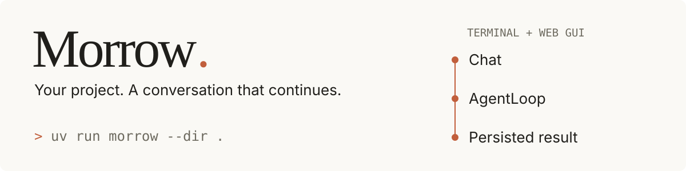
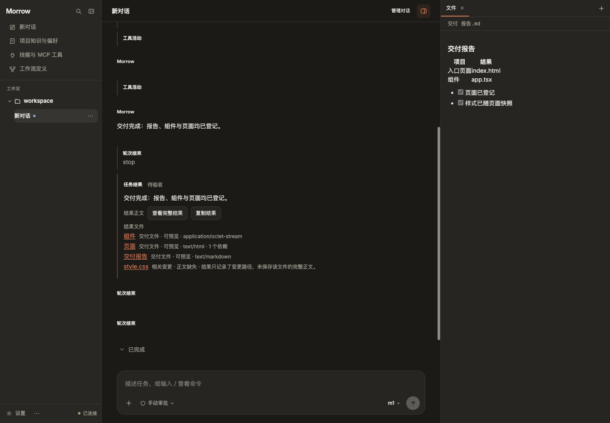
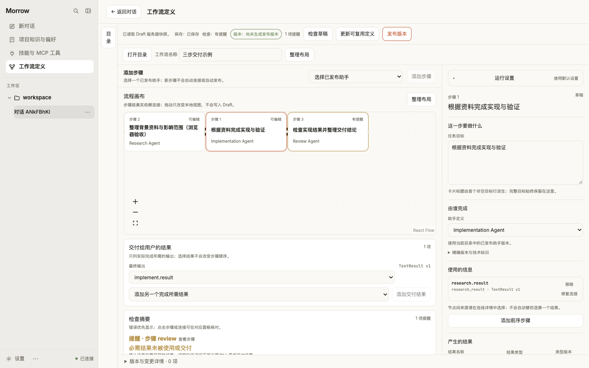
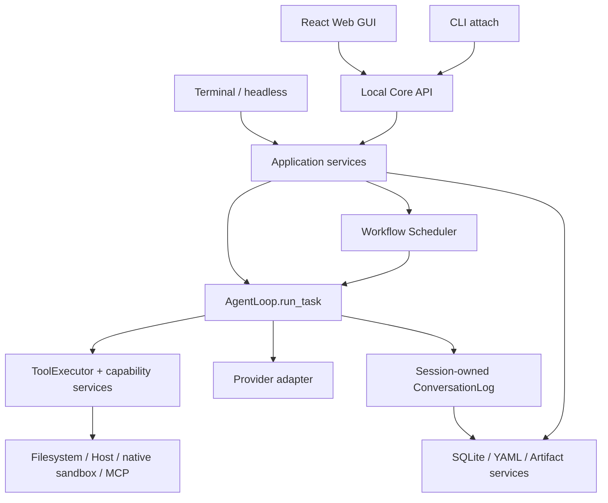

<p align="center">
  
</p>

<p align="center">
  <strong>English</strong> · <a href="README.zh-CN.md">简体中文</a>
</p>

# Morrow · 承序

**A local coding agent that keeps your conversations, task progress, and delivered files connected.**

Morrow helps you explore a repository, edit code, run project commands, and continue work across sessions. Start in the terminal or use the local Web GUI. For tasks that need several steps, compose agents in a versioned Workflow, inspect the plan, and control execution from the same workbench.

The current package version is **0.1.0**. Morrow is under active development; the interface and most detailed guides are currently in Chinese. This README describes the implemented product, with platform and execution limits below.

<p align="center">
  <a href="#quick-start">Quick start</a> ·
  <a href="#what-you-can-do">Features</a> ·
  <a href="#workflows">Workflows</a> ·
  <a href="#permissions-and-execution-boundaries">Permissions</a> ·
  <a href="#architecture">Architecture</a> ·
  <a href="#documentation">Documentation</a>
</p>



*Actual Web GUI, captured from the current build using an isolated workspace and a scripted Provider. The example writes and registers a Markdown report, a TSX component, and an HTML page; it demonstrates the product flow, not live-model coding quality.*

## What you can do

| Capability | What it gives you |
| --- | --- |
| **Work on a local repository** | Read files, browse directories, search code, apply precise edits, create files, and run commands with bounded output. |
| **Continue a conversation** | Persist sessions and tasks, resume after restart, fork conversation history, and compact context without deleting the original log. |
| **Use terminal or browser** | CLI, JSONL headless execution, and a local Chat workbench share application services and permission checks. |
| **Make execution visible** | Inspect task and node state, tool activity, model usage, approvals, recovery reports, and delivered artifacts. |
| **Compose multiple agents** | Edit a Workflow graph, publish immutable versions, preview task plans, pause, adjust future steps, and continue. |
| **Keep real deliverables** | Workflow nodes explicitly register files; the service validates and snapshots them so historical results retain their original bytes. |
| **Manage reusable context** | Maintain project profiles, scoped preferences, project knowledge, and reviewable learning proposals. |
| **Extend deliberately** | Manage Provider/Model configurations, versioned Skills, and MCP server catalogs with explicit activation and risk checks. |

Morrow is designed for developers working on local projects and for people studying how an agent runtime handles durable execution, tools, recovery, and orchestration. The model is supplied by your configured Provider; local state storage does not mean inference runs locally.

## Quick start

### 1. Install from source

Requirements:

- **Python 3.12+** and [`uv`](https://docs.astral.sh/uv/).
- **Git** to clone the repository.
- For the Web GUI build: **Node.js 22.12+** and [**pnpm 11.5.1**](https://pnpm.io/installation), the version pinned in [gui/package.json](gui/package.json). CLI-only use does not require the frontend build toolchain.
- A compatible model endpoint and its credential to run model-backed tasks.

```bash
git clone https://github.com/Maxuix/morrow-agent.git
cd morrow-agent
uv sync
uv run morrow --help
```

Run the following `uv run` commands from this checkout. Replace `/absolute/path/to/project` with an existing project directory. To work on the Morrow checkout itself, use `.`.

### 2. Configure a Provider

The built-in preset is Volcengine:

```bash
uv run morrow provider add --preset volcengine
uv run morrow model current
```

The CLI requests your API key without echoing it. Adding this preset performs a real connection test before saving a usable configuration. The preset currently selects `volcengine/glm-5.3-flash` at `https://ark.cn-beijing.volces.com/api/plan/v3`; your account must have access to that endpoint and model. See [Providers and models](#providers-and-models) for a custom endpoint.

### 3. Start terminal chat

```bash
uv run morrow --dir /absolute/path/to/project
```

Confirm the workspace when prompted, then try:

```text
Explain how this repository starts up. Cite the relevant files and functions.
```

For an implementation task:

```text
Find the cause of the failing parser test, make a minimal fix, run the relevant
tests, and summarize the changes and any remaining limitations.
```

These are example prompts, not recorded model outputs. Model requests use your Provider account. The default `manual` preset directly executes ordinary workspace tools and Host commands; read the [permission table](#permissions-and-execution-boundaries) before running tasks that can change files or execute code.

### 4. Open the Web GUI

```bash
pnpm --dir gui install --frozen-lockfile
pnpm --dir gui build
uv run morrow gui --dir /absolute/path/to/project
```

The command starts a foreground Core process on loopback and opens your browser. The GUI can also start before a Provider is configured: add your Provider and default model in its settings. Press `Ctrl+C` in the server terminal to shut down the Core.

An installed wheel containing the prebuilt GUI needs neither Node.js nor a separate frontend server. Source checkouts must build those assets first.

## Everyday use

### Sessions and task control

```bash
# Find an existing session in this workspace.
uv run morrow session list --dir /absolute/path/to/project --limit 50 --json

# Continue it after restarting Morrow.
uv run morrow --dir /absolute/path/to/project --session-id SESSION_ID

# Inspect its tasks and the workspace's artifacts.
uv run morrow task list SESSION_ID --dir /absolute/path/to/project --json
uv run morrow artifact list --dir /absolute/path/to/project --json
```

Replace uppercase identifiers such as `SESSION_ID` with values returned by Morrow. Paginated JSON listings return `items` and `next_cursor`.

| In terminal chat | Action |
| --- | --- |
| `/workspace` | Inspect the current workspace profile. |
| `/status` | Inspect the current session/runtime status. |
| `/preferences` | Inspect or manage scoped preferences. |
| `/task` | Inspect the current task. |
| `/accept` | Accept the task result. |
| `/task new` | Start a new task within the session. |
| `/recovery` | Inspect recovery evidence and required decisions. |
| `/new` | Switch to a new session, retaining persisted history. |
| `/exit` | Leave the REPL and retain persisted history. |

During execution, `Enter` submits steering for the next safe boundary; `Alt+Enter` queues a follow-up for normal completion. Already admitted tool batches finish their boundary before steering takes effect. `Ctrl+C` cancels the current task.

A final answer leaves a task awaiting acceptance. A normal follow-up continues the same task; accepting a result and creating a new task are explicit actions.

### Headless JSONL

First register the workspace through terminal chat or the GUI. Then run one prompt without interactive input:

```bash
uv run morrow run \
  --workspace /absolute/path/to/project \
  --prompt "Summarize the module layout and identify the test entry points."
```

`run` emits versioned JSONL records and supports `--resume-session-id SESSION_ID`. Tools that require approval are denied when no interactive approval channel is available. This does not turn ordinary Host commands into sandboxed commands.

### Connect to an existing Core

```bash
uv run morrow attach --list
uv run morrow attach --workspace-id WORKSPACE_ID --session-id SESSION_ID
uv run morrow attach --open-gui
```

Use `attach` when a GUI/Core process already owns the workspace writer. In attach mode, `/exit` or `Ctrl+C` disconnects the client; `/stop` explicitly stops the run. `uv run morrow serve --dir /absolute/path/to/project` starts the API without the GUI for an already registered workspace.

## The Web workbench

The browser interface brings daily coding and operational controls together:

- **Chat and navigation:** multiple workspaces and sessions, search, pinning, archiving, conversation forks, and per-session drafts.
- **Inputs:** text, source files, PNG/JPEG/WebP images, PDF, drag and drop, pasted images, and `@` references to workspace files. Image input depends on model capability.
- **Execution:** model and permission settings, inline approvals, queued input, steering, task plans, pause/continue/stop, and node-specific guidance.
- **Results:** readable answers and file links that open the right-hand panel. Markdown renders with GFM; source uses CodeMirror highlighting, line numbers, and search. Current files and historical deliverables are read-only in this panel. HTML displays as source; it is not executed there.
- **Management:** project profiles, preferences, knowledge, learning review, Skills, MCP, Agent definitions, diagnostics, and backup/cleanup tools.

Attachments are bounded: up to **8 files per message**, **8 MiB per file**, **20 pages per PDF**, **16 million pixels per image**, and **32,768 extracted text characters**. Scanned PDF pages require an image-capable model. See the [architecture baseline](docs/ARCHITECTURE.md) for the current boundaries.

## Workflows

Ordinary chat uses the single-agent loop directly. Workflows are an explicit way to combine steps when a task benefits from separate exploration, implementation, and review.

### Plan a task from Chat

Enter this in the Web GUI:

```text
/workflow Inspect the configuration loader, implement the requested validation,
and review the change with targeted tests.
```

Review the generated graph, adjust the steps and permissions, and explicitly start it. General, Explore, and Review presets are available to task planning. Planning or editing a graph does not run its business steps.

### Maintain a reusable definition



*Workflow editor captured from the current build. The example intentionally shows a validation warning for an unused result.*

Two built-in Workflow definitions provide starting points: **Direct** and **Explore Implement Verify**. Clone a built-in definition before customizing it.

```bash
uv run morrow agent list --dir /absolute/path/to/project
uv run morrow workflow list --dir /absolute/path/to/project
uv run morrow workflow runs --dir /absolute/path/to/project
uv run morrow workflow --help
```

The lifecycle is **edit → validate → publish an immutable revision → explicitly start a run**. Published versions stay fixed; create a new draft/version to change them. The [runtime architecture](docs/architecture/runtime.md) describes the execution and recovery boundaries.

- Execution is serial by default. Explicit concurrency only applies to independent nodes that the runtime can prove are read-only; writes and process tools remain serial.
- Pause waits for safe execution boundaries. Future-step edits create a continuation while preserving completed history and valid outputs.
- Continuing an eligible interrupted run preserves committed tool results. Rerunning creates a new run. Unknown side effects require recovery reconciliation before continuation.
- File delivery is explicit: nodes register paths, the service validates and snapshots their bytes, and results reference those snapshots. Mentioning a filename in prose does not create a deliverable.
- Request caps and deadlines are optional user guardrails. Built-in defaults do not impose a total request count or overall duration limit; individual tool, context, and output limits still apply.

## Permissions and execution boundaries

Workspace-scoped file tools and operating-system process isolation are separate mechanisms.

| Preset | Project command execution | Approval behavior and limits |
| --- | --- | --- |
| `manual` — default | Directly on the Host | Ordinary workspace file tools and project commands execute directly. Configuration changes and governed extensions retain their own approval rules. |
| `auto-safe` | Directly on the Host | Ordinary workspace tools and project commands execute directly; other capabilities follow their policies. This preset does not provide OS isolation. |
| `auto-sandboxed` | Native sandbox in a temporary workspace snapshot | Currently supported on macOS. Network is denied by default; process changes do not directly modify the real workspace. Promoting sandbox changes always requires approval. |
| `full-access-manual` | Unconfined Host capability | Requires an explicit, run-scoped grant; each opaque Host command still requires approval. Expired or revoked grants cannot authorize new execution. |

```bash
uv run morrow --dir /absolute/path/to/project --permission-mode auto-sandboxed
```

Structured file tools reject workspace escape, external symlinks, and unsupported file types. `edit` and `write` capture file identity internally and recheck for conflicts before publishing changes; mixed line endings are rejected rather than silently rewritten.

**Host commands run with the current user's privileges.** They can access resources outside the workspace and may use the network. The names `manual` and `auto-safe` do not imply per-command confirmation or a sandbox. File names such as `.env` are not automatically hidden from workspace reads; place only intended project material in the selected workspace.

Auto Sandboxed fails closed when its backend is unavailable; it does not silently fall back to Host execution. Linux native sandbox support is not yet declared, and this repository does not establish full Windows compatibility. Full Access Auto is not supported.

## Providers and models

Morrow uses an **OpenAI-compatible adapter** and an explicit local model catalog. Compatibility depends on the endpoint's actual protocol and capabilities; function calling is needed for coding tools, and image/reasoning support is model-specific.

```bash
uv run morrow provider list
uv run morrow provider presets
uv run morrow model list
uv run morrow model current
```

For a custom endpoint, replace the example URL and model ID with values from your Provider:

```bash
uv run morrow provider add --name my-provider \
  --adapter openai-compatible \
  --base-url https://your-provider.example/v1
uv run morrow model add my-provider your-model-id
uv run morrow model use my-provider/your-model-id
uv run morrow provider test my-provider
```

`provider test` performs a real request. `model sync PROVIDER_ID` explicitly discovers models when the adapter supports discovery. Morrow does not silently switch Providers or models to recover a failed request.

Credentials use the OS-backed CredentialStore or an explicit environment variable. The naming convention is `MORROW_<PROVIDER_ID>_API_KEY`, uppercasing the ID and replacing `-` with `_`; for the built-in preset it is `MORROW_VOLCENGINE_API_KEY`. Environment credentials take precedence for normal configuration resolution. Persistent configuration stores credential references, not keys.

```bash
uv run morrow provider configure volcengine
uv run morrow provider configure volcengine --replace-credential
```

Unset an active environment override before replacing a stored credential. Recovery validates the run's frozen configuration rather than silently adopting new settings.

## Project context, learning, and extensions

### Project instructions and preferences

Morrow reads the first readable UTF-8 instruction file at the workspace root in this order: **`AGENTS.override.md` → `AGENTS.md` → `CLAUDE.md`**. These instructions guide the model; they cannot grant local tool permissions.

Workspace Profiles describe the project. Preferences can be scoped to a session, workspace, or globally. Explicit configuration changes show the target and proposed changes before confirmation. Ordinary questions or temporary response instructions are not direct writes to persistent preferences.

### Reviewable learning

The default learning mode is `review-only`. Post-turn preference review and task-outcome learning can propose reusable preferences or project knowledge. Review candidates in the Inbox before applying them; accepting a task result is a separate operation. Use `off` to disable review.

```bash
uv run morrow learning status --workspace-id WORKSPACE_ID
uv run morrow learning inbox --workspace-id WORKSPACE_ID
uv run morrow learning set-mode off --workspace-id WORKSPACE_ID
uv run morrow memory selection list --workspace-id WORKSPACE_ID
```

Review uses model requests and can consume Provider usage. Project knowledge is versioned, and each AgentRun freezes its memory selection. In-process review workers do not constitute an independent background daemon.

### Skills and MCP

- **Skills:** validate and install packages, manage bindings, pin or roll back versions, inspect usage, and review generated drafts. Accepting a draft publishes a version; activation and permissions remain separate. Declared Skill scripts require a supported native sandbox.
- **MCP:** configure a server, explicitly refresh its catalog, inspect risks, and enable it. Changed configurations remain disabled until reviewed. stdio subprocesses receive only explicitly declared environment entries; credentials are resolved at the execution boundary. Approval evidence is tied to the exact run, server, configuration, catalog, and tool.

```bash
uv run morrow skill --help
uv run morrow mcp --help
uv run morrow manage --help
```

See [Tools, extensions, and learning](docs/architecture/extensions.md) for ownership and trust boundaries.

## State, configuration, and recovery

Morrow stores application state under **`~/.morrow`** by default, separately from the project it edits.

| Data | Storage and ownership |
| --- | --- |
| Sessions, tasks, turns, execution evidence, Workflow records | SQLite operational store; chat history has a single Session-owned writer. |
| Configuration, profiles, preferences, definitions | Validated YAML with revisions and controlled writes. |
| Artifacts and registered deliverables | Managed bytes, metadata, and references with explicit retention. |
| Provider/MCP credentials | CredentialStore or declared environment references, excluded from backup bundles. |

Runtime defaults are bundled in [runtime-policy.toml](src/morrow/resources/runtime-policy.toml). Supported fields can be overridden in `~/.morrow/config.yaml`, for example:

```yaml
runtime_policy:
  agent_run:
    tool_timeout_seconds: 180
  long_horizon:
    reserve_tokens: 20000
```

Overrides load at process startup. Invalid fields or values reject the configuration instead of partially applying it. Runtime-policy settings cannot relax permission or credential boundaries. See the [state architecture](docs/architecture/state.md).

```bash
uv run morrow recovery show SESSION_ID --dir /absolute/path/to/project
uv run morrow state doctor --workspace-id WORKSPACE_ID
uv run morrow state cleanup --workspace-id WORKSPACE_ID
uv run morrow state --help
```

`doctor` is read-only and exits with code `0` only for healthy state, otherwise `2`. `cleanup` previews by default; `--apply` quarantines eligible unmanaged bytes rather than destroying them. Backup verification and restore use complete bundles, and restore writes into a new isolated target. Credentials must be configured separately.

**Conversation recovery does not roll back project files.** Forking a conversation preserves history but does not reset your Git checkout. Unknown tool outcomes are reconciled from durable evidence, never assumed successful or automatically replayed. See the [state architecture](docs/architecture/state.md).

## Architecture



Ordinary chat and Workflow leaves use the same agent loop. The scheduler coordinates the graph; it does not implement another model/tool loop. CLI and GUI call application services instead of writing business state independently. Run admission freezes the relevant model, tools, permissions, and context selections; recovery checks those persisted facts.

```text
src/morrow/
├── core/           # Domain models, contracts, ports, and rules
├── runtime/        # Agent loop, tool cycles, Session, ConversationLog
├── application/    # Tasks, workflows, recovery, context, learning, extensions
├── services/       # Workspace, file, search, mutation, process, sandbox capabilities
├── adapters/       # Provider SDK, SQLite, YAML, credentials, filesystem, MCP
├── interfaces/     # CLI, REPL, headless, attach
├── server/         # Core API, workspace registry, execution supervision
└── resources/      # Packaged runtime defaults
gui/                # React 19 + TypeScript + Vite; pnpm-managed
tests/              # Python unit, integration, and acceptance tests
scripts/            # Release/build tooling
docs/               # Project documentation and the current architecture baseline
```

The backend uses Python, Pydantic v2, Typer, Starlette/Uvicorn, and SQLite. The frontend uses React, TypeScript, React Flow, CodeMirror 6, and GFM Markdown rendering. Read the [architecture baseline](docs/ARCHITECTURE.md) for module responsibilities and invariants.

## Development and verification

```bash
uv sync
pnpm --dir gui install --frozen-lockfile

# Backend: offline tests are the default.
uv run pytest -m 'not live'
uv run ruff format --check .
uv run ruff check .
uv run python -m compileall -q src tests
uv run morrow --help

# Frontend: types, behavior, and production bundle budget.
pnpm --dir gui typecheck
pnpm --dir gui test
pnpm --dir gui build

git diff --check
```

Use fake SDK chunks and scripted Providers for deterministic tests. Live Provider/MCP tests require explicit authorization and compatible credentials; an offline test pass does not establish live-model quality or cross-platform sandbox support.

### Build a distributable package

```bash
python3 scripts/build_release.py
```

The release script installs frontend dependencies from the lockfile, builds the GUI with its size gate, then runs `uv build`. Outputs go to `dist/`. Use `--offline` only when all required build dependencies are cached. A bare `uv build` also requires the prebuilt GUI assets in `src/morrow/gui_static/`.

## Troubleshooting

| Symptom | Next step |
| --- | --- |
| GUI reports missing assets | Run `pnpm --dir gui install --frozen-lockfile` and `pnpm --dir gui build`. |
| Workspace is already owned by a writer | Use `morrow attach`, or shut down the Core that owns it. |
| Headless execution rejects a new path | Open and register that directory through the interactive CLI or GUI first. |
| CredentialStore/Keychain is unavailable | Unlock or configure the OS keyring; inspect any explicit Provider environment override. |
| A model cannot use tools or images | Check the adapter and exact model capabilities; endpoint compatibility alone is insufficient. |
| Auto Sandboxed cannot start | Check native backend support. Current support is macOS; unsupported environments fail closed. |
| A recovered task cannot continue | Read its recovery report and reconcile unknown side effects before resuming. |
| A Workflow is unpublished or stale | Validate and publish a new revision, or refresh the current source/head before retrying. |

Use `uv run morrow <command> --help` for the current parameter contract.

## Current scope

Implemented: local coding tools, durable sessions and recovery, reviewable learning, Skills/MCP, Provider/Model management, versioned Workflows, and the Chat workbench with planning and execution controls.

Not currently delivered: an independent background daemon, scheduled automation, remote or multi-user Core hosting, automatic workspace/code rollback, Linux native sandbox support, and Full Access Auto. Real-provider behavior depends on your endpoint and has separate validation requirements.

## Documentation

Most detailed documents are currently in Chinese; both README pages describe the same entry points and boundaries.

| Read next | Contents |
| --- | --- |
| [Architecture](docs/ARCHITECTURE.md) | Layers, runtime ownership, interfaces, extensions |
| [Runtime and orchestration](docs/architecture/runtime.md) | Agent loop, workflows, pause and continuation |
| [State and recovery](docs/architecture/state.md) | Durable state, artifacts, backup and cleanup |
| [Interfaces and workbench](docs/architecture/interfaces.md) | CLI, Core API and GUI ownership |
| [Extensions](docs/architecture/extensions.md) | Providers, Skills, MCP and learning boundaries |
| [Documentation index](docs/README.md) | Public architecture documentation |

## Contributing

For a bug report, include the revision, Python/Node versions, permission mode, minimal reproduction, and expected versus actual behavior. Remove credentials and private project data. Keep changes focused, run the relevant checks, and update both READMEs when public behavior changes.

## License

This repository does not currently include a `LICENSE` file or declared package license. No open-source license is asserted by this README; licensing terms remain to be specified by the maintainer.
