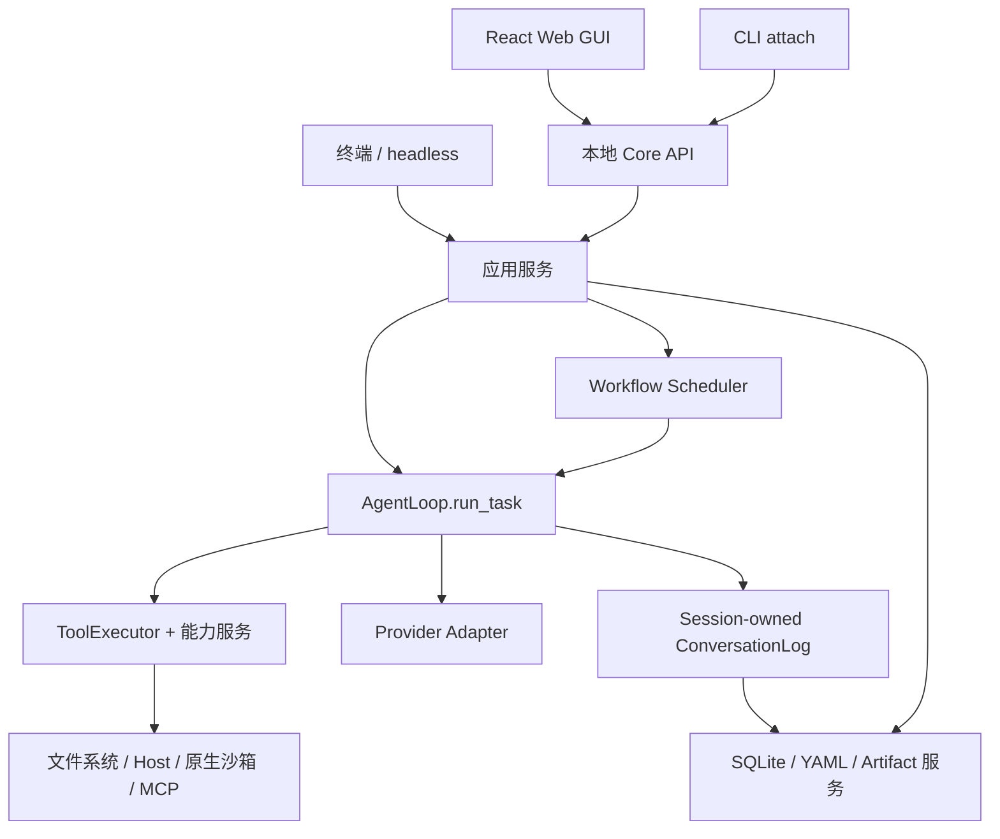

<p align="center">
  
</p>

<p align="center">
  <a href="README.md">English</a> · <strong>简体中文</strong>
</p>

# Morrow · 承序

**把对话、任务进度和交付文件连接起来的本地编程 Agent。**

Morrow 帮助你理解仓库、修改代码、运行项目命令，并在不同会话之间继续工作。你可以从终端开始，也可以使用本地 Web GUI。对于需要多个步骤的任务，可以通过版本化 Workflow 组合 Agent，在同一个工作台中查看计划、控制执行并检查结果。

当前包版本为 **0.1.0**，项目仍在持续开发中，界面与详细指南目前主要使用中文。本页介绍已经实现的能力，平台支持和执行边界见下文。

<p align="center">
  <a href="#快速开始">快速开始</a> ·
  <a href="#主要能力">主要能力</a> ·
  <a href="#workflow-工作流">工作流</a> ·
  <a href="#权限与执行边界">权限</a> ·
  <a href="#架构">架构</a> ·
  <a href="#文档导航">文档</a>
</p>


*截图来自当前构建的真实 Web GUI，使用隔离工作区与 scripted Provider。示例写入并登记了 Markdown 报告、TSX 组件和 HTML 页面，展示产品操作链路，不代表真实模型的编码质量。*

## 主要能力

| 能力 | 你能做什么 |
| --- | --- |
| **操作本地仓库** | 读取文件、浏览目录、搜索源码、精确编辑、创建文件，执行命令并获取有界输出。 |
| **持续推进任务** | 持久化会话与任务，重启后继续，从历史分叉对话，并在保留原始记录的同时压缩上下文。 |
| **终端与浏览器共用服务** | CLI、JSONL headless 执行和本地 Chat 工作台使用同一组应用服务与权限检查。 |
| **观察执行过程** | 查看任务和节点状态、工具活动、模型用量、审批、恢复报告与交付产物。 |
| **组合多个 Agent** | 编辑 Workflow 图，发布不可变版本，预览任务计划，暂停、调整未来步骤并继续。 |
| **保留真实交付文件** | Workflow 节点显式登记文件，由服务端校验并保存快照，历史结果保留原始字节。 |
| **管理可复用上下文** | 维护项目 Profile、不同作用域的偏好、项目知识，以及等待审查的学习候选。 |
| **受控扩展能力** | 管理 Provider/Model、版本化 Skill 和 MCP 工具目录，通过明确启用与风险检查接入。 |

Morrow 面向长期在本地项目中工作的开发者，也适合研究 Agent 持久执行、工具调用、恢复和编排机制。模型由你配置的 Provider 提供；状态保存在本地，不意味着推理也在本地完成。

## 快速开始

### 1. 从源码安装

环境要求：

- **Python 3.12+** 与 [`uv`](https://docs.astral.sh/uv/)。
- 用于克隆仓库的 **Git**。
- 构建 Web GUI 时需要 **Node.js 22.12+** 和 [**pnpm 11.5.1**](https://pnpm.io/installation)，后者固定在 [gui/package.json](gui/package.json)。仅使用 CLI 不需要前端构建工具链。
- 执行模型任务时，需要兼容的模型端点与凭据。

```bash
git clone https://github.com/Maxuix/morrow-agent.git
cd morrow-agent
uv sync
uv run morrow --help
```

下文的 `uv run` 命令均在本仓库目录执行。把 `/absolute/path/to/project` 替换为已存在的项目目录；若希望操作 Morrow 自身，使用 `.` 即可。

### 2. 配置 Provider

当前内置火山引擎 Volcengine 预设：

```bash
uv run morrow provider add --preset volcengine
uv run morrow model current
```

按提示输入 API Key，终端不会回显。添加预设会先执行真实连接测试，成功后保存可用配置。当前预设为 `volcengine/glm-5.3-flash`，端点是 `https://ark.cn-beijing.volces.com/api/plan/v3`；你的账号需要具备该端点与模型的使用权限。自定义端点见[模型与 Provider](#模型与-provider)。

### 3. 启动终端对话

```bash
uv run morrow --dir /absolute/path/to/project
```

首次使用时按提示确认工作区，然后可以输入：

```text
解释这个仓库的启动流程，指出相关文件和函数。
```

需要实际修改时，可以描述明确的开发任务：

```text
定位解析器测试失败的原因，做最小修复，运行相关测试，
最后说明修改内容、验证结果和仍未解决的问题。
```

以上是使用示例，不是实测模型输出。模型请求使用你配置的 Provider 账号。默认 `manual` 模式会直接执行普通工作区工具与 Host 命令；执行可能修改文件或运行代码的任务前，请先了解[权限表](#权限与执行边界)。

### 4. 打开 Web GUI

```bash
pnpm --dir gui install --frozen-lockfile
pnpm --dir gui build
uv run morrow gui --dir /absolute/path/to/project
```

命令在 loopback 地址启动前台 Core 进程并打开浏览器。尚未配置 Provider 时也可以启动 GUI，在设置中添加 Provider 并选择默认模型。在服务端终端按 `Ctrl+C` 可关闭 Core。

安装包含预构建 GUI 的 wheel 后，不需要 Node.js 或独立前端开发服务器；从源码运行时，需要先构建这些资源。

## 日常使用

### 会话与任务控制

```bash
# 查找这个工作区中已有的会话。
uv run morrow session list --dir /absolute/path/to/project --limit 50 --json

# 重启后继续该会话。
uv run morrow --dir /absolute/path/to/project --session-id SESSION_ID

# 查看会话任务与工作区产物。
uv run morrow task list SESSION_ID --dir /absolute/path/to/project --json
uv run morrow artifact list --dir /absolute/path/to/project --json
```

将 `SESSION_ID` 等大写占位符替换为 Morrow 返回的实际 ID。分页 JSON 列表包含 `items` 和 `next_cursor`。

| 终端对话命令 | 作用 |
| --- | --- |
| `/workspace` | 查看当前工作区 Profile。 |
| `/status` | 查看当前会话与运行状态。 |
| `/preferences` | 查看或管理不同作用域的偏好。 |
| `/task` | 查看当前任务。 |
| `/accept` | 接受任务结果。 |
| `/task new` | 在当前会话中开始新任务。 |
| `/recovery` | 查看恢复证据与待处理决策。 |
| `/new` | 切换到新会话，保留已持久化历史。 |
| `/exit` | 退出 REPL，保留已持久化历史。 |

执行期间，`Enter` 发送 steering，在下一个安全边界生效；`Alt+Enter` 排队追加后续输入，正常完成后执行。已经接纳的工具批次会先完成其执行边界，再处理 steering。`Ctrl+C` 取消当前任务。

最终回答会让任务进入待接受状态。普通追问继续同一任务；接受结果和创建新任务是独立的明确操作。

### Headless JSONL

先通过终端对话或 GUI 注册工作区，再以非交互方式执行一个提示：

```bash
uv run morrow run \
  --workspace /absolute/path/to/project \
  --prompt "总结模块结构，并指出测试入口。"
```

`run` 输出带版本的 JSONL 记录，支持 `--resume-session-id SESSION_ID`。没有交互审批通道时，需要审批的工具会被拒绝；这不会让普通 Host 命令自动获得沙箱隔离。

### 连接已有 Core

```bash
uv run morrow attach --list
uv run morrow attach --workspace-id WORKSPACE_ID --session-id SESSION_ID
uv run morrow attach --open-gui
```

GUI/Core 已占用工作区写入权时，使用 `attach` 接入。attach 模式中的 `/exit` 或 `Ctrl+C` 仅断开客户端；`/stop` 才明确停止运行。对于已注册工作区，可以使用 `uv run morrow serve --dir /absolute/path/to/project` 只启动 API。

## Web 工作台

浏览器界面把日常编码与运行管理放在一起：

- **对话与导航：** 多工作区、多会话、搜索、置顶、归档、历史分叉，以及按会话保存的草稿。
- **输入：** 文本、源码、PNG/JPEG/WebP 图片、PDF、拖放、粘贴图片和 `@` 工作区文件引用。图片输入取决于模型能力。
- **执行：** 模型与权限设置、内联审批、输入排队、steering、任务计划、暂停/继续/停止，以及针对具体节点的指导。
- **结果：** 可阅读的答案与文件链接，点击后在右侧打开。Markdown 支持 GFM；源码使用 CodeMirror 高亮、行号和搜索。当前文件与历史交付件在此面板中均只读展示；HTML 显示源码，不在面板内执行。
- **管理：** 项目 Profile、偏好、知识、学习审查、Skill、MCP、Agent 定义、诊断、备份与清理。

附件有明确上限：**每条消息最多 8 个文件**、**单文件 8 MiB**、**PDF 最多 20 页**、**图片最多 1600 万像素**、**提取文本最多 32,768 字符**。扫描 PDF 页面需要支持图片的模型。当前边界见[架构基线](docs/ARCHITECTURE.md)。

## Workflow 工作流

普通聊天直接使用单 Agent 循环。任务需要分别探索、实现和审查时，可以显式使用 Workflow 组合步骤。

### 在 Chat 中规划当前任务

在 Web GUI 中输入：

```text
/workflow 检查配置加载器，实现需要的校验逻辑，
并通过定向测试审查修改结果。
```

查看生成的任务图，调整步骤与权限，再明确开始执行。任务规划提供 General、Explore、Review 预设。生成或编辑任务图不会执行业务节点。

### 维护可复用定义


*截图来自当前构建；该示例故意保留了一项“结果未使用”的校验提醒。*

内置 **Direct** 与 **Explore Implement Verify** 两个 Workflow 起点。定制前先复制为用户定义。

```bash
uv run morrow agent list --dir /absolute/path/to/project
uv run morrow workflow list --dir /absolute/path/to/project
uv run morrow workflow runs --dir /absolute/path/to/project
uv run morrow workflow --help
```

生命周期为 **编辑 → 校验 → 发布不可变修订 → 明确开始运行**。已发布版本保持不变；修改时创建新草稿或新版本。[运行时架构](docs/architecture/runtime.md) 描述执行与恢复边界。

- 默认串行。显式提高并发后，也仅允许运行时能够证明独立且只读的节点并行；写入和进程工具仍串行执行。
- 暂停等待安全执行边界。调整未来步骤会创建 continuation，保留已完成历史与有效输出。
- 继续符合条件的中断运行会保留已提交工具结果；重跑创建新运行。未知副作用必须先完成恢复对账。
- 文件交付需要显式登记：节点提交路径，服务端校验并保存字节快照，结果引用该快照。仅在文字中提到文件名不会生成交付件。
- 请求次数和截止时间是可选的用户限制。内置默认值不设总请求次数或总时长上限；单工具、上下文与输出的各自限制仍生效。

## 权限与执行边界

工作区文件工具的路径约束与操作系统进程隔离是两种不同机制。

| 预设 | 项目命令在哪里执行 | 审批与边界 |
| --- | --- | --- |
| `manual`，默认 | 直接在 Host 执行 | 普通工作区文件工具与项目命令直接执行；配置修改和受治理扩展保留各自的审批规则。 |
| `auto-safe` | 直接在 Host 执行 | 普通工作区工具与项目命令直接执行，其他能力按各自策略处理；不提供 OS 隔离。 |
| `auto-sandboxed` | 原生沙箱中的临时工作区快照 | 当前支持 macOS；默认断网，进程改动不直接写入真实工作区；推广沙箱改动始终需要审批。 |
| `full-access-manual` | 未隔离的 Host 能力 | 需要显式授予绑定本次运行的 Grant；每次 opaque Host 命令仍需审批；过期或撤销后不能授权新执行。 |

```bash
uv run morrow --dir /absolute/path/to/project --permission-mode auto-sandboxed
```

结构化文件工具拒绝工作区逃逸、外部符号链接及不支持的文件类型。`edit` 和 `write` 在内部冻结文件身份，发布改动前再次检查冲突；遇到混合换行会明确拒绝，不会静默重写。

**Host 命令以当前用户权限运行。** 它们可能访问工作区外资源，也可能访问网络。`manual` 和 `auto-safe` 的名称不意味着逐条命令确认或沙箱隔离。工作区读取不会自动隐藏 `.env` 等文件，应只将希望交给 Agent 处理的项目材料放入所选工作区。

Auto Sandboxed 在后端不可用时会拒绝执行，不会静默回退到 Host。Linux 原生沙箱尚未声明支持，仓库也未建立完整的 Windows 兼容性结论。Full Access Auto 不支持。

## 模型与 Provider

Morrow 使用 **OpenAI-compatible Adapter** 和显式本地模型目录。实际兼容性取决于端点协议与能力；编码工具需要 function calling，图片和思考能力取决于具体模型。

```bash
uv run morrow provider list
uv run morrow provider presets
uv run morrow model list
uv run morrow model current
```

使用自定义端点时，将示例地址与模型 ID 替换为供应商提供的值：

```bash
uv run morrow provider add --name my-provider \
  --adapter openai-compatible \
  --base-url https://your-provider.example/v1
uv run morrow model add my-provider your-model-id
uv run morrow model use my-provider/your-model-id
uv run morrow provider test my-provider
```

`provider test` 会发起真实请求。Adapter 支持模型发现时，可用 `model sync PROVIDER_ID` 显式同步目录。请求失败不会触发静默切换 Provider 或模型。

凭据由操作系统支持的 CredentialStore 或显式环境变量提供。环境变量格式为 `MORROW_<PROVIDER_ID>_API_KEY`，ID 转为大写并把 `-` 替换为 `_`；内置预设对应 `MORROW_VOLCENGINE_API_KEY`。正常配置解析时，环境变量凭据优先。持久化配置只保存凭据引用，不保存密钥。

```bash
uv run morrow provider configure volcengine
uv run morrow provider configure volcengine --replace-credential
```

替换已存储凭据前，需先取消正在生效的环境变量覆盖。恢复验证运行冻结的配置，不会静默套用后来修改的设置。

## 项目上下文、学习与扩展

### 项目指令与偏好

Morrow 在工作区根目录按 **`AGENTS.override.md` → `AGENTS.md` → `CLAUDE.md`** 的顺序，读取第一个可读的 UTF-8 指令文件。这些内容用于指导模型，不能授予本地工具权限。

Workspace Profile 描述项目，Preferences 支持本次会话、当前工作区与全局作用域。显式配置操作会展示修改目标和内容，确认后写入。普通问题或临时回复要求不会直接成为持久偏好的写入。

### 可审查学习

默认学习模式为 `review-only`。回合后的偏好审阅和任务结果学习可提出可复用的偏好或项目知识，在 Inbox 审查后再应用。接受任务结果与接受学习候选是两个动作；可使用 `off` 关闭审阅。

```bash
uv run morrow learning status --workspace-id WORKSPACE_ID
uv run morrow learning inbox --workspace-id WORKSPACE_ID
uv run morrow learning set-mode off --workspace-id WORKSPACE_ID
uv run morrow memory selection list --workspace-id WORKSPACE_ID
```

审阅会调用模型，可能消耗 Provider 用量。项目知识保存版本，每个 AgentRun 冻结自己的 Memory Selection。进程内审阅 Worker 不等于独立后台 daemon。

### Skills 与 MCP

- **Skills：** 校验和安装包，管理绑定，固定或回退版本，查看使用记录，审查生成草稿。接受草稿只发布版本，启用与授权仍是独立动作。声明的 Skill 脚本需要可用的原生沙箱。
- **MCP：** 配置 Server，显式刷新 Catalog，检查风险后启用。配置变更后保持禁用，等待重新审查。stdio 子进程只获得明确声明的环境项；凭据在执行边界解析。审批证据绑定精确的运行、Server、配置、Catalog 与工具。

```bash
uv run morrow skill --help
uv run morrow mcp --help
uv run morrow manage --help
```

职责与信任边界见[工具、扩展与学习](docs/architecture/extensions.md)。

## 状态、配置与恢复

Morrow 默认将应用状态保存在 **`~/.morrow`**，与正在编辑的项目目录分开。

| 数据 | 存储与所有权 |
| --- | --- |
| 会话、任务、回合、执行证据、Workflow 记录 | SQLite Operational Store；聊天记录只有 Session-owned writer 一个写入入口。 |
| 配置、Profile、Preferences、定义 | 带校验和 revision 的 YAML，通过受控写入更新。 |
| Artifact 与登记交付件 | 受管字节、元数据与引用，支持明确的保留策略。 |
| Provider/MCP 凭据 | CredentialStore 或声明的环境引用，不进入备份包。 |

运行默认值随包保存在 [runtime-policy.toml](src/morrow/resources/runtime-policy.toml)。可在 `~/.morrow/config.yaml` 中覆盖允许调整的字段，例如：

```yaml
runtime_policy:
  agent_run:
    tool_timeout_seconds: 180
  long_horizon:
    reserve_tokens: 20000
```

覆盖在进程启动时加载。字段或值不合法会拒绝整个配置，不会部分生效；运行策略不能放宽权限或凭据边界。详见[状态架构](docs/architecture/state.md)。

```bash
uv run morrow recovery show SESSION_ID --dir /absolute/path/to/project
uv run morrow state doctor --workspace-id WORKSPACE_ID
uv run morrow state cleanup --workspace-id WORKSPACE_ID
uv run morrow state --help
```

`doctor` 只读检查状态，健康时退出码为 `0`，其他情况为 `2`。`cleanup` 默认预览；`--apply` 将符合条件的非托管字节移入隔离区，不直接销毁。备份验证与恢复使用完整 bundle，restore 只写入新的隔离目标；凭据需要另行配置。

**恢复对话不会回退项目文件。** 从历史分叉保留对话来源，不会重置 Git 工作区。未知工具结果按持久证据对账，不会被假定为成功或自动重放。详见[状态架构](docs/architecture/state.md)。

## 架构



普通聊天与 Workflow 叶子使用同一个 Agent Loop。Scheduler 组织任务图，不另写一套模型与工具循环。CLI 和 GUI 调用应用服务，不各自写入业务状态。运行接纳时冻结相关模型、工具、权限与上下文选择，恢复时校验持久化事实。

```text
src/morrow/
├── core/           # 领域模型、合同、端口与规则
├── runtime/        # Agent Loop、工具周期、Session、ConversationLog
├── application/    # 任务、编排、恢复、上下文、学习与扩展
├── services/       # 工作区、文件、搜索、变更、进程与沙箱能力
├── adapters/       # Provider SDK、SQLite、YAML、凭据、文件系统、MCP
├── interfaces/     # CLI、REPL、headless、attach
├── server/         # Core API、工作区注册表与执行监督
└── resources/      # 随包运行策略
gui/                # React 19 + TypeScript + Vite，使用 pnpm
tests/              # Python 单元、集成与验收测试
scripts/            # 发布与构建工具
docs/               # 项目文档与当前架构基线
```

后端使用 Python、Pydantic v2、Typer、Starlette/Uvicorn 与 SQLite；前端使用 React、TypeScript、React Flow、CodeMirror 6 与 GFM Markdown 渲染。模块职责和架构约束见[架构基线](docs/ARCHITECTURE.md)。

## 开发与验证

```bash
uv sync
pnpm --dir gui install --frozen-lockfile

# 后端默认使用离线测试。
uv run pytest -m 'not live'
uv run ruff format --check .
uv run ruff check .
uv run python -m compileall -q src tests
uv run morrow --help

# 前端类型、行为与生产包体积检查。
pnpm --dir gui typecheck
pnpm --dir gui test
pnpm --dir gui build

git diff --check
```

确定性测试使用 fake SDK chunks 和 scripted Provider。真实 Provider/MCP 测试需要明确授权与兼容凭据；离线通过不代表真实模型效果或跨平台沙箱能力。

### 构建分发包

```bash
python3 scripts/build_release.py
```

脚本按 lockfile 安装前端依赖，构建 GUI 并检查体积门禁，然后执行 `uv build`，结果写入 `dist/`。仅在构建依赖缓存齐全时使用 `--offline`。单独运行 `uv build` 也要求 `src/morrow/gui_static/` 中已存在预构建 GUI。

## 常见问题

| 现象 | 处理方式 |
| --- | --- |
| GUI 提示找不到资源 | 先运行 `pnpm --dir gui install --frozen-lockfile` 和 `pnpm --dir gui build`。 |
| 工作区已有 writer 占用 | 使用 `morrow attach`，或关闭持有写入权的 Core。 |
| Headless 拒绝新目录 | 先通过交互 CLI 或 GUI 打开并注册该目录。 |
| CredentialStore / Keychain 不可用 | 解锁或配置系统凭据后端，并检查显式 Provider 环境变量覆盖。 |
| 模型不能调用工具或接收图片 | 检查 Adapter 与精确模型能力，端点协议兼容不等于全部能力可用。 |
| Auto Sandboxed 无法启动 | 检查原生后端支持；当前支持 macOS，不支持的环境会拒绝执行。 |
| 恢复后的任务不能继续 | 查看恢复报告，先对账未知副作用，再继续。 |
| Workflow 尚未发布或版本陈旧 | 校验并发布新修订，或重新读取当前 Source/Head 后重试。 |

当前参数以 `uv run morrow <command> --help` 为准。

## 当前范围

已实现：本地编码工具、持久化会话与恢复、可审查学习、Skills/MCP、Provider/Model 管理、版本化 Workflow，以及具备任务规划和执行控制的 Chat 工作台。

尚未交付：独立后台 daemon、定时自动化、远程或多用户 Core 托管、工作区/代码自动回滚、Linux 原生沙箱，以及 Full Access Auto。真实 Provider 表现取决于所选端点，需要单独验证。

## 文档导航

详细文档目前主要为中文；中英文 README 对应相同的使用入口与能力边界。

| 入口 | 内容 |
| --- | --- |
| [架构基线](docs/ARCHITECTURE.md) | 分层、运行时所有权、接口与扩展 |
| [运行时与编排](docs/architecture/runtime.md) | Agent Loop、Workflow、暂停与继续 |
| [状态与恢复](docs/architecture/state.md) | 持久状态、交付件、备份与清理 |
| [接口与工作台](docs/architecture/interfaces.md) | CLI、Core API 与 GUI 所有权 |
| [扩展](docs/architecture/extensions.md) | Provider、Skill、MCP 与学习边界 |
| [文档索引](docs/README.md) | 公开架构文档 |

## 参与贡献

反馈缺陷时，请提供代码 revision、Python/Node 版本、权限模式、最小复现步骤、预期行为与实际行为，并移除凭据和私人项目数据。保持改动聚焦，执行相关验证；公共行为变化时同步更新中英文 README。

## 许可证

仓库目前没有 `LICENSE` 文件，包元数据也未声明许可证。本 README 不代为指定开源协议，授权条款仍需由维护者确定。
