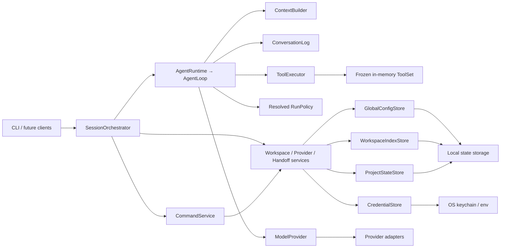

# Morrow 架构基线

> 状态：阶段 2 完成后的当前架构基线
> 原则：先锁定依赖方向和数据所有权，具体文件树允许随实现变薄或调整。

本文描述 Morrow 完成阶段 2 后的稳定所有权和依赖边界。具体文件可以演进，但不能绕过已经验证的单一历史、执行、状态和安全边界。

## 目标

Morrow 要把“模型调用、项目上下文、用户状态和交互入口”组合成一个可以持续协作的个人 Agent，同时保留以下性质：

- 不同工作空间的状态默认隔离。
- 用户可以查看、迁移、恢复和删除自己的状态。
- Provider、存储和交互入口可替换，不把具体厂商写进核心逻辑。
- Agent 的行动边界、失败结果和数据写入对用户可解释。
- 第一阶段可以只实现一个 Provider 和终端入口，但不能因此破坏扩展边界。

## 分层与依赖方向



### Core

Core 只表达领域对象、协议和状态转换，例如 `Message`、`ModelRef`、`Handoff`、`Preference`、`AgentEvent` 以及错误分类。Core 不依赖 CLI、Rich、具体模型 SDK、YAML、数据库或操作系统密钥库。

### Runtime / services

普通对话只有一条状态机路径：`AgentLoop.run_task()` 负责任务生命周期、模型重试、工具轮次、deadline/预算、取消闭合、重复循环检测和全部聊天历史写入；`AgentRuntime.run_turn()` 只是薄委托。每个任务恰好一次 `turn.started`/`turn.completed`，fatal error 的 `stop_code` 与完成事件一致。

会话历史由 Session 持有的进程内 `ConversationLog` 单一权威管理（冻结的 System/User/Assistant/Tool 协议）；`Session.messages` 是只读投影。带 calls 的 Assistant 和其有序 ToolMessage 构成不可拆分的 ToolCycle，任何 terminal 或下一消息写入前必须闭合。ContextBuilder 从不可变 Snapshot 生成 Chat/Structured/Handoff-fallback 三种 View，先按完整 Cycle 清理旧结果，再按完整 turn/Cycle 裁剪；它不写事实源、不调用摘要模型。

工具经任务冻结的 Registry/Executor 进入循环。生产组合只在 Adapter 明确声明 OpenAI function-tool 支持时启用 `lookup_record` 和 `calculate` 两个无本地副作用工具，不支持的 Adapter 保持普通聊天。随包 `agent-policy.toml` 经严格校验后解析为任务固定的 RunPolicy，统一约束模型、工具、时间、上下文、结果、Cycle 和循环阈值。模型请求白名单、流片段组装与 reasoning/SDK 元数据隔离归 Provider Adapter。

命令识别、确认、会话切换和退出码仍归 `SessionOrchestrator`；配置补丁、工作空间状态和交接生成归对应服务。StructuredCompletion 和 Handoff 只读取安全投影、从不消费 ToolMessage envelope 或中间 tool-call Assistant。服务层不直接实现终端交互或外部协议。

### Interfaces

CLI 或未来的 Web、桌面、消息入口只负责输入解析、事件渲染、确认和退出码。它们通过服务或事件接口工作，不直接读写 YAML、凭据或工作空间文件。

### Adapters / infrastructure

Provider Adapter、状态存储、凭据存储和终端执行等差异都位于边界层。核心代码通过 Protocol 或等价接口依赖它们；新增 Provider 只需注册新的 Adapter 和预设，不应新增 Provider 名称分支。

## 当前运行流

```text
进入项目目录或传入 --dir
  → 解析稳定 workspace_id
  → 检查 Provider 与凭据
  → 加载 Profile，展示但不自动注入 Handoff
  → 用户选择独立开始或显式继续
  → AgentRuntime 委托 AgentLoop，ConversationLog 接纳当前 User
  → ContextBuilder 组装并验证 system / profile / handoff / legal history / tools
  → Adapter 流式返回文本或 tool calls
  → ToolExecutor 串行执行受限内存工具并闭合 ToolCycle
  → AgentLoop 继续模型调用，直到最终回答、取消或确定性 stop_code
  → 接力会话退出时生成 Handoff，失败则使用确定性兜底
  → 需要保存时原子写入，失败则保留最后一份有效状态
  → 独立会话未显式保存时不覆盖现有 Handoff
```

## 状态所有权

| 状态 | 权威来源 | 允许的写入者 | 当前规则 |
|---|---|---|---|
| Provider 非敏感配置 | 全局本地状态 | Provider 管理服务 | YAML 不保存密钥，只保存 credential ref |
| 凭据 | `CredentialStore` / 显式环境变量 | Provider 管理服务 | 不进入日志、事件、交接和模型上下文 |
| Preferences | 全局 `config.yaml`、工作空间 `preferences.yaml`、进程内 session | 配置服务 | 按 global → workspace → session 合并；其他服务不得绕过受限补丁写入 |
| 工作空间路径索引 | `workspace-index.yaml` | Workspace 服务 | 独立于项目状态写入；移动候选不得自动认领 |
| 工作空间 Profile | 工作空间状态目录 | Profile 服务 | 按 `workspace_id` 隔离，原子写入 |
| Handoff | 工作空间状态目录 | Handoff 服务 | 启动只展示，用户明确选择后才加载 |
| 当前会话消息 | Session 持有的进程内 `ConversationLog` | `AgentLoop`；命令只可 reset | ToolCycle 原子闭合；不持久化、不跨进程恢复 |
| Agent 运行策略 | 随包 `agent-policy.toml` → task-fixed `RunPolicy` | 开发者配置与 composition root | 不进入用户 Preferences/Profile/Handoff/CLI |

状态写入必须带 schema 版本和 revision；写入顺序为“读取并校验 → 生成新内容 → 临时文件落盘 → 原子替换 → 保留一份可恢复备份”。任何一步失败都不能把旧的有效状态变成半份文件。

工作空间 Preferences、Profile 与 Handoff 使用版本 2 文档信封：`state: present` 承载类型化领域值，`state: cleared` 是不承载领域值但保留递增 revision 的合法 tombstone。读取结果保持两轴：`StateLoadStatus` 仅有 ok/corrupt/unsupported schema，ok 状态再以独立 presence 区分 missing/cleared/present；因此合法 missing/cleared 不会被误判为只读降级。版本 1 工作空间文档兼容读取为 present，并只在成功变更时升级。清除和普通写入共用同一锁、校验、临时文件、文件/目录 `fsync`、原子替换与备份路径。

Profile 或 Handoff 任一损坏/未来版本会触发保守的工作空间状态只读降级：本次会话不加载 Handoff，也不写 workspace Preferences、Profile 或 Handoff；普通独立对话、session Preferences、全局 Preferences 与 Provider 管理仍可使用。仅 workspace Preferences 损坏/未来版本时，该层视为空且禁止覆盖或修改，但有效 Profile/Handoff 仍可加载并用于 `/continue`。合法缺失或 cleared 状态不属于损坏，不触发降级。

`config.yaml` 是一个聚合文档，而不是 Provider 与 Preferences 各自拥有的两份逻辑文件。它使用一个 Schema、一个 revision 和一把事务锁；Provider 管理服务与配置服务都只能通过 `GlobalConfigStore` 在锁内执行“读取整单 → 修改所属字段 → 校验整单 → 原子发布”，并必须原样保留对方拥有的字段。`workspace-index.yaml` 由独立的 `WorkspaceIndexStore` 管理；两者都不能并入要求显式 `workspace_id` 的 `ProjectStateStore`。

## 事件边界

对外事件使用统一信封，至少包含事件类型、顺序号、回合标识和可选时间戳。`sequence` 是顺序权威，`timestamp` 只用于观测。取消应表达为正常完成的一种 `finish_reason`，不要把用户中断伪装成系统错误。

公开事件不包含密钥、原始 SDK 对象、完整异常堆栈或 Provider 私有 reasoning 内容。消费者应忽略未知事件类型和未知字段，以便后续阶段扩展。

## 安全与失败语义

- 阶段 2 的两个演示工具只读取注入的内存数据；不读写项目内容、不调用 Shell/Git、不联网。
- 默认测试不联网、不使用真实钥匙串、不依赖用户主目录。
- Provider 超时、无效结构化响应和网络错误必须分类，交接生成失败要有确定性兜底。
- 正常状态和配置失败不能静默切换到另一 Provider 或模型。
- 后续加入文件、Shell、网络和后台任务时，权限、预算、审批、取消和审计必须沿用同一套边界。

## 当前明确不锁死的内容

- 完整会话数据库、长期记忆和向量检索的实现技术。
- Provider 管理 CLI 的全部命令面。
- Web、桌面端、消息渠道以及后台调度器的进程模型。
- 为未来能力预建但当前没有行为的空模块。

这些内容进入对应阶段时再根据真实使用和验收结果确认。若实现需要突破本文件的边界，先更新架构决策并在 `.agent/LOG.md` 记录原因。
