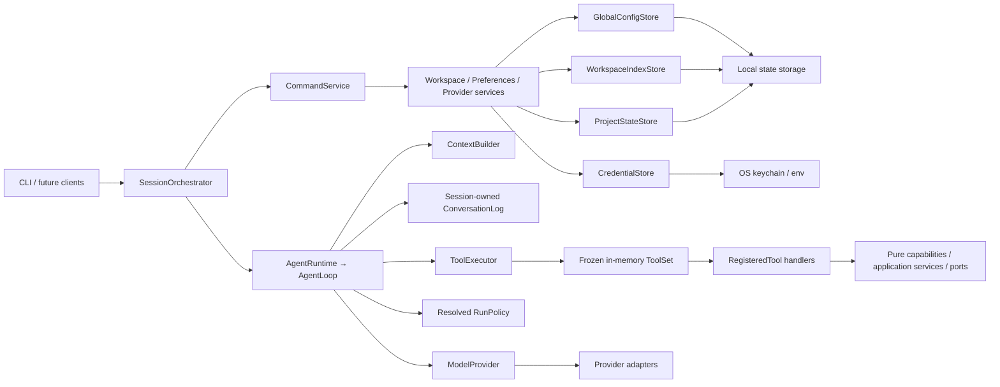

# Morrow 架构基线

> 状态：阶段 2、阶段 3 已完成（当前声明平台为 macOS；Linux 原生运行仍 unsupported）；阶段 4 已落地 Operational Store v7 的 Session/Task 历史、工具/审批日志、恢复分类、TaskOutcome、Artifact Store、ContextCheckpoint 与 Session Fork

本文锁定当前依赖方向、数据所有权和安全边界。阶段 3 的能力策略、配置工具、工作空间读搜、冲突安全文件变更、审批后 Host 命令、只读 Git 和当前 macOS 原生沙箱
已经交付；Linux 原生运行尚未声明支持。Stage 4 已落地数据根 SQLite Operational Store 的
身份/迁移/备份基础、v2 无工具 Session 历史、v3 工具执行/审批日志、v4 恢复分类与
崩溃对账，以及 v5 TaskRun 生命周期、转移审计、版本化 TaskOutcome、v6 Artifact 元数据/引用与受控字节发布、v7 确定性 ContextCheckpoint 与不可变 Session lineage。Full Access 仍未开始。Stage 5 的可审查学习、Stage 6 的 Skills/MCP，
以及 Stage 7–10 的 Workflow、GUI、后台自动化和产品化均尚未开始。

## 分层与依赖方向



### Core

Core 表达消息、模型引用、Profile、Preferences、配置补丁、工作空间文档、事件和错误分类。
Core 不依赖 CLI、Rich、具体模型 SDK、YAML、数据库或操作系统密钥库。

### Runtime 与应用服务

普通对话只有一条状态机路径：`AgentLoop.run_task()` 负责任务生命周期、模型重试、工具轮次、
deadline/预算、取消闭合、循环检测和全部聊天历史写入；`AgentRuntime.run_turn()` 是薄委托。

Session 持有的进程内 `ConversationLog` 是唯一聊天历史权威，`Session.messages` 是只读投影。
带 calls 的 Assistant 与其有序 ToolMessage 构成不可拆分的 ToolCycle。ContextBuilder 从不可变
Snapshot 生成 Chat 或 Structured 投影，按完整 Cycle/turn 控制预算；它不写事实源、不调用摘要模型。

生产组合只在 Adapter 声明 OpenAI function-tool 支持时启用 `list_directory`、`read_file`、
`find_files`、`search_text`、`apply_patch`、`write_file`、`show_changes`、`run_command`、`git_status`、`git_diff` 和 `update_configuration`；
支持原生沙箱时再加入当前运行、始终需审批的 `promote_sandbox_changes`。读搜工具通过冻结的
`WorkspacePathResolver`、`WorkspaceFileService` 与 `WorkspaceSearchService` 访问当前工作空间，
并对调用路径及工作区内解析后的文件符号链接目标应用同一受保护策略；变更工具通过
`WorkspaceMutationService`、`FileSystemAdapter` 与进程内 `ChangeSetService` 执行 SHA-256 冲突检查、
原子发布和实际 Diff。`update_configuration` 是配置服务的薄工具适配器，三类工具仍遵循同一标准 ToolCycle。随包
`agent-policy.toml` 解析为任务固定的 RunPolicy。模型请求白名单、流片段组装与 reasoning/SDK 元数据
隔离归 Provider Adapter。

Runtime 已提供与具体领域无关的 `PermissionProfile`、`WorkspaceCapability`、`CapabilityPolicy`、
`ToolExecutionPolicy`、本地 `ToolEffect` 和注入式 `ApprovalPort`；生产组合在 Session 构造时冻结工作区
能力与权限预设，Executor 按 intent 预检和策略判定后才允许审批或执行。生产配置工具使用
`effect=persistent_write/approval=required`，通过 Interface 层的 `TerminalApprovalPort` 接收经过预检和
脱敏的预览；权限、原因和副作用元数据不会进入 Provider wire。`ToolRunContext` 与严格 `ToolFact`
只在进程内保留最近一次完成运行的事实，不写入 ConversationLog 或持久状态；可选
`RunMetricsSnapshot` 只保留有界 JSON-safe 计数，默认启用但可在 composition root 关闭，同样不持久化、不上传。
配置工具、Slash 命令与
Profile/Preferences 的校验和写入统一委托给 `ConfigPatchService`。文件读取与搜索不跟随目录符号链接，
并把 `.git`、`.morrow`、凭据路径及常见 PEM 私钥内容作为受保护资源；文件变更拒绝符号链接路径、
混合换行源文件、陈旧 SHA-256、模糊/多匹配编辑和受保护凭据内容，并通过同目录临时文件、文件 `fsync`、
原子替换和父目录句柄保护发布；结果在领域服务内按当前 ToolCall 预算语义截断。Git 工具通过
`GitInspectionService` 与固定的 `GitInspectionAdapter` 解析只读状态/Diff，拒绝外部 Git metadata 并禁用
pager、外部 diff、textconv、hooks-like executable extension points、prompt 和可选锁。`run_command` 通过同一个 `ProcessExecutionService` 选择
`HostProcessAdapter` 或能力探测通过的 `NativeSandboxProcessAdapter`：Host 命令全部需要审批且不提供操作系统隔离，
审批预览展示有界脱敏命令，shell 包装的 Git 命令在审批前按写风险拒绝；Auto Sandboxed 则在默认断网的临时
快照中自动执行。快照准备/收集使用协作式取消和预留临时根，超时等待后台阶段停稳后再清理；沙箱变更只通过
当前运行、始终需审批的推广工具进入既有冲突安全 mutation 服务，并记录到同一 `ChangeSetService`。
Linux bubblewrap 在真实 runner 验收前固定探测为 unsupported，不因本机存在二进制而声明支持。

命令识别归 CommandService；调度归 SessionOrchestrator；输入、确认、渲染和退出码归终端接口。
配置补丁显式分派到 Preferences 或 Profile，不存在兜底目标。`build_session_application()` 返回命名的
`SessionApplication`，包含 `session`、`context_builder`、`commands`、`orchestrator`、`files`、`search`、`mutation`、`changes`、
`process`、`checkpoints` 和 `forks`。

### 工具能力边界

`ToolDefinition`、`ToolRegistry`、`ToolExecutor` 与 `AgentLoop` 只拥有标准工具协议、任务级注册冻结、
参数校验、intent 预检、能力策略、执行预算、取消闭合、结果限制和通用风险策略，不拥有任何具体工具的领域行为。
`RegisteredTool` handler 是标准工具协议到领域能力的薄适配层；新增工具不得要求 `AgentLoop`、
`ToolExecutor` 或 `SessionOrchestrator` 按工具名称增加业务分支。

所有工具都必须与交互入口、Provider SDK 和具体基础设施实现解耦，但不要求每个工具机械地增加一层
Service 或 Port：

- 纯计算工具可以直接调用无副作用的本地函数。
- 只读取构造时注入的不可变数据的工具可以使用自包含 handler。
- 读取持久状态、产生副作用或访问外部系统的工具必须通过显式注入的 Application Service 或 Core Port
  执行，不得直接依赖 Terminal、YAML Store、具体 Provider SDK 或模块级全局可变状态。
- Slash Command、自然语言 Tool 和未来其他入口可以共享同一个 Application Service，但不得复制领域
  校验、权限判定或状态写入逻辑。
- 工具的副作用等级、审批、超时、取消和审计属于通用 Tool Policy/Executor；单个 handler 不得自行读取
  用户输入、发起终端确认或发布公开事件。

`list_directory`、`read_file`、`find_files` 与 `search_text` 通过注入的文件/搜索服务访问冻结工作空间；
`apply_patch`、`write_file` 与 `show_changes` 通过注入的 mutation/ChangeSet 服务执行和报告当前运行的实际变更；
`run_command` 通过注入的 `ProcessExecutionService` 执行审批后的 Host 命令，或在 Auto Sandboxed 中执行原生快照命令；
`promote_sandbox_changes` 通过注入的 `SandboxSnapshotService`、`WorkspaceMutationService` 与
`ChangeSetService` 推广并记录当前运行的有界文本变更；
`update_configuration` 通过注入的 `ConfigPatchService` 访问既有配置状态。旧的 `lookup_record` 与 `calculate` 仅保留在显式测试 fixture 中。
未来 Git、网络等有状态或有副作用工具必须沿用同一注册与 ToolCycle 协议，并把实际能力委托给相应 Service/Port。模型请求中的 ToolDefinition 保持标准化；
本地风险与审批元数据不得泄露为 Provider 私有协议。

## 当前运行流

```text
进入项目目录或传入 --dir
  → 解析稳定 workspace_id
  → 检查 Provider 与凭据
  → 检查并加载 Profile / workspace Preferences
  → 构造进程内 SessionApplication
  → AgentLoop 接纳 User，ContextBuilder 组装合法历史和工具
  → Adapter 流式返回文本或 tool calls
  → ConversationLog 校验 Assistant ToolCall 后，同一事务提交有序 ToolExecution 意图
  → 审批 consume 与 executing 同一事务；handler 只在已提交意图可见后运行
  → bounded、redacted run_command 结果先发布为 Artifact，再记录 handler_completed 与 ToolMessage/closed
  → ToolExecutor 校验、预检、审批并串行执行受限工具，闭合 ToolCycle
  → 最终回答、取消或确定性 stop_code
  → 先提交 Turn/User，再发出 turn.started
  → 重启后扫描未闭合 ToolExecution；Host/sandbox 缺完成一律 unknown，禁止自动重放
  → 恢复只经 ConversationLog 追加 interrupted/error ToolMessage，不编造成功
  → /new 创建新 Session 而不删除旧会话；已持久化对话的 /exit 不再要求丢弃
```

任何启动、聊天、配置、重置或退出路径都不会生成模型摘要或写入对话延续状态。

## 状态所有权

| 状态 | 权威来源 | 允许的写入者 | 当前规则 |
|---|---|---|---|
| Provider 非敏感配置 | 全局 `config.yaml` | Provider 服务 | 只保存 credential ref |
| 凭据 | CredentialStore / 环境变量 | Provider 服务 | 不进入日志、事件或模型上下文 |
| Preferences | global、workspace、process-local session | 配置服务 | global → workspace → session 合并 |
| 工作空间路径索引 | `workspace-index.yaml` | Workspace 服务 | 独立于项目状态 |
| 工作空间 Profile | `profile.yaml` | Workspace/配置服务 | 按 workspace_id 隔离 |
| 当前会话消息 | 进程内 ConversationLog 投影；权威在 Operational Store v7 | AgentLoop 经 ConversationLog 提交 | 未闭合工具在重启后进入 needs_recovery，不自动重放；Checkpoint 不是第二历史权威 |
| Agent 运行策略 | 随包策略 → RunPolicy | composition root | 不属于用户配置 |
| 运行记录 / Artifact 元数据 | 数据根 `store/operational.sqlite`；Artifact 字节在 `artifacts/` | v7 Session/Task/对话/工具执行/审批/恢复报告/Outcome/Artifact/Checkpoint 元数据与引用 | 字节只经有界脱敏、hash/size 校验、fsync 和原子发布；YAML 与凭据权威不变 |

ProjectStateStore 只支持 `profile.yaml` 和 `preferences.yaml`。两者使用版本化文档信封、revision、
锁、临时文件、文件/目录 `fsync`、原子替换和备份；`state: cleared` 是合法 tombstone。

Profile 损坏或未来版本使工作空间持久状态只读，并阻止 Profile/workspace Preferences 写入。
workspace Preferences 损坏只隔离该层。旧 `handoff.yaml(.bak)` 不属于当前状态 API：生产代码不读取、
校验、迁移、覆盖或删除它，因此它也不能触发只读降级。

`config.yaml` 是聚合文档，Provider 与全局 Preferences 的写入必须在同一事务锁内保留对方字段。
`workspace-index.yaml` 由独立 WorkspaceIndexStore 管理。

### Operational Store 与 Artifact 布局（v7）

数据根（`--state-root` 或 `~/.morrow`）下的保留路径：

```text
{data_root}/
  store/operational.sqlite          # POSIX 0600；WAL/SHM sidecar 同为 0600
  artifacts/                        # 0700；Artifact 文件为 0600、ID 派生路径
    tmp/                            # 0700；staging 临时字节
  backups/operational/              # 0700；仅在线 backup 目标
  locks/operational-store.lock      # 全局维护锁，不是 WorkspaceWriterLock
```

`DataRoot` 暴露 `store_path`、`artifacts_path`、`backups_path` 与 `operational_lock_path`。
`build_session_application()` 会打开或创建 v7 Operational Store，并把对话经 ConversationLog
提交到 Session / TaskRun / Turn / AgentRun / conversation / receipt 表。v3 起有 tool_executions
与 approvals；v4 增加 recovery_reports / recovery_receipts；v5 增加完整 TaskRun 状态、转移审计、
TaskOutcome 版本和 Task 命令回执；v6 增加 Artifact 元数据、引用、pin 状态和 `artifact_refs_json`；v7 增加不可变
`context_checkpoints`、Checkpoint Artifact 引用以及 Session 的 parent/cut lineage 字段。
命令输出 Artifact 只接收既有有界脱敏结果，不保存 raw stream；单个 Artifact 上限 64 MiB，单个
TaskRun 预留字节上限 256 MiB，元数据/Excerpt 上限分别为 32 KiB/8 KiB。发布顺序是 staging 元数据、
用户私有临时文件写入与 fsync、hash/size 校验、原子 rename、父目录 fsync、available 元数据事务。
重启时扫描未闭合执行并分类，
Host/sandbox 缺 `handler_completed` 一律 `outcome_unknown`。YAML 与凭据权威不变。
损坏、外源或未来版本文件保持原字节并失败关闭。

### ContextCheckpoint 与 Session Fork

`ContextCheckpointService` 从 durable ConversationLog 的闭合 Turn 前缀生成有界、可重算的确定性投影。
Raw conversation records 仍是唯一聊天历史权威；Checkpoint 只保存 source record/range、完整最近 Turn 的
record IDs、确定性计数/Task 状态、Artifact 引用和 typed omitted reasons，不保存 retained-tail transcript，也不
把 `OMITTED_TOOL_RESULT` 写入历史。`ContextBuilder` 可从 Session 最近 checkpoint 保留完整 recent Turn、Checkpoint
之后的完整记录和当前输入；未闭合 ToolCycle 仍交给恢复边界处理。

Fork 只允许从合法闭合 Turn terminal 或以其结束的 Checkpoint 创建。子 Session 只写 parent Session、cut record/
position、可选 checkpoint 和原因；恢复时投影 parent immutable prefix 加 child 本地记录，不复制 Preferences、TaskRun、
Approval、CapabilityGrant 或文件。父子 Artifact 通过只读 ID/reference 共享，Workspace 文件不会被 fork 读取或修改。

## 事件与安全边界

每个任务恰好一次 `turn.started`/`turn.completed`。事件以 sequence 为顺序权威；取消是正常完成的
一种 finish_reason。公开事件不包含密钥、原始 SDK 对象、完整异常堆栈、完整工具参数/结果或 Provider
私有 reasoning。

- 当前工具只读取冻结工作空间，或通过冲突安全的 mutation 服务更新项目文件，或经审批调用非隔离 Host 命令；Auto Sandboxed 只在原生临时快照内执行；Git 只读检查不修改仓库；配置服务更新既有状态；不联网。
- 当前系统边界按冻结 ToolSet 动态渲染；未提供的能力、工作空间外访问、网络/loopback、Git 写入和权限提升始终被禁止。
- 默认测试不联网、不使用真实钥匙串、不依赖用户主目录。
- Provider 和结构化响应失败必须分类；不静默切换 Provider 或模型。
- 无工具 Session 对话可持久化并在重启后恢复；Artifact 的 missing/corrupt/staging/orphan 状态保持可见，
  只产生 retention/orphan 报告，不自动删除；conversation Fork、工具恢复和确定性 checkpoint 已实现；
  工作空间/代码 rewind 不属于 Stage 4，长期偏好/知识学习留到 Stage 5。
  当前不存在过渡兼容写入器。

若未来实现需要突破这些边界，先更新架构与当前阶段计划。
