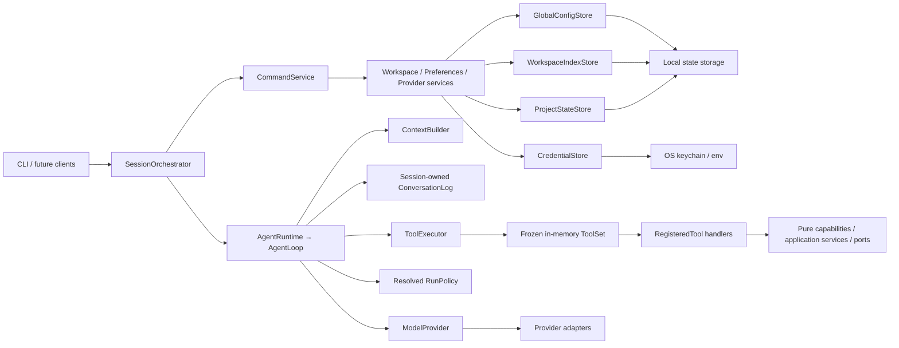

# Morrow 架构基线

> 状态：阶段 2 完成、阶段 3 通用工具策略/审批与配置工具先行切片完成

本文锁定当前依赖方向、数据所有权和安全边界。阶段 3 的配置工具先行切片已经交付，文件/Shell/Git
能力仍未实现；Stage 4 的持久化 Session/Task/Artifact、Stage 5 的可审查学习、Stage 6 的 Skills/MCP，
以及 Stage 7–10 的 Workflow、GUI、后台自动化和产品化均尚未开始。

## 分层与依赖方向



### Core

Core 表达消息、模型引用、Profile、Preferences、配置补丁、工作空间文档、事件和错误分类。
Core 不依赖 CLI、Rich、具体模型 SDK、YAML、数据库或操作系统密钥库。

### Runtime 与应用服务

普通对话只有一条状态机路径：`AgentLoop.run_task()` 负责任务生命周期、模型重试、工具轮次、
deadline/预算、取消闭合、循环检测和全部聊天历史写入；`AgentRuntime.run_turn()` 是薄委托。

Session 持有的进程内 `ConversationLog` 是唯一聊天历史权威，`Session.messages` 是只读投影。
带 calls 的 Assistant 与其有序 ToolMessage 构成不可拆分的 ToolCycle。ContextBuilder 从不可变
Snapshot 生成 Chat 或 Structured 投影，按完整 Cycle/turn 控制预算；它不写事实源、不调用摘要模型。

生产组合只在 Adapter 声明 OpenAI function-tool 支持时启用 `lookup_record`、`calculate` 和
`update_configuration`。后者是配置服务的薄工具适配器，仍遵循同一标准 ToolCycle。随包
`agent-policy.toml` 解析为任务固定的 RunPolicy。模型请求白名单、流片段组装与 reasoning/SDK 元数据
隔离归 Provider Adapter。

Runtime 已提供与具体领域无关的 `ToolExecutionPolicy`、本地 `ToolEffect` 和注入式 `ApprovalPort`；
生产配置工具使用 `effect=persistent_write/approval=required`，通过 Interface 层的
`TerminalApprovalPort` 接收经过预检和脱敏的预览；副作用元数据不会进入 Provider wire。配置工具、
Slash 命令与 Profile/Preferences 的校验和写入统一委托给 `ConfigPatchService`。文件/Shell/Git 工具
以及对应的 Interface 组合仍未进入当前架构基线。

命令识别归 CommandService；调度归 SessionOrchestrator；输入、确认、渲染和退出码归终端接口。
配置补丁显式分派到 Preferences 或 Profile，不存在兜底目标。`build_session_application()` 返回命名的
`SessionApplication`，包含 `session`、`context_builder`、`commands` 和 `orchestrator`。

### 工具能力边界

`ToolDefinition`、`ToolRegistry`、`ToolExecutor` 与 `AgentLoop` 只拥有标准工具协议、任务级注册冻结、
参数校验、执行预算、取消闭合、结果限制和通用风险策略，不拥有任何具体工具的领域行为。
`RegisteredTool` handler 是标准工具协议到领域能力的薄适配层；新增工具不得要求 `AgentLoop`、
`ToolExecutor` 或 `SessionOrchestrator` 按工具名称增加业务分支。

所有工具都必须与交互入口、Provider SDK 和具体基础设施实现解耦，但不要求每个工具机械地增加一层
Service 或 Port：

- 纯计算工具可以直接调用无副作用的本地函数。
- 只读取构造时注入的不可变数据的工具可以使用自包含 handler。
- 读取持久状态、产生副作用或访问外部系统的工具必须通过显式注入的 Application Service 或 Core Port
  执行，不得直接依赖 Terminal、YAML Store、具体 Provider SDK 或模块级全局可变状态。
- Slash Command、自然语言 Tool 和未来其他入口可以共享同一个 Application Service，但不得复制领域
  校验、权限判定或状态写入逻辑。
- 工具的副作用等级、审批、超时、取消和审计属于通用 Tool Policy/Executor；单个 handler 不得自行读取
  用户输入、发起终端确认或发布公开事件。

`lookup_record` 与 `calculate` 分别属于注入不可变数据和纯计算工具；`update_configuration` 通过注入的
`ConfigPatchService` 访问既有配置状态。未来文件、Shell、Git、网络等有状态或有副作用工具必须沿用同一
注册与 ToolCycle 协议，并把实际能力委托给相应 Service/Port。模型请求中的 ToolDefinition 保持标准化；
本地风险与审批元数据不得泄露为 Provider 私有协议。

## 当前运行流

```text
进入项目目录或传入 --dir
  → 解析稳定 workspace_id
  → 检查 Provider 与凭据
  → 检查并加载 Profile / workspace Preferences
  → 构造进程内 SessionApplication
  → AgentLoop 接纳 User，ContextBuilder 组装合法历史和工具
  → Adapter 流式返回文本或 tool calls
  → ToolExecutor 校验、预检、审批并串行执行受限工具，闭合 ToolCycle
  → 最终回答、取消或确定性 stop_code
  → /new 或 /exit 对脏 Session 要求显式丢弃确认
```

任何启动、聊天、配置、重置或退出路径都不会生成模型摘要或写入对话延续状态。

## 状态所有权

| 状态 | 权威来源 | 允许的写入者 | 当前规则 |
|---|---|---|---|
| Provider 非敏感配置 | 全局 `config.yaml` | Provider 服务 | 只保存 credential ref |
| 凭据 | CredentialStore / 环境变量 | Provider 服务 | 不进入日志、事件或模型上下文 |
| Preferences | global、workspace、process-local session | 配置服务 | global → workspace → session 合并 |
| 工作空间路径索引 | `workspace-index.yaml` | Workspace 服务 | 独立于项目状态 |
| 工作空间 Profile | `profile.yaml` | Workspace/配置服务 | 按 workspace_id 隔离 |
| 当前会话消息 | 进程内 ConversationLog | AgentLoop；命令只可 reset | 不持久化、不跨进程恢复 |
| Agent 运行策略 | 随包策略 → RunPolicy | composition root | 不属于用户配置 |

ProjectStateStore 只支持 `profile.yaml` 和 `preferences.yaml`。两者使用版本化文档信封、revision、
锁、临时文件、文件/目录 `fsync`、原子替换和备份；`state: cleared` 是合法 tombstone。

Profile 损坏或未来版本使工作空间持久状态只读，并阻止 Profile/workspace Preferences 写入。
workspace Preferences 损坏只隔离该层。旧 `handoff.yaml(.bak)` 不属于当前状态 API：生产代码不读取、
校验、迁移、覆盖或删除它，因此它也不能触发只读降级。

`config.yaml` 是聚合文档，Provider 与全局 Preferences 的写入必须在同一事务锁内保留对方字段。
`workspace-index.yaml` 由独立 WorkspaceIndexStore 管理。

## 事件与安全边界

每个任务恰好一次 `turn.started`/`turn.completed`。事件以 sequence 为顺序权威；取消是正常完成的
一种 finish_reason。公开事件不包含密钥、原始 SDK 对象、完整异常堆栈、完整工具参数/结果或 Provider
私有 reasoning。

- 当前工具只读取注入的内存数据，或通过配置服务更新既有状态；不读写项目、不调用 Shell/Git、不联网。
- 默认测试不联网、不使用真实钥匙串、不依赖用户主目录。
- Provider 和结构化响应失败必须分类；不静默切换 Provider 或模型。
- Session 持久化、恢复、Fork 和摘要留到 Stage 4 重新设计；长期偏好/知识学习留到 Stage 5。
  当前不存在过渡兼容写入器。

若未来实现需要突破这些边界，先更新架构与当前阶段计划。
