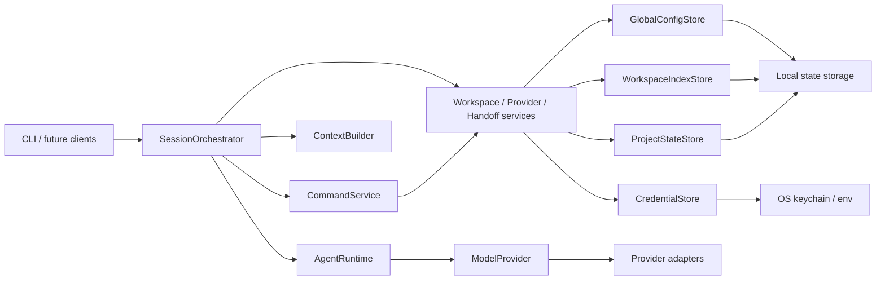

# Morrow 架构基线

> 状态：目标架构，服务于阶段 1 实现  
> 原则：先锁定依赖方向和数据所有权，具体文件树允许随实现变薄或调整。

本文是 Morrow 的长期架构边界。它不是现有代码的目录说明；在项目尚未形成稳定实现前，任何具体模块都必须以能验证阶段 1 闭环为前提。

## 目标

Morrow 要把“模型调用、项目上下文、用户状态和交互入口”组合成一个可以持续协作的个人 Agent，同时保留以下性质：

- 不同工作空间的状态默认隔离。
- 用户可以查看、迁移、恢复和删除自己的状态。
- Provider、存储和交互入口可替换，不把具体厂商写进核心逻辑。
- Agent 的行动边界、失败结果和数据写入对用户可解释。
- 第一阶段可以只实现一个 Provider 和终端入口，但不能因此破坏扩展边界。

## 分层与依赖方向



### Core

Core 只表达领域对象、协议和状态转换，例如 `Message`、`ModelRef`、`Handoff`、`Preference`、`AgentEvent` 以及错误分类。Core 不依赖 CLI、Rich、具体模型 SDK、YAML、数据库或操作系统密钥库。

### Runtime / services

`AgentRuntime` 只负责把已经组装好的上下文变成一次可观察的模型回合：调用 Provider、归一化结果并发布事件。命令识别、确认、是否加载交接、会话切换和退出码归 `SessionOrchestrator`；上下文组装归 `ContextBuilder`；配置补丁、工作空间状态和交接生成归对应服务。服务层承载用例，但不直接实现终端交互或外部协议。

阶段 1 的 `AgentRuntime.run_turn()` 只代表一轮模型调用。阶段 2 的多步工具循环应作为任务级编排加入，不能把单轮协议悄悄改成不可控的循环。工作空间启动检查和首次 Profile/Handoff 发布由 `WorkspaceStateService` 持有，CLI 只负责收集输入和展示结果；结构化完成协议位于 runtime 边界，供 Handoff 与配置提取复用。

### Interfaces

CLI 或未来的 Web、桌面、消息入口只负责输入解析、事件渲染、确认和退出码。它们通过服务或事件接口工作，不直接读写 YAML、凭据或工作空间文件。

### Adapters / infrastructure

Provider Adapter、状态存储、凭据存储和终端执行等差异都位于边界层。核心代码通过 Protocol 或等价接口依赖它们；新增 Provider 只需注册新的 Adapter 和预设，不应新增 Provider 名称分支。

## 阶段 1 的最小运行流

```text
进入项目目录或传入 --dir
  → 解析稳定 workspace_id
  → 检查 Provider 与凭据
  → 加载 Profile，展示但不自动注入 Handoff
  → 用户选择独立开始或显式继续
  → ContextBuilder 组装 system / profile / handoff / history
  → AgentRuntime 进行流式单轮对话
  → 接力会话退出时生成 Handoff，失败则使用确定性兜底
  → 需要保存时原子写入，失败则保留最后一份有效状态
  → 独立会话未显式保存时不覆盖现有 Handoff
```

## 状态所有权

| 状态 | 权威来源 | 允许的写入者 | 阶段 1 规则 |
|---|---|---|---|
| Provider 非敏感配置 | 全局本地状态 | Provider 管理服务 | YAML 不保存密钥，只保存 credential ref |
| 凭据 | `CredentialStore` / 显式环境变量 | Provider 管理服务 | 不进入日志、事件、交接和模型上下文 |
| Preferences | 全局 `config.yaml`、工作空间 `preferences.yaml`、进程内 session | 配置服务 | 按 global → workspace → session 合并；其他服务不得绕过受限补丁写入 |
| 工作空间路径索引 | `workspace-index.yaml` | Workspace 服务 | 独立于项目状态写入；移动候选不得自动认领 |
| 工作空间 Profile | 工作空间状态目录 | Profile 服务 | 按 `workspace_id` 隔离，原子写入 |
| Handoff | 工作空间状态目录 | Handoff 服务 | 启动只展示，用户明确选择后才加载 |
| 当前会话消息 | 进程内会话对象 | Session 编排层 | 阶段 1 不承诺完整历史恢复 |

状态写入必须带 schema 版本和 revision；写入顺序为“读取并校验 → 生成新内容 → 临时文件落盘 → 原子替换 → 保留一份可恢复备份”。任何一步失败都不能把旧的有效状态变成半份文件。

`config.yaml` 是一个聚合文档，而不是 Provider 与 Preferences 各自拥有的两份逻辑文件。它使用一个 Schema、一个 revision 和一把事务锁；Provider 管理服务与配置服务都只能通过 `GlobalConfigStore` 在锁内执行“读取整单 → 修改所属字段 → 校验整单 → 原子发布”，并必须原样保留对方拥有的字段。`workspace-index.yaml` 由独立的 `WorkspaceIndexStore` 管理；两者都不能并入要求显式 `workspace_id` 的 `ProjectStateStore`。

## 事件边界

对外事件使用统一信封，至少包含事件类型、顺序号、回合标识和可选时间戳。`sequence` 是顺序权威，`timestamp` 只用于观测。取消应表达为正常完成的一种 `finish_reason`，不要把用户中断伪装成系统错误。

公开事件不包含密钥、原始 SDK 对象、完整异常堆栈或 Provider 私有 reasoning 内容。消费者应忽略未知事件类型和未知字段，以便后续阶段扩展。

## 安全与失败语义

- 阶段 1 默认不读写工作空间内容，也不调用 Shell；只识别必要的路径和 Git 元数据。
- 默认测试不联网、不使用真实钥匙串、不依赖用户主目录。
- Provider 超时、无效结构化响应和网络错误必须分类，交接生成失败要有确定性兜底。
- 正常状态和配置失败不能静默切换到另一 Provider 或模型。
- 后续加入文件、Shell、网络和后台任务时，权限、预算、审批、取消和审计必须沿用同一套边界。

## 当前明确不锁死的内容

- 阶段 2 的具体工具事件名称和 Agent Loop 公共入口。
- 完整会话数据库、长期记忆和向量检索的实现技术。
- Provider 管理 CLI 的全部命令面。
- Web、桌面端、消息渠道以及后台调度器的进程模型。
- 为未来能力预建但当前没有行为的空模块。

这些内容进入对应阶段时再根据真实使用和验收结果确认。若实现需要突破本文件的边界，先更新架构决策并在 `.agent/LOG.md` 记录原因。
