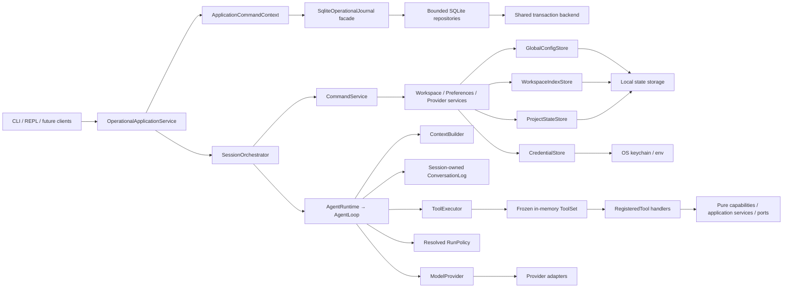

# Morrow 架构基线

> 状态：阶段 2–7 已完成；Stage 8 的运行时内核、Core API、Web GUI 观察器、Workflow Draft
> 编辑器、Agent Inspector 和 Context/Learning/Skill 管理已通过离线工程验收（macOS；Linux 原生运行仍 unsupported）。

本文锁定当前依赖方向、数据所有权和安全边界。阶段 3 的能力策略、配置工具、工作空间读搜、冲突安全文件变更、直接 Host 命令、只读 Git 和当前 macOS 原生沙箱
已经交付；Linux 原生运行尚未声明支持。Stage 4 已落地数据根 SQLite Operational Store 的
身份/迁移/备份基础、无工具 Session 历史、工具执行/审批日志、恢复分类与
崩溃对账，以及 TaskRun 生命周期、转移审计、版本化 TaskOutcome、Artifact 元数据/引用与受控字节
发布、确定性 ContextCheckpoint 与不可变 Session lineage、有界 application event/command receipt、
按 AgentRun 冻结的权限证据与可撤销 grant。Stage 5 已增加 LearningPolicy、Review、Evidence、
Candidate、Suppression 的有界领域与 SQLite 持久化；accepted TaskOutcome 的同事务 Review 请求、
一次性 lease Runner、Evidence/Context 安全边界和候选去重/抑制；Inbox、Candidate 决策、Project
Knowledge 生命周期；Profile Promotion Saga；确定性 MemorySelection、AgentRun 冻结注入、
RunContextProjection；以及 no-tool production Reviewer、离线评估、只读 Learning doctor 和完整
backup 引用校验。Stage 6 的 Skills 包、生命周期、选择/上下文、Draft/Usage、受限脚本执行、
Provider/Model 控制面以及 MCP desired state/Catalog 持久化已在本地完成；MCP Runtime/Security、
当前完整 Backup 与 Stage 6 Doctor 也已完成；S7P-01 增加了不改变公开事件的 AgentRun
request/terminal observability 与复用同一 SessionOrchestrator/AgentLoop 的 headless JSONL 入口。
Stage 7 已完成版本化 AgentDefinition、静态 Workflow 编译、串行调度、Artifact 协作、管理 CLI 与
恢复闭环；Stage 8 已交付 Pause/Drain、future-only patch/continuation 与 rerun 运行时内核、
版本化 Core API、Web GUI 观察器，以及持久 Workflow Draft 编辑器和 Agent Inspector。任务特化
GraphPlanner 与全局 Replan 已接入相同 Draft/Compiler/发布链；Context/Learning/Skill 管理 GUI
已交付；反馈评估与显式有界只读并行也已接通，后台自动化尚未交付。本文架构门禁以
离线证据为主；未获授权的 Live 证据不改变这些当前模块事实。

S56–S61 已冻结并接通 generic Preference 契约、加载前一次性旧 YAML 迁移、当前 workspace Preference、
Operational Store v13 Review/Evidence/Proposal/Writer saga、异步 Worker、Inbox、Writer 和下一
AgentRun 注入。v13 DDL 与 checksum 保持不变。

Stage 6 的当前所有权如下：`application/skills/` 负责 Catalog、生命周期、Selection/Context、Draft、Usage、脚本和
Doctor；`application/mcp/` 负责 desired-state、Catalog、run-scoped runtime、策略桥接和结果归一化；Provider/Model
控制面仍由 Provider service 与 Adapter Registry 持有。SkillBinding、MCP desired state、Provider/Model 非敏感配置和
Workspace 扩展配置继续由 YAML 持有，CredentialStore 是唯一凭据权威。Operational Store v14–v23 持有 Skill/MCP
运行证据与 AgentRun 观测；request ledger、保留但不参与当前判定的历史 completion 列与 long-horizon accounting，
以及 v21 的有界 retry progress、v22 的 durable runtime-control queue 独立于不可变
AgentRun admission snapshot。Stage 7 当前已交付纯 Workflow Compiler、不可变 Revision 发布、统一串行
Scheduler、isolated 多节点 Artifact pipeline，以及复用同一 Scheduler/TurnLifecycle 的 opt-in 单节点
`invoking_session` adapter；Subplan 8 增加 application management/query boundary、`morrow agent` /
`morrow workflow` CLI，以及 Direct 和 Explore Implement Verify 两个只读起点；后者只使用通用
`TextResult@1/result` 链，能通过 `workflow clone` 变为可任意编辑的用户 source。旧结构化合同和已发布
Revision 保持兼容，但不再形成角色专用的内置传递协议。Stage 8 运行时内核在 v26 上增加 durable
Pause/Drain、execution set、Artifact imports、
detached run-local Revision、FutureGraphPatch 的 Past/Future 校验与 OCC handoff，以及 continuation/rerun
lineage。`EffectiveOutputResolver` 是 Scheduler readiness、prompt/input binding、结果收口和查询的统一
继承输出入口；显式设置限制时 continuation 共用 absolute deadline 与 lineage accounting root，
rerun 建立新 accounting root。请求 cap 和 admission timeout 缺省均为 `None`，不触发系统猜测的
自动终止；durable request/usage accounting 始终保留。
普通 Direct 仍是默认路径，Scheduler 默认串行，显式并发声明可启用已证明的只读 frontier。
`application/backup_service.py` 组合在线 SQLite、Artifact、脱敏 YAML 和被引用 managed Skill 版本，并以新目标
目录执行原子、隔离 restore。Backup 只有当前完整格式，且不复制凭据。

Stage 7 Subplan 1 的实际结构：`core/agent_definitions.py` 持有最小 Source/Version/Head/Revocation；
`adapters/state/definition_yaml.py` 持有 workspace `agent-definitions.yaml` 的可编辑 desired state，
`agent_definition_journal.py` 通过共享事务 backend 持有 v23 不可变版本、发布 head、单向撤销、命令回执与 Skill 引用。
`application/agent_definitions/publication.py` 是唯一发布/enable/revoke 应用入口；validate 只做静态检查。
Built-in Direct/Explorer 是只读源 fixture，必须显式 publish，启动和 validate 都不发布。

Stage 7 Subplan 2 增加 `core/workflows/` 的 source、compiled Revision、NodeRun/WorkflowRun 与
TaskContract/TextResult 契约；`workflow_journal.py` 在共享事务 backend 上持有 v24 immutable
Revision/Head/source-hash、单向撤销、根任务非终态唯一性、queued leaf ownership 和 Artifact binding。
Repository 只接受已编译的不可变对象，不生成 Revision/hash；纯 Compiler 与唯一 publication service
位于 `application/workflows/compiler.py`、`publication.py`。workspace `workflow-definitions.yaml` 复用
definition YAML/OCC owner。
TaskRun 的 `user|workflow_node` purpose 把内部叶子排除在普通 Task/Turn mutation 与 LearningReview 之外；
`application/workflows/tasks.py` 是明确的内部生命周期边界。Artifact bytes 仍归同一 ArtifactService/store，
TaskContract/TextResult 只新增 typed contract、确定性 NodeRun/slot 产物身份与引用，不复制聊天历史。
Artifact/TaskOutcome 保存内部 TextSafetyProfile；Workflow typed projection 复用现有 refusal/redaction owner，
普通 API 保持 legacy-strict。Backup/doctor 复用现有 bundle/integrity seams，保留 malformed desired source
原始字节；published reference/hash 损坏是 error，未发布源问题是局部 warning。

`AgentFactory` 默认绑定调用者提供的独立空 Session/current TaskRun 对；Direct adapter 仅在 Revision
明确声明 `invoking_session` 时绑定 exact invoking user Session/root Task。两种 scope 都限制既有
preparation 的工具集合并选择 Compiler 冻结的精确模型。
role prompt 经原 PromptAssembler 注入，精确 Skill 版本仍经过 enabled binding、pin 和依赖检查；Preference、Memory、
Permission 与 Context 仍归原 owner。AgentRun 只新增 Definition ID/version/hash、conversation_session_id 和可空的
primary-generation-request cap；计入每次 `purpose=agent` 的调用（含工具后的继续生成与重试），
在既有 durable request admission 事务中记录，仅当用户显式配置 cap 时拒绝超额请求。预算耗尽以
存储错误返回，由 SessionPersistence 转换为现有 known-failure 诊断。Definition 准备与提交失败也
沿用这一诊断路径；精确 Skill 在准备时
预检，提交事务仍重新检查绑定并冻结选择，恢复不读取当前绑定。Session-local prompt owner binding
供 admission/recovery 验证同一组装器，只有 Session-owned ConversationLog 和 AgentLoop 写聊天历史；禁止 transcript fork。
普通 disable 只阻止新 admission，Factory recovery 只检查不可变版本及其撤销记录，不再检查 enabled head。
普通 Direct 不使用 AgentFactory，默认路径、公开事件和 bundled runtime-policy 未改变。

`application/workflows/scheduler.py` 是所有 Workflow 图形的唯一执行器；它在 `AgentLoop` 之外组合
叶子，但仍通过同一 `run_task`、ToolExecutor、权限、durable request admission 与 Session-owned
ConversationLog。isolated 节点拥有独立 Session/`workflow_node` Task；单节点无边的
`invoking_session` 节点改为绑定根 Session/user Task，并由 TurnLifecycle 独占根终态写入，Workflow
finalizer 随后幂等关闭 Run 与结果 snapshot。NodeResultCommitter、Artifact binding、取消与恢复路径在
两种 scope 间共享。多节点 DAG 使用 contract-bound Artifact handoff；内置
Explorer→Coder→Reviewer 只传通用 `TextResult`，高级用户仍可显式声明结构化合同。管理 CLI 只调用
application services；validate 保持零写入，publication、Head
toggle、精确 revoke、foreground recovery 与查询没有第二套 SQLite/YAML 逻辑。
只读 ceiling 要求可证明的静态只读工具契约，未知副作用工具仍可用于 write ceiling 的串行 Agent，
不能因角色提示变成只读。

现有 refusal owner 为 Workflow Definition、Artifact 与 TaskOutcome 提供共享的 value-sensitive 模式，
并共享 preview/value-shaped 与高置信 literal 检测规则；持久化 profile discriminator 已落地，普通
Direct 仍默认 legacy-strict。现有 backup/doctor 增加 definition
行完整性与精确路径的原始 desired-source inventory：损坏草稿可备份/恢复且只报局部 warning；发布引用/hash 损坏才报 error。

Stage 8 Subplan 12 的 `application/workflows/parallel.py` 协调固定 ready frontier 的准备与准入屏障，
不调用 Provider、不重试请求，也不持有持久状态。Scheduler 只组合独立 Session 的叶子 `run_task()`。
AgentFactory 在可选工具过滤前检查 Compiler 冻结的有效工具要求；已知 read-contract drift 直接失败，
未知或不可证明契约回退串行。冻结的工具契约 digest 存在 NodeRun 的可空 `parallel_read_digest` 中，
沿用 NodeRun JSON，不新增数据库表或修改旧 Revision hash。逐调用 intent guard 在 handler 前复核契约。
Turn admission 同事务冻结只读 PermissionSnapshot 并取得 NodeRun slot；journal 拒绝超出
`max_concurrency` 的 Active 集合，以及 Writer/未证明节点与其他 Active 节点重叠。
每次 Provider 请求仍使用原有 AgentRun/request ordinal 幂等账本与 lineage cap 检查，
不预留整节点额度。Adapter 只归一化限流错误/Retry-After，叶子 AgentLoop 独占重试，Scheduler 不重试。
叶子聊天、请求实际用量、终态与候选 Artifact 即时持久化；并行叶子暂不发布 Workflow output binding。
Scheduler join 全部活动叶子后，按稳定节点序事务性发布 binding 与 NodeRun completion，再处理整体失败、
取消、Replan 或下一 frontier。部分成功和崩溃恢复由原叶子事实重建，不重跑已提交结果。
恢复检查整个 Active 集合与冻结 read/permission 证据。Doctor/Backup 的 Workflow integrity 同时校验
并发 slot 和 PermissionSnapshot 引用。上述变化不扩展公开事件，不改变普通聊天历史的唯一 writer。

Stage 8 Subplan 9 的 `core/workflows/replan.py` 定义有界 ReplanRequest、节点关闭证据
ReplanSignal 和精确 ReplanProposal。v28 只新增 signal/proposal 表；节点的提交 marker 仍由
ArtifactService 保存，`WorkflowLeafHooks.apply_terminal_in_txn` 在 leaf 关闭事务中提交信号。
同一节点准入事务与底层 queued→running 写入重检未消费信号。Scheduler 仅在节点收口后交给
`ReplanCoordinator` 请求 Pause/Drain；无 Active 的 paused 窗口才可自动或批准 handoff。
Coordinator 是唯一自动提案者，沿用 PatchApplicationService 的 pure Compiler、detached
Revision 和 OCC/CAS。提案消费与创建原子提交，决策与 child handoff 原子提交；API command receipt
加入同一事务。已有 RunSupervisor 仍独占每个 child driver，Session-owned ConversationLog 不变。

风险沿用并补齐 `patch_preview.py` 的 C8 数据比较：新增/替换角色、权限/模型数据边界、合同、
报告依赖、Writer 顺序、显式约束删除、scope 变化及未知字段变化均升级。显式通配用户策略的
`allow_low_risk` 只自动接受当前分类仍为 low 的提案；任务类型级自动化没有配对证据时仍关闭。
CLI、Core API 与 GUI 共用 Coordinator 的精确 before/after、分类、策略版本和决策历史投影。
GUI 以 Query 轮询补齐提案显示，不新增 ApplicationEvent 生命周期；自动应用复用已有 run 事件。
Backup/Doctor 复用 `verify_workflow_rows` 检查信号消费、proposal 身份与 child lineage。
恢复时在校验 frozen tool-schema digest 前重建内部机制工具，并按冻结 digest 保留升级前工具集。

Stage 8 Subplan 8 在 `core/orchestration.py` 定义有界 TaskFeatures、TaskBrief、用户
OrchestrationPolicy 和 PlannerMetadata。策略复用全局/工作空间 Extension YAML 的唯一写入、
OCC 与备份机制；`application/workflows/orchestration_policy.py` 按 workspace→global、精确
任务类型→通配规则解析完整策略。空策略字段不改变旧 Extension digest，保护已有 Skill/MCP 操作。
`planning_catalog.py` 只投影已启用、未撤销的 Agent head、已有 Artifact 合同和实际工具权限，
不建立第二 Registry；GraphGrammar 直接暴露 Compiler source schema 和串行声明。
`planning_features.py` 提取本地/项目约束，最多调用当前 Provider 一次作无工具分类；可选 Scout
只查询一次受限目录并返回已知项目标记。原始模型回复、隐藏 reasoning 和目录内容均不持久化。

`graph_planner.py` 用结构化特征、模板先验和最小普通图组合规则选取精确 Agent/Model/Skill 引用，
生成 `TextResult@1/result` Artifacts 绑定；模型偏好只筛选现有已授权 Agent 版本，不发布新的
Definition 或权限。显式小任务保持 Direct；范围扩大可增加 Planner/Reviewer，独立研究可形成
多个只读分支汇入 Synthesizer；Planner 默认保留并发度 1，用户可在 Draft 中提高声明。显式请求/时间限制只会被继承或收紧，
不会根据任务大小猜测一个 cap。编译失败最多重新生成一次，再编译 Direct 回退或返回具体补充要求。
有效结果通过既有 WorkflowDraftService 持久化；生成说明随 Draft 保存，并按 source hash 标明
编辑后是生成时说明。普通聊天、ConversationLog、Revision 写入与 Scheduler 所有权均不变。

Core API 的只读规划准备在 Core loop 上等待 Provider，但不占用串行 mutation bus；完成后
在同步编译与 Draft 写入的 bus 操作中重新读取策略/Catalog 和当前 Profile 约束；基于当前
显式约束重算本地特征并重新融合已有分类结果，无需第二次模型请求。`workflow plan`、GUI 和 API
共享应用服务。`auto_run_mode=allow_promoted` 是用户偏好；Subplan 11 已补齐产品推广证据
writer，GraphPlanner 记录生成时的 `auto_run_eligible` 与原因，不自行启动任务，手工冻结和执行始终可用。
`auto_replan_mode` 由 Subplan 9 的 ReplanCoordinator 消费：按不可变根任务分类解析策略，
显式用户通配策略可允许低风险自动应用，任务类型级自动化仍受配对收益证据门槛约束。

Stage 8 Subplan 11 的 `core/workflows/feedback.py` 与 v29 持有有界 WorkflowFeedback、
WorkflowPolicyCandidate 和 WorkflowEvaluation；`workflow_feedback_journal.py` 使用原 Operational
Store 事务 backend。Draft update 和用户 exact Patch save 在原编辑事务内记录变更摘要与哈希，
不复制任务文本、聊天记录或工具结果；自动 Replan 提案不冒充用户编辑。不同 Draft 或根任务的
重复信号触发确定性 Learning review，候选与证据通过同一个 Learning Inbox/评估页面查询。
同一 Draft、重复点击和 continuation lineage 不重复增加独立证据样本。

`application/workflows/roles.py` 共享规划器既有的 canonical node ID 约定（角色名或
`角色名_正整数`），作为冻结的任务角色；复用其他 AgentDefinition 不改变这个角色。
反馈与 Reviewer 评估采用同一解释，非角色 ID 保留 Definition 来源回退；不增加 Revision
字段或改写既有内容哈希。

`application/workflows/feedback.py` 只提议当前 workspace 的完整策略候选，接受时检查全局和
workspace Extension 文档修订；先保存 applying intent，再调用原 OrchestrationPolicyService.put，
最后记录 accepted。中断后相同命令恢复，后续 YAML 修改触发冲突，拒绝保留历史。没有自动
policy mutation、额外 Review Provider、跨 workspace 聚合或后台 worker。

`evaluation.py` 复用 Run/Artifact/TaskOutcome/request-ledger 查询，结果绑定具体 WorkflowRun；
死节点指标定义为“不在 required output 依赖祖先中、实际完成的只读节点”，不推断写入节点价值。
编辑频率按根任务去重，Reviewer 价值使用每个根任务最新一次用户评价；未知 usage 和未评价
明确保留不可用。实际配对需要相同 TaskContract 的独立初始 Direct/Multi 完成运行，每个 Run
只参与一组；质量分为用户声明，request 数来自 durable ledger，Direct 估算不计入推广。
当前规则为至少两组配对且全部有收益；无收益记录关闭资格。GraphPlanner 的生成资格、CLI
policy show 与 Replan 的应用前门槛共享这一纯收益计算；显式用户通配低风险 Replan 策略保留
既有语义，任何高风险 Patch 仍需明确批准。GUI/CLI/API 通过 ManagementService 共享反馈、
审核与评估服务。v29 引用校验进入现有 Doctor/Backup 路径；public ApplicationEvent 不变。

## 分层与依赖方向



### Core

Core 表达消息、模型引用、Profile、Preferences、配置补丁、工作空间文档、事件和错误分类。
Core 不依赖 CLI、Rich、具体模型 SDK、YAML、数据库或操作系统密钥库。

### Runtime 与应用服务

普通对话只有一条状态机路径：`AgentLoop.run_task()` 负责任务生命周期、模型重试、工具轮次、
上下文压缩、单次工具/结果预算、取消闭合和全部聊天历史写入；`AgentRuntime.run_turn()` 是薄委托。
有序公开事件的构造由 loop 内部事件发射协作者负责，但状态转换、事件时机和 ConversationLog
写入权仍只属于 `AgentLoop.run_task()`。持久化运行能力由显式 `DurableRunCoordinator` 合同提供；
AgentLoop 在每次 Provider 调用前后经该合同记录 bounded request admission/settlement，并在终态
写入独立的 AgentRun terminal metrics；projection 只含 ID、状态、计数、stop/finish 和明确的
usage/cost availability，不含 prompt、message、reasoning、完整工具参数/结果、SDK object 或 traceback。
有效且不含 tool calls 的模型 `stop` 直接决定普通回合结束；Runtime 不再推断 OutcomeContract、扫描
workspace baseline，或依据 diff、validation、verifier 和其他输出事实拒绝最终回答。`ValidationFact`
仍是独立、精确 scoped 的执行遥测，不是回答发送门禁。当前 AgentRunSnapshot 不包含 contract、
workspace baseline 或 completion gate；旧快照不能通过当前严格模型加载。
工具 handler 的审批、权限复查、超时/取消和 durable execution 状态由 `ToolCycleExecutor` 执行，
但它不拥有聊天历史或公开事件。只有实现有界、单行且拒绝密钥材料的 `PublicDiagnosticError`
合同的领域失败可越过 Agent 的通用异常边界；未知异常仍只产生固定内部错误，不暴露 traceback。

Session 持有的进程内 `ConversationLog` 是唯一聊天历史权威，`Session.messages` 是只读投影。
带 calls 的 Assistant 与其有序 ToolMessage 构成不可拆分的 ToolCycle。ContextBuilder 从不可变
Snapshot 生成 Chat 或 Structured 投影，按完整 Cycle/turn 控制预算；它不写事实源、不调用摘要模型。
普通追加只校验新增记录和当前 Turn 状态；只有同一 Log 产生且尚未失效的不可变 append 能增量提交。
恢复、外部快照及非当前 append 仍完整校验。持久化写入不再逐条重新加载全历史；快照仍复制记录引用，
没有新增历史缓存或第二写入者。模型文本按完整行脱敏后发送现有 `text.delta`，携带请求序号；
未完成的末行等响应收口再发送。提前显示的文本是临时预览，重试失败不写入历史，最终内容修订时通过
现有 `status.changed/response_reset` 提示替换；`turn.completed.text` 是最终回答。

生产组合只在 Adapter 声明 OpenAI function-tool 支持时启用 `read`、`ls`、`find`、`grep`、
`edit`、`write` 与 `bash` 七个核心编码工具；`run_skill_script`、`update_configuration`、
`manage_preferences` 与 `read_artifact` 随对应能力条件组合，支持原生沙箱时再加入当前运行、始终需
审批的 `promote_sandbox_changes`。读搜工具通过冻结的
`WorkspacePathResolver`、`WorkspaceFileService` 与 `WorkspaceSearchService` 访问当前工作空间，
只把工作空间边界、外部符号链接、文件类型和资源预算作为结构约束，不按文件名或内容关键词隐藏工作区
资源；变更工具通过
`WorkspaceMutationService`、`FileSystemAdapter` 与进程内 `ChangeSetService` 自动取得模式/当前
revision，并执行 SHA-256 冲突检查、原子发布和实际 Diff。模型可见 schema 不携带这些内部协议字段。
`update_configuration` 只管理 Workspace Profile；`manage_preferences` 是原子 Preference Writer 的受审批薄适配器。所有工具遵循同一标准 ToolCycle。随包
`runtime-policy.toml` 与可选 `config.yaml.runtime_policy` 安全覆盖在 composition root 合并，并解析为任务固定的 RunPolicy 及 Review policy。模型请求白名单、流片段组装与 reasoning/SDK 元数据
隔离归 Provider Adapter。

S7P-04 曾在上述 ToolCycle 中提供显式删除、移动和重命名适配器；当前模型层不再注册这些专用工具。
对应 mutation 服务仍只接受工作空间内的普通文件，源文件必须携带内部取得的 SHA-256，目标必须在预检和原子发布时均不存在；
不支持目录、递归、符号链接、special、force/overwrite、copy-delete fallback 或跨设备降级。
删除通过 no-follow directory-fd unlink，移动/重命名通过平台可证明的 atomic no-replace primitive；
无法证明能力时 fail closed。这些服务供沙箱变更推广和恢复对账使用；普通模型操作统一通过受策略约束的
`bash`。公开事件生命周期与 runtime-policy 默认值不因这次接口收缩改变。

Runtime 已提供与具体领域无关的 `PermissionProfile`、`WorkspaceCapability`、`CapabilityPolicy`、
`ToolExecutionPolicy`、本地 `ToolEffect` 和注入式 `ApprovalPort`；生产组合在 Session 构造时冻结工作区
能力与权限预设，Executor 按 intent 预检和策略判定后才允许审批或执行。生产配置工具使用
`effect=persistent_write/approval=required`，通过 Interface 层的 `TerminalApprovalPort` 接收经过预检和
脱敏的预览；权限、原因和副作用元数据不会进入 Provider wire。`ToolRunContext` 与严格 `ToolFact`
只在进程内保留最近一次完成运行的事实，不写入 ConversationLog 或持久状态；对需要崩溃对账的文件变更，
durable execution 只可额外保存无正文的 `FileMutationEvidence`，不保存 ToolFact、正文或完整参数；可选
`RunMetricsSnapshot` 只保留有界 JSON-safe 计数，默认启用但可在 composition root 关闭，同样不持久化、不上传。
普通 `CommandToolFact` 只证明一次有界命令执行；只有 Process preflight 识别出的、带规范 workspace scope 的
`ValidationFact` 才能贡献 validation outcome。两者均不携带完整命令、输出、文件内容、秘密或 traceback。
Profile 配置工具和 `/workspace` 委托给 `ConfigPatchService`；Preference 工具、CLI/REPL 与 Inbox
统一委托给 `PreferenceWriter`。文件读取与搜索不跟随目录符号链接，但工作空间内的 `.git`、`.env`、
示例凭据文件和 PEM 文本不因名称或内容关键词被隐藏。文件变更拒绝符号链接路径、混合换行源文件、
陈旧 SHA-256 和模糊/多匹配编辑，并通过同目录临时文件、文件 `fsync`、
原子替换和父目录句柄保护发布。S7P-04 的 destructive mutation 只做 regular-file confined unlink，或
通过 `renameatx_np`/`renameat2` 等已证明的 no-clobber primitive 完成 move/rename；源 regular-file fd 在
effect 期间保持打开，内容以有界稳定双读核验。为关闭“最后一次源目录项检查到 effect”之间的 TOCTOU，
适配器先用同一 no-replace primitive 把源原子捕获到计划中冻结的、workspace-confined、不可预测的
`.morrow-capture-<random>` sibling，再以 dev/ino/type/mode/size/mtime 证据核验捕获条目；捕获
不匹配时只做 no-clobber 有界恢复，恢复失败保留 staging 并报告 outcome-unknown，绝不删除或覆盖第三方
条目。匹配后 delete 只 unlink 捕获名，move/rename 只从捕获名 no-replace publish；每个阶段都 fsync
受影响父目录并验证 source absence、destination identity/hash/size/mode，staging 残留进入 ChangeSet、
ToolFact、prepared evidence 和恢复观察，不产生未声明垃圾。无法把源身份绑定到操作时 fail closed。
多路径按稳定顺序加锁并在锁内重验，发布后验证
source absence、destination hash/size/mode 与受影响父目录 fsync。prepared intent
只冻结 hash/size/kind/path evidence：delete 为 source expected-absent，move/rename 为有序 source-absent
加 destination expected-file；恢复区分 completed、safe-to-retry、mixed/reconciliation 与 outcome-unknown，
不以路径缺失伪造成功；effect 后 fsync/验证失败会保留 outcome-unknown ChangeSet/文件 evidence 并进入恢复，
绝不宣称成功。durable prepare 已缓存的完整内存 MutationPlan（含 staging 名）在后续
skip-approval resolver/handler 阶段按 run/call 身份复用；执行阶段只对这个冻结 plan 做锁内重验，
不重新分配 staging，也不以第二次 preflight 覆盖 PreparedIntent evidence。结果在领域服务内按当前
ToolCall 预算语义截断。只读 Git 服务仍通过
`GitInspectionService` 与固定的 `GitInspectionAdapter` 解析只读状态/Diff，拒绝外部 Git metadata 并禁用
pager、外部 diff、textconv、hooks-like executable extension points、prompt 和可选锁，但不再拥有独立的
模型工具包装；模型使用 `bash` 读取 Git 状态。`bash` 通过同一个 `ProcessExecutionService` 选择
`HostProcessAdapter` 或能力探测通过的 `NativeSandboxProcessAdapter`：普通工作空间模式下，注册的
`bash` 直接执行命令，不解析 `git`、重定向、管道、`mv`、`cp`、`tee` 等字符串来决定
许可或审批；Host 后端仍不提供操作系统隔离。命令输出只遮蔽当前运行已知凭据的精确值，并继续执行有界输出、
超时、取消和进程组清理。Auto Sandboxed 在默认断网的临时快照中执行。快照准备/收集使用协作式取消和预留
临时根，超时等待后台阶段停稳后再清理；沙箱变更通过当前运行的推广工具进入既有冲突安全 mutation 服务，
并记录到同一 `ChangeSetService`。
Linux bubblewrap 在真实 runner 验收前固定探测为 unsupported，不因本机存在二进制而声明支持。
`run_skill_script` 则通过 `SkillScriptExecutionService` 读取按 AgentRun 选择的冻结 managed Skill 包，
只在可用原生沙箱中运行；脚本 argv、环境名、输入 Artifact 和输出路径均有界，输出先脱敏再发布为
Session-scoped Artifact。它不接受 shell、不继承 ambient 环境或 CredentialStore，缺少沙箱时拒绝，
并沿用同一 CapabilityPolicy、ToolExecutor、ToolFact 与恢复分类。模型可见的低权限 Skill context
显示 Morrow 持久化的 `selection_id` 及冻结身份，以便构造严格请求；Skill 正文仍不能生成选择证据、
授予工具、权限或审批。Script 失败只返回已审查的稳定诊断码/消息，不返回原始异常。

Project Instruction 采用 availability-first 启动加载：只在工作空间根按
`AGENTS.override.md`、`AGENTS.md`、`CLAUDE.md` 顺序选择第一个可读 UTF-8 普通文件。任务文本和 touched
paths 不触发局部目录扫描；过大、异常格式或读取失败只产生警告并跳过，不阻断任务准备或恢复。

Stage 4 的 Full Access Manual 是一条额外的、明确受限的证据链：只有 Application API 的本地界面命令能
创建 `CapabilityGrant`；它绑定一个前台 AgentRun，随后冻结为不可替换的 `PermissionSnapshot`。Stage 4
只开放 `unconfined_host_process`，且只允许带 `unconfined_host` 证据的 opaque `bash` 携带 grant；
每次执行仍消费绑定 intent、schema、snapshot 和 grant 的一次性 Approval。这个标签明确表示没有操作系统
隔离，不能被描述为受保护的文件、网络或凭据 confinement。撤销会阻止新的审批/handler 入口、使 pending
approval 失效并请求活动执行取消；已完成或 outcome unknown 的事实不会被伪造回滚。结构化工具不会因为同一
AgentRun 有 grant 而获得 elevated 证据，`full_access + auto` 保持 unsupported。

命令识别归 CommandService；状态/生命周期 Command、Query、Event 统一归
`OperationalApplicationService`；调度归 SessionOrchestrator；输入、确认、渲染和退出码归终端接口。
Slash `CommandService` 是薄适配器，CLI、REPL 和未来客户端不直接访问 SQL 或 Artifact 文件。
`OperationalApplicationService` 是公开应用边界；Recovery 与 Permission/Approval 命令事务由独立
领域协作者实现，并只接收显式 `ApplicationCommandContext`，不持有或穿透父 facade。命令上下文统一
拥有 command replay、application event/receipt、时钟、ID 和错误翻译。Artifact、Task、Checkpoint/Fork、Grant、Recovery 与 durable conversation 服务依赖
`core/journal.py` 的窄端口；只有 composition、跨域事务聚合、诊断和备份持有具体 SQLite adapter。
`SqliteOperationalJournal` 保留 Session 聚合与领域委托；application event、Artifact、Context、
Conversation/Turn、Permission、Recovery、RuntimeControl、Task 与 Tool SQL 分属有界 repository。全部 repository 共享
一个 `SqliteJournalBackend` 的外层事务、时间戳、replayability 与 touched-Session 状态，因此拆分不会
拆散跨域原子事务，也不会形成 repository 对父 facade 的反向依赖。
Profile 配置补丁与通用 Preference Writer 是两条显式领域入口，不存在固定字段 Preference 兜底目标。`build_session_application()` 返回命名的
`SessionApplication`，包含 `session`、`context_builder`、`commands`、`orchestrator`、`files`、`search`、`mutation`、`changes`、
`process`、`checkpoints`、`forks`、统一 `api`、只读 `doctor` 和 `backup` 服务。
交互 bootstrap 与 headless CLI（包括 `morrow run`）通过 `build_operational_services()` / `build_operational_api()` 复用同一
Operational 组装路径；接口层不自行复制领域服务构造。

`SessionPersistence` 是运行时组合门面；Turn 提交、Session 恢复、权限证据、durable tool
状态以及 Tool/Conversation 原子写分别由聚焦 coordinator 持有。外部应用协作者只能调用公开同步方法，
不能修改其 Session、Task 或 AgentRun 私有投影。

Stage 5 的 `LearningPolicyService` 复用同一个 `ApplicationCommandContext`，只负责 workspace 策略的无写入
查询和 `off | review_only` 的有界命令；默认 `review_only` 不创建策略行，`explicit_auto` 只保留为不可选
领域令牌。`LearningReviewRequestService` 在同一 outer transaction 接受 accepted TaskOutcome，
`LearningReviewRunner` 只在提交后执行一次受限 Review；`ModelLearningReviewer` 使用独立的 no-tool、
有界消息和严格 Candidate schema，不读完整 Session、工具或凭据。Inbox、Candidate 决策和 Project
Knowledge 由 SQLite Learning application services 持有；`ConfigurationPromotionService` 只通过
`ConfigPatchService.prepare/apply_prepared` 写 YAML，先保存 PromotionOperation，最后在 SQLite 中原子
记录 decision、activation、events 和 receipt。它不连接后台自动晋升或第二配置权威。`OperationalDoctor`
通过 `learning_doctor` 的域校验入口检查 Review/Candidate/Promotion/Knowledge 链接，Memory doctor
继续检查 Selection/AgentRun/derived terms；`OperationalBackupService` 在 SQLite online backup 后
分别验证 Learning、Memory 与 Preference 引用；当前 Preference/Profile、workspace index 与扩展 YAML
进入完整 bundle，凭据和 Keychain 始终在 bundle 外。

普通前台工作的共享准入条件是 `Session.lifecycle=active` 且 `Session.health=ok`。
Orchestrator 在调度前刷新 durable lifecycle/health；Task/Turn application service 执行稳定错误映射，
SQLite journal 保留最终写入守卫。Archive 必须没有 current TaskRun；`needs_recovery` 只能经恢复边界解决，
`quarantined`/`read_only` 不能启动普通 Turn 或 TaskRun。Session 的可观察 mutation 在每个外层
事务共享一个注入时间戳，`updated_at` 以整秒精度跨事务严格单调。

Recovery resolve 先按 command receipt 返回同请求 replay；新 command 只能作用于 `OPEN`
RecoveryReport，并在写事务内重新读取 durable status。该终态守卫阻止旧 report 清除
后来的 quarantined/read-only health 或重复创建 AgentRun。`resume_recovery()` 本身也要求
Session 仍为 ACTIVE + health OK，不依赖陈旧内存投影扩大恢复权限。

### 工具能力边界

`ToolDefinition`、`ToolRegistry`、`ToolExecutor` 与 `AgentLoop` 只拥有标准工具协议、任务级注册冻结、
统一有界参数验证、声明拥有的恢复证据、intent 预检、能力策略、执行预算、取消闭合、结果限制和通用风险策略，
不拥有任何具体工具的领域行为。每个 `RegisteredTool` 携带一个参数验证器和一个 `ToolRecoveryDeclaration`；
准备阶段把声明冻结进 durable intent，恢复优先使用该证据，不从当前注册表或工具名表重新推断。
`RegisteredTool` handler 是标准工具协议到领域能力的薄适配层；新增工具不得要求 `AgentLoop`、
`ToolExecutor` 或 `SessionOrchestrator` 按工具名称增加业务分支。

所有工具都必须与交互入口、Provider SDK 和具体基础设施实现解耦，但不要求每个工具机械地增加一层
Service 或 Port：

- 纯计算工具可以直接调用无副作用的本地函数。
- 只读取构造时注入的不可变数据的工具可以使用自包含 handler。
- 读取持久状态、产生副作用或访问外部系统的工具必须通过显式注入的 Application Service 或 Core Port
  执行，不得直接依赖 Terminal、YAML Store、具体 Provider SDK 或模块级全局可变状态。
- Slash Command、自然语言 Tool 和未来其他入口可以共享同一个 Application Service，但不得复制领域
  校验、权限判定或状态写入逻辑。
- 工具的副作用等级、审批、超时、取消和审计属于通用 Tool Policy/Executor；单个 handler 不得自行读取
  用户输入、发起终端确认或发布公开事件。

`read`、`ls`、`find` 与 `grep` 通过简洁适配器和注入的文件/搜索服务访问冻结工作空间；
`edit` 与 `write` 通过适配器自动补全内部 revision/mode，再由 mutation/ChangeSet 服务执行和报告
实际变更。旧的专用文件/Git/ChangeSet schema、参数模型、工厂和 recovery 声明已删除；
`bash` 通过注入的 `ProcessExecutionService` 执行 Host 命令，或在 Auto Sandboxed 中执行原生快照命令；
`run_skill_script` 通过注入的 `SkillScriptExecutionService` 执行已冻结 Skill 包中的脚本，并只发布有界、脱敏的
声明输出 Artifact；
`promote_sandbox_changes` 通过注入的 `SandboxSnapshotService`、`WorkspaceMutationService` 与
`ChangeSetService` 推广并记录当前运行的有界文本变更。沙箱删除仅推广预算内的 regular UTF-8 文本；
只有 deleted+created 按 hash/size/mode 一对一无歧义时才形成携带 source+destination 的 move/rename。
推广先按稳定顺序完成所有预检，但不宣称 run-level atomic；后项失败时保留已生效 ChangeSet 并返回
bounded partial failure，不回滚或覆盖用户数据；
`update_configuration` 通过注入的 `ConfigPatchService` 管理 Profile；`manage_preferences` 通过注入的
`PreferenceManagementService` 调用同一原子 Writer。旧的 `lookup_record` 与 `calculate` 仅保留在显式测试 fixture 中。
未来 Git、网络等有状态或有副作用工具必须沿用同一注册与 ToolCycle 协议，并把实际能力委托给相应 Service/Port。模型请求中的 ToolDefinition 保持标准化；
本地风险与审批元数据不得泄露为 Provider 私有协议。

### Context、Learning 与 Skill 管理（Stage 8 Subplan 10）

`application/management.py` 是 GUI `/v1/management/*` 与 `morrow manage` 的共享入口；
`management_requests.py` 校验严格命令、幂等 ID 和 OCC 标记。它委托 PreferenceWriter/Inbox、
Learning promotion/Memory lifecycle、ConfigPatchService 和 Skill lifecycle/Draft 服务，
不增加 YAML、SQLite、ConversationLog 或包内容的第二写入者。文件发布沿用原有 saga；
额外 UI 回执不把文件发布包进外层 SQLite 事务，中断后的冲突交给原有恢复链处理。

`context_management.py` 以所选 Task 的直接和 Workflow 叶子 AgentRun 为边界读取不可变
snapshot；Knowledge 使用 MemorySelection 内的精确 revision ID，而非当前 Head。
PreferenceDocument 历史只从 typed Writer images 中投影规则。泛化偏好没有语言/详细度专用
字段，不根据自由文本猜测。管理 GET 不触发旧 Inbox 的 lazy expiry；过期候选只显示状态提示，
不能接受。候选、Knowledge、Draft 通过有界查询翻页，无 schema 变更。

`skill_management.py` 只投影 Catalog/Binding/Usage 和校验过的 Draft 文档；Draft 的内容摘要、
文本差异和编辑文本经过脱敏。发生包漂移时不返回可发布校验结果，遮盖后的文档不能覆盖原文。
自动生成 Draft 与已启用 Skill 始终分开；Draft accept 仍只发布版本。

Workflow Scheduler 新 leaf admission 通过组合根加载当前 Profile 和 Preference；恢复已有
leaf 仍从冻结快照重建。GUI 的本地更新、焦点刷新和有界管理查询轮询补齐没有 ApplicationEvent
的配置更改，不新增公开事件类型或更改默认运行策略。

### Core API Server（Stage 8）

`server/` 是 CLI 之外的第二个接口层：一个由 Core 进程拥有的本地版本化 API（`/v1`），供 Web GUI
与未来其他壳消费与 CLI 完全相同的 application services。传输层（Starlette ASGI，
`server/app.py`）不含任何业务状态机，不触碰 Repository/YAML；它只解析严格 wire 模型
（`server/protocol.py`，extra 一律拒绝）、委托给 Core Host 并渲染投影。所有出站 payload 由
`server/projections.py` 的显式字段白名单装配：凭据、完整敏感工具参数、reasoning、SDK 对象与
traceback 永不越界；Provider catalog 只暴露 `credential_configured` 布尔值，审批面只暴露有界
preview。

并发模型遵守冻结合同 C4：`server/host.py` 的 `CoreHost` 持有唯一 Core runtime 线程/事件循环，
线程绑定的 SQLite session 永不交给 ASGI worker。变更命令经有界串行 command bus（queue 满即显式
503 背压，绝不静默丢弃）；读投影在同一 Core loop 上运行。`RunSupervisor` 为每个 WorkflowRun 持有
至多一个进程内 driver；server 关闭只取消 driver，从不记录为 user cancellation，durable 状态留给
恢复路径。命令幂等端到端：Start/审批/rerun 走服务自带 receipt（rerun 的 receipt 与子 Run 创建
同事务），Patch Apply 的 receipt 与 continuation handoff 也在同一事务；Pause/Resume/Cancel/Abandon
等天然幂等 transition 由命令层的提交后 receipt 包装，replay 一律从当前 durable 事实重建应答并在
需要时重新确保 child driver 存在。

事件不是第二真相：新增量公开 `ApplicationEvent` 类型（`workflow_run.created`、
`workflow_run.status_changed`、`workflow_node.status_changed`、`approval.requested`）追加进既有
workspace 单调游标流；`WorkflowTransitionService` 的可选 `event_sink` 是唯一 transition 发射缝，
CLI 默认不挂接。事件行加入其外层状态变更事务，subscriber hint 延迟到最外层 commit 后。客户端取
同事务 snapshot（含 max cursor），WebSocket 只推 `latest_cursor` 提示，事实一律分页从 durable
`/v1/events?after=` 拉取；gap 检测与 resync 是协议的一部分。驱动中的审批由
`ServerApprovalPort` 先注册等待者再发无 preview 正文的提示事件；API 在同一事务提交 resolution、
consume/deny、事件和 receipt 后才释放 live waiter，ToolCycle 对已提交决定只做一致性复核；无等待者
时走同一个 durable `resolve_approval` 路径。服务器只绑定 loopback，以每进程随机 token
认证，拒绝非 loopback Origin/Referer 与非 JSON 变更请求。`morrow serve` 以前台进程启动该服务并
在 SIGINT 时优雅退出（Stage 8 无后台守护）。

运行前编辑使用 Operational Store v27 的 `WorkflowDraft` 作为唯一可变图状态：source、base
Workflow head/source revision、诊断、终态 Revision 引用与 `row_version` 一起持久化。所有 edit/
revalidate/reject/freeze 命令仍经 Core Host 串行执行；OCC 冲突显式返回 409。编辑只调用现有 pure
Compiler 并保存带 `node_id` / `edge_id` 的结构化诊断，绝不创建 Revision；只有 freeze 经现有唯一
Workflow publication service 写 desired YAML 并生成或复用 immutable Revision。已提交 publication
在 API receipt 落盘前崩溃时，可由 publication receipt 收敛 Draft，而不受之后 Catalog 变化影响。
GUI 通过 400ms debounce 保存语义编辑，画布拖动不发验证请求；刷新后从 Draft Catalog 重新打开。
Agent Inspector 只编辑既有 schema 中的可发布字段，复制为新用户定义时记录可校验的 parent
Definition/source hash 和可用时的 parent Version；Credential、审批豁免、reasoning 与路径权限不在
该 schema 中。

## 当前运行流

```text
进入项目目录或传入 --dir
  → 解析稳定 workspace_id
  → 检查 Provider 与凭据
  → 检查并加载 Profile / workspace Preferences
  → 构造进程内 SessionApplication
  → AgentLoop 接纳 User；不发起额外意图解析或输出契约准备
  → ContextBuilder 组装合法历史和工具
  → 每次 Provider 调用前 admission bounded request observation，完成/失败/取消后 exactly-once settlement
  → Adapter 流式返回文本或 tool calls
  → ConversationLog 校验 Assistant ToolCall 后，同一事务提交有序 ToolExecution 意图
  → 审批 consume 与 executing 同一事务；handler 只在已提交意图可见后运行
  → bounded、redacted bash 结果先发布为 Artifact，再记录 handler_completed 与 ToolMessage/closed
  → ToolExecutor 校验、预检、审批并串行执行受限工具，闭合 ToolCycle
  → 合法模型 STOP 直接提交并发布最终回答
  → 工具协议、审批、权限、预算、Provider 错误、取消和未闭合 ToolCycle 仍由各自确定性边界处理
  → AgentRun terminal metrics 由已 settlement request 与已关闭 ToolExecution 聚合；crash 留下 open request 供 Doctor/恢复识别
  → 先提交 Turn/User，再发出 turn.started
  → 重启后扫描未闭合 ToolExecution；Host/sandbox 缺完成一律 unknown，禁止自动重放
  → 恢复只经 ConversationLog 追加 interrupted/error ToolMessage，不编造成功
  → /new 创建新 Session 而不删除旧会话；已持久化对话的 /exit 不再要求丢弃
```

任何启动、聊天、配置、重置或退出路径都不会生成模型摘要或写入对话延续状态。

## 状态所有权

| 状态 | 权威来源 | 允许的写入者 | 当前规则 |
|---|---|---|---|
| Provider 非敏感配置 | 全局 `config.yaml` | Provider 服务 | 只保存 credential ref |
| 凭据 | CredentialStore / 环境变量 | Provider 服务 | 不进入日志、事件或模型上下文 |
| Preferences | global/workspace YAML；process-local session entries | `PreferenceWriter`（明确管理或 Inbox 接受） | Active 原子规则在新 AgentRun 前加载并冻结；不授予能力 |
| 工作空间路径索引 | `workspace-index.yaml` | Workspace 服务 | 独立于项目状态 |
| 工作空间 Profile | `profile.yaml` | Workspace/配置服务 | 按 workspace_id 隔离 |
| 当前会话消息 | 进程内 ConversationLog 投影；权威在 Operational Store v13 | AgentLoop 经 ConversationLog 提交 | 未闭合工具在重启后进入 needs_recovery，不自动重放；Checkpoint 不是第二历史权威 |
| 运行策略默认值 | 随包 `runtime-policy.toml` | 发行包；composition root 只读 | AgentRun/Review 的唯一默认值来源 |
| 运行策略覆盖 | 全局 `config.yaml.runtime_policy` | 用户手工配置；YAML Store 保留 | 可省略；只覆盖声明字段且不能突破代码安全上限；Agent 工具不可写 |
| 运行记录 / Artifact 元数据 | 数据根 `store/operational.sqlite`；Artifact 字节在 `artifacts/` | v11 Session/Task/对话/工具执行/审批/恢复报告/Outcome/Artifact/Checkpoint/PermissionSnapshot/Grant，以及 LearningPolicy/Review/Evidence/Candidate/Suppression/Decision/PromotionOperation/ConfigurationActivation、v17 AgentRun request/terminal observations 与应用 receipt/event 服务 | 字节只经有界脱敏、hash/size 校验、fsync 和原子发布；观测不复制聊天/工具 payload；YAML 与凭据权威不变 |
| Learning 与 Preference 审计 | Operational Store v13；Profile/Preferences Active 仍由 YAML 持有 | no-tool Reviewers、`ReviewWorker`、Inbox/Writer、Knowledge/Promotion、doctor/backup verifiers | 普通终态 Turn 同事务 enqueue；进程内 Worker lease/retry；推断只进 Inbox，无 daemon、无自动晋升 |

ProjectStateStore 只支持 `profile.yaml` 和 `preferences.yaml`。两者使用版本化文档信封、revision、
锁、临时文件、文件/目录 `fsync`、原子替换和备份；`state: cleared` 是合法 tombstone。

Profile 损坏或未来版本使工作空间持久状态只读，并阻止 Profile/workspace Preferences 写入。
workspace Preferences 损坏只隔离该层。旧 `handoff.yaml(.bak)` 不属于当前状态 API：生产代码不读取、
校验、迁移、覆盖或删除它，因此它也不能触发只读降级。

`config.yaml` 是聚合文档，Provider、全局 Preferences 与可选 runtime-policy 覆盖的写入必须在同一事务锁内保留对方字段。
`workspace-index.yaml` 由独立 WorkspaceIndexStore 管理。

### Operational Store 与 Artifact 布局（v23）

数据根（`--state-root` 或 `~/.morrow`）下的保留路径：

```text
{data_root}/
  store/operational.sqlite          # POSIX 0600；WAL/SHM sidecar 同为 0600
  artifacts/                        # 0700；Artifact 文件为 0600、ID 派生路径
    tmp/                            # 0700；staging 临时字节
  backups/operational/              # 0700；仅在线 backup 目标
  locks/operational-store.lock      # 全局维护锁，不是 WorkspaceWriterLock
```

`DataRoot` 暴露 `store_path`、`artifacts_path`、`backups_path` 与 `operational_lock_path`。
`build_session_application()` 会打开或创建当前 v30 Operational Store，并把对话经 ConversationLog
提交到 Session / TaskRun / Turn / AgentRun / conversation / receipt 表。v3 起有 tool_executions
与 approvals；v4 增加 recovery_reports / recovery_receipts；v5 增加完整 TaskRun 状态、转移审计、
TaskOutcome 版本和 Task 命令回执；v6 增加 Artifact 元数据、引用、pin 状态和 `artifact_refs_json`；v7 增加不可变
`context_checkpoints`、Checkpoint Artifact 引用以及 Session 的 parent/cut lineage 字段；v8 增加
`application_events`、`application_command_receipts`、有序 cursor 查询和统一命令回放；v9 增加
`capability_grants`、`permission_snapshots` 及其按 AgentRun 绑定的不可变权限证据；v10 增加
`learning_policies`、`learning_reviews`、`learning_evidence`、`learning_candidates`、Evidence link
和 `learning_suppressions`，v11 增加 Candidate decisions、Project Knowledge、`promotion_operations`
和 `configuration_activations`；v12 增加 `memory_selections`、`memory_selection_items` 和
`memory_search_terms`；v13 增加 Preference Review job、Evidence、Proposal、WriteBatch 及链接表；v14 增加
Skill Catalog、Binding、Selection、Context 和 Draft；v15 增加 Skill Usage 与生成 Skill 的运行证据；v16 增加
MCP Server、Catalog、run snapshot、Tool snapshot 和结果 Artifact 链接。v17 增加独立的
`agent_run_model_requests` 与 `agent_run_terminal_metrics`，以 AgentRun 外键、workspace guard、
ordered attempt、合法状态检查和明确 usage/cost availability 保存 Provider 进度与终态聚合；它不
修改 immutable `agent_runs.snapshot_json`，也不复制 ConversationLog 或 ToolExecution payload。
v18 在 terminal metrics 中增加了历史 validation/completion 字段，v19 为每个 model request 增加用途、
当次 PromptProfileEvidence 以及历史 no-tool 语义意图请求证据；这些字段仍可供旧数据读取，但 S7P-06
的新运行不把已移除的 completion gate 当作运行时权威。v20 以追加列记录 long-horizon policy version、
可选的精确 context-window accounting、compaction-required、compaction/overflow-recovery 计数；v21 以单独的
有界可变 retry-progress 行记录连续模型重试、累计重试与摘要重试计数；v22 增加每 Session 最多
32 条、单条最多 4096 字符的 FIFO steering/follow-up queue，并让 `steered` AgentRun 终态可观测。
队列消费与下一 Turn admission 同事务，消息仍只通过 ConversationLog 写入；这些投影都不改写
immutable AgentRun snapshot，也不复制 ToolExecution payload。v23 增加 `agent_definition_versions`、`agent_definition_heads`、`agent_definition_revocations`、
`agent_definition_publications` 与 `agent_definition_skills`；immutable row triggers、head OCC 和 AgentRun definition identity
约束保留历史版本及精确 Skill 引用，不重建 YAML 草稿中的旧版本。
未迁移的 v20 只读观测仍可读取，
只是不提供 v21 retry-progress 或 v22 runtime-control 行。

`SessionOrchestrator` 是 runtime control 的应用边界。AgentLoop 只在循环顶部、完整工具批次之后和
最终 STOP 提交之前轮询 steering；它不会中断模型流、retry backoff 或已接纳工具批次。命中 steering
时当前 Turn 以 `FinishReason.STEERED` 合法闭合，随后队列文本用其 `client_message_id` 经普通
probe → prepare → Turn admission 路径提交。正常 STOP 后才按 FIFO 一次 drain 一个 follow-up；
cancel/error/host stop 不自动消费 follow-up。
所有新建、注入和恢复的 Provider AgentRun 只接受 v2 long-horizon RunPolicy；v1 snapshot 与已退役的
累计轮次、调用次数、总时长和重复循环覆盖字段会严格拒绝，不再静默降级。exact model capability 提供 context window 时按 token
窗口减去输出 reserve 触发压缩，缺少该 capability 时以 256 KiB 保守字符预算触发同一压缩路径，并保持
context-window/token-threshold 观测为空，不猜测或伪造 token window。已知 maximum output capability
会扩大 reserve，避免输入投影占用模型可能需要的输出空间。上述路径都不保存命令参数、
输出、项目指令正文、文件内容、模型原始回复或 verifier 私有数据。
Selection 只引用不可变 Project Knowledge revision，AgentRunSnapshot 保存
selection/digest/memory revision，运行时由 `RunContextProjection` 重建。Promotion 只保存审计/恢复/来源
记录，不形成 YAML Active 状态副本。
命令输出 Artifact 只接收有界捕获后再脱敏的结果，不保存 raw stream；单个 Artifact 上限 64 MiB，单个
TaskRun 预留字节上限 256 MiB，元数据/Excerpt 上限分别为 32 KiB/8 KiB。发布顺序是 staging 元数据、
用户私有临时文件写入与 fsync、hash/size 校验、原子 rename、父目录 fsync、available 元数据事务。
重启时扫描未闭合执行并分类，
Host/sandbox 缺 `handler_completed` 一律 `outcome_unknown`。YAML 与凭据权威不变。

Long-horizon compaction 只改变模型可见的 projection：完整 ConversationLog 与 ToolCycle 仍是唯一
聊天/工具事实来源。每次压缩以 `pi_compaction` codec 写入既有 immutable ContextCheckpoint，内容是
有界结构化摘要、来源范围、digest、token accounting、模型/提示身份和累计文件引用；恢复时重建
summary + recent tail，不能删除或重放已经持久化的对话/工具记录。模型请求的瞬态 retry 由 AgentLoop
单独拥有：408、409、429、5xx、timeout、连接中断和流提前结束可重试，明确的 quota、balance、billing
失败不可重试；`internal` 只有在 Provider Adapter 显式标记为瞬态 Provider 来源时才可重试。Long-horizon
默认使用 Pi 的 3 次、2/4/8 秒退避和 60 秒 provider-delay cap，普通 bundled policy 同样为三次重试；工具
timeout、输出/Artifact 保留上限仍是独立的 per-operation 安全边界。

摘要必须包含有效结构化内容；空对象、仅未知字段、多对象歧义和未正常 STOP 的摘要不推进压缩边界。
摘要及上次摘要放入明确标记为历史数据的 User-role 消息，不提升为 System 指令。生产摘要 completion
显式限制输出为 reserve 的 80%，保留 finish/usage/cost；活动运行中的各次摘要请求复用既有 admission
与请求账本，以 `purpose=compaction` 区分并纳入用量聚合，仍遵守 lineage/deadline admission，
不消耗普通 agent-generation 次数配额。空闲手动压缩没有新 AgentRun，用量保存在 CompactionEntry。
v30 仅扩展既有请求表的 purpose/error CHECK，保留旧请求与关系。下一次上下文预算可以复用相同模型、
工具及完整前缀的最近 usage，加上新增消息估算；任一前缀改变后回退估算，估算不作为计费事实。

`OperationalDoctor` 使用 diagnose/read-only 连接检查 schema、SQLite integrity/FK、Conversation grammar、
Task/Execution、Review/Evidence/Candidate/Promotion/Knowledge、Memory Selection/AgentRun/derived terms、Skill/MCP
运行证据、Artifact metadata/bytes/reference 和 application-event cursor；报告只包含有界摘要与计数，绝不自动改写历史。
`OperationalBackupService` 只生成当前完整 bundle：使用 SQLite online backup，写入 Artifact hash/size manifest，
验证 Learning/Memory/Preference 引用，并在维护锁下捕获当前 config/workspace-index、Preference/Profile、扩展 YAML、
被引用的 imported/generated Skill 版本和 MCP 引用。隔离 restore 只写入不存在的新目标；服务不读取或复制 CredentialStore。
缺失、损坏或变化的 Artifact、backup 中断裂的 Learning/Memory/Preference 引用在 manifest/restore verification 中显式可见。Doctor 在遍历前验证
data-root/`artifacts`/`tmp` 目录链，并区分 managed-unreferenced、unmanaged-removable 和
unsafe-refused；受管 `tmp/` 本身不是 orphan。

Orphan cleanup 默认 dry-run，其权威是 data root 内全部 workspace 的 Artifact metadata、
普通 reference 和 checkpoint reference 并集。Apply 只在 `O_NOFOLLOW` dirfd 目录链下接受类型、
单链接、0600 权限和 ID/后缀均精确匹配的普通文件，并在不可重放的 SQLite 写事务中
终态复查全局权威。成功只会原子 rename 到随机 0700 私有 quarantine，报告
`removed=0`/`quarantined=1`；该路径不调用 `unlink`、`truncate` 或 `ftruncate` 销毁原字节。
不确定恢复不覆盖后来的路径，无法证明安全时保留 quarantine 并 fail closed。

### ContextCheckpoint 与 Session Fork

`ContextCheckpointService` 从 durable ConversationLog 的闭合 Turn 前缀生成有界、可重算的确定性投影。
Raw conversation records 仍是唯一聊天历史权威；Checkpoint 只保存 source record/range、完整最近 Turn 的
record IDs、确定性计数/Task 状态、Artifact 引用和 typed omitted reasons，不保存 retained-tail transcript，也不
把 `OMITTED_TOOL_RESULT` 写入历史。`ContextBuilder` 可从 Session 最近 checkpoint 保留完整 recent Turn、Checkpoint
之后的完整记录和当前输入；未闭合 ToolCycle 仍交给恢复边界处理。

Fork 只允许从合法闭合 Turn terminal 或以其结束的 Checkpoint 创建。子 Session 只写 parent Session、cut record/
position、可选 checkpoint 和原因；恢复时投影 parent immutable prefix 加 child 本地记录，不复制 Preferences、TaskRun、
Approval、CapabilityGrant 或文件。“不复制 TaskRun”是创建时约束：child 持久化后可正常创建和拥有
自己的 TaskRun、Turn 与 child-local records。父子 Artifact 通过只读 ID/reference 共享，Workspace 文件不会被 fork 读取或修改。

## 事件与安全边界

每个任务恰好一次 `turn.started`/`turn.completed`。事件以 sequence 为顺序权威；取消是正常完成的
一种 finish_reason。公开事件不包含密钥、原始 SDK 对象、完整异常堆栈、完整工具参数/结果或 Provider
私有 reasoning。Headless `morrow run` 只在 stdout 输出版本化 JSONL：既有 AgentEvent 原样包裹，
末尾附带不含消息/参数/结果的 safe AgentRun metrics；审批默认 fail closed，诊断只写 stderr。

`application_events.cursor` 是独立的 `application_event_cursor` 命名空间，只记录已经与业务状态在同一
SQLite 事务提交的 Session/Task/Turn/Recovery/Artifact/Checkpoint/Approval 事实。它不替代
`AgentEvent.runtime_event_sequence`，不重建 ConversationLog，也不进入 Terminal 的流式生命周期；当前
`core/events.py` 的 public lifecycle 保持不变。

Session/Task/Artifact 列表的 Application page 合同在 CLI 中不被丢弃：文本模式在存在
下一页时输出 `next_cursor`，`--json` 输出 `{items, next_cursor}`。Doctor 的报告生成与
健康结果是两件事：报告保留可读输出，但只有 health OK 时 CLI exit 0，其他状态 exit 2。

- 核心本地工具只读取冻结工作空间，或通过冲突安全的 mutation 服务更新项目文件，或经审批调用非隔离 Host 命令；Auto Sandboxed 只在原生临时快照内执行；Skill 脚本只在冻结包的原生沙箱内执行并通过 Artifact 输出；Git 只读检查不修改仓库；配置服务更新既有状态。这些本地能力不联网；受治理 MCP 只能凭与 AgentRun、Server、配置、Catalog 和工具精确绑定的审核证据，将 network、loopback、credential 或 external-effect 风险提升为逐调用审批，不会直接获得授权。
- 当前系统边界按冻结 ToolSet 动态渲染；未提供、未冻结或未通过审批的能力，以及工作空间外访问、Git 写入和权限提升继续被禁止。
- 默认测试不联网、不使用真实钥匙串、不依赖用户主目录。
- Provider 和结构化响应失败必须分类；不静默切换 Provider 或模型。
- 无工具 Session 对话可持久化并在重启后恢复；Artifact 的 missing/corrupt/staging/orphan 状态保持可见，
  只产生 retention/orphan 报告，不自动修复；显式 cleanup 默认 dry-run，apply 只做保字节隔离；
  conversation Fork、工具恢复和确定性 checkpoint 已实现；
  工作空间/代码 rewind 不属于 Stage 4；Stage 5 已实现 Learning 基础、Project Knowledge/MemorySelection、通用 Preference 的异步 Review/Inbox/Writer/AgentRun 注入和 doctor/backup 门禁。当前离线门禁与正式 CLI 可行性证据记录在 `docs/acceptance/`；真实 Provider 质量验证需要单独授权。
  当前不存在过渡兼容写入器。

若未来实现需要突破这些边界，先更新架构与当前阶段计划。
