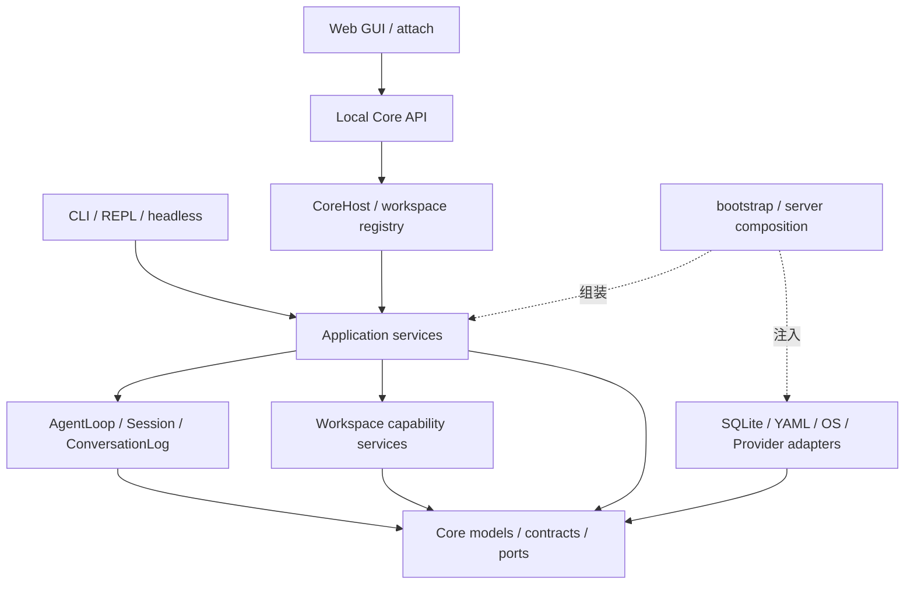

# Morrow 架构基线

本文描述当前代码的职责、依赖与状态所有权。初次结构核对：2026-09-12（`37233d8`）；生产修复与读取边界更新：2026-09-14。
具体实现变更时同步对应专题；阶段计划、历史提案和验收结果不替代当前代码事实。

Morrow 是工作空间作用域的 Code Agent，提供终端、headless JSONL 和本地 Web GUI。
普通聊天、Workflow 叶子、工具执行和恢复共用运行时与持久化边界。Stage 8 已交付 Chat 工作台、
任务规划、暂停/继续、运行观察和工作流编辑器；Stage 9 的独立后台自动化尚未开启。
当前原生沙箱支持边界为 macOS；Linux 原生运行仍未声明支持。

## 阅读入口

| 问题 | 专题 |
| --- | --- |
| 一次输入如何执行，Workflow 如何组合叶子，暂停后怎样继续？ | [运行时与编排](architecture/runtime.md) |
| 哪些状态写 SQLite、YAML 或文件，当前数据如何恢复？ | [状态与恢复](architecture/state.md) |
| CLI、Core API、GUI 怎样共享服务，页面和事件由谁维护？ | [接口与工作台](architecture/interfaces.md) |
| 工具、Provider、Skills、MCP、学习如何受控接入？ | [工具、扩展与学习](architecture/extensions.md) |

## 分层与依赖方向

图表达主要职责与组合方向，不宣称目录之间完全没有交叉导入。Core 不依赖外层；
application 中的组合、跨域事务、配置生命周期、诊断和备份有明确的 Adapter 依赖。
不能把现有这些例外推广为任意领域服务直接操作 SQLite 或 SDK 的许可。

| 代码目录 | 责任 | 主要边界 |
| --- | --- | --- |
| `src/morrow/core/` | Pydantic 模型、协议、端口、状态与纯领域规则 | 不依赖接口、应用、运行时或具体基础设施 |
| `src/morrow/runtime/` | 单 Agent 循环、工具批次、Session 与聊天日志 | 不调度 Workflow 图，不实现具体工具业务 |
| `src/morrow/application/` | 任务/回合、编排、接纳、上下文、领域命令与查询 | 委托既有状态 owner，不复制聊天历史 |
| `src/morrow/services/` | 工作空间、文件、搜索、变更、进程、Git、沙箱能力 | 通过注入的适配器实施 OS 行为 |
| `src/morrow/adapters/` | SQLite/YAML、Provider SDK、文件系统、凭据、MCP 协议 | 不拥有 UI 或任务编排决策 |
| `src/morrow/interfaces/` | CLI、REPL、审批交互、headless、attach | 解析输入、调用应用服务、渲染与退出码 |
| `src/morrow/server/` | 本地 API、Core 线程、运行监督与安全投影 | 业务状态转换由 application 承担 |
| `gui/src/` | API client、界面状态、导航、Chat、Inspector、编辑器 | 不直接写数据库或绕过后端权限 |

通用组合根是 [bootstrap.py](../src/morrow/bootstrap.py)；服务端组合在
[server/composition.py](../src/morrow/server/composition.py)。`build_operational_services()`、
`build_operational_api()` 与 `build_session_application()` 复用领域服务，服务端增加事件、审批、
工作区注册表和运行 driver。无 Provider 时管理界面仍可启动，执行服务按需组装。

## 不可破坏的所有权

1. **聊天记录**：AgentLoop 通过 Session-owned `ConversationLog` 追加；SQLite 保存 durable 记录。
   `Session.messages`、timeline、activity、checkpoint 和 GUI store 都不是第二聊天历史写入者。
2. **普通执行**：`AgentLoop.run_task()` 是唯一主循环；保留的 `run_turn()` 只委托该循环。
   Workflow Scheduler 组合叶子，叶子仍经过同一工具、权限、请求账本与日志链。
3. **工具副作用**：先提交 intent/审批证据，再进入 handler。未知完成状态不能自动重放或伪造成功。
4. **事务**：分域 Journal 共享 `SqliteJournalBackend` 外层事务；跨域原子性不能随模块拆分被拆散。
5. **版本**：发布的 Agent/Workflow 版本、运行快照、Artifact 来源和 fork 前缀保持不可变；
   后续编辑经 OCC、Draft、Patch、continuation 或 rerun 建立新事实。
6. **能力**：Role Prompt、项目指令、Memory、Skill 和 MCP 内容不能授予权限。普通 Host shell
   无 OS 隔离；结构化工作空间工具的边界不能用来描述 Host 命令。
7. **数据**：凭据只由 CredentialStore/显式环境变量提供，不进入 YAML、日志、事件、模型上下文或备份。
   公开投影不包含原始 SDK 对象和未处理 traceback。

## 文档与验证约定

[README](../README.md) 负责安装和常用入口；本目录下的四篇专题文档说明当前运行时、状态、接口和扩展边界。
实现变更应以代码和测试为准；本公开文档不承载实施计划、验收过程或历史提案。

架构边界检查见 [test_architecture_boundaries.py](../tests/test_architecture_boundaries.py)。
离线测试是默认门禁，真实 Provider/MCP 和跨平台原生验证需要独立证据。
文档中的“已交付”不表示本次文档编辑重跑了全部产品测试。
