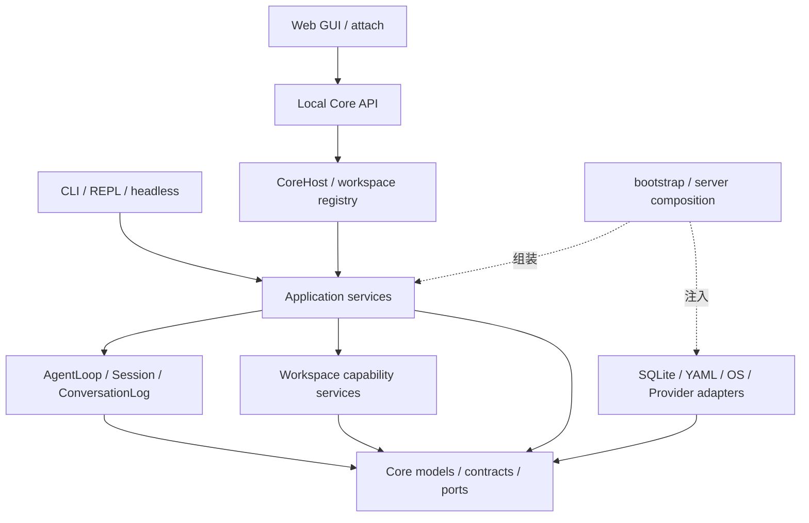

# Morrow 架构基线

本文描述当前代码的职责、依赖与状态所有权。初次结构核对：2026-09-12（`37233d8`）；生产修复与读取边界更新：2026-09-14。
具体实现变更时同步对应专题；阶段计划、历史提案和验收结果不替代当前代码事实。

Morrow 是工作空间作用域的 Code Agent，提供终端、headless JSONL 和本地 Web GUI。
普通聊天、Workflow 叶子、工具执行和恢复共用运行时与持久化边界。Stage 8 已交付 Chat 工作台、
任务规划、暂停/继续、运行观察和工作流编辑器；Stage 9 的独立后台自动化尚未开启。
当前原生沙箱支持边界为 macOS；Linux 原生运行仍未声明支持。

## 阅读入口

| 问题 | 专题 |
| --- | --- |
| 一次输入如何执行，Workflow 如何组合叶子，暂停后怎样继续？ | [运行时与编排](architecture/runtime.md) |
| 哪些状态写 SQLite、YAML 或文件，当前数据如何恢复？ | [状态与恢复](architecture/state.md) |
| CLI、Core API、GUI 怎样共享服务，页面和事件由谁维护？ | [接口与工作台](architecture/interfaces.md) |
| 工具、Provider、Skills、MCP、学习如何受控接入？ | [工具、扩展与学习](architecture/extensions.md) |

## 分层与依赖方向

```mermaid
flowchart TD
    CLI[CLI / REPL / headless] --> APP[Application services]
    GUI[Web GUI / attach] --> API[Local Core API]
    API --> HOST[CoreHost / workspace registry]
    HOST --> APP
    APP --> LOOP[AgentLoop / Session / ConversationLog]
    APP --> SVC[Workspace capability services]
    LOOP --> CORE[Core models / contracts / ports]
    SVC --> CORE
    APP --> CORE
    ADAPTER[SQLite / YAML / OS / Provider adapters] --> CORE
    BOOT[bootstrap / server composition] -.组装.-> APP
    BOOT -.注入.-> ADAPTER
```

图表达主要职责与组合方向，不宣称目录之间完全没有交叉导入。Core 不依赖外层；
application 中的组合、跨域事务、配置生命周期、诊断和备份有明确的 Adapter 依赖。
不能把现有这些例外推广为任意领域服务直接操作 SQLite 或 SDK 的许可。

| 代码目录 | 责任 | 主要边界 |
| --- | --- | --- |
| `src/morrow/core/` | Pydantic 模型、协议、端口、状态与纯领域规则 | 不依赖接口、应用、运行时或具体基础设施 |
| `src/morrow/runtime/` | 单 Agent 循环、工具批次、Session 与聊天日志 | 不调度 Workflow 图，不实现具体工具业务 |
| `src/morrow/application/` | 任务/回合、编排、接纳、上下文、领域命令与查询 | 委托既有状态 owner，不复制聊天历史 |
| `src/morrow/services/` | 工作空间、文件、搜索、变更、进程、Git、沙箱能力 | 通过注入的适配器实施 OS 行为 |
| `src/morrow/adapters/` | SQLite/YAML、Provider SDK、文件系统、凭据、MCP 协议 | 不拥有 UI 或任务编排决策 |
| `src/morrow/interfaces/` | CLI、REPL、审批交互、headless、attach | 解析输入、调用应用服务、渲染与退出码 |
| `src/morrow/server/` | 本地 API、Core 线程、运行监督与安全投影 | 业务状态转换由 application 承担 |
| `gui/src/` | API client、界面状态、导航、Chat、Inspector、编辑器 | 不直接写数据库或绕过后端权限 |

通用组合根是 [bootstrap.py](../src/morrow/bootstrap.py)；服务端组合在
[server/composition.py](../src/morrow/server/composition.py)。`build_operational_services()`、
`build_operational_api()` 与 `build_session_application()` 复用领域服务，服务端增加事件、审批、
工作区注册表和运行 driver。无 Provider 时管理界面仍可启动，执行服务按需组装。

## 不可破坏的所有权

1. **聊天记录**：AgentLoop 通过 Session-owned `ConversationLog` 追加；SQLite 保存 durable 记录。
   `Session.messages`、timeline、activity、checkpoint 和 GUI store 都不是第二聊天历史写入者。
2. **普通执行**：`AgentLoop.run_task()` 是唯一主循环；保留的 `run_turn()` 只委托该循环。
   Workflow Scheduler 组合叶子，叶子仍经过同一工具、权限、请求账本与日志链。
3. **工具副作用**：先提交 intent/审批证据，再进入 handler。未知完成状态不能自动重放或伪造成功。
4. **事务**：分域 Journal 共享 `SqliteJournalBackend` 外层事务；跨域原子性不能随模块拆分被拆散。
5. **版本**：发布的 Agent/Workflow 版本、运行快照、Artifact 来源和 fork 前缀保持不可变；
   后续编辑经 OCC、Draft、Patch、continuation 或 rerun 建立新事实。
6. **能力**：Role Prompt、项目指令、Memory、Skill 和 MCP 内容不能授予权限。普通 Host shell
   无 OS 隔离；结构化工作空间工具的边界不能用来描述 Host 命令。
7. **数据**：凭据只由 CredentialStore/显式环境变量提供，不进入 YAML、日志、事件、模型上下文或备份。
   公开投影不包含原始 SDK 对象和未处理 traceback。

## 桌面运行的准备边界

Computer-use 在 macOS arm64 使用基于官方 0.30.4 的功能补丁版 0.30.4+morrow.3；
补丁、上游 commit、SHA256、复现脚本位于 vendor/cua-driver-functional。2026-10-03 用户纠正后移除密码框输入
禁令、逐字段安全证明和自编 guarded SDK。type_text/key/hotkey 对普通及 secure 字段
共用已授权路径。2026-10-04 用户进一步要求移除完整工具内容分类链：不检测屏幕内容的关键词、
凭据样式或 secure 角色，不清空可读属性、不遮罩截图。LLM 根据用户意图和上下文判断内容与动作安全；
Provider 配置凭据依旧遵循独立 CredentialStore 契约。截图发布只校验几何、解码、资源及所属执行授权。
macOS arm64 基础观察、普通输入和带实际图像的 ordinary loop 实测后允许显式激活；
其他平台保留 unavailable。隐藏字段输入可能产生效果但由 SDK 返回 unknown，仍按
原副作用恢复语义处理，不重新投递。SDK/OS 不可读的值仍返回 unavailable；Morrow 不增加字段内容禁读规则。
元素左键单击为语义激活，双击/物理右键要求同一新图及有效几何。功能 SDK 的后台元素左键双击
保留旧 token，使用实际窗口局部坐标、单个 PID 投递流；前台坐标滚轮先证明选定窗口置前，再向该窗口
投递单个轮事件流。AXScrollArea/AXScrollView 保留实际对象及 token，语义模式可引用滚动容器。
背景坐标双击及右键双击仍明确 unsupported；官方 0.30.4 保留旧投递门禁，不自动切换模式或手势。
属性验证只公开 enabled；read_element_attribute 在新快照前从缓存原 token 保留的同一 AX 对象读回，
核对 PID/窗口归属。对象失效时不可用，不重查同名节点。Application 保留该精确判定并继续采集新观察。
五项合成 fixture 门禁于2026-10-05通过，SDK unknown 完成仍保留；证据不替代真实模型 API 验收。

可选 computer-use 默认关闭，原生验收未通过时不激活 Driver。bootstrap 为运行准备器与
CoreHost 关闭路径传递同一 lifecycle；每个已授权 AgentRun 的 facade 持有独立 Session 与观察引用。
本地 ComputerUseSelection 先决定冻结工具集合，不能作为模型参数；durable AgentRun 创建后，
PreparedAgentRunRuntime.activate 委托既有 Application API 创建 run-bound grant。
AgentLoop 在本地激活与待处理 Host 授权后、首次 Provider 请求前冻结 PermissionSnapshot。
handler 只重验已有执行/审批/授权证据，不创建 grant。关闭先停止入场，再等待资源释放。
桌面恢复需要新的本地选择、新 AgentRun/grant 与更高代次；磁盘旧 grant 不足以重新绑定设备。
Workflow 的选择由可信本地入口绑定实际 NodeRun，只在新叶子 admission 时消费一次；
AgentFactory 校验请求属于该叶子 Session，并拒绝并行只读候选携带桌面请求。
定义目录始终声明已知桌面工具合同，避免缓存受启动开关影响；实际 prepare 检查当前配置与
本地选择。默认 executor 和未选择叶子没有桌面工具或设备授权。
根运行 grant 不继承；叶子继续也需要重新选择，crash rehydrate 不自动重新绑定。
桌面配置在每次 prepare 时从当前全局配置复制到该运行；已有 Prepared runtime 不随配置
改变。内部 OpenRunSessionRequest 携带这份冻结设置，lifecycle 用其诊断，owner 为新 Session
应用调用期限与原生 TTL；共享 Driver、租约和 Session-owned ConversationLog 的所有权不变。
启用开关不创建 grant；关闭配置只影响后续准备，停止/撤销由原权限和运行控制入口负责。
本地候选读取是独立的显式生命周期入口，使用同一 owner/Driver 与桌面租约，仅读
list_apps/list_windows，不创建 AgentRun 或 SDK run Session、不捕获 AX/截图。候选编号
只指向 adapter 内存中保存的 bundle/PID/process birth/window 身份，30 秒到期、刷新或
shutdown 即失效；本地 DTO 只含应用、显示标签与编号，不作为模型 target 或授权证据。
取消/超时沿 NativeCalls quarantine 保留租约，等读取停稳后才允许 shutdown 释放。
原生验收门槛同样约束候选入口，未通过的平台保持 unavailable。本地候选选择产生 opaque cwin 身份，
运行期 SelectedWindowScope 将应用与这些窗口身份冻结到既有 grant/snapshot JSON；历史
AppWindowScope 仅用于旧证据解码，序列化不增加 windows 字段，保持原证据摘要。
设备请求与新 grant 只接受 SelectedWindowScope，运行路径不靠版本分支选择范围。
候选目录刷新或到期只撤销未确认的候选编号，保留已确认的窗口绑定；owner 开启 run 前
一次性消费该绑定并重验 process birth，
将原生绑定复制给该 Session；discover 只注册选中窗口，Core observe/action 与服务返回目标
也验证窗口范围。失效候选编号、重用绑定或变化的进程身份在 SDK Session 前拒绝，
不扩展到同应用其他窗口。Application 替换、清除、淘汰或拒绝过期的待用选择时，
只释放该选择的绑定；owner quarantine/停止则撤销所有待用绑定。
CLI/GUI 的明确窗口选择已接入该 v2 链路。新的本地选择、新 grant 和设备开启都拒绝旧的应用级
v1 范围；已存储的 v1 JSON 仍可解码，授权摘要仍用 legacy_app_windows 描述旧应用范围。
journal 授权后，admit_discover/admit_observe/admit_execute 产生设备 port 接受的准入结果。
AdmittedObserve 携带唯一的冻结观察设置，Session 不再另收 settings 或重算静态授权规则；
派发前保留会话归属、实时几何、process birth、观察年龄、token 退役与授权回调复查。
图像发布只把存储不可用与预算耗尽映射为 image_publish_failed，保留已经派发的动作结果；
完整性、schema、身份与程序错误继续抛出。
macOS arm64 的受控原生证据与假 SDK 离线产品流程分别记录，不能互相替代。
ComputerUseSelectionService 管理最多八个会话的本地候选与一次性选择标识，scope 始终由
owner 解析候选生成 v2，不接受客户端自造原生身份或授权。Core API 的显式 POST candidates
通过异步只读准备读取 SDK，再在命令总线上重新检查 Session/权限/配置并保存临时目录；
POST selection 检查同会话目录、精确模型/图像能力及操作/投递范围，只创建短期选择，
不创建 grant、SDK run Session 或历史消息。普通聊天输入可携带 computer_selection_id：submit 在事务前绑定到 client_message_id，
事务失败释放 claim；重复相同输入沿原 receipt 回放。新 run prepare 时按同 Session/key 消费
一次选择，交给原 ComputerUseRunFactory，并在配置器应用输入冻结权限后重新验证实际
Session；首次 Provider 请求前由原 activate/grant/snapshot 链路授权。排队过期或重启后
临时选择丢失即拒绝准备，不从 interaction JSON 恢复 native 身份或授权。未使用该字段的
普通输入序列化保持原样。选择不能用于 steer 或根 Workflow，shell Host 与 desktop 仍需
各自显式运行选择。CLI 的 TerminalComputerPicker 与 GUI 的 permission/computer-use 控件
共用这些服务；Workflow scheduler 在新叶子或继续 admission 调用 prepare_workflow_leaf，
仅消费可信宿主显式绑定到该 NodeRun 的本地选择，不继承根 grant 或从磁盘恢复设备授权。

## 文档与验证约定

[README](../README.md) 负责安装和常用入口；本目录下的四篇专题文档说明当前运行时、状态、接口和扩展边界。
实现变更应以代码和测试为准；本公开文档不承载实施计划、验收过程或历史提案。

架构边界检查见 [test_architecture_boundaries.py](../tests/test_architecture_boundaries.py)。
离线测试是默认门禁，真实 Provider/MCP 和跨平台原生验证需要独立证据。
文档中的“已交付”不表示本次文档编辑重跑了全部产品测试。
