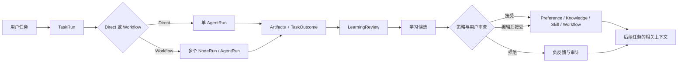
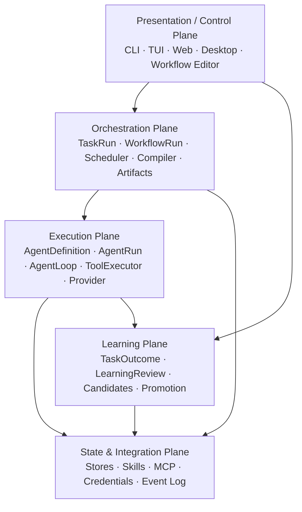
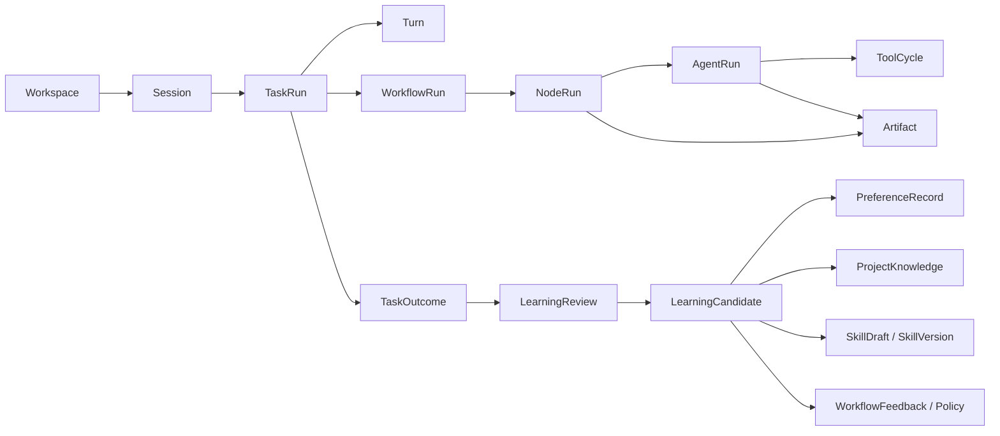

# Morrow 个人 Agent 工作台开发路线总览

> 状态：阶段 1、阶段 2 已完成；阶段 3 进行中；阶段 4–10 未开始
> 基线日期：2026-08-18
> 用途：维护 Morrow 的长期产品方向、阶段顺序、稳定边界与详细阶段文档入口。
> 执行约定：具体实现任务、活跃子计划、进度与验证结果继续维护在 `.agent/`；本文不承担实时 TODO 或开发日志职责。
> 当前实现：[架构基线](ARCHITECTURE.md)；本文出现的未来领域对象不代表代码中已经存在。

## 一、项目定位

Morrow（承序）首先是一个面向独立开发者的个人 Code Agent，随后逐步演进为一个：

> **可观察、可编辑、可积累，并始终由用户掌控的个人 Agent 工作台。**

它不以“内置最多工具”“启动最多 Agent”或“替用户隐藏全部复杂度”为主要竞争点，而以以下能力形成差异化：

1. **可靠执行**：在明确工作空间、权限、预算和审批边界内完成真实开发任务。
2. **长期连续性**：能够恢复会话、任务和关键项目状态，而不是每次从零开始。
3. **可审查学习**：从已完成任务中提出偏好、项目知识、Skill 和编排改进候选，但不把模型推断直接写成永久事实。
4. **模块化协作**：把单个 Agent 作为可配置模块，通过版本化 Workflow 组合 Planner、Explorer、Coder、Reviewer 等角色。
5. **统一多入口控制**：自然语言、CLI 和 GUI 使用同一套应用服务；用户能够查看、修改、拒绝、撤销和导出系统状态。
6. **渐进式自动化**：只有在单 Agent 基线、持久化、权限和评估稳定后，才增加多 Agent、后台任务与更高自治程度。

### 1.1 主要用户与发展顺序

第一目标用户是长期在本地项目中工作的独立开发者。能力发展顺序固定为：

```text
可靠单 Agent Code Agent
    ↓
可恢复的任务、会话与上下文
    ↓
可审查的偏好与知识学习
    ↓
Skills、MCP 与扩展生态
    ↓
静态、多角色 Workflow
    ↓
自适应编排与可视化编辑
    ↓
后台自动化与产品化
```

办公、信息整理、日常协作与其他通用个人助理场景，可以复用同一运行时、状态模型和扩展边界，但不能反过来阻塞 Code Agent 主线。

### 1.2 北极星闭环



这个闭环必须满足两个条件：

- **任务完成不等于自动改变长期状态。** `TaskOutcome` 与 `LearningReview` 是两个不同阶段。
- **长期状态不是不可见提示词。** 用户必须能够查看来源、作用域、状态、版本与最近一次确认信息。

## 二、当前架构基线与演进策略

当前代码已经具备工作空间隔离、Provider/Model 抽象、进程内 Session、`ConversationLog`、`AgentLoop`、统一 ToolCycle、通用工具策略、审批端口和配置更新工具。阶段 3 的文件、搜索、编辑、Shell 与 Git 检查能力尚未完成。

后续演进不得通过把所有职责塞入 `AgentLoop` 来实现。稳定策略是：

- `AgentLoop` 继续作为**单个 Agent 的叶子执行器**，负责一次 AgentRun 内的模型循环、工具周期、预算、取消与聊天记录写入。
- 在它上方增加 `TaskRun`、`WorkflowRun`、`LearningReview` 和后台任务等应用层对象。
- 逐步将当前只负责斜杠命令与普通聊天分发的 `SessionOrchestrator` 收敛为 `InteractionDispatcher` 或 `SessionController`；未来真正的多 Agent 调度对象使用 `WorkflowOrchestrator` 命名。
- GUI、CLI、自然语言工具与未来客户端不得直接写数据库、YAML 或运行中对象；它们统一调用 Application Service，并消费公开事件与查询投影。
- 引入 AgentRun 后，每次运行冻结模型、工具、Skills、权限、上下文策略和配置版本，保证任务可复现、可审计。

## 三、长期架构：五个平面



| 平面 | 责任 | 不负责 |
|---|---|---|
| Presentation / Control | 输入、展示、审批、编辑、查询、可视化 | Agent 核心状态机、数据库直写、Provider 协议 |
| Orchestration | 任务生命周期、Workflow 编译与运行、节点依赖、Artifact 传递、预算 | 单个 Agent 的工具循环、长期学习决策 |
| Execution | 单个 AgentRun、Prompt 组装、模型调用、工具执行、运行快照 | 任意图调度、任务后学习、GUI 状态 |
| Learning | 从任务结果生成候选、证据评分、冲突检测、晋升与撤销 | 直接执行开发任务、绕过配置服务写状态 |
| State & Integration | 持久化、迁移、凭据、Skills、MCP、Provider Adapter、事件存储 | 产品决策、界面逻辑 |

## 四、核心领域模型

本节是跨 Stage 4–9 逐步建立的目标模型，不是当前代码清单；每个对象只有在对应阶段通过实现与验收后，
才进入 `docs/ARCHITECTURE.md` 的当前基线。



### 4.1 生命周期对象

| 对象 | 说明 | 生命周期边界 |
|---|---|---|
| `Workspace` | 项目隔离、配置与知识作用域 | 长期 |
| `Session` | 一段可恢复的用户交互容器 | 可跨多个 TaskRun |
| `TaskRun` | 面向结果的一项任务，可跨多轮、多个 AgentRun | 用户目标完成、失败、取消或放弃时结束 |
| `Turn` | 一次用户输入与对应的公开回合 | 单次输入 |
| `AgentRun` | 某个 AgentDefinition 在冻结快照下的一次执行 | 一次叶子执行 |
| `WorkflowRun` | 某个 WorkflowDefinition 版本的一次运行快照 | 由多个 NodeRun 组成 |
| `NodeRun` | Workflow 中一个节点的执行记录 | 独立状态、输入、输出与预算 |
| `Artifact` | Agent 或确定性节点产生的类型化产物 | 不可变版本或明确修订 |
| `TaskOutcome` | 对任务结果、修改、验证、未决项的结构化总结 | TaskRun 关闭时生成 |
| `LearningReview` | 对 TaskOutcome 和证据的学习审查 | 不直接改长期状态 |

### 4.2 配置对象与运行对象必须分离

- `AgentDefinition` 是可编辑、可版本化的模块定义；`AgentRun` 是一次实际执行。
- `WorkflowDefinition` 是可编辑模板；`WorkflowRun` 是运行开始时冻结的快照。
- `SkillDefinition` / `SkillVersion` 是长期资产；Skill 激活快照属于具体 AgentRun。
- 用户在 GUI 中编辑的是定义或待运行草稿，不是直接篡改已完成的运行记录。

## 五、长期信息分类

Morrow 必须在数据模型中区分以下信息，不允许都塞入一个“memory”字段：

| 类型 | 回答的问题 | 示例 | 默认作用域 |
|---|---|---|---|
| Profile | 用户或项目是什么 | “项目使用 Python 3.12” | global / workspace |
| Preference | 用户喜欢怎样协作 | “默认用中文回答” | global / workspace / session |
| Project Knowledge | 当前项目有哪些经过确认的事实和决定 | “Provider 通过 Adapter Registry 注册” | workspace |
| Episodic Summary | 某次任务发生了什么 | “本次完成配置工具切片” | task / session |
| Skill | 单个 Agent 如何重复完成某类任务 | “执行完整代码审查的步骤” | global / workspace |
| Workflow Template | 多个角色如何交换产物 | “Explorer → Coder → Reviewer” | global / workspace |
| Orchestration Policy | 什么任务选择什么流程 | “小修改默认 Direct，不启用 Planner” | global / workspace |

固定规则：

1. 一次性要求首先属于当前 Turn 或 Task，不得自动晋升为长期 Preference。
2. Skill 描述“如何做”；Workflow 描述“多个角色如何协作”；Orchestration Policy 描述“何时选择哪个流程”。
3. 模型自己的回答不能成为用户偏好的唯一证据。
4. 用户纠正、拒绝候选、删除节点或禁用 Skill 都是负反馈，必须进入后续决策。

## 六、不可破坏的系统约束

1. **单一聊天历史写入者**：当前由 `AgentLoop` 通过 Session-owned `ConversationLog` 写入；未来即使日志按 AgentRun 持久化，每个叶子 Run 仍只有自己的 AgentLoop 可以追加消息，不允许工具、Workflow 或 UI 拼接消息。
2. **完整 ToolCycle**：带 tool calls 的 Assistant 记录与有序 ToolMessage 不得被上下文压缩拆开。
3. **副作用前持久化**：在执行可能改变现实世界的工具前，先持久化调用意图、参数摘要、审批与幂等标识；持久化失败则不执行副作用。
4. **本地能力不泄漏到 Provider 协议**：风险等级、审批策略、路径边界与审计元数据留在本地。
5. **安全边界不可由 Role Prompt、Skill、Memory、Profile 或 MCP 内容覆盖。**
6. **GUI 不拥有第二套业务逻辑**：所有写操作经过与 CLI/自然语言工具相同的 Application Service。
7. **学习先提案后晋升**：除用户明确、低风险且策略允许的配置意图外，推断性学习默认进入候选状态。
8. **来源与版本可见**：Preference、Knowledge、Skill、AgentDefinition 和 WorkflowDefinition 必须可追溯、可回滚。
9. **Artifact 优先于共享完整对话**：多 Agent 默认通过类型化产物交换信息，不复制全部个人状态与聊天记录。
10. **Deny wins**：节点、Agent、Workflow、工作空间和全局安全策略取交集；任一层拒绝即不可用。
11. **多 Agent 非默认**：没有证据表明能提高成功率时，优先 Direct / 单 Agent。
12. **用户拥有数据**：状态可查看、编辑、删除、导出、备份和迁移；凭据永不进入普通状态或模型上下文。
13. **离线测试为默认门禁**：真实网络、真实凭据和高风险集成只在显式授权下验证。
14. **路线文档描述稳定边界**：实时任务、临时探索和验证结果放在 `.agent/` 与 acceptance 文档中。

## 七、状态与存储权威

推荐采用“用户可编辑配置、运行状态、较大产物”分层存储，避免一个数据库或一组 YAML 承担全部职责。

| 状态 | 推荐权威来源 | 原因 |
|---|---|---|
| Provider 非敏感配置、全局 Preferences | 现有版本化 YAML | 可读、可导出、已有事务边界 |
| Workspace Profile、Active Preferences | 现有工作空间 YAML / 后续兼容文档 | 用户可直接检查，保持工作空间隔离 |
| AgentDefinition、WorkflowDefinition | 版本化 YAML/Markdown | 适合人工编辑、Diff 与导出 |
| Skill 内容 | 文件系统目录，核心为 `SKILL.md` | 与开放 Skill 目录格式兼容 |
| Session、TaskRun、AgentRun、WorkflowRun、NodeRun | SQLite Operational Store | 需要事务、查询、恢复、迁移与关联 |
| 事件、审批、学习候选、证据、状态转换 | SQLite | 需要可追溯和原子更新 |
| 大型 Artifact、Patch、报告、日志附件 | 文件系统 + SQLite 元数据 | 避免数据库膨胀，保留校验和与引用 |
| 凭据 | CredentialStore / 环境变量 | 不进入普通状态、日志或上下文 |

实现约束：

- 阶段 4 默认使用 Python 标准库 `sqlite3` 完成首个 Operational Store；除非 ADR 证明不适用，不先引入大型 ORM。
- 每类状态只有一个权威来源。查询投影和缓存可以重建，不做双向同步。
- 数据库迁移、文件 Schema 迁移、备份和恢复必须有失败保护，禁止静默覆盖较新或损坏数据。
- 运行记录不得保存 Provider 私有 reasoning、密钥、完整未脱敏环境变量或不受限的工具原始输出。

## 八、阶段索引

| 阶段 | 状态 | 阶段结果 | 详细路线 |
|---|---|---|---|
| 1. 方向确定与可运行原型 | 已完成 | 验证终端对话、工作空间识别与早期连续性方向 | [阶段 1](roadmap/stage-1-direction-and-prototype.md) |
| 2. Agent 核心能力 | 已完成 | 建立稳定 AgentLoop、ToolCycle、预算、取消与错误闭环 | [阶段 2](roadmap/stage-2-agent-core.md) |
| 3. 本地 Code Agent 与安全闭环 | 进行中 | 在指定工作空间中可靠定位、修改并验证真实代码任务 | [阶段 3](roadmap/stage-3-local-tools-and-safety.md) |
| 4. Task、Session、Artifact 与持久化 | 未开始 | 程序重启后可恢复 Session/Task，并保留可查询运行产物 | [阶段 4](roadmap/stage-4-task-session-and-persistence.md) |
| 5. 可审查学习与长期记忆 | 未开始 | 任务后产生有证据的学习候选，由策略和用户决定是否晋升 | [阶段 5](roadmap/stage-5-reviewable-learning-and-memory.md) |
| 6. Skills 与扩展生命周期 | 未开始 | Skill、MCP 和 Provider 扩展具备版本、权限与生命周期治理 | [阶段 6](roadmap/stage-6-skills-and-extensions.md) |
| 7. Agent Definition 与静态 Workflow Runtime | 未开始 | 用户可定义多个 Agent，并运行经编译验证的版本化 Workflow | [阶段 7](roadmap/stage-7-workflow-runtime.md) |
| 8. 自适应编排与 GUI 控制面 | 未开始 | 系统生成可编辑 Workflow Draft，用户在 GUI 中观察与控制运行 | [阶段 8](roadmap/stage-8-adaptive-orchestration-and-gui.md) |
| 9. 后台任务与可靠自动化 | 未开始 | Workflow 可作为可恢复、可暂停、可审计的后台或周期任务运行 | [阶段 9](roadmap/stage-9-background-automation.md) |
| 10. 产品化与 Morrow 1.0 | 未开始 | 形成可安装、升级、诊断、备份并长期日用的个人 Agent 产品 | [阶段 10](roadmap/stage-10-productization-and-1.0.md) |

## 九、建议产品里程碑

版本号仅用于表达能力门槛，不替代阶段验收，也不要求严格采用这些语义版本。

| 建议里程碑 | 完成阶段 | 可对外描述的能力 |
|---|---|---|
| Code Agent MVP | Stage 3 | 能在本地项目安全读取、修改、运行测试并报告 Diff |
| Durable Personal Agent | Stage 4 | 可恢复 Session/Task，长上下文可压缩，产物可查询 |
| Reviewable Learning Preview | Stage 5 | 能提出偏好与项目知识候选，来源可见、可拒绝和撤销 |
| Extensible Agent | Stage 6 | 支持受治理的 Skills、MCP 与多 Provider 能力 |
| Workflow Runtime Preview | Stage 7 | 支持手写、版本化、可验证的多 Agent Workflow |
| Visual Orchestration Beta | Stage 8 | 支持模板化自动编排和 GUI 拖拽编辑、实时运行观察 |
| Automation Beta | Stage 9 | 支持持久后台任务、周期执行、恢复与通知 |
| Morrow 1.0 | Stage 10 | 完整安装、升级、数据管理、桌面入口与发布维护能力 |

## 十、跨阶段质量门禁

每个阶段只有在满足以下门禁后才能标记完成：

### 10.1 功能门禁

- 阶段定义的关键用户闭环可以在真实或等价 Fixture 项目中完成。
- 所有公开状态转换有确定性终态，不依赖界面猜测。
- 失败、取消、审批拒绝和超预算路径均有验收用例。

### 10.2 安全门禁

- 新能力明确声明读取范围、写入范围、副作用等级和默认审批策略。
- 路径、进程、网络、MCP、Skill 与后台任务不能绕过统一能力策略。
- 敏感信息不会进入事件、日志、数据库普通字段、模型上下文或可导出诊断包。

### 10.3 数据门禁

- 权威来源、Schema 版本、迁移、备份、恢复、删除和损坏降级行为已定义并测试。
- 状态变化具备 revision、版本或事件证据；冲突不会使用 last-write-wins 静默覆盖。
- 旧版本数据不被隐式删除或错误解释。

### 10.4 可观察性门禁

- 用户能够知道任务当前在哪个状态、哪个 Agent/Node 正在运行、等待什么，以及已经产生哪些副作用。
- 关键事件不泄漏完整参数或 reasoning，同时足以完成诊断和 UI 投影。
- 所有自动学习和自动编排决策可以追溯到输入、策略、模型版本与候选版本。

### 10.5 验证门禁

- 默认离线测试、相关单元测试、集成测试、Ruff、Compileall 与 `git diff --check` 通过。
- 新的持久化和恢复能力必须包含崩溃点、迁移失败与损坏状态测试。
- 多 Agent 和自动化能力必须与单 Agent 基线比较，不只验证“能运行”。

## 十一、评估指标

Morrow 应从阶段 3 开始持续采集本地、可关闭、可导出的运行指标。默认不上传遥测。

### 11.1 执行质量

- Task 成功率与用户接受率。
- 用户纠正、返工和手动恢复次数。
- 修改后测试通过率。
- 工具失败、超时、取消与审批拒绝比例。
- 平均 Token、费用、时间和工具调用次数。

### 11.2 学习质量

- LearningCandidate 接受、编辑后接受、拒绝比例。
- 已激活 Preference/Knowledge 被撤销或覆盖的比例。
- 候选重复率、冲突率与敏感信息拦截率。
- 记忆检索后对任务成功率和上下文成本的影响。

### 11.3 Skill 质量

- Skill 触发准确率、调用成功率与回归失败率。
- 使用 Skill 前后的任务成功率、时间和成本差异。
- 自动 Skill Draft 的接受率、测试通过率和后续修改次数。

### 11.4 Workflow 质量

- Direct 与 Multi-Agent 在同类任务上的成功率、时间和成本差异。
- 无有效产物的节点比例。
- Reviewer 实际发现问题并导致修正的比例。
- 用户删除、替换、重排节点的频率。
- 并发写冲突、合并失败和重新运行次数。

## 十二、阶段依赖与允许并行的探索

### 12.1 严格关键路径

```text
Stage 3 → Stage 4 → Stage 5 → Stage 6 → Stage 7 → Stage 8 → Stage 9 → Stage 10
```

关键原因：

- 没有真实 Code Agent 闭环，就无法获得可靠的学习和编排样本。
- 没有 Task/Artifact/Persistence，就无法稳定定义学习触发点或多 Agent 产物。
- 没有版本化 Skill 与权限模型，就不应让系统自动生成或加载长期能力。
- 没有静态 Workflow Runtime，就不应先做自由图生成与拖拽运行编辑。
- 没有可靠持久化和审批，就不应执行无人值守后台任务。

### 12.2 可以提前做但不得进入生产主线的 Spike

- Stage 4 期间可以验证只读事件观察页面，帮助稳定 GUI 所需事件投影。
- Stage 6 期间可以验证 AgentDefinition/WorkflowSpec 的文件格式，但不运行多 Agent。
- Stage 7 期间可以验证 React Flow 或其他节点编辑器，但不让 UI 直接控制未冻结的运行状态。
- Stage 8 期间可以验证桌面壳与本地进程通信，但正式安装、升级与自动更新留到 Stage 10。

Spike 的代码若不能满足当前阶段边界，应保持实验性、可删除，不得成为隐含依赖。

## 十三、文档与执行约定

- `docs/ROADMAP.md`：只维护长期方向、阶段顺序、状态与入口。
- `docs/roadmap/stage-*.md`：维护当前阶段稳定范围、架构决策、交付物与完成标准。
- `docs/ARCHITECTURE.md`：只描述已经存在或已经正式决定的架构，不把未来愿望写成当前事实。
- `.agent/PLAN.md`：当前大型实施计划索引。
- `.agent/subplans/`：按顺序拆分的可执行子计划。
- `.agent/TODO.md`：当前活跃子计划的任务。
- `.agent/TRACKER.md`：当前进度、阻塞与下一动作。
- `.agent/LOG.md`：重要决策、失败、验证和恢复记录。
- `docs/acceptance/`：阶段验收证据与真实使用记录。

阶段状态只使用：

- `未开始`
- `设计中`
- `进行中`
- `阻塞`
- `已完成`
- `已取代`

路线文档不维护逐项 `[ ]` TODO；进入某阶段后，再根据该阶段的“建议子计划”建立 `.agent/PLAN.md` 和具体 subplans。

## 十四、路线迁移说明

本路线保留现有 Stage 1、Stage 2 完成文档，不覆盖历史验收记录。原有后续路线重新映射为：

- 原 Stage 3 → 新 Stage 3，补充真实 Code Agent 的精确闭环。
- 原 Stage 4 → 拆分为新 Stage 4（持久运行基础）与 Stage 5（可审查学习）。
- 原 Stage 5 → 新 Stage 6，并增加 Skill Draft、版本、权限与自动生成治理。
- 原 Stage 6 → 拆分为新 Stage 7（静态 Workflow）、Stage 8（自适应编排与 GUI）和 Stage 9（后台自动化）。
- 原 Stage 7 → 分散到新 Stage 8（可视化工作台）与 Stage 10（完整产品化）。

具体文件替换与旧链接处理见 [路线迁移说明](roadmap/MIGRATION.md)。
