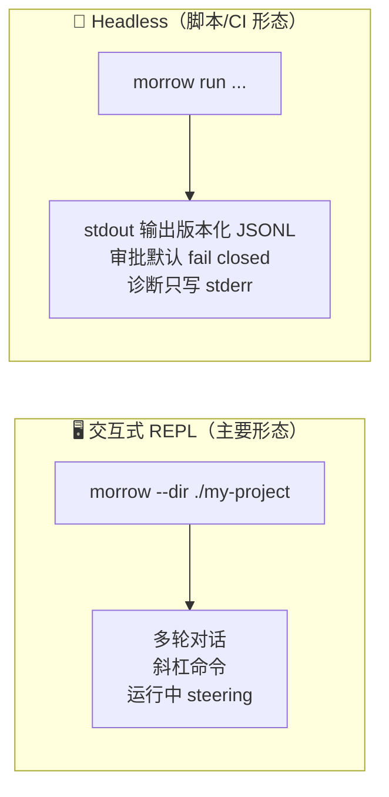
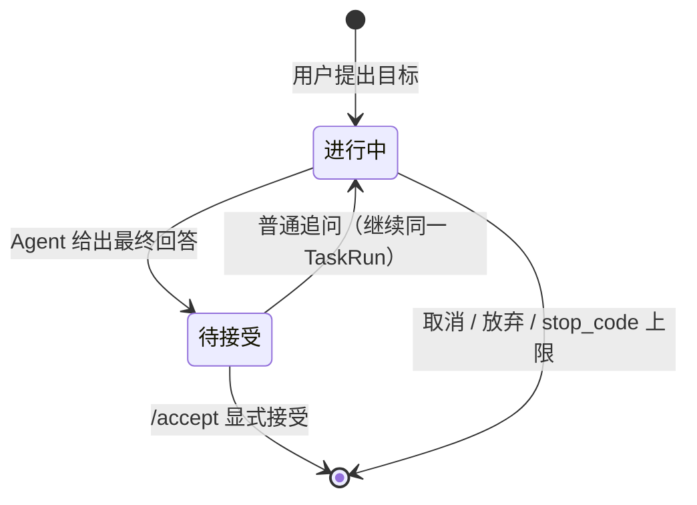

# 01 · 产品形态与使用指南

> Morrow 从用户视角看是什么样：怎么安装、怎么启动、能输入什么、权限有几档。
> 关联：[02-整体架构与分层](02-整体架构与分层.md) · [06-工具系统与安全模型](06-工具系统与安全模型.md)

---

## 一、两种使用面孔



- **交互式** 是日常形态：进入项目目录，像聊天一样让 Agent 干活。
- **Headless** 把同一条 `SessionOrchestrator → AgentLoop` 链路包成 JSONL 事件流，
  供自动化与评估使用；没有人值守的审批通道，所以审批一律安全拒绝。

## 二、安装与首次配置

```bash
uv sync                    # 安装依赖（Python ≥ 3.12 + uv）
uv run morrow --help       # 验证安装

# 首次：配置一个模型 Provider（以 OpenCode Go 为例）
scripts/morrow-mimo provider add --preset opencode-go-mimo   # API Key 隐藏输入，存入 macOS Keychain
scripts/morrow-mimo provider test opencode-go
morrow provider list         # 查看所有 Provider
morrow model current         # 查看当前模型
```

凭据纪律：**API Key 只进 Keychain / 环境变量，永不写入 YAML、日志、事件或模型上下文。**
环境变量 `MORROW_OPENCODE_GO_API_KEY` 优先于 Keychain；要轮换已存凭据需先取消环境变量。

## 三、状态存在哪里

```text
~/.morrow/                      # 数据根（不会写进你的项目目录！）
├── config.yaml                 # Provider 非敏感配置 + 全局 Preferences + runtime_policy 覆盖
├── workspace-index.yaml        # 路径 → workspace_id 索引
├── workspaces/<id>/
│   ├── profile.yaml            # 工作空间 Profile（项目是什么）
│   └── preferences.yaml        # 工作空间 Preferences
├── store/operational.sqlite    # Operational Store v22（0600 权限）
├── artifacts/                  # 命令输出等大产物（0700，ID 派生路径，0600 文件）
├── backups/operational/        # 在线备份目标
└── locks/operational-store.lock
```

## 四、四档权限模式

权限模式是启动时选择的「玻璃房厚度」，决定工具默认要不要问你：

| 模式 | 文件读写 | Host 命令 | 一句话理解 |
|---|---|---|---|
| `manual` | 变更需审批 | 需审批 | 「什么都问我」 |
| `auto-safe`（默认体感） | 结构化变更自动 | 需审批 | 「安全的自己来，危险的问我」 |
| `auto-sandboxed` | 结构化变更自动 | **macOS 原生沙箱快照内自动执行**，默认断网 | 「在一次性副本里随便跑」 |
| `full-access-manual` | 同 auto-safe | 仍需 `/grant` 授权 + 逐次审批，**无 OS 隔离** | 「明确授权的完全前台权限」 |

关键规则：
- `full-access-manual` **不会自动获得能力**：只有本地 REPL `/grant` 或 CLI `grant create`
  能为一个前台 AgentRun 授予 `unconfined_host_process`；每条命令仍单独审批；
  Grant 过期、撤销、或崩溃恢复后的新 AgentRun 一律 fail closed。
- `full-access + auto` 组合**永远不支持**。
- 沙箱后端不可用（或非 macOS）时 `auto-sandboxed` 直接 fail closed，不会偷偷降级到 Host。

## 五、REPL 里的常用操作

| 输入 | 作用 |
|---|---|
| 普通文本 | 交给 AgentLoop 处理 |
| `/status` | 当前 Session / 模型 / 预算状态 |
| `/workspace` `/workspace edit summary ...` `/workspace reset` | 查看与确定性修改 Profile |
| `/preferences` | 管理 Preferences（session / workspace / global 三个作用域） |
| `/task` `/accept` | 任务列表 / 接受当前 TaskRun 结果 |
| `/grant` | 创建 Full Access 授权 |
| `/recovery` | 查看并处理崩溃后的安全对账 |
| `/new` | 新建 Session（旧的保留，不删除） |
| `/exit` / EOF | 退出；已持久化会话直接退出并保留历史 |
| **Enter**（运行中） | 把文本作为 **steering**：在当前 Turn 的安全点结束并提交新 Turn |
| **Alt+Enter**（运行中） | 把文本作为 **follow-up**：Agent 正常停止后按 FIFO 执行 |
| **Ctrl+C** | 取消当前任务（取消是正常终态之一） |

## 六、任务（TaskRun）语义



- Agent 回答完 ≠ 任务结束；TaskRun 进入「待接受」，普通追问会继续同一个任务。
- 只有 `/accept`、`/task new`、取消、放弃、恢复命令才改变任务语义。
- 归档 Session 前必须先显式关闭 current TaskRun——历史不会被静默改写。

## 七、独立 CLI 一览（不进入 REPL 也能用）

```bash
morrow provider list / presets / add / configure / test / remove
morrow model list / show / add / sync / use / remove / current
morrow session list / resume
morrow task list SESSION_ID
morrow artifact list
morrow agent-run show AGENT_RUN_ID
morrow grant list / create / revoke
morrow recovery show / resolve
morrow state doctor / backup / verify-backup / cleanup
morrow learning status / set-mode / inbox / review / retry / accept / edit / reject
morrow memory selection list / show
morrow preferences ...      # Preferences 管理
morrow skills ...           # Skill 生命周期
morrow mcp ...              # MCP Server 管理
```

分页约定：`session/task/artifact list` 文本模式显示 `next_cursor`，`--json` 输出 `{items, next_cursor}`。
`state doctor` 只有 health OK 时 exit 0，其余 exit 2——可直接接 CI。

## 八、运行策略微调（可选）

随包 `morrow/resources/runtime-policy.toml` 是只读默认值（不许改安装包）。如需调整，
在 `~/.morrow/config.yaml` 覆盖白名单字段：

```yaml
runtime_policy:
  reviews:
    learning_timeout_seconds: 90
    learning_lease_seconds: 180
```

安全边界：权限、审批、密钥/路径过滤、预算上限、最大重试语义**不允许通过 YAML 放宽**；
未知字段或超限值会让整个配置拒绝加载（不部分生效）；Agent 的工具也不能写 `runtime_policy`。
