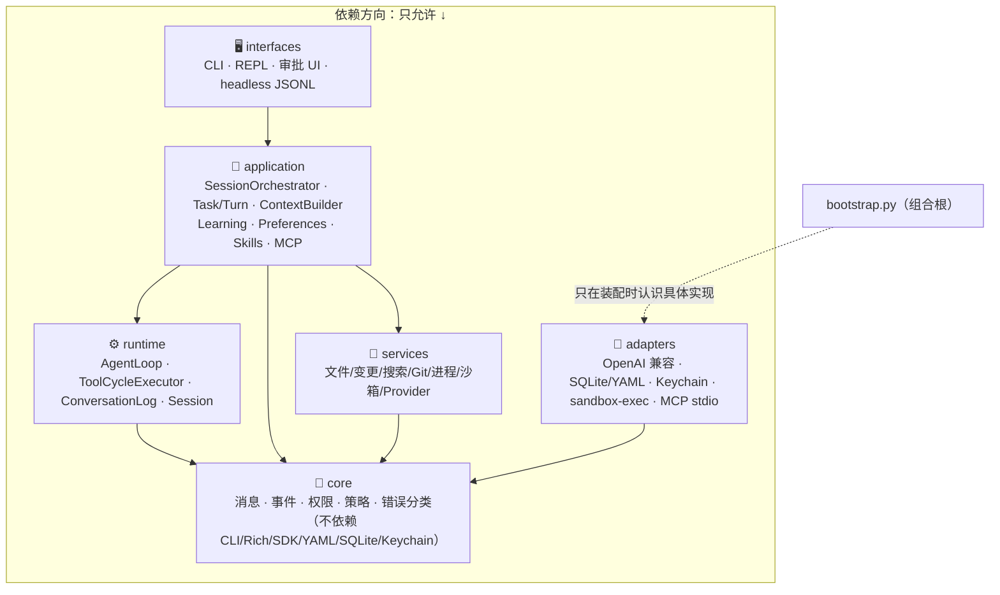

# 02 · 整体架构与分层

> Morrow 的骨架：六层代码、一条主链路、一个组合根。
> 关联：[03-core](03-core-领域模型.md) · [04-runtime](04-runtime-Agent运行时.md) · [05-application](05-application-应用服务层.md)

---

## 一、六层洋葱



| 层 | 类比 | 铁律 |
|---|---|---|
| `core` | 宪法 | 纯数据与规则；不知道外面有终端、数据库或网络 |
| `runtime` | 发动机 | 唯一一条聊天状态机路径；只有它能写聊天历史 |
| `services` | 工具车间 | 副作用能力（文件、进程、Git）的受控实现 |
| `adapters` | 转换插头 | 把外部世界（SDK、OS、SQLite）翻译成 core 端口 |
| `application` | 中控台 | 编排、事务边界、命令分派；CLI 与未来的 GUI 共用 |
| `interfaces` | 方向盘 | 输入、渲染、审批询问、退出码；不含业务逻辑 |
| `bootstrap.py` | 插线板 | 唯一把全部具体实现装配在一起的地方 |

## 二、一次请求的完整旅程

```text
你在终端输入「帮我修复这个测试」
  │
  ▼ interfaces/terminal.py
  Terminal 捕获输入 → 交给 CommandService 识别（是普通对话还是 /斜杠命令）
  │
  ▼ application/orchestrator.py
  SessionOrchestrator 刷新 Session 的 durable lifecycle/health
  准入检查：lifecycle=active 且 health=ok，否则拒绝
  │
  ▼ application/turns.py + runtime/agent.py
  提交 Turn/User 记录（先落库，再发 turn.started 事件）
  AgentLoop.run_task() 启动——唯一的聊天状态机
  │
  ▼ application/context.py
  ContextBuilder 从 ConversationLog 不可变快照组装投影
  （Checkpoint 摘要 + 最近完整 Turn + 冻结的 Preferences/Knowledge/Skill 上下文）
  │
  ▼ adapters/models/openai_compatible.py
  每次 Provider 调用前：admission 记录 bounded request observation
  流式返回文本或 tool calls；完成后 exactly-once settlement
  │
  ├─ 纯文本 stop ──────────────► 提交最终回答，TaskRun 待接受
  │
  └─ tool calls
       ▼ runtime/tool_cycle.py + runtime/tools.py
       ConversationLog 校验后，同一事务提交有序 ToolExecution 意图
       ToolCycleExecutor：参数校验 → intent 预检 → 能力策略 →（必要时审批）→ 执行
       结果写 ToolMessage，闭合 ToolCycle → 回到模型循环
  │
  ▼ 终态
  聚合 AgentRun terminal metrics（只含 ID/状态/计数/stop 与 usage，绝不含正文）
  事件流渲染到终端；一切已落 SQLite
```

## 三、五条「单行道」契约

这些契约决定了改代码时什么东西能碰什么：

1. **聊天历史单写者**：`AgentLoop` 经 Session 持有的 `ConversationLog` 追加；
   `Session.messages` 只是只读投影。工具、UI、Workflow 都不能拼消息。
2. **ToolCycle 不可拆**：带 tool calls 的 Assistant 消息 + 有序 ToolMessage 是一个原子单元，
   上下文压缩也不能把它劈开。
3. **副作用前持久化**：改文件/跑命令之前，意图、参数摘要、审批、幂等 ID 先落库；
   落库失败则不执行。
4. **本地风险不泄漏到 Provider**：审批策略、路径边界、风险等级留在本地，
   发给模型的 ToolDefinition 是标准化 schema。
5. **命令与入口无关**：Slash 命令、自然语言工具、headless、未来 GUI 都调用同一批
   Application Service——不允许任何入口复制领域校验或状态写入。

## 四、与应用层对应的「五平面」产品视角

`docs/ROADMAP.md` 把长期架构描述为五个平面。当前代码已覆盖其中三个半：

| 产品平面 | 责任 | 当前代码落点 | 状态 |
|---|---|---|---|
| Presentation / Control | 输入、审批、查询、可视化 | `interfaces/` | ✅ CLI/REPL；GUI 属 Stage 8 |
| Orchestration | 任务生命周期、Workflow | `application/orchestrator.py` 等 | 🟡 单 Agent 调度已有；Workflow 属 Stage 7 |
| Execution | 单次 AgentRun、模型循环、工具执行 | `runtime/` | ✅ 完整 |
| Learning | 候选生成、审查、晋升 | `application/learning/` `application/preferences/` | ✅ Stage 5 完成 |
| State & Integration | 持久化、凭据、Skills、MCP | `adapters/state/` `adapters/mcp/` 等 | ✅ Stage 4/6 完成 |

## 五、关键技术决策（为什么这么搭）

| 决策 | 理由 | 出处 |
|---|---|---|
| 无 ORM，标准库 sqlite3 | 可控的事务边界与迁移纪律 | ROADMAP §七 |
| YAML 存配置、SQLite 存运行、文件系统存大产物 | 人类可编辑 / 事务查询 / 避免库膨胀 | ROADMAP §七 |
| 组合根集中在 bootstrap.py | 接口层不复制领域服务构造，headless 与 REPL 复用同一组装路径 | ARCHITECTURE |
| Core 零外部依赖 | 领域规则可单测、可移植，不被基础设施污染 | ARCHITECTURE |
| 事件不含密钥/完整参数/reasoning | 事件流未来要喂给 GUI 与诊断，必须先安全 | ARCHITECTURE §事件与安全边界 |

继续深入：[04-runtime-Agent运行时](04-runtime-Agent运行时.md) 看状态机细节，
[08-持久化与恢复](08-持久化与恢复.md) 看落库布局。
