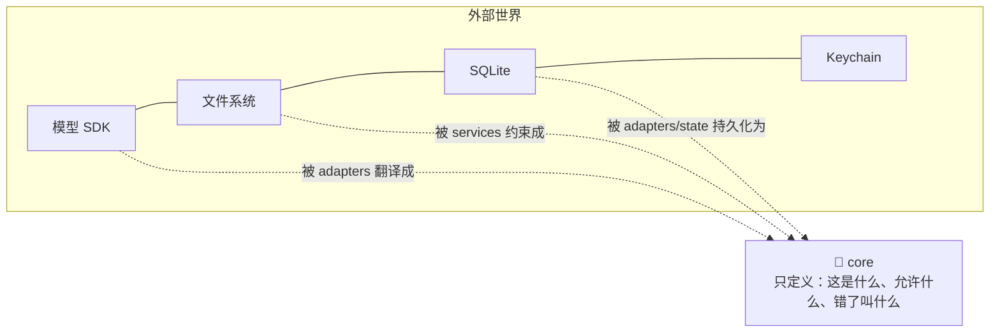
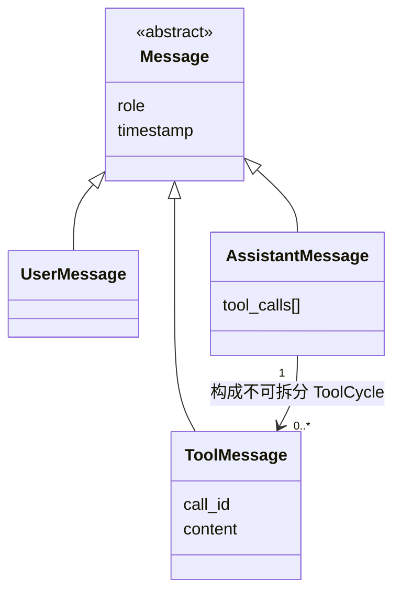
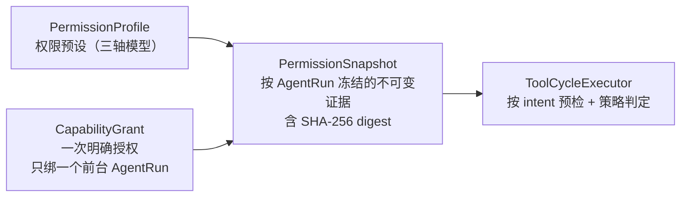

# 03 · core · 领域模型

> `src/morrow/core/`——项目的「宪法层」：定义所有名词与规则，但不依赖任何外部世界
> （不知道终端、SDK、YAML、SQLite、Keychain 的存在）。
> 关联：[02-整体架构](02-整体架构与分层.md) · [04-runtime](04-runtime-Agent运行时.md)

---

## 一、core 的角色

如果把整个项目比作一座城市，core 就是法律条文：它不盖房子、不通电，
但规定了「什么是建筑、谁能施工、违建叫什么罪」。所有上层模块围绕这些定义运转。

## 二、文件分组导览

| 分组 | 代表文件 | 定义了什么 |
|---|---|---|
| 💬 消息与事件 | `models.py` `events.py` | `Message`/`UserMessage`/`AssistantMessage`/`ToolMessage`、`AgentEvent`、`FinishReason`、`AgentStopCode` |
| 🔐 权限与能力 | `permissions.py` `capabilities.py` | `PermissionProfile`、`WorkspaceCapability`、`PermissionSnapshot`、`CapabilityGrant`、`ToolFact` |
| 🧰 工具执行 | `execution.py` `local_tools.py` | `ToolExecutionState`、`RecoveryClassification`、`ApprovalResolution`、效果分类 |
| 🏪 存储端口 | `store.py` `journal.py` `ports.py` | `OperationalStorePort`、`StoreHealth`、`MigrationReport`、`Clock`/`IdSource`/`ModelProvider` 端口 |
| 📜 运行策略 | `runtime_policy.py` `state_schema.py` | 策略字段、安全上限、schema 版本常量 |
| 🎓 学习领域 | `learning*.py` `memory_*.py` `preference_*.py` | 候选 payload、安全扫描、Memory Selection、Preference 文档模型 |
| 🧩 扩展领域 | `skills/` `mcp/` | Skill 身份/信任/绑定/脚本；MCP 契约/结果/审查 schema |
| 🩺 诊断与恢复 | `diagnostics.py` `doctor.py` `recovery.py` `faults.py` | `PublicDiagnosticError`、恢复报告、注入故障（测试用） |
| 🗜️ 上下文 | `compaction.py` `context.py` `prompt.py` | 压缩摘要、token 记账、投影契约 |

## 三、消息家谱

铁律：带 `tool_calls` 的 Assistant 消息与它对应的有序 ToolMessage **构成一个不可拆分的
ToolCycle**——持久化按此校验，上下文压缩按整 Cycle 取舍。

## 四、事件的「分寸感」

`core/events.py` 定义公开事件生命周期。公开事件是一条**已经脱敏的广播信道**，
未来要喂给 GUI、诊断导出，因此契约是：

| 可以有 | 永远没有 |
|---|---|
| ID、状态、计数、stop/finish 原因 | 密钥、凭据 |
| 有界摘要与 digest | 完整工具参数/结果 |
| 明确的 usage/cost availability | Provider 私有 reasoning、原始 SDK 对象 |
| 单调递增的 sequence（顺序权威） | 完整异常堆栈 / traceback |

取消不是异常：它是 `turn.completed` 的一种合法 `finish_reason`。

## 五、权限证据三件套

- `PermissionSnapshot` 一旦冻结**不可替换**，崩溃恢复后仍按原证据执行。
- `CapabilityGrant` 只对创建它的 AgentRun 有效；过期/撤销/新 AgentRun 一律 fail closed。
- 所有证据带 schema version 与 digest 校验——版本不符直接 `ValueError`，不猜、不兼容暗坑。

## 六、错误分类哲学

core 定义了稳定的错误码（`ModelErrorCode`、`ToolErrorCode`、`StorageErrorCode`、
`LearningSafetyCode`…），上层只能沿分类表翻译，不能即兴抛裸异常：

- 只有实现 `PublicDiagnosticError` 合同（有界、单行、拒绝密钥材料）的领域失败，
  才能越过 Agent 的通用异常边界被用户看到。
- 未知异常 → 固定的内部错误，**traceback 永远不出现在事件、日志或终端**。

## 七、给开发者的提示

- 往 core 加东西之前先问：它是否真的不依赖任何外部库？（测试 `test_architecture_boundaries.py`
  会强制执行这条边界。）
- core 里的 Pydantic 模型大多带严格 validator：digest 必须是 SHA-256 hex、版本必须匹配、
  集合必须有界——这是整个系统「fail closed」性格的源头。
