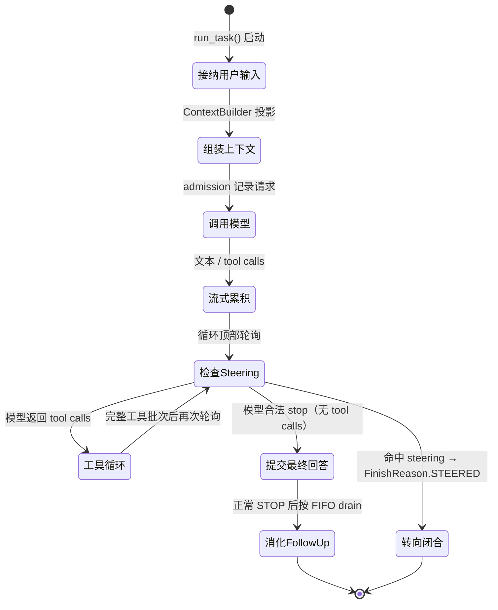
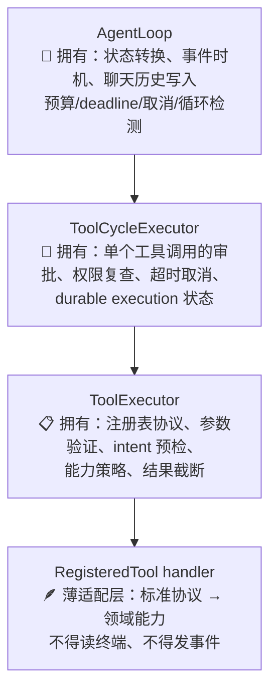
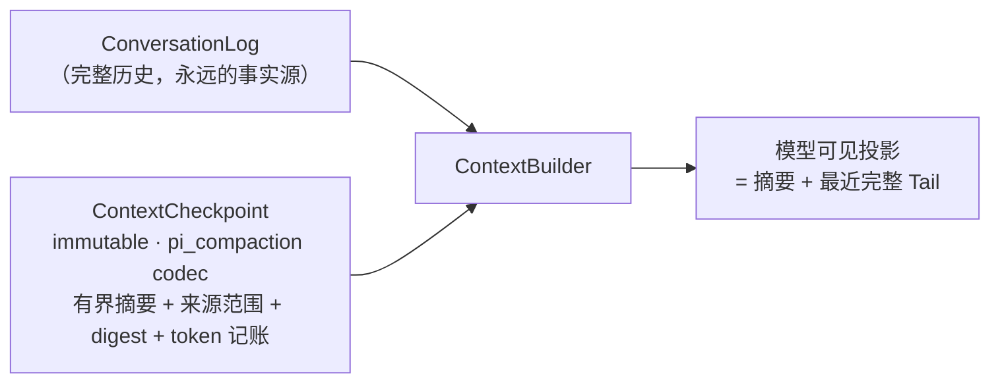

# 04 · runtime · Agent 运行时

> `src/morrow/runtime/`——项目的「发动机舱」：唯一的聊天状态机 `AgentLoop`、
> 工具循环执行器、对话日志、会话容器。
> 关联：[03-core](03-core-领域模型.md) · [06-工具系统与安全模型](06-工具系统与安全模型.md) · [08-持久化](08-持久化与恢复.md)

---

## 一、一张图看懂 AgentLoop



**只有一个入口**：普通对话统一走 `AgentLoop.run_task()`；
`AgentRuntime.run_turn()` 只是薄委托。不存在第二条聊天路径。

## 二、文件职责表

| 文件 | 职责 | 关键词 |
|---|---|---|
| `agent.py` | AgentLoop 状态机：任务生命周期、模型重试、预算、取消闭合、循环检测、**全部聊天历史写入** | 单写者 |
| `session.py` | Session 容器：持有进程内 ConversationLog、冻结能力/权限 | 权威容器 |
| `conversation.py` | `ConversationLog`：唯一聊天历史权威；`ConversationSnapshot` 不可变投影 | ToolCycle 校验 |
| `tools.py` | `ToolRegistry`/`ToolSet`/`ToolExecutor`：注册冻结、参数校验、恢复声明、预算、契约审计 | 通用协议 |
| `tool_cycle.py` | `ToolCycleExecutor`：审批、权限复查、超时/取消、durable 执行状态 | 不拥有历史 |
| `policy.py` | `RuntimePolicy`/`AgentPolicy`/`ReviewPolicy` 解析与合并 | 策略来源 |
| `durable_log.py` | 对话记录与 SQLite 持久化之间的双向翻译 | 脱敏 payload |
| `ids.py` `truncation.py` `structured.py` | ID 源、结果截断、结构化输出 | 小工具 |

## 三、分工：AgentLoop vs ToolExecutor vs ToolCycleExecutor



新增工具的纪律：handler **不得**要求 AgentLoop / ToolExecutor / SessionOrchestrator
按工具名加业务分支——协议是通用的，领域行为走注入的 Service/Port。

## 四、模型调用的「记账本」

每次 Provider 调用都被持久化运行能力（`DurableRunCoordinator` 合同）包裹：

```text
调用前  → admission：bounded request observation（不含 prompt 正文）
调用后  → exactly-once settlement（完成/失败/取消各一次）
终态    → 聚合写入 AgentRun terminal metrics
崩溃    → 留下 open request，供 Doctor / 恢复识别
```

投影只含 ID、状态、计数、stop/finish 与 usage/cost availability；
**不复制聊天、工具参数、reasoning、SDK 对象或 traceback**。

瞬态重试由 AgentLoop 单独拥有：默认 3 次、2/4/8 秒退避、60 秒 provider-delay cap（Pi 基线）。
v21 schema 用单独的有界行记录连续/累计重试计数。

## 五、Steering 与 Follow-up：运行中继续说话

| 动作 | 输入方式 | 语义 |
|---|---|---|
| Steering | Enter | 在**安全点**结束当前 Turn（`FinishReason.STEERED` 合法闭合），文本作为新 Turn 走普通 probe → prepare → admission 路径 |
| Follow-up | Alt+Enter | 排队等待；仅在 Agent **正常 STOP** 后按 FIFO 一次 drain 一个 |

边界：
- Steering 不打断模型流、retry backoff 或已接纳的工具批次。
- cancel / error / host stop **不自动消费** follow-up。
- 队列持久化（v22）：每 Session 最多 32 条、单条 ≤ 4096 字符的 FIFO；
  消费与下一 Turn admission 同事务。

## 六、长上下文：压缩但不篡改历史



- 压缩只改变**模型可见的投影**，完整 ConversationLog 与 ToolCycle 仍是唯一事实来源。
- 恢复时重建「summary + recent tail」，已持久化的对话/工具记录不会被删除或重放。
- v2 记账只在模型 capability 明确提供 context window 时启用；缺失不猜小窗口。
- ContextBuilder 不写事实源、不调用摘要模型——它是纯投影器。

## 七、任务如何结束：stop_code

达到模型、工具、时间、上下文、结果或循环上限时，任务以稳定的 `AgentStopCode` 结束——
失败路径和成功路径一样是**确定性终态**，不靠界面猜。合法的无 tool calls 模型 `stop`
直接决定回合结束；Runtime 不再依据 diff/验证结果拒绝最终回答（v19 遗留的 completion
字段只为旧数据可读保留）。

## 八、给开发者的提示

- 想让 Agent「多干一步」？不要往 AgentLoop 塞分支——未来多 Agent 也是给每个叶子 Run
  各配一个 AgentLoop，调度属于上方的 Workflow 层。
- 事件发射有内部协作者，但**状态转换与历史写入权**不可移交。
- 工具超时默认 120 秒，可在安全上限内被用户运行策略覆盖；审批拒绝/超时/通道不可用
  都安全地形成普通工具结果，让模型有机会恢复。
