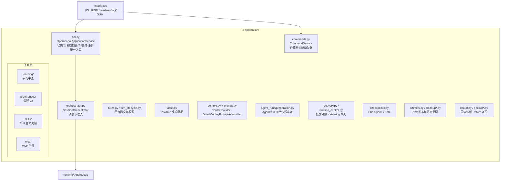
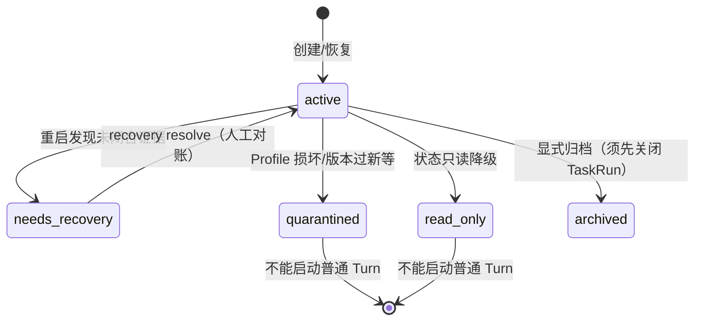

# 05 · application · 应用服务层

> `src/morrow/application/`——「中控台」：编排会话、管理任务/回合生命周期、
> 组装上下文、承载学习/偏好/Skill/MCP 四大子系统。
> 关联：[02-整体架构](02-整体架构与分层.md) · [04-runtime](04-runtime-Agent运行时.md) · [11](11-学习与偏好记忆.md) · [12](12-Skills与MCP扩展.md)

---

## 一、地图



## 二、关键角色一句话

| 角色 | 一句话 | 铁律 |
|---|---|---|
| `SessionOrchestrator` | 调度器：刷新 durable lifecycle/health 后决定能不能跑 | 普通工作准入 = `lifecycle=active` + `health=ok` |
| `OperationalApplicationService` | 应用 API 兼容 facade：命令、查询、事件统一从这里过 | 领域事务由独立协作者实现，不穿透父 facade |
| `CommandService` | 识别 `/斜杠命令` 的薄适配器 | CLI/REPL/未来客户端不直接碰 SQL 或 Artifact 文件 |
| `ApplicationCommandContext` | 命令上下文：replay、event/receipt、时钟、ID、错误翻译 | 所有命令事务共享它 |
| `AgentRunPreparationService` | 运行前冻结：模型、工具、权限、Memory/Skill 上下文打成快照 | 冻结后不可替换，崩溃恢复按原快照 |
| `ContextBuilder` | 从不可变 Snapshot 生成 Chat/Structured 投影，按完整 Cycle 控预算 | 不写事实源、不调摘要模型 |
| `DirectCodingPromptAssembler` | 组装系统提示：能力边界按冻结 ToolSet **动态渲染** | 没提供的能力在提示里也不存在 |
| `RecoveryService` | 崩溃对账：按持久化证据分类，只追加 interrupted/error 记录 | 绝不编造成功、绝不自动重放副作用 |
| `RuntimeControlService` | steering/follow-up 队列（v22）的持久化与消费 | 消息仍只经 ConversationLog 写入 |

## 三、Session 健康状态机



- `updated_at` 以整秒精度跨事务**严格单调**——可作乐观并发 token。
- `needs_recovery` 只能经恢复边界解决；`resume_recovery()` 也要求 Session 仍是
  ACTIVE + health OK，不拿陈旧的内存投影扩大权限。
- Recovery resolve 有终态守卫：旧 report 不能清除后来的 quarantined/read-only，
  也不能重复创建 AgentRun。

## 四、上下文与提示词组装

```text
冻结的 AgentRun 快照
  ├── Profile（项目是什么）          ← workspace profile.yaml
  ├── Preferences（怎么协作）        ← 三作用域 YAML，新 AgentRun 前加载冻结
  ├── Project Knowledge / Memory Selection ← SQLite 版本化记录（只引用不可变 revision）
  ├── Skill 上下文（低权限，带 selection_id）← 按 AgentRun 冻结的选择
  ├── 项目指令（AGENTS.md 等）
  └── ConversationLog 投影（checkpoint 摘要 + 最近完整 Turn + 新输入）
        ↓ DirectCodingPromptAssembler + ContextBuilder
  发给模型的系统提示 + 消息序列 + 标准化 ToolDefinition
```

关键边界：Skill 正文、Memory、Profile、Preference **都不能覆盖安全边界**，
也不能生成选择证据、授予工具或权限。

## 五、配置写入的唯一通道

| 写目标 | 唯一写入者 | 触发方式 |
|---|---|---|
| Workspace Profile | `ConfigPatchService`（prepare → apply_prepared） | `update_configuration` 工具 / `/workspace` 命令 |
| Preferences（三作用域） | `PreferenceWriter`（原子写 YAML） | `manage_preferences` 工具 / `/preferences` / Inbox 接受 |
| 配置晋升（学习） | `ConfigurationPromotionService` → 经同一 ConfigPatchService | Learning Inbox 接受 |

- 所有确定性编辑和自然语言配置**先预览（作用域/目标/操作/字段/值），确认后才写入**。
- 每个工具调用独立确认和提交，不组成跨调用事务；部分成功时分别报告
  `applied` / `unchanged` / 失败。
- 自然语言只在用户明确说「保存/记住/更新」时才走 `manage_preferences`；
  回答风格、假设、否定句不会被持久化。

## 六、给开发者的提示

- 新增一个「用户能做的操作」= 在 Application Service 实现领域逻辑 → 在
  `OperationalApplicationService` 暴露 → CLI/REPL/工具三处入口薄适配。
  **不要把逻辑写进 interfaces 层。**
- 应用服务只能调 core/journal 的窄端口；只有组合根、跨域事务聚合、诊断和备份
  能持有具体 SQLite adapter。
- 子系统笔记：[11-学习与偏好记忆](11-学习与偏好记忆.md)、[12-Skills与MCP扩展](12-Skills与MCP扩展.md)。
