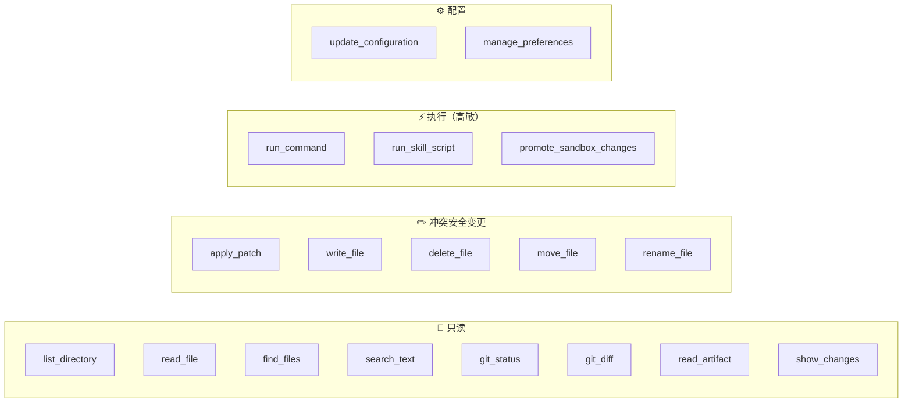
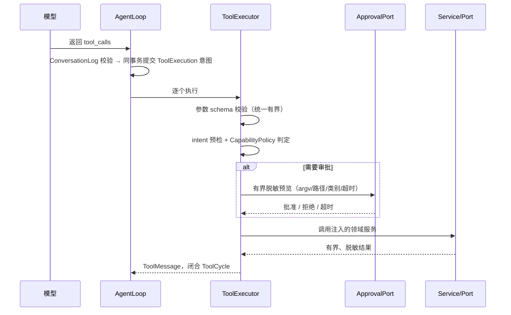
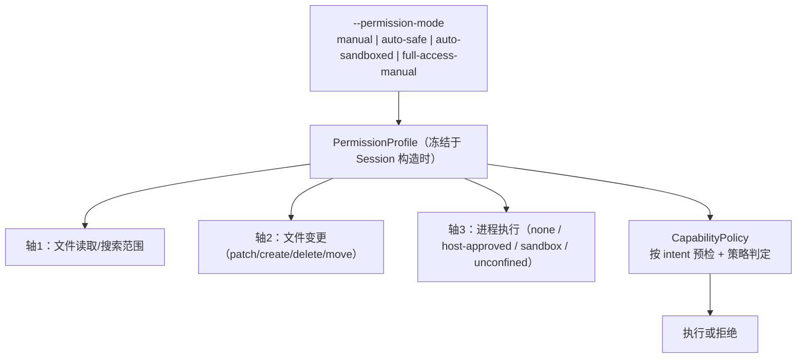
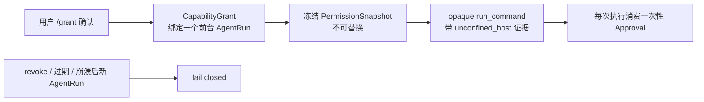

# 06 · 工具系统与安全模型

> Morrow 的「手」与「镣铐」：16 个工具如何让 Agent 干活，
> 权限/审批/沙箱/Grant 又如何保证它不乱来。
> 关联：[04-runtime](04-runtime-Agent运行时.md) · [07-services](07-services-工作空间服务.md) · [01-权限模式](01-产品形态与使用指南.md)

---

## 一、工具全家福

启用条件：**只在 Adapter 声明支持 OpenAI function calling 时**才注册工具；
`promote_sandbox_changes` 只在原生沙箱可用时加入；不支持 function calling 的 Adapter
不提供工具，但 `/workspace`、`/preferences` 等确定性命令仍可用。

## 二、一次工具调用的「安检通道」

纪律：
- handler 是**薄适配层**：不读终端、不发公开事件、不自行审批。
- 审批拒绝 / 通道不可用 / 等待超时 → 安全地形成普通工具结果，模型可继续。
- 每个 `RegisteredTool` 携带参数验证器 + `ToolRecoveryDeclaration`；
  声明在准备阶段冻结进 durable intent，**恢复用证据，不从工具名重新推断**。

## 三、权限模型：三轴 × 四模式

**Deny wins**：节点、Agent、工作空间、全局策略取交集；任何一层拒绝即不可用。
权限与审批语义不允许通过 YAML 或 Agent 工具放宽。

## 四、run_command 的三条岔路

| 路径 | 何时走 | 隔离 | 审批 |
|---|---|---|---|
| Host 直接执行 | manual / auto-safe | **无 OS 隔离** | 每次审批，预览有界脱敏 argv/shell/cwd/类别/超时 |
| Native Sandbox | auto-sandboxed（macOS） | 临时快照、默认断网、不碰真实工作区 | 自动执行 |
| Unconfined Host | full-access-manual + Grant | **明确无隔离** | `/grant` 授权 + 每次仍单独审批 |

护栏：
- shell 包装的 Git 命令按**写风险在审批前直接拒绝**。
- 命令文本只用于本地审批，不进 `CommandResult`、Provider、公开事件或持久状态。
- 沙箱能力无法证明（非 macOS/探测失败）→ fail closed，不降级到 Host。
- `full_access + auto` 永远 unsupported。

## 五、Full Access Grant：一条「明确受限」的证据链

- Grant 只对创建它的 AgentRun 有效；撤销阻止新审批、使 pending 失效、请求活动取消。
- 已完成或 outcome-unknown 的事实**不会被伪造回滚**。
- 结构化工具不会因同 AgentRun 有 Grant 而获得 elevated 证据。

## 六、文件与搜索的保护策略

- 同时检查**用户可见路径**与工作区内解析后的符号链接目标。
- `.git`、`.morrow`、凭据文件、常见 PEM 私钥内容 → 只返回受保护元数据。
- 读/搜不跟随目录符号链接；变更拒绝符号链接路径。
- 混合换行文件明确返回不支持（不静默改写为 LF）；patch/replace 保留统一换行。
- 变更要 SHA-256 冲突检查 + 原子发布（同目录临时文件 → fsync → rename → 父目录 fsync）。
- 仓库检查用专用 `git_status`/`git_diff`（禁用 pager、外部 diff、hooks、prompt、锁）。

> 变更工具的 TOCTOU 防护、捕获-核验发布协议等细节见
> [07-services-工作空间服务](07-services-工作空间服务.md)。

## 七、Skill 脚本与 MCP 的安全位

- `run_skill_script`：只在可用原生沙箱中运行冻结的 managed Skill 包脚本；
  argv/环境名/输入 Artifact/输出路径都有界；输出先脱敏再发布为 Session 级 Artifact；
  不接受 shell、不继承环境或凭据；缺沙箱直接拒绝。
- MCP 工具：经 run 级快照与结果归一化接入，见 [12-Skills与MCP扩展](12-Skills与MCP扩展.md)。

## 八、本地事实摘要（ToolFacts）

每个工具轮次完成后，终端可显示一行由进程内 `ToolFacts`/metrics 生成的**有界事实摘要**
（如「改了 2 个文件 +40/-12」）。它不进 Provider、公开事件或持久状态——
纯粹是给你看的「刚才发生了什么」小票。
