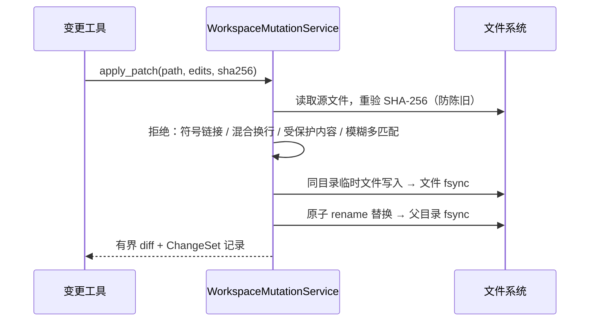
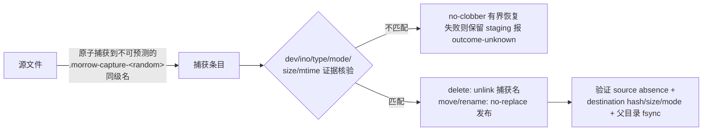
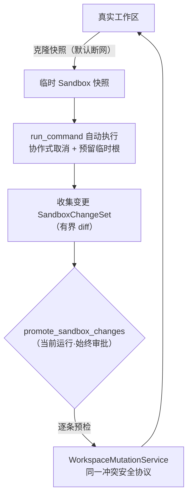

# 07 · services · 工作空间服务

> `src/morrow/services/`——「工具车间」：文件、搜索、Git、进程、沙箱这些
> 真正碰你硬盘的副作用能力，全部在这里被约束实现。
> 关联：[06-工具系统与安全模型](06-工具系统与安全模型.md) · [09-adapters](09-adapters-适配器层.md)

---

## 一、车间布局

| 文件 | 服务 | 干什么 |
|---|---|---|
| `files.py`（约 1800 行，车间核心） | `WorkspacePathResolver` / `WorkspaceFileService` / `WorkspaceMutationService` | 路径解析与保护、有界读取、冲突安全变更 |
| `changes.py` | `ChangeSetService` | 当前运行的变更集记录与 Diff 投影 |
| `search.py` | `WorkspaceSearchService` | 有界文本搜索 |
| `git.py` | `GitInspectionService` | 只读 status/diff（禁用一切扩展点） |
| `process.py` | `ProcessExecutionService` / `SecretRedactor` | Host/沙箱命令选择与执行、输出脱敏 |
| `sandbox.py` | `SandboxSnapshotService` | 快照准备、变更收集、推广 |
| `workspace.py` `provider.py` `preferences.py` | 工作空间索引 / Provider / 配置补丁 | 状态服务的应用门面 |

## 二、文件变更的「银行金库」协议

改一个文件为什么这么重？因为 Morrow 的承诺是：**要么不改，要么可证明地改对。**

拒绝清单（fail closed，全部不降级）：
- 路径是符号链接或逃出工作空间
- 源文件混合换行（不静默统一为 LF）
- SHA-256 不匹配（别人动过这个文件）
- 编辑目标模糊/多处匹配
- 内容命中凭据/私钥保护规则

## 三、删除/移动/重命名：TOCTOU 的「捕获-核验」

S7P-04 引入的 `delete_file` / `move_file` / `rename_file` 面临经典难题：
**预检那一刻到真正动手之间，文件可能被人换掉。** 解决方案像「先把手铐铐上再转移」：

要点：
- 只接受工作空间内**普通文件**；不支持目录、递归、force/overwrite、跨设备降级。
- 发布用平台已证明的 no-clobber 原语（`renameatx_np`/`renameat2`）；证明不了就 fail closed。
- 源文件 fd 在 effect 期间保持打开，内容以有界稳定双读核验。
- 每个阶段失败都留下证据进入恢复分类，**绝不删除或覆盖第三方条目**。

## 四、沙箱快照：一次性副本里撒野

- 快照超时后等后台阶段停稳才清理。
- 推广不是 run 级原子：后项失败保留已生效 ChangeSet，返回有界 partial failure，
  不回滚、不覆盖用户数据。
- 删除只推广预算内 regular UTF-8 文本；只有 deleted+created 按 hash/size/mode
  一对一无歧义时才识别为 move/rename。
- Linux bubblewrap 在真实 runner 验收前**固定探测为 unsupported**——不读本机二进制就声称支持。

## 五、Git 与进程的细节护栏

`GitInspectionService`（只读）：
- 拒绝外部 Git metadata；禁用 pager、外部 diff、textconv、hooks 类可执行扩展点、
  prompt 和可选锁。
- 输出有界截断 + UTF-8 安全切分。

`ProcessExecutionService`：
- `SecretRedactor` 对有界捕获输出脱敏后才允许发布为 Artifact。
- `CommandPlan` 预检识别带规范 workspace scope 的 `ValidationFact`（如跑测试）——
  它是独立遥测，**不是回答发送门禁**。
- 普通 `CommandToolFact` 只证明一次有界命令执行；两者都不携带完整命令、输出、
  文件内容、秘密或 traceback。

## 六、Artifact 预算

命令输出等结果先落 Artifact 再回到对话。硬上限：

| 项 | 上限 |
|---|---|
| 单个 Artifact | 64 MiB |
| 单 TaskRun 预留字节 | 256 MiB |
| 元数据 / Excerpt | 32 KiB / 8 KiB |

发布顺序：staging 元数据 → 用户私有临时文件写入 + fsync → hash/size 校验 →
原子 rename → 父目录 fsync → available 元数据事务。
