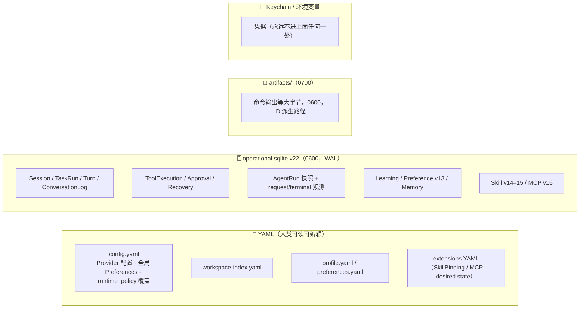
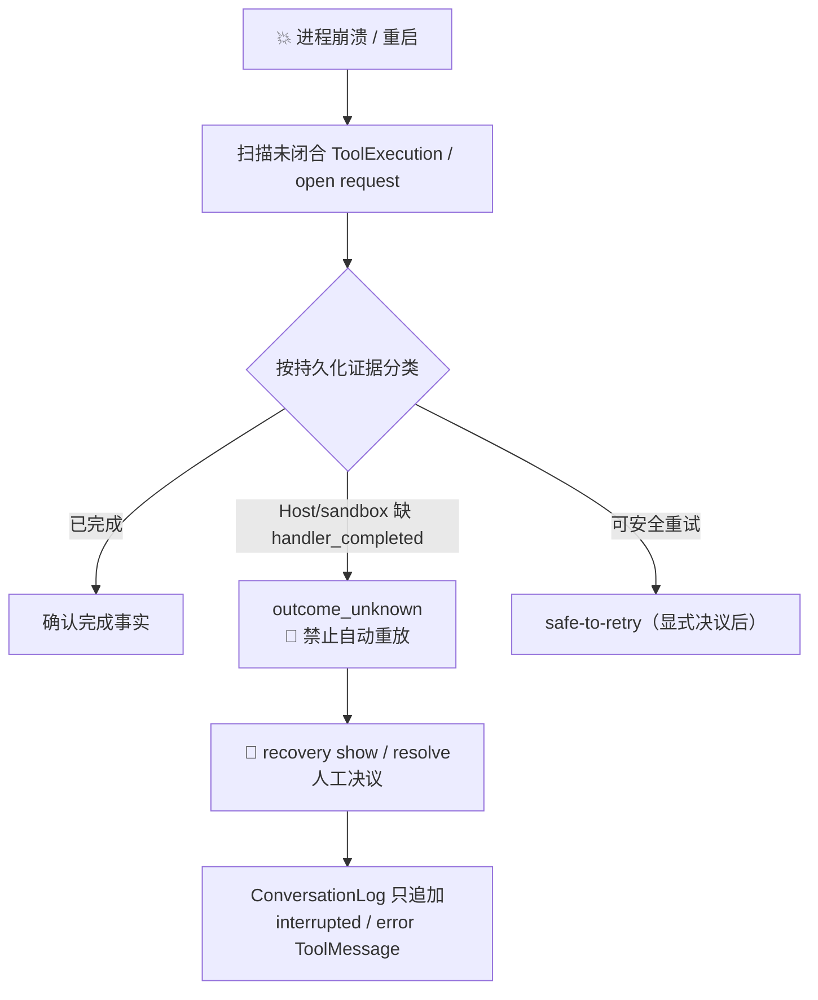
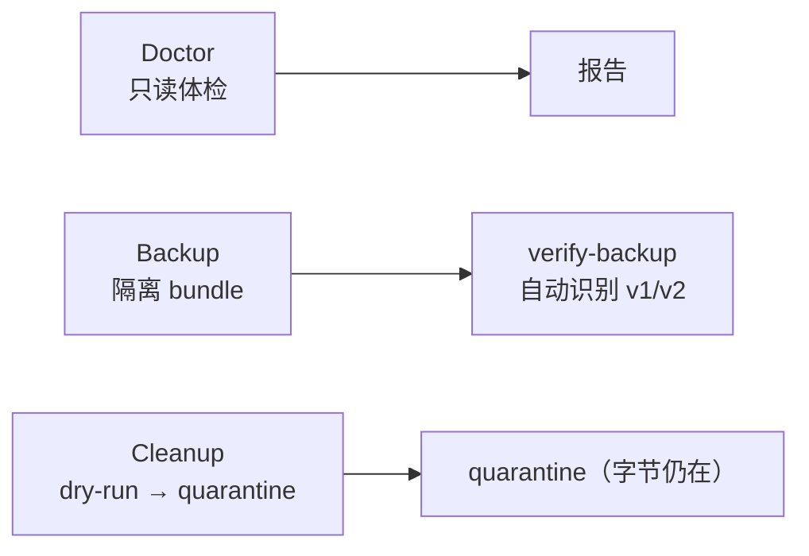

# 08 · 持久化、恢复与备份

> Morrow 的「记忆力」：Operational Store（SQLite v22）、YAML 配置、Artifact 字节、
> 崩溃对账、Doctor/Backup/Cleanup 三件套。
> 关联：[02-整体架构](02-整体架构与分层.md) · [09-adapters/state](09-adapters-适配器层.md)

---

## 一、三种状态，三个家



原则：**每类状态只有一个权威来源**；查询投影可重建，不做双向同步。

## 二、SQLite Schema 的演化史（v1 → v22）

每一版 schema 对应一批能力的落地，迁移文件在 `adapters/state/migrations_v*.py`：

| 版本 | 带来了什么 |
|---|---|
| v1–2 | 身份/迁移/备份基础；无工具 Session 历史 |
| v3 | ToolExecution 与 Approval 日志 |
| v4 | 恢复分类与崩溃对账（recovery_reports/receipts） |
| v5 | 完整 TaskRun 状态机、转移审计、版本化 TaskOutcome |
| v6 | Artifact 元数据/引用/pin、受控字节发布 |
| v7 | 确定性 ContextCheckpoint + Session parent/cut lineage |
| v8 | application_events / command_receipts（有序 cursor + 命令回放） |
| v9 | capability_grants / permission_snapshots（按 AgentRun 绑定） |
| v10–12 | Learning 全家桶：Policy/Review/Evidence/Candidate/Suppression、Decision/ProjectKnowledge/Promotion、MemorySelection |
| v13 | Preference Review job / Evidence / Proposal / WriteBatch |
| v14–15 | Skill Catalog/Binding/Selection/Context/Draft；Usage 与生成 Skill 证据 |
| v16 | MCP Server/Catalog/run snapshot/Tool snapshot/结果 Artifact 链接 |
| v17–19 | AgentRun request ledger 与 terminal metrics；历史 completion 兼容列（新运行不再写） |
| v20 | long-horizon：精确 context-window 记账、compaction 计数 |
| v21 | 有界 retry-progress（连续/累计模型重试） |
| v22 | steering/follow-up FIFO 队列（每 Session ≤32 条、单条 ≤4096 字符） |

未迁移的旧版本只读可读取，只是不提供新行——**旧数据永不被隐式删除或错误解释**。

## 三、写入纪律

```text
校验 → revision 检查 → 同目录临时文件 → 文件 fsync → 原子替换 → 父目录 fsync → 保留 .bak
```

- 所有 repository 共享一个 `SqliteJournalBackend` 的外层事务、时间戳、replayability——
  拆分 repository 不会拆散跨域原子事务。
- `SqliteOperationalJournal` 只保留 Session 聚合与兼容委托；
  各领域 SQL 分属有界 repository，不反向依赖父 facade。
- Profile 损坏/版本过新 → 工作空间持久状态整体只读；workspace Preferences 损坏只隔离该层。
- `state: cleared` 是合法 tombstone；旧 `handoff.yaml` 不读、不迁移、不删（留待未来决策）。

## 四、崩溃恢复：对账，而不是重来



核心原则：**恢复只承认证据，不编造成功**。`recovery resolve` 幂等——同请求按
command receipt 直接回放结果；新命令只对 `OPEN` 状态的报告生效，且在写事务内
重新读取 durable status。

## 五、Checkpoint 与 Fork：时间长河里的分叉

- **ContextCheckpoint**（v7）：从闭合 Turn 前缀生成的确定性、可重算投影。
  保存 source record 范围、完整最近 Turn 的 record ID、计数、Artifact 引用和
  typed omitted reasons——**不保存 tail 原文**，原始记录仍是唯一权威。
- **Session Fork**：从合法闭合 Turn 或 Checkpoint 创建隔离子 Session，
  只记录 parent/cut lineage；恢复时投影「父不可变前缀 + 子本地记录」。
  不复制 TaskRun/Approval/Grant/文件；子 Session 之后可以拥有自己的一切。

## 六、Doctor / Backup / Cleanup 三件套

| 工具 | 干什么 | 铁律 |
|---|---|---|
| `state doctor` | 只读诊断：schema、SQLite integrity/FK、对话语法、Task/Execution、Learning/Memory/Preference/Skill/MCP 引用、Artifact 字节与引用、event cursor | 报告只有有界摘要与计数；**绝不自动改写历史**；health OK 才 exit 0 |
| `state backup` | v1：SQLite online backup + Artifact manifest + 引用验证。v2（`--version 2`）：再加脱敏 YAML、被引用 managed Skill 版本、MCP 引用 | **永不复制 CredentialStore/Keychain/凭据字节**；v2 只能恢复到新的隔离目标 |
| `state cleanup` | Artifact orphan 清理，默认 dry-run | `--apply` 不销毁字节：复查后原子移入随机私有 quarantine；成功报告是 `removed=0, quarantined=1`；证明不了安全就 fail closed |



## 七、事件与回放的边界

- `application_events.cursor` 是独立命名空间，只记录已与业务状态**同事务提交**的事实；
  它不替代 `AgentEvent.runtime_event_sequence`，也不重建 ConversationLog。
- Headless `morrow run` 的 JSONL 是另一路投影：事件原样包裹 + 末尾 safe metrics。
- 共同底线：命令参数、输出、指令正文、文件内容、模型原始回复**都不进这些投影**。
