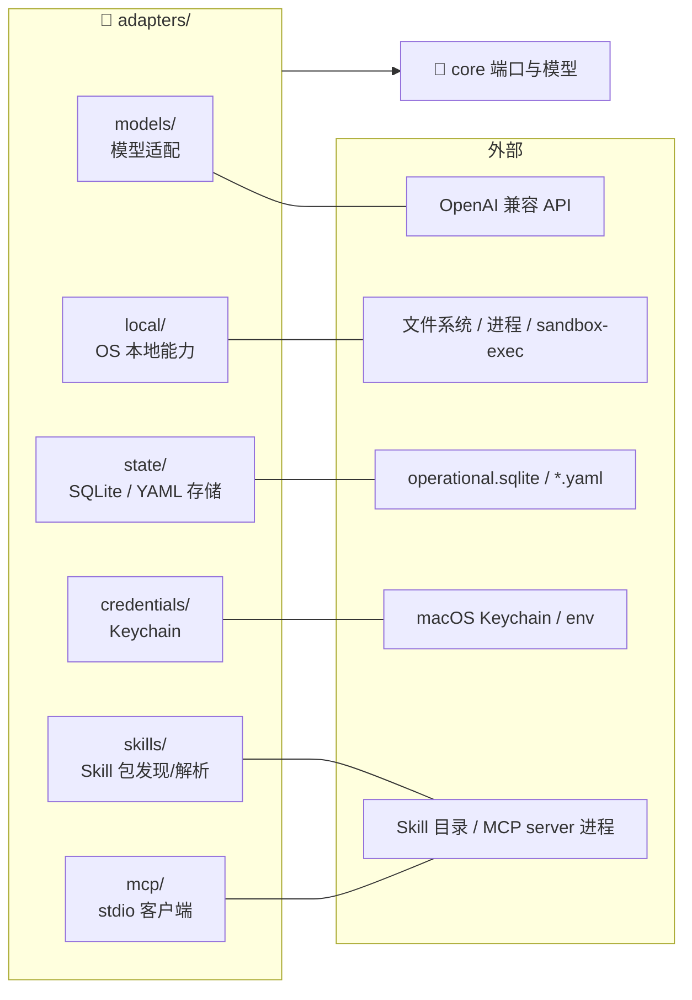
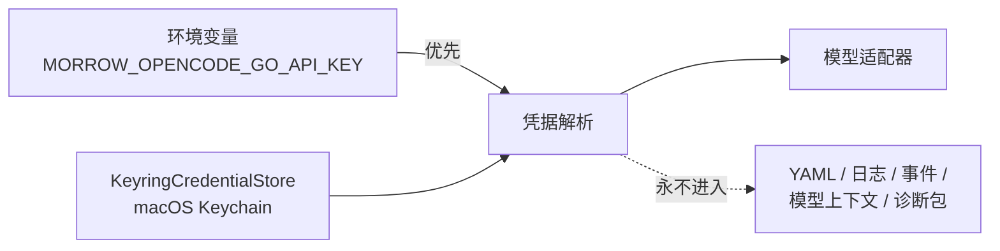

# 09 · adapters · 适配器层

> `src/morrow/adapters/`——「转换插头」：把外部世界（模型 SDK、SQLite、YAML、
> Keychain、macOS 沙箱、MCP）翻译成 core 定义的端口，反之亦然。
> 关联：[03-core 端口](03-core-领域模型.md) · [08-持久化](08-持久化与恢复.md)

---

## 一、六组插头

**装配纪律**：只有 `bootstrap.py`（组合根）认识这些具体类；
上层只依赖 core 端口，因此测试可以用假实现替换任何插头。

## 二、models/：模型世界的翻译官

| 文件 | 角色 |
|---|---|
| `openai_compatible.py` | 主适配器：请求白名单、流片段组装（`StreamAccumulator`）、usage 归一化、错误分类（`classify_error`）、重试间隔提取 |
| `learning_reviewer.py` | `ModelLearningReviewer`：no-tool、有界消息、严格 Candidate schema 的学习审查器 |
| `preference_reviewer.py` | `ModelPreferenceReviewer`：偏好审查对应物 |
| `registry.py` | `AdapterRegistry`：Provider/Model 注册与 preset（如 `opencode-go` / `opencode-go-mimo`） |

隔离红线：Provider 私有 reasoning、SDK 原始对象、凭据**留在适配器内**，
翻译成 core 模型后才允许上行。错误必须分类（超时/限流/认证/格式…），
不静默切换 Provider 或模型。

## 三、local/：操作系统的边界守卫

| 文件 | 角色 |
|---|---|
| `filesystem.py` | 原子写、fsync、no-follow 打开等文件原语 |
| `process.py` | `HostProcessAdapter`：无隔离 Host 命令（需审批） |
| `sandbox.py` | `NativeSandboxProcessAdapter` + `default_sandbox_backend`：macOS 原生能力探测与执行；Linux 固定 unsupported |
| `git.py` | `GitInspectionAdapter`：固定参数集的只读 Git 调用 |
| `search.py` | 搜索原语 |

这一层是「能力探测 + 原语执行」；策略判定（要不要审批、允不允许）在上层。

## 四、state/：最大的一组插头

50+ 个文件，分三类：

### 4.1 SQLite 侧（Operational Store）
- `operational.py`：`OperationalStore` / `OperationalStoreSession`——连接、WAL、0600 权限。
- `journal.py`：`SqliteOperationalJournal` 兼容 facade + 各有界 repository
  （conversation / task / tool / permission / recovery / runtime_control / observability…）。
- `transaction.py`：共享 `SqliteJournalBackend` 外层事务。
- `migrations*.py`（v13–v22）：逐版本迁移；v13 的 DDL 与 checksum 已冻结不变。

### 4.2 YAML 侧（人类可读配置）
- `yaml.py`：`GlobalConfigYamlStore` / `ProjectStateYamlStore` / `WorkspaceIndexYamlStore`。
- `preference_yaml*.py`：Preferences 文档 IO、迁移、类型（版本化信封 + revision + 锁 +
  临时文件 + fsync + 原子替换 + .bak）。
- `extension_yaml.py`：SkillBinding / MCP desired state 等扩展配置。

### 4.3 Artifact 字节
- `artifacts.py`：`FilesystemArtifactStore`——ID 派生路径、staging → fsync → 原子发布。
- `application_journal.py` / `artifact_journal.py` / `context_journal.py` 等：
  各领域 journal 窄端口的 SQLite 实现。

## 五、credentials/：凭据的唯一权威

轮换规则：环境变量存在时优先；必须先取消环境变量才能用 `--replace-credential` 换 Keychain 里的值。

## 六、skills/ 与 mcp/ 适配器

- `skills/`：`discovery`（目录扫描）、`manifest_parser`（SKILL.md 解析）、
  `managed_store`（受管包存储）、`tree`、`envelope`——把文件系统里的 Skill 包
  变成 core 的 Catalog/Version 模型。
- `mcp/stdio_client.py`：`McpStdioClient`——与 MCP server 子进程的 stdio 会话，
  崩溃隔离与诊断（`McpStdioDiagnostic`）。运行治理见
  [12-Skills与MCP扩展](12-Skills与MCP扩展.md)。

## 七、给开发者的提示

- 换存储引擎？只动 `adapters/state/` + 组合根，上层无感——这就是端口的价值。
- 新增 Provider 时从 `AdapterRegistry` 与 preset 入手，不要绕过 `classify_error` 自己抛错。
- 测试替换：脚本化 Provider、fake stdio MCP server（`tests/spikes/fake_mcp_stdio_server.py`）
  都是现成的假插头。
