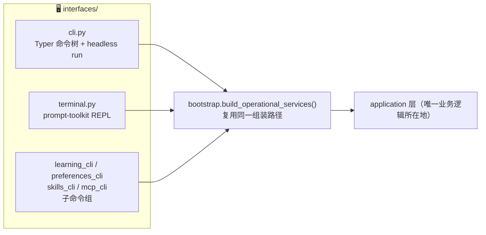
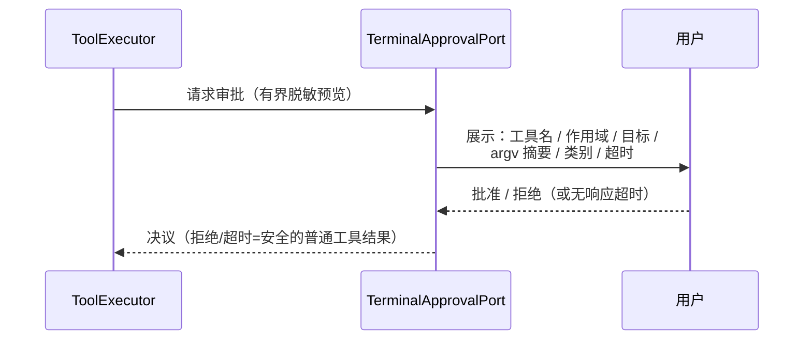

# 10 · interfaces · 接口层

> `src/morrow/interfaces/`——「方向盘与仪表盘」：人（或脚本）与 Morrow 打交道的地方。
> 只有输入、渲染、审批询问、退出码；**不含业务逻辑**。
> 关联：[01-使用指南](01-产品形态与使用指南.md) · [05-应用服务层](05-application-应用服务层.md)

---

## 一、三扇门，同一间房

纪律：接口层**不自行复制领域服务构造**；交互式与 headless 复用同一
`build_operational_services()` / `build_operational_api()` 组装。

## 二、文件分工

| 文件 | 内容 |
|---|---|
| `cli.py` | Typer 根命令与全部子命令（provider/model/session/task/artifact/grant/recovery/state/…）；`run_headless`；`HeadlessApprovalPort` |
| `terminal.py` | `Terminal` REPL 渲染、`TerminalApprovalPort` 审批 UI、steering/follow-up 输入捕获、学习通知展示 |
| `learning_cli.py` | `morrow learning ...`：status / set-mode / inbox / review / retry / accept / edit / reject |
| `preferences_cli.py` | `morrow preferences ...` |
| `skills_cli.py` | `morrow skills ...`：Catalog/Draft/Binding/生命周期 |
| `mcp_cli.py` | `morrow mcp ...`：add / list / show / inspect / status / enable / disable / remove / refresh |
| `spike.py` | 输入实验工具（EOF/流处理） |

## 三、审批 UI：安全模型的「人」那一半

- 预览**有界且脱敏**：看不到完整大参数，看不到任何密钥。
- Headless 模式没有真人 → `HeadlessApprovalPort` 默认 fail closed。

## 四、终端体验细节

| 元素 | 表现 |
|---|---|
| 工具活动 | `↳ 工具步骤 n/m：工具名` |
| 事实摘要 | 每个工具轮次后一行有界 ToolFacts 小票（不进持久状态） |
| 学习通知 | 后台 Review 完成时展示待审候选提示 |
| 运行中输入 | Enter=steering，Alt+Enter=follow-up，Ctrl+C=取消 |
| 恢复提示 | 检测到可恢复 Session 时启动即显示 ID |

## 五、退出码契约

- `state doctor`：health OK → `0`；其余 → `2`（报告仍完整输出）。
- 确认提示期间收到 EOF → `2` 且不重置会话。
- Headless：事件只写 stdout，诊断只写 stderr——脚本可以安全地分流。

## 六、给开发者的提示

- 想加一个新命令？先去 application 层加服务方法，再在这里做薄适配；
  不要在 CLI 里写 SQL 或读 Artifact 文件。
- 未来 GUI 也是这一层的兄弟：消费同样的 Application Service、公开事件与查询投影——
  这就是「GUI 不拥有第二套业务逻辑」约束的落点。
