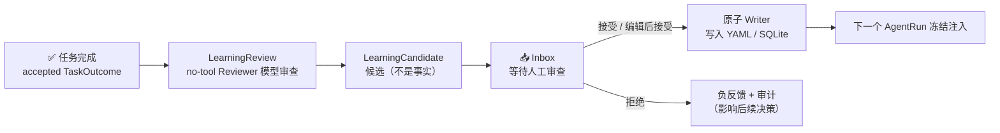
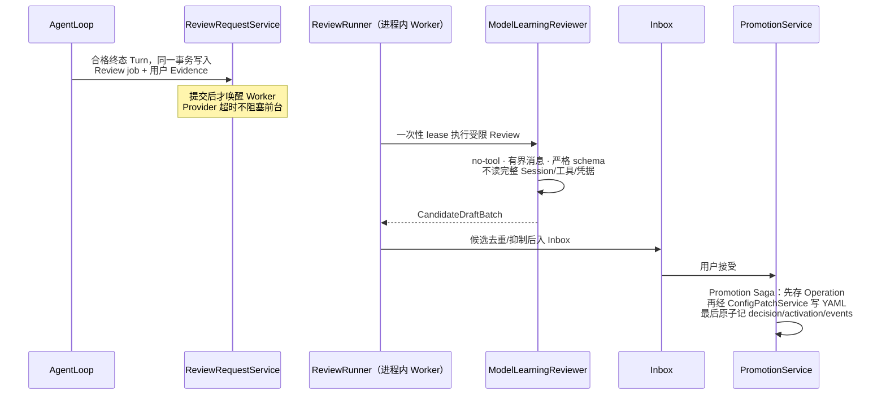
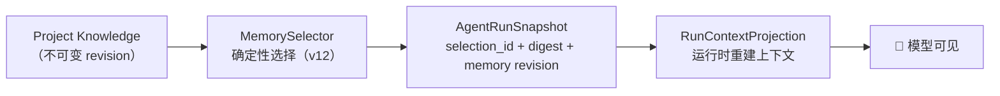

# 11 · 学习与偏好记忆（Stage 5）

> Morrow 的「可审查学习」：Agent 可以从完成的任务里**提出**长期偏好和项目知识，
> 但任何推断都必须经过你的审查才会成为长期状态。
> 关联：[05-应用服务层](05-application-应用服务层.md) · [08-持久化 v10–v13](08-持久化与恢复.md)

---

## 一、核心理念：提案 ≠ 事实

两条铁律：
1. **任务完成 ≠ 自动改变长期状态**——TaskOutcome 和 LearningReview 是两个阶段。
2. **长期状态不是不可见提示词**——来源、作用域、状态、版本、最近确认都可查。

默认策略是 `review-only`；`explicit-auto` 被显式拒绝；`off` 可完全关闭任务后 Review。

## 二、Learning 流水线详解（application/learning/）

### 模块职责表

| 模块 | 职责 |
|---|---|
| `policy.py` | LearningPolicy：`off / review_only` 有界命令；默认不建策略行 |
| `requests.py` / `runner.py` | Review 请求的同事务入队；一次性 lease Runner |
| `context.py` | Review 上下文构建（Evidence 安全边界） |
| `candidate_pipeline.py` / `decisions.py` / `inbox.py` | 候选管线、决策、收件箱 |
| `promotion*.py` / `configuration_*.py` | Promotion Saga：Profile 候选 → YAML；恢复/撤销 |
| `memory*.py` | Project Knowledge 生命周期、Memory Selector、派生词、doctor/backup |
| `learning_doctor*.py` / `learning_backup.py` | 只读校验与备份引用验证 |
| `evaluation.py` | 离线评估数据集与打分 |

### 候选的四条出路

| 候选类型 | 接受后去向 |
|---|---|
| Preference | `PreferenceWriter` → 对应作用域 YAML |
| Profile | Configuration Promotion Saga → `profile.yaml` |
| Project Knowledge | SQLite 版本化记录（不可变 revision） |
| Skill / Workflow / Orchestration | **只保留为候选**——不创建文件、工具、权限或运行时规则 |

## 三、安全边界（learning_safety）

- `scan_learning_text` 拦截敏感材料；Reviewer 原始输出、Provider reasoning、密钥
  不进事件、日志、候选、YAML 或模型上下文。
- 模型自己的回答**不能成为偏好的唯一证据**；你的纠正、拒绝、删除都是负反馈。
- 一次性要求属于当前 Turn/Task，不自动晋升长期 Preference。

## 四、Preferences v2：三层作用域 + 异步审查

```mermaid
flowchart TB
    subgraph 作用域["三层 Preferences（后者覆盖前者）"]
        G["global<br/>~/.morrow/config.yaml"]
        W["workspace<br/>workspaces/<id>/preferences.yaml"]
        S["session<br/>进程内，不落盘"]
    end
    W -.覆盖.-> G
    S -.覆盖.-> W
    subgraph v13管线["v13 异步审查管线（preferences/）"]
        J["jobs.py<br/>终态 Turn 同事务 enqueue"]
        WK["worker.py<br/>进程内 ReviewWorker<br/>lease/retry"]
        RV["reviewer.py<br/>Deterministic / Model PreferenceReviewer"]
        IN2["inbox.py<br/>Proposal 审查"]
        WR["writer.py<br/>PreferenceWriter 原子写 YAML"]
        RP["run_projection.py<br/>select_run_preferences → 下一 AgentRun 冻结注入"]
    end
    J --> WK --> RV --> IN2 --> WR --> RP
```

- **写入只有一个门**：`PreferenceWriter`；`manage_preferences` 工具只是它的受审批薄适配器。
- 活跃规则在**新 AgentRun 前加载并冻结**——运行中途改偏好不影响当前运行。
- decode-only legacy 迁移：旧格式只解码读取，不再有兼容写入器。

## 五、Memory Selection：按运行冻结的记忆

- 确定性：同一输入永远选出同一结果；AgentRun 崩溃恢复后**复用同一冻结选择**。
- `morrow memory selection list / show` 只显示引用、原因、预算、digest——
  不默认展开 Knowledge 内容。
- Memory doctor 检查 Selection/AgentRun/derived terms 链接完整性。

## 六、现状与边界

| 已验收 | 仍待做 |
|---|---|
| 确定性离线安全门禁、模拟用户回放、headless accept/edit/reject、真实 Provider Reviewer v4 质量验收 | 真实模型质量持续评估（需显式授权与凭据） |
| Inbox/Writer/Promotion/撤销/恢复全链路 | Skill/Workflow 候选的自动落地（刻意只留候选） |
| v13 doctor/backup 门禁 | 跨工作空间知识共享（无） |
