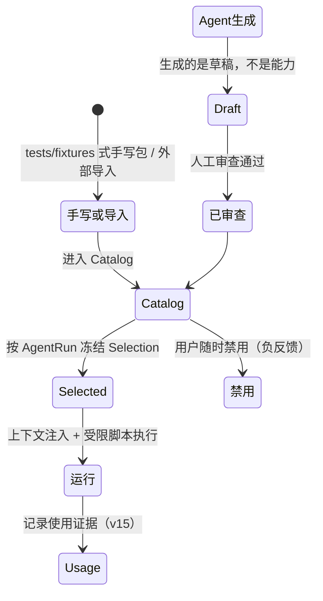
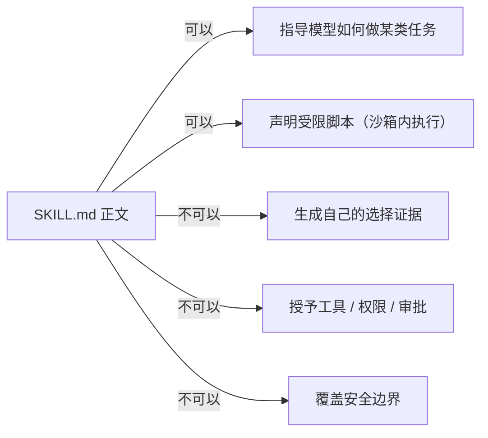
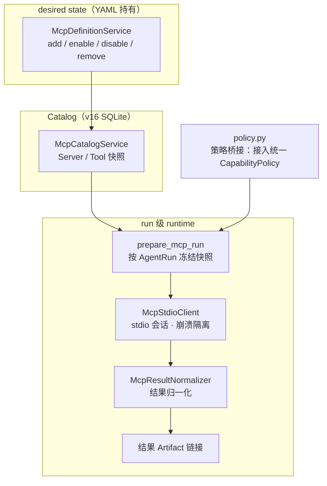

# 12 · Skills 与 MCP 扩展（Stage 6）

> Morrow 的「可插拔能力」：受治理的 Skill 全生命周期，以及 MCP 外部工具服务器的
> desired-state 接入。核心立场：**扩展可以增强 Agent，但永远不能扩大安全边界。**
> 关联：[06-安全模型](06-工具系统与安全模型.md) · [09-adapters](09-adapters-适配器层.md)

---

## 一、Skill 是什么

一个 Skill 是一个目录包（核心为 `SKILL.md`，可有 `references/`、`scripts/`），
描述「某类任务应该怎么做」。Morrow 治理它的完整生命周期：



### application/skills/ 模块表

| 模块 | 职责 |
|---|---|
| `catalog.py` / `package_lifecycle.py` | Skill 包目录与生命周期 |
| `selection.py` / `context.py` | 按 AgentRun 冻结的选择与低权限上下文注入 |
| `drafts.py` | 生成 Draft 的审查管线（**Draft 不自动成为能力**） |
| `scripts.py` | 受限脚本执行：`run_skill_script` 的服务端 |
| `bindings.py` / `binding_lifecycle.py` | SkillBinding（YAML 持有的绑定配置） |
| `usage.py` | 使用证据记录 |
| `resources.py` / `validation.py` / `resolution.py` | 资源、校验、解析 |
| `doctor.py` / `backup.py` / `recovery.py` | 只读诊断、备份引用、恢复 |

## 二、Skill 的权力边界



- 模型可见的 Skill context 是**低权限**的：显示 Morrow 持久化的 `selection_id` 与冻结身份，
  供构造严格请求；正文本身无授权能力。
- `run_skill_script`：只在**原生沙箱**中运行冻结 managed 包的脚本；argv/环境名/
  输入 Artifact/输出路径有界；输出脱敏后发布为 Session 级 Artifact；
  不接受 shell、不继承 ambient 环境或 CredentialStore；缺沙箱直接拒绝；
  失败只返回稳定诊断码/消息，不返回原始异常。

## 三、MCP：外部工具服务器的「签证处」



### application/mcp/ 模块表

| 模块 | 职责 |
|---|---|
| `definitions.py` | MCP Server desired-state 管理（YAML） |
| `catalog.py` / `queries.py` | Catalog 持久化与查询 |
| `runtime.py` / `run_bridge.py` | run 级准备/再水化；接入 AgentRun |
| `policy.py` | 把 MCP 工具桥接进统一能力策略与审批 |
| `results.py` | 结果归一化（配合 `core/mcp/` 的 contracts/schema） |
| `backup.py` | 备份引用校验 |

当前边界：MCP desired state、Catalog、审批、结果归一化、崩溃隔离与恢复证据
已通过**离线 Fake stdio** 验收；不读取真实用户状态、凭据或外部 MCP。

## 四、Provider/Model 控制面

Stage 6 同时交付了 Provider/Model 控制面（仍由 Provider service 与 AdapterRegistry 持有）：

```bash
morrow provider add --preset opencode-go   # 预置模板
morrow model add / sync / use / remove     # 模型管理
morrow model current                        # 当前模型
```

- 非敏感配置进 `config.yaml`；凭据只进 CredentialStore。
- AgentRun 快照冻结模型身份——每次运行可复现、可审计。

## 五、统一视角：扩展接入的「四不」

无论是 Skill、MCP 还是未来扩展，接入纪律相同：

1. **不绕过** CapabilityPolicy / ToolExecutor / ToolFact / 恢复分类——走同一个 ToolCycle。
2. **不持久化**正文与原始输出——只有有界、脱敏、hash 校验的 Artifact。
3. **不自动落地**生成物——Draft 必须经人工审查。
4. **不改变**公开事件生命周期与 runtime-policy 默认值。

## 六、验收入口

- `tests/acceptance/test_stage6_integrated.py`——离线综合验收（Fake Provider + Fake stdio MCP）。
- `docs/acceptance/stage6-skills-and-extensions.md`——验收证据。
- `tests/fixtures/stage6/`——手写 Skill 包与 fake provider 脚本。
