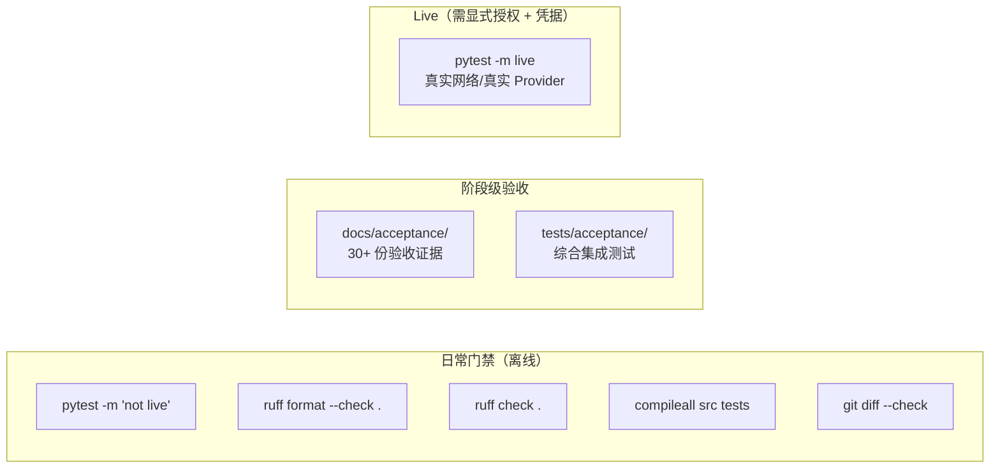

# 13 · 测试与质量门禁

> Morrow 的「免疫系统」：120+ 测试文件、离线默认门禁、按阶段组织的验收证据、
> 以及一套独立的评估协议。
> 关联：[14-Roadmap](14-Roadmap路线图.md) · [08-持久化](08-持久化与恢复.md)

---

## 一、质量门禁总览



**默认测试不联网、不用真实钥匙串、不依赖用户主目录。**
Live 测试只在用户明确要求且有兼容凭据时运行；用脚本化 Provider / fake SDK chunk 替代真实网络。

## 二、tests/ 的组织方式

| 类别 | 代表文件 | 守护什么 |
|---|---|---|
| 架构边界 | `test_architecture_boundaries.py` `test_stage_boundary.py` | core 不依赖外层；阶段能力不越界 |
| Agent 核心 | `test_agent_tool_loop.py` `test_agent_limits.py` `test_agent_guardrails.py` `test_conversation_and_loop.py` | AgentLoop 状态机、预算、取消、循环检测 |
| 工具契约 | `test_dynamic_tool_contracts.py` `test_tool_contract_audit.py` `test_local_tool_factories.py` | 工具 schema 闭合、注册协议 |
| 阶段验收 | `test_stage2_e2e.py` `test_stage3_product_acceptance.py` `test_stage4_*.py`（约 20 个） `test_stage5_*.py`（约 20 个） | 每个 Stage 的功能闭环 |
| 持久化/恢复 | `test_stage4_recovery_crash.py` `test_operational_store.py` `test_stage4_journal.py` | 崩溃点、迁移失败、损坏降级 |
| 安全 | `test_sandbox.py` `test_policy.py` `test_local_mutation.py` | 沙箱探测、策略交集、变更协议 |
| S7P 系列 | `test_s7p04_workspace_change_lifecycle.py` `test_s7p05_completion_truth.py` `test_s7p06_pi_parity.py` … | Stage 7 Preflight 各切片 |
| 学习/偏好 | `test_preference_*.py` `test_stage5_learning_*.py` `test_stage5_memory_*.py` | 审查管线、Inbox、Writer、Memory |
| Skill/MCP | `test_skill_*.py` `test_mcp_*.py` | Stage 6 扩展治理 |
| fixtures/spikes | `tests/fixtures/`（fake provider、手写 skill）`tests/spikes/`（fake stdio MCP） | 可替换的假插头 |

## 三、evals/：产品级评估协议

`evals/code-agent-mini/` 是一套迷你 Code Agent 评估集：

```text
evals/code-agent-mini/
├── eval.py              # 评估运行器
├── manifest.toml        # 评估清单
├── protocol.toml        # 协议（任务集、判定、阈值）
└── tasks/
    ├── MORROW-001..006/ # 针对 Morrow 自身能力的任务
    └── EXTERNAL-001..004/ # 外部通用任务
```

它与 S7P-00 评估协议（`docs/acceptance/s7p-00-evaluation-protocol.md`）一起构成
Stage 7 之前的 Direct 基线测量：成功率、成本、延迟、返工、工具使用、上下文消耗。

## 四、验收证据链（docs/acceptance/）

每个阶段完成时都留下一份验收文档，形成可回溯的证据链：

| 文档 | 证明 |
|---|---|
| `stage-1a/1b-evidence.md` `stage-2-evidence.md` | 原型与 Agent 核心 |
| `stage-3-local-code-agent-evidence.md` | 本地工具与安全闭环（macOS） |
| `stage-4-durable-agent-evidence.md` | 持久化、恢复、权限证据 |
| `stage5-*.md`（7 份） | 离线/真实 Provider/模拟用户评估、Reviewer 质量 |
| `stage6-skills-and-extensions.md` | Skill/MCP 离线综合验收 |
| `s7p-01..09`（9 份） | Stage 7 Preflight：观测、工具契约、变更生命周期、Pi 对比基线… |

纪律：确定性回放证据**不被描述为** Live Provider 质量结论——两者分开记录。

## 五、跨阶段质量门禁（ROADMAP §十）

每个阶段标记完成前必须过五道门：

1. **功能门禁**：关键用户闭环可完成；状态转换有确定性终态；失败/取消/拒绝/超预算有验收用例。
2. **安全门禁**：新能力声明读写范围、副作用等级、默认审批；敏感信息不进事件/日志/上下文。
3. **数据门禁**：权威来源、迁移、备份、损坏降级已定义并测试；无 last-write-wins 静默覆盖。
4. **可观察性门禁**：任务状态、副作用、学习/编排决策可追溯。
5. **验证门禁**：离线测试 + Ruff + compileall + `git diff --check` 通过；
   新持久化能力必须有崩溃点与损坏状态测试。

## 六、给开发者的执行命令

```bash
uv sync                          # 环境
uv run pytest -m 'not live'      # 默认离线门禁
uv run pytest -q tests/test_xxx.py   # 迭代你碰过的测试
uv run ruff format --check . && uv run ruff check .
uv run python -m compileall -q src tests
git diff --check
```

铁律：**没跑过的检查不许声称通过**；实现工作只在你改动的测试与 Ruff 全部成功后才算完成。
