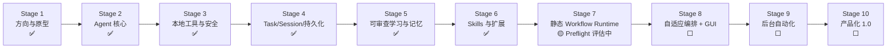
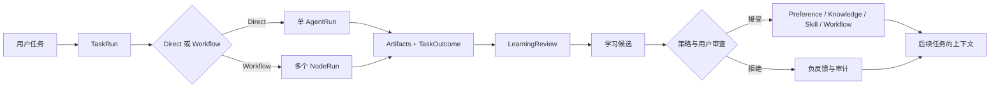

# 14 · Roadmap 路线图

> Morrow 要去哪里：十个阶段的行军路线、当前位置、每步的前置条件。
> 本篇不深入代码，只看方向与状态。权威来源：[docs/ROADMAP.md](../ROADMAP.md) 与
> [docs/roadmap/](../roadmap/README.md) 各阶段文档。

---

## 一、全景：行军到哪了



**当前位置（2026-08）**：Stage 1–6 完成；Stage 7 未正式开始，处于 Preflight
可靠性评估（S7P-01–S7P-09，建立 Direct 基线与 Pi 对照）——先证明单 Agent 足够可靠，
再谈多 Agent。

## 二、逐阶段速览

### ✅ 已完成

| 阶段 | 交付了什么 | 对用户意味着 |
|---|---|---|
| 1 方向与原型 | 终端对话、工作空间识别 | 能在终端里和 Agent 聊项目 |
| 2 Agent 核心 | 稳定 AgentLoop、ToolCycle、预算、取消、错误闭环 | 任务会正常结束，不会失控空转 |
| 3 本地工具与安全 | 读搜、冲突安全编辑、审批后 Host 命令、只读 Git、macOS 原生沙箱 | Agent 能真实改代码、跑测试，且被约束 |
| 4 持久化 | Session/TaskRun/Turn、Artifact、恢复、Checkpoint/Fork、Grant | 关电脑明天接着聊；崩了能对账 |
| 5 可审查学习 | Learning Review、Preference v2、Project Knowledge、Memory Selection | Agent 会「提议」记住什么，你审批 |
| 6 Skills 与扩展 | Skill 生命周期/Draft/脚本、MCP 接入、Provider 控制面 | 能力可插拔，但边界不可突破 |

### ⬜ 未开始

| 阶段 | 目标 | 为什么还没做 |
|---|---|---|
| **7** 静态 Workflow | 用户定义多个 AgentDefinition；WorkflowCompiler 校验图/权限/预算/写冲突；节点经类型化 Artifact 交换结果 | 关键路径：需先用 S7P 证明单 Agent 基线可靠 |
| **8** 自适应编排 + GUI | 系统按任务复杂度选择 Direct/Multi-Agent，生成可编辑 Workflow Draft；GUI 实时观察、暂停、改节点 | 依赖 Stage 7 的静态 Runtime |
| **9** 后台自动化 | ScheduleDefinition、Local Scheduler、可恢复/暂停/审计的后台与周期任务 | 依赖可靠持久化 + Workflow + 审批 |
| **10** 产品化 1.0 | 安装/升级/迁移/诊断/备份收口；CLI 与 GUI 状态一致；桌面入口 | 收口阶段，依赖全部前置 |

### Stage 7 的关键设计预告（来自阶段文档）

```text
用户选择静态 WorkflowDefinition
→ WorkflowCompiler 校验图、输入输出、权限、预算与写入冲突
→ 冻结 WorkflowRevision → 创建 WorkflowRun
→ Scheduler 按依赖启动 NodeRun
→ AgentFactory 由 AgentDefinition 构造 AgentRun（复用单 Agent AgentLoop）
→ 节点通过类型化 Artifact 交换结果
→ 汇总、验证并完成 TaskRun
```

**AgentLoop 不会变成多 Agent 控制器**——它永远是叶子执行器；多 Agent 调度属于
上方的 `WorkflowOrchestrator`（未来的 `SessionOrchestrator` 会收敛为交互分发器）。

## 三、里程碑视角

| 里程碑 | 对应阶段 | 对外可说的能力 |
|---|---|---|
| Code Agent MVP | Stage 3 ✅ | 本地项目安全读改、跑测试、报 Diff |
| Durable Personal Agent | Stage 4 ✅ | 可恢复会话/任务、上下文压缩、产物可查 |
| Reviewable Learning Preview | Stage 5 ✅ | 偏好/知识候选可见、可拒、可撤销 |
| Extensible Agent | Stage 6 ✅ | 受治理的 Skills/MCP/多 Provider |
| Workflow Runtime Preview | Stage 7 | 手写版本化多 Agent Workflow |
| Visual Orchestration Beta | Stage 8 | 自动编排 + GUI 拖拽编辑 |
| Automation Beta | Stage 9 | 持久后台任务、周期执行、通知 |
| Morrow 1.0 | Stage 10 | 完整个人 Agent 产品 |

## 四、产品的「北极星闭环」



目前这条闭环的「Direct 半边」已完整运转；「Workflow 半边」正是 Stage 7+ 要补的。

## 五、不可破坏的约束（选摘）

这些约束在任何阶段都有效，也是「缺的功能」背后的原因：

1. 单一聊天历史写入者（AgentLoop / ConversationLog）。
2. ToolCycle 不可被上下文压缩拆开。
3. 副作用前持久化；持久化失败不执行。
4. 本地能力边界不泄漏到 Provider 协议。
5. **安全边界不可被 Role Prompt / Skill / Memory / Profile / MCP 覆盖。**
6. GUI 不拥有第二套业务逻辑。
7. 学习先提案后晋升；推断默认进候选。
8. 来源与版本可见、可回滚。
9. 多 Agent 通过 Artifact 交换，不复制完整对话。
10. **Deny wins**；多 Agent 非默认；用户拥有数据；离线测试为默认门禁。

## 六、文档分工（去哪看什么）

| 文档 | 回答 |
|---|---|
| `docs/ROADMAP.md` | 长期方向、阶段顺序、状态（本篇的权威来源） |
| `docs/roadmap/stage-*.md` | 每阶段的目标、架构合同、完成门禁 |
| `docs/ARCHITECTURE.md` | **只描述已存在/已决定的**架构 |
| `docs/decisions/` | 关键决策记录（为什么这么做） |
| `docs/acceptance/` | 各阶段验收证据 |
| `.agent/PLAN.md` `TRACKER.md` | 当前活跃计划与进度（实时执行状态） |
| `docs/notes/`（本系列） | 面向用户的整体理解入口 |
