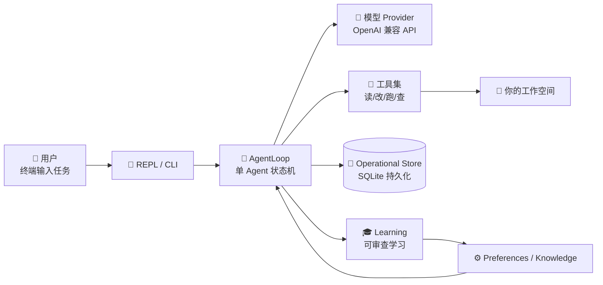
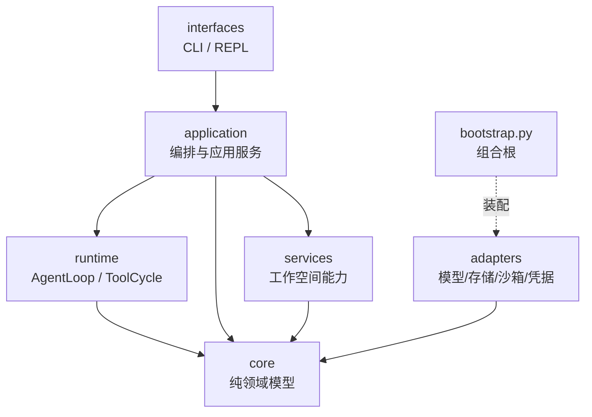

# Morrow 项目笔记 · 总览

> 面向使用者的项目 Wiki 首页。
> 目标：不看代码也能回答「这是什么、怎么运作、有什么、缺什么、各部分怎么连起来」。
> 基线：2026-08，Stage 1–6 已完成，Stage 7 处于 Preflight 可靠性评估（S7P-09）阶段。

---

## 一、一句话认识 Morrow

**Morrow（承序）是一个以工作空间为边界、跑在终端里的本地 Code Agent。**

它像一位住在你项目目录旁边的「结对程序员」：你给它任务，它读代码、改文件、跑命令、
查 Git；但它生活在一个纪律严明的「玻璃房」里——每一次读、写、执行都被权限、审批、
预算和持久化证据约束着，崩溃后能对账恢复，长期偏好必须经你审查才会被记住。



---

## 二、技术栈速览

| 类别 | 选择 | 说明 |
|---|---|---|
| 语言 | Python ≥ 3.12 | 单包 `src/morrow/` |
| 包管理 | uv + hatchling | `uv sync` 一键安装 |
| 数据校验 | Pydantic v2 | 全部领域模型与 schema |
| CLI | Typer + Rich + prompt-toolkit | 命令行 + 交互 REPL |
| 模型接入 | openai SDK（OpenAI 兼容协议） | Adapter Registry 管理多 Provider |
| 持久化 | 标准库 sqlite3（WAL）+ YAML | 无 ORM；运行状态进 SQLite，配置进 YAML |
| 文件锁 | filelock | 状态写入串行化 |
| 凭据 | keyring（macOS Keychain）/ 环境变量 | 永不进 YAML、日志、模型上下文 |
| 沙箱 | macOS 原生（`sandbox-exec` 系） | Linux 在真实 runner 验证前保持 unsupported |
| MCP | 官方 `mcp` SDK（stdio） | Stage 6 扩展协议 |
| 测试 | pytest + pytest-asyncio，Ruff | 默认离线门禁，`live` 标记需显式授权 |

> 刻意的「不」：不联网工具、不写 Git、不自动学习、无 GUI、无后台任务、无多 Agent ——
> 这些都是边界设计，不是疏忽（见 [14-Roadmap路线图](14-Roadmap路线图.md)）。

---

## 三、代码结构地图

```text
src/morrow/
├── interfaces/    🖥️  接口层：CLI 命令、REPL 终端、审批 UI、headless JSONL
├── application/   🧭  应用服务层：编排、任务/回合、上下文组装、学习/偏好/Skill/MCP
├── runtime/       ⚙️  运行时：AgentLoop 状态机、ToolCycle、ConversationLog、Session
├── core/          📐  领域核心：消息模型、事件、权限、策略、错误分类（零外部依赖）
├── services/      🔧  工作空间服务：文件读写/变更、搜索、Git、进程、沙箱
├── adapters/      🔌  适配器：模型 SDK、本地 OS 能力、SQLite/YAML 存储、Keychain
└── resources/     📦  随包资源：runtime-policy.toml（只读默认策略）
```

依赖方向严格单向，**外层可以依赖内层，内层永远不知道外层的存在**：



> 只有 `bootstrap.py` 这个「组合根」知道所有具体实现，像插线板一样把适配器插到端口上。

---

## 四、模块笔记索引

| # | 笔记 | 回答的问题 |
|---|---|---|
| 01 | [产品形态与使用指南](01-产品形态与使用指南.md) | 怎么装、怎么用、有哪些命令和权限模式？ |
| 02 | [整体架构与分层](02-整体架构与分层.md) | 整体分几层？一次请求从头到尾经过什么？ |
| 03 | [core · 领域模型](03-core-领域模型.md) | 消息、事件、权限、策略这些「名词」如何定义？ |
| 04 | [runtime · Agent 运行时](04-runtime-Agent运行时.md) | AgentLoop 状态机怎么转？工具循环怎么闭合？ |
| 05 | [application · 应用服务层](05-application-应用服务层.md) | 编排器、任务/回合、上下文组装各做什么？ |
| 06 | [工具系统与安全模型](06-工具系统与安全模型.md) | 16 个工具、审批、沙箱、Grant 如何构成安全闭环？ |
| 07 | [services · 工作空间服务](07-services-工作空间服务.md) | 文件改动如何做到冲突安全、原子发布？ |
| 08 | [持久化、恢复与备份](08-持久化与恢复.md) | SQLite v22 存什么？崩溃后怎么对账？ |
| 09 | [adapters · 适配器层](09-adapters-适配器层.md) | 模型/存储/沙箱/凭据如何被隔离在端口后面？ |
| 10 | [interfaces · 接口层](10-interfaces-接口层.md) | CLI、REPL、headless 三种入口如何复用同一应用层？ |
| 11 | [学习与偏好记忆](11-学习与偏好记忆.md) | Stage 5 的「可审查学习」流水线怎么走？ |
| 12 | [Skills 与 MCP 扩展](12-Skills与MCP扩展.md) | Stage 6 的 Skill 生命周期与 MCP 接入怎么治理？ |
| 13 | [测试与质量门禁](13-测试与质量门禁.md) | 120+ 测试文件、evals、验收文档构成怎样的门禁？ |
| 14 | [Roadmap 路线图](14-Roadmap路线图.md) | 十个阶段走到哪了？未来还有什么？ |

**推荐阅读路径**：
- 新用户：01 → 02 → 14
- 准备改代码：02 → 对应模块笔记 → [架构基线](../ARCHITECTURE.md)
- 想知道「为什么这么设计」：模块笔记 → `docs/decisions/` 决策记录

---

## 五、功能清单：有什么 / 缺什么

### ✅ 已有（Stage 1–6 + Stage 7 Preflight）

| 能力 | 入口 | 详见 |
|---|---|---|
| 可恢复的持久化对话（Session/TaskRun/Turn） | `morrow --session-id` | [08](08-持久化与恢复.md) |
| 16 个受治理工具（读/搜/改/删/移/跑/Git/配置/偏好/脚本/沙箱推广） | 模型 function calling | [06](06-工具系统与安全模型.md) |
| 四档权限模式 + 逐次审批 + Full Access Grant | `--permission-mode` | [06](06-工具系统与安全模型.md) |
| macOS 原生沙箱快照执行（默认断网） | `auto-sandboxed` | [06](06-工具系统与安全模型.md)、[07](07-services-工作空间服务.md) |
| SHA-256 冲突安全编辑 + 原子发布 + TOCTOU 防护 | `apply_patch` 等 | [07](07-services-工作空间服务.md) |
| 崩溃恢复分类与对账（不自动重放副作用） | `recovery show/resolve` | [08](08-持久化与恢复.md) |
| 确定性 Context Checkpoint 与 Session Fork | 自动 / 应用服务 | [08](08-持久化与恢复.md) |
| 长上下文压缩（compaction）与精确 token 记账 | 自动 | [04](04-runtime-Agent运行时.md) |
| Steering / Follow-up 队列（运行中继续输入） | REPL Enter / Alt+Enter | [04](04-runtime-Agent运行时.md) |
| 可审查学习：Review → Inbox → Writer → 注入 | `learning` / `preferences` CLI | [11](11-学习与偏好记忆.md) |
| Project Knowledge + Memory Selection（按 AgentRun 冻结） | `memory selection` | [11](11-学习与偏好记忆.md) |
| Skill 全生命周期（Catalog/Draft/Usage/受限脚本） | `skills` CLI | [12](12-Skills与MCP扩展.md) |
| MCP desired-state / Catalog / run 级运行时 / 结果归一化 | `mcp` CLI | [12](12-Skills与MCP扩展.md) |
| Provider/Model 控制面（preset、凭据、测试） | `provider` / `model` CLI | [09](09-adapters-适配器层.md) |
| Doctor 只读诊断 + Backup v1/v2 + 字节保留式 cleanup | `state doctor/backup/cleanup` | [08](08-持久化与恢复.md) |
| Headless `morrow run`（版本化 JSONL） | CLI | [10](10-interfaces-接口层.md) |

### ⏳ 未做（按路线，刻意未做）

| 缺失能力 | 所属阶段 | 说明 |
|---|---|---|
| 多 Agent / Workflow Runtime | Stage 7（未开始，Preflight 评估中） | 当前只有单 Agent；Planner/Coder/Reviewer 协作待 WorkflowCompiler |
| 自适应编排 + GUI 控制面 | Stage 8 | 无图形界面，无 Workflow Draft 自动生成 |
| 后台任务 / 周期调度 | Stage 9 | 无 daemon、无定时任务 |
| 网络访问工具 | 长期边界 | 「不联网」是安全约束，未来若开也需审批与策略 |
| Git 写入（commit/push） | 长期边界 | Git 只读；写操作留给审批后的 `run_command` |
| Linux 原生沙箱支持 | Stage 3 遗留 | bubblewrap 需真实 runner 验收后才解锁 |
| 工作空间/代码 rewind（回滚） | 明确排除 | Stage 4 已声明不属于范围 |
| 桌面安装包 / 自动更新 | Stage 10 | 产品化收尾 |

---

## 六、三条贯穿全项目的「设计公理」

1. **单一写入者**：聊天历史只有 `AgentLoop` 能写；配置只有 `PreferenceWriter`/`ConfigPatchService` 能写；
   凭据只有 `CredentialStore` 能碰。每类状态只有一个权威。
2. **副作用前持久化**：任何改变现实世界的动作（改文件、跑命令）都先落库意图与审批证据，
   持久化失败则不执行。崩溃后按证据分类对账，**绝不伪造成功**。
3. **Deny wins & Fail closed**：权限取交集，任何一层拒绝即不可用；无法证明安全的操作
   （混合换行、符号链接、沙箱能力不明）一律拒绝，而不是降级执行。

这三条公理在每一篇模块笔记里都会反复出现——它们就是 Morrow 的「性格」。
