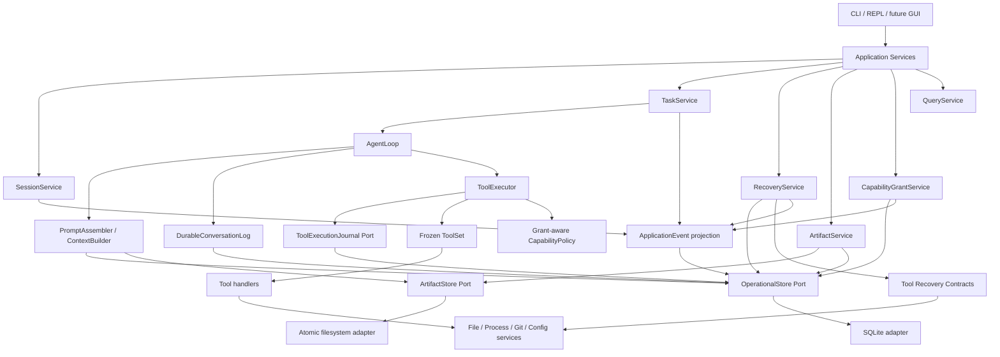
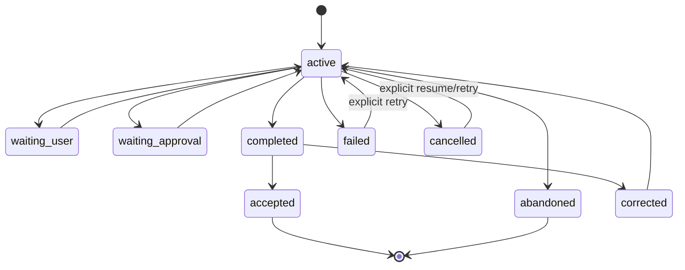
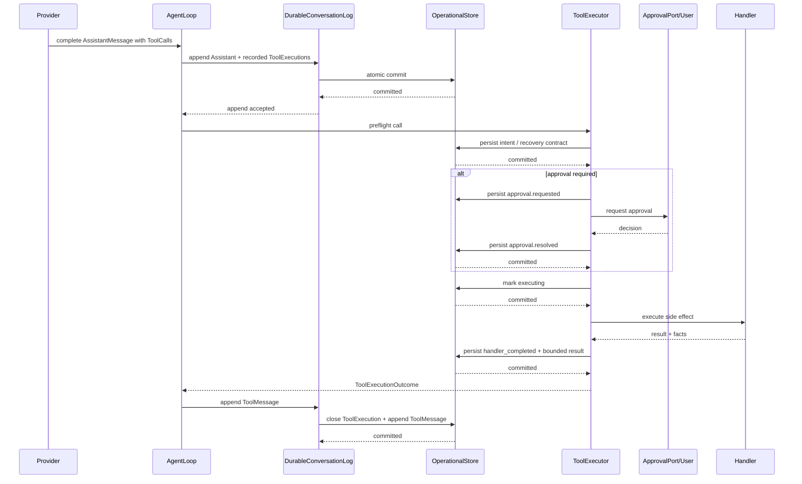

# Morrow Stage 4 完整实施方案 V2（成熟项目参考增强版）

> **状态：已被当前 [`.agent/PLAN.md`](../../.agent/PLAN.md) 与 Stage 4 ADR 取代。本文仅是研究/决策输入，禁止作为实施规格。**
> **已否决或延期：Controlled Full Access Auto/raw auto、WorkspaceCheckpoint/rewind、EventOutbox/ack/worker、RunClaim/lease、approval nonce、FTS5 默认依赖、自动业务历史修复，以及本文旧 Subplan 35–48 编号。**
> 文档性质：历史研究提案；不是活动 Stage 4 主计划
> 阶段主题：Task、Session、Artifact 与持久化  
> 目标状态：从“进程内 Code Agent”升级为“可恢复、可审计、能安全对账副作用的长期 Agent Runtime”  
> 上位依据：`docs/ROADMAP.md`、`docs/roadmap/stage-4-task-session-and-persistence.md`、`docs/ARCHITECTURE.md`  
> 实施基线：激活计划时以 `git rev-parse HEAD` 回填，不沿用旧 Stage 3 基线哈希  
> 范围状态：Stage 4 已由用户正式开启；长期学习、Skill、Multi-Agent、后台自动化和完整 GUI 仍不在本阶段  
> 修订版本：V2，2026-08-19；已对照 Pi、Hermes Agent、OpenAI Codex 与 Claude Code  
> 配套评审：`docs/research/morrow-stage4-mature-agent-reference-review.md`
> 采用原则：Morrow 原生领域不变量优先；协议与算法语义可借鉴，直接代码复用必须固定 commit、完成许可证审查并登记来源

---

## 1. 结论与总体路线

Stage 4 不应被实现成“给聊天记录加一个 SQLite 数据库”，而应建设一层 **Durable Execution Substrate**：

```text
可恢复 Session / TaskRun
+ 合法且可重建的 ConversationLog
+ 副作用前执行日志
+ 工具级恢复与对账合同
+ 可追溯 Artifact / Context Checkpoint
+ 结构化 TaskOutcome
+ 用户显式 CapabilityGrant
+ 统一 Command / Query / Event 边界
```

核心路线为：

```text
先稳定运行对象和事务边界
→ 再持久化无工具 Session
→ 再接入 ToolCycle 与副作用日志
→ 再实现恢复对账
→ 再补 TaskRun / TaskOutcome
→ 再做 Artifact、压缩与 Fork
→ 再稳定 Command / Query / Event
→ 最后激活 Full Access Manual 与受控 Auto
```

不能反向实施。尤其不能在 ToolCall 持久化、恢复分类和授权审计尚未稳定时提前开放 Full Access。

V2 在原方案上增加九个硬化点：

```text
Command/UserMessage 幂等
+ mutation optimistic concurrency
+ one-time approval intent
+ immutable full PermissionSnapshot
+ operational truth / prompt projection separation
+ self-contained ContextCheckpoint
+ managed WorkspaceCheckpoint / rewind
+ shutdown drain / process ownership
+ state doctor / repair / bounded storage
```

---

## 2. 阶段目标

完成后，Morrow 必须能够可靠回答：

1. 当前工作空间有哪些 Session？
2. 当前 Session 正在进行哪个 TaskRun？
3. 一个 TaskRun 经历了哪些 Turn、AgentRun、ToolCycle 和审批？
4. 哪些副作用确定完成、确定未执行、可安全重试、需要对账或结果未知？
5. 崩溃后为何继续、为何阻止重试、需要用户决定什么？
6. 当前上下文由哪些原始记录、摘要和 Artifact 组成？
7. 一个 TaskOutcome 的结论由哪些工具事实与验收证据支持？
8. 某次 AgentRun 实际冻结了哪些权限、授权来自谁、何时失效或被撤销？
9. 任意 UI、CLI 或未来 GUI 是否都通过同一应用服务修改状态？

阶段完成后的产品闭环：

```text
进入 Workspace
→ 创建或恢复 Session
→ 创建或恢复 TaskRun
→ 接受 User Turn
→ 创建 AgentRun 并冻结运行配置、工具集与权限
→ 持久化 UserMessage
→ 调用 Provider
→ 持久化合法 Assistant / ToolCall
→ 持久化审批和执行意图
→ 执行工具
→ 持久化结果与副作用事实
→ 闭合 ToolCycle
→ 完成、等待、失败、取消或中断
→ 生成版本化 TaskOutcome
→ 退出或崩溃
→ 重启校验、恢复、对账或请求用户决策
```

---

## 3. 明确边界

### 3.1 Stage 4 包含

- Session 创建、恢复、归档、逻辑删除和 Fork。
- TaskRun 多 Turn 生命周期。
- Turn、AgentRun、ToolExecution、Approval 的持久记录。
- Durable ConversationLog。
- 副作用前执行意图持久化。
- 工具级恢复策略和 RecoveryReport。
- SQLite Operational Store、迁移、备份和损坏保护。
- 文件系统 Artifact Store。
- 上下文压缩、摘要、Checkpoint 和来源追溯。
- 结构化、版本化 TaskOutcome。
- Command、Query、Event 合同。
- CapabilityGrant、权限快照、撤销和审计。
- Full Access Manual。
- 仅针对结构化、可判定操作的受控 Full Access Auto。
- CLI / REPL 的最小管理面。
- Stage 3 真实任务的崩溃恢复验收。

### 3.2 Stage 4 不包含

- 自动把 TaskOutcome 写成长期 Preference 或 Knowledge。
- 自动创建、安装或更新 Skill。
- 向量数据库和默认 Embedding 依赖。
- Multi-Agent Workflow、Planner/Explorer/Reviewer 编排。
- 后台 Worker、定时任务、跨重启自动执行。
- 多设备同步、团队协作和共享。
- 完整桌面 GUI。
- 模型、Memory、Skill、项目文件或 Provider 响应创建权限授权。
- 可保存为全局默认的 Full Access。
- 任意宿主 Shell 永不审批的 raw auto 模式。
- Provider reasoning、SDK 对象、原始环境变量、凭据或未清洗 traceback 的持久化。

---

## 4. 当前基线与必须修正的结构差距

当前架构已有很好的 Stage 4 接入点：

- `AgentLoop` 是唯一聊天历史写入者。
- Session-owned `ConversationLog` 已维护严格消息顺序和完整 ToolCycle。
- `ContextBuilder` 是不可变 ConversationSnapshot 的纯投影。
- `ToolRegistry.snapshot()` 已冻结一次运行使用的工具集。
- `ToolExecutor` 已统一参数校验、能力判断、审批和 handler 执行。
- 文件修改已有 before/after revision、实际 Diff 和 ChangeToolFact。
- Host Command 已有分类、脱敏、范围限制和 CommandToolFact。
- `WorkspaceWriterLock` 已形成工作空间单写边界。
- Profile、Preferences、Provider 配置和凭据已有各自权威来源。

Stage 4 必须修正的差距：

1. `Session` 和 `ConversationLog` 仍是进程内对象，启动时会新建 Session。
2. 当前 `turn_id` 同时承担部分 run identity，需要拆分 `task_run_id`、`turn_id` 和 `agent_run_id`。
3. Conversation records 尚未携带持久化的 Session/Task/Turn/Run 归属。
4. ToolCall、审批、handler 开始、handler 完成和 ToolResult 之间没有 durable journal。
5. `ToolRunContext`、ToolFact、ChangeSet 目前主要是进程内事实。
6. 文件工具可以依靠 revision/hash 对账，但尚无统一 Recovery Contract。
7. Host Shell 一旦在 handler 后、ToolResult 前崩溃，无法判断外部副作用，必须显式表示 `outcome_unknown`。
8. `ContextBuilder` 的旧输出裁剪没有持久 Summary、Artifact 或 Checkpoint。
9. 当前公开事件主要以 Turn 为中心，不足以表达 Session、Task、Recovery、Artifact 和 Grant。
10. 当前 `CapabilityPolicy` 对 Full Access 直接 fail closed，尚无用户授权记录和权限快照。
11. `/new` 的“reset 当前内存对象”语义不适用于可恢复 Session；Stage 4 后应创建新 Session，不销毁旧历史。
12. `ChangeSetService` 只保留当前运行内的变更投影，无法支撑 TaskOutcome 和重启后的证据查询。

---


## 4A. 成熟项目参考与复用策略

Stage 4 的关键设计应经过四类成熟实现的交叉验证，但不以任何一个项目的内部架构作为 Morrow 的新权威。

| 项目 | 最值得借鉴 | Morrow 采用方式 | 明确不照搬 |
|---|---|---|---|
| Pi | Entry tree、CompactionEntry、self-contained retained tail、分支公共祖先、运行记录与模型上下文分离 | 语义移植为 `ContextCheckpoint`、Fork lineage、Prompt projection | 不采用单 JSONL 运行状态权威；不把所有对象压成 Entry |
| Hermes Agent | SQLite WAL、迁移、写竞争、FTS、Session lineage | 复用存储纪律和测试模式 | 不导入其 SessionDB；不采用 message-centric 全能表 |
| Codex | Thread/Turn/Item 协议、客户端稳定 ID、`expectedTurnId`、分页、granted subset | 设计 `CommandReceipt`、`client_message_id`、optimistic concurrency、ApplicationEvent | 不采用 rollout JSONL + index DB 双权威；不引入完整 Queue |
| Claude Code | Checkpoint/Rewind UX、Runtime 权限强制、Hook 生命周期、高风险模式隔离 | 行为参考；实现 Managed Checkpoint、分离的会话/代码恢复 | 不复制实现；不承诺恢复 Shell/外部/链接文件变化 |

采用级别：

```text
A. 直接代码复用
   仅限小型纯函数/helper；固定上游 commit；保留许可证与来源；有独立测试。

B. 语义移植
   理解算法与合同后，以 Morrow 领域对象重新实现。Stage 4 默认采用这一层。

C. 行为参考
   只实现公开行为；Claude Code 属于此类。

D. 故障回归化
   将上游真实 bug 转成 Morrow fault-injection / acceptance tests。
```

必须新增来源治理：

```text
THIRD_PARTY_NOTICES.md
docs/references/stage4-reference-lock.yaml
docs/references/stage4-adoption-log.md
```

`stage4-reference-lock.yaml` 记录仓库、固定 commit、许可证、参考文件、采用级别、Morrow 目标文件和修改说明。没有完成记录前，不允许复制上游代码。

最终组合：

```text
SQLite / migration discipline       ← Hermes
lineage / compaction algorithms      ← Pi
Command / Event / concurrency        ← Codex
checkpoint / rewind interaction      ← Claude Code
side-effect recovery                 ← Morrow ToolExecution Journal
permission resume semantics          ← Morrow run-bound snapshot
                                       + Codex granted subset
                                       + Claude runtime enforcement
```

成熟项目的公开故障不是旁注，而是 Stage 4 的验收输入：持久化错误吞掉、重复 User Turn、旧审批重放、shutdown 尾记录丢失、Session 膨胀、Resume 权限/cwd 漂移、双权威分叉等都必须有对应自动化测试。

---

## 5. 不可破坏的设计原则

### 5.1 保留单一历史写入路径

- 普通对话仍只经过 `AgentLoop.run_task()`。
- AgentLoop 仍是每个叶子 AgentRun 的唯一聊天历史写入者。
- Tool、CLI、Workflow、Recovery UI 和未来 GUI 都不能直接拼接 Provider 消息。
- Recovery 需要补写 ToolResult 时，必须通过 ConversationLog 的恢复专用合法追加接口，而不是直接改表。

### 5.2 SQLite 是运行状态权威，但不是所有状态权威

```text
现有 YAML / CredentialStore
- Global Preferences
- Workspace Preferences
- Workspace Profile
- Provider 非敏感配置
- Credential 引用和真实 Credential

SQLite Operational Store
- Session / TaskRun / Turn / AgentRun
- Conversation records / ToolExecution / Approval
- TaskOutcome / RecoveryReport
- CapabilityGrant / ApplicationEvent
- Artifact metadata / Context checkpoint

Filesystem Artifact Store
- 大型命令输出
- Patch / Diff / Test report
- Task / Context summary
- 必要的文件快照
- 备份包
```

不得为了“统一存储”把现有 YAML、CredentialStore 或工作空间身份复制成第二权威。

### 5.3 不采用事件溯源

- 当前状态表是权威。
- Event 是同一事务产生的有序审计与 UI 投影。
- 系统不通过回放所有事件重建业务状态。
- 不建设通用 Event Bus、CQRS 框架或分布式消息系统。

### 5.4 不引入 ORM

第一版使用 Python 标准库 `sqlite3`：

- SQL 和迁移显式可审查。
- 事务边界与崩溃语义清晰。
- 不增加 SQLAlchemy、Alembic 或异步数据库依赖。
- 不建立通用 CRUD Repository 层。
- Store Port 直接暴露围绕领域不变量设计的事务操作。

### 5.5 不在数据库事务中等待外部操作

绝对禁止：

- 在事务中 `await` Provider。
- 在事务中等待用户审批。
- 在事务中运行 Tool handler。
- 在事务中执行 Shell。
- 在事务中写大型 Artifact。

事务只完成小型、确定性的状态提交。

### 5.6 副作用执行必须 fail closed

只要以下任一步骤失败，有副作用 handler 就不得启动：

- ToolCall / execution intent 持久化失败。
- 审批记录持久化失败。
- `executing` 状态持久化失败。
- CapabilityGrant 有效性无法证明。
- 工作空间或配置快照不一致且无法安全恢复。

### 5.7 恢复 Session，不盲目恢复 AgentRun

Session 和 TaskRun 可以跨进程继续；崩溃时的 AgentRun 是一次不可变执行 episode。

推荐语义：

- 恢复服务先终结或标记旧 AgentRun 为 `interrupted`。
- 对旧 Run 的未闭合 ToolExecution 完成对账。
- 后续模型调用创建新的 AgentRun，并通过 `resume_of_run_id` 关联旧 Run。
- 新 AgentRun 重新冻结当前配置、工具集与有效权限。
- Full Access 不随 Session/Task 自动继承到新 Run。

这样可避免升级、配置变化、工具实现变化和过期授权被静默带入旧 Run。

---


### 5.8 外部写命令必须幂等

- 每个 Application Command 携带 `command_id`。
- 每个 User Turn 携带 `client_message_id`。
- 相同 ID 与相同 request hash 返回已有结果；相同 ID 与不同 hash 返回冲突。
- Provider retry、UI retry 和网络重放不得产生第二条 UserMessage 或第二次 Tool side effect。

### 5.9 状态变更必须有乐观并发条件

Approval、Recovery、Steer、Revoke、Checkpoint restore 等命令必须携带预期 revision 或预期活跃 Run ID。状态已经变化时拒绝旧命令，不能把输入或授权落到错误的 Turn/ToolExecution。

### 5.10 Operational truth 与 Prompt projection 分离

- 原始 durable records 是审计与恢复权威。
- ContextCheckpoint、Summary 和 Provider input 是可重建投影。
- UI-only、audit-only、diagnostic records 默认不进入模型上下文。
- Provider replay payload 使用版本化 canonical codec；不保存 SDK 私有对象。

### 5.11 Approval 是一次性 intent capability

高风险 Approval 必须绑定：

```text
tool_execution_id
+ canonical intent hash
+ input schema digest
+ permission snapshot hash
+ granted capability subset
+ nonce
+ expiry
```

执行前原子消费 Approval，并推进 ToolExecution 到 `executing`。普通文本确认不能跨重启再次授权。

### 5.12 PermissionSnapshot 全量替换

- AgentRun 冻结完整 Snapshot，而不是若干可漂移字段。
- 模式切换创建完整新 Snapshot 或新 AgentRun，不做 partial merge。
- Resume 重新计算 Workspace、cwd、Sandbox、ToolSet、Grant 和 hard deny。
- Full Access/Auto/Bypass 类高风险状态不静默继承。

### 5.13 所有 durable payload 有尺寸上限

建议首版默认：inline text 32 KiB、单 JSON payload 128 KiB、durable event 32 KiB、单 Artifact 64 MiB、Query 默认 100/最大 500 条。超限转 Artifact 或显式截断并记录原始尺寸；绝不静默丢弃或无限加载。

### 5.14 Shutdown 是显式状态机

```text
停止接受新命令
→ 中断可中断工作
→ finalize 或标记 interrupted
→ flush durable state
→ drain event outbox
→ 关闭连接
→ 释放 writer lock
```

关闭开始后，stale writer 必须得到明确错误；不能成功返回却丢失尾部记录。

## 6. 目标架构



依赖方向：

```text
Core domain / ports
    ↑
Runtime + Application Services
    ↑
Adapters / CLI / Terminal
```

SQLite、Typer、Prompt Toolkit、OS 文件系统和 Provider SDK 不得进入 Core。

---


### 6.1 V2 新增横切组件

```text
IdempotencyGate
- command_id / client_message_id
- request hash
- durable CommandReceipt

OptimisticConcurrencyGuard
- expected revision / expected AgentRun

RunOwnershipGuard
- WorkspaceWriterLock
- process_instance_id
- transactional AgentRun claim

EventOutbox
- 与业务状态同事务写入
- UI/observer 后续投递

StateDoctor
- integrity / grammar / Artifact / permission / recovery 检查

CheckpointService
- ContextCheckpoint
- managed WorkspaceCheckpoint
- fork/restore/summarize
```

Stage 4 不引入分布式租约、外部队列或后台 Worker。Run claim 只防止本机两个入口同时执行同一 AgentRun；OS writer lock 仍是强制边界。

## 7. 核心领域对象

### 7.1 WorkspaceScope

每个运行对象必须显式携带 `workspace_id`。

所有 Store 查询和 Command 都要求：

```text
WorkspaceScope(workspace_id)
+ entity_id
```

不能提供只按 `session_id`、`task_run_id` 或 `artifact_id` 的无作用域生产查询。

数据库中子表使用 `(workspace_id, parent_id)` 复合外键，防止跨工作空间错误关联。

---

### 7.2 Session

```text
SessionRecord
- session_id
- workspace_id
- status: active | archived | deleted
- title
- labels
- parent_session_id
- parent_turn_id
- base_checkpoint_id
- current_task_run_id
- current_config_ref
- created_at
- updated_at
- archived_at
- deleted_at
- row_version
- next_conversation_sequence
```

规则：

- 一个 Session 顺序承载多个 TaskRun。
- 默认只有一个前台 TaskRun。
- `/new` 创建新 Session，不 reset 或覆盖旧 Session。
- `deleted` 第一版为 tombstone；物理清理延后。
- Archive 不影响证据和 Artifact 引用。
- Workspace A 的 Session 永远不能在 Workspace B 下注入上下文。

---

### 7.3 TaskRun

```text
TaskRunRecord
- task_run_id
- workspace_id
- session_id
- parent_task_run_id
- goal
- status
- created_at
- updated_at
- completed_at
- accepted_at
- cancelled_at
- abandoned_at
- row_version
```

状态机：



第一版确定语义：

- 首个普通输入在没有前台 TaskRun 时创建 TaskRun。
- AgentRun 进行时为 `active`。
- 等待工具审批时临时为 `waiting_approval`。
- 普通最终 Assistant 结果使 TaskRun 进入 `completed`。
- `/accept` 进入 `accepted`。
- 用户在 `completed` 后继续补充或指出问题，记录纠正信号，执行 `completed → corrected → active`。
- `/cancel` 只停止未来工作，不伪装回滚已发生副作用。
- `/abandon` 表示用户放弃，不作为正向学习证据。
- `waiting_user` 不通过自然语言猜测；只有明确的结构化运行信号或用户命令才能进入。

---

### 7.4 Turn

```text
TurnRecord
- turn_id
- workspace_id
- session_id
- task_run_id
- ordinal
- status: active | completed | failed | cancelled | interrupted
- started_at
- ended_at
- terminal_code
- error_code
- row_version
```

规则：

- Turn 表示一次被接受的用户输入及其闭合结果。
- UserMessage 和 Turn 创建在一个事务中完成。
- 一个 Turn 可包含多次 Provider 调用和多个 ToolCycle。
- 当前 Stage 4 通常一个 Turn 对应一个 AgentRun；领域模型不写死该限制。

---

### 7.5 AgentRun

```text
AgentRunRecord
- agent_run_id
- workspace_id
- session_id
- task_run_id
- turn_id
- resume_of_run_id
- runtime_instance_id
- status: running | completed | failed | cancelled | interrupted
- provider_ref
- model_ref
- run_policy_snapshot
- toolset_snapshot
- config_snapshot
- permission_snapshot
- capability_grant_id
- input_sequence_start
- output_sequence_end
- model_calls
- tool_calls
- token_usage
- stop_reason
- error_code
- started_at
- ended_at
```

必须拆分当前混用的 ID：

```text
session_id ≠ task_run_id ≠ turn_id ≠ agent_run_id ≠ tool_execution_id
```

`ToolRunContext.run_id` 在 Stage 4 中应明确改为 `agent_run_id`，并补充 Task/Turn 归属。

运行快照只保存：

- Provider/Model 引用。
- RunPolicy 的有界、版本化 JSON。
- Tool 名称、schema hash、实现/策略版本。
- 已解析的 Profile/Preferences/config hash 或安全快照。
- PermissionSnapshot 和 CapabilityGrant 引用。

不保存：

- Credential。
- 原始环境变量。
- Provider reasoning。
- SDK response 对象。
- 未清洗异常对象。

---

### 7.6 ConversationRecord

```text
ConversationRecord
- record_id
- workspace_id
- session_id
- task_run_id
- turn_id
- agent_run_id
- sequence
- kind: user | assistant | tool | turn_terminal
- payload_version
- payload_json
- source_record_id
- created_at
```

不变量：

- `(workspace_id, session_id, sequence)` 唯一。
- sequence 是消息顺序权威，时间戳不是。
- Assistant ToolCall 和有序 ToolMessage 构成不可拆 ToolCycle。
- `turn_terminal` 不进入 Provider wire，但参与合法性和恢复校验。
- Provider partial text 不属于 authoritative ConversationRecord。

---

### 7.7 ToolExecution

```text
ToolExecutionRecord
- tool_execution_id
- workspace_id
- session_id
- task_run_id
- turn_id
- agent_run_id
- assistant_record_id
- call_id
- ordinal
- tool_name
- effect
- status
- recovery_policy
- durable_payload_policy
- arguments_hash
- durable_arguments
- intent_summary
- operation_intent
- idempotency_key
- before_state
- expected_after_state
- approval_id
- handler_result
- result_envelope
- facts
- error_code
- recorded_at
- preflighted_at
- executing_at
- handler_completed_at
- closed_at
```

状态建议：

```text
recorded
→ preflighted
→ awaiting_approval
→ approved
→ executing
→ handler_completed
→ closed
```

终止分支：

```text
rejected
failed
cancelled
outcome_unknown
reconciled
```

`closed` 表示对应 ToolMessage 已经进入 authoritative ConversationLog，不只是 handler 返回。

---

### 7.8 Approval

```text
ApprovalRecord
- approval_id
- tool_execution_id
- workspace_id
- status: pending | approved | rejected | unavailable | cancelled
- requested_by
- decided_by
- reason_codes
- preview
- permission_snapshot_ref
- capability_grant_id
- requested_at
- decided_at
```

规则：

- 审批请求和结果都持久化。
- 进程重启后，`pending` 审批不会自动视为批准。
- 用户决策必须在 handler 前提交成功。
- 审批 Preview 保持有界、脱敏。
- 原始 Shell 命令、Credential 和完整敏感内容不进入 Event 或普通日志。

---

### 7.9 Artifact

```text
ArtifactRecord
- artifact_id
- workspace_id
- task_run_id
- producer_run_id
- kind
- content_location
- inline_excerpt
- content_hash
- mime_type
- encoding
- size
- sensitivity
- retention_policy
- state: available | missing | corrupt | released | deleted
- metadata
- created_at
- pinned_at
- released_at
```

首批类型：

```text
command_output
patch
diff
test_report
task_summary
context_summary
diagnostic_report
file_snapshot
recovery_report
```

Artifact 内容写入顺序：

```text
写临时文件
→ flush + fsync
→ 原子 rename
→ fsync 父目录
→ 计算/确认 hash
→ 提交 Artifact metadata
→ 在业务事务中增加引用
```

崩溃后：

- 文件存在、metadata 不存在：孤儿文件，可扫描清理。
- metadata 存在、文件缺失/hash 不符：标记 missing/corrupt，禁止静默重建。
- 仍被 TaskOutcome、Checkpoint、Fork、用户 Pin 引用的 Artifact 不得自动清理。

---

### 7.10 ContextCheckpoint

```text
ContextCheckpoint
- checkpoint_id
- workspace_id
- session_id
- task_run_id
- through_sequence
- covered_start_sequence
- covered_end_sequence
- summary_artifact_id
- method: deterministic | model
- model_ref
- prompt_version
- source_hash
- regenerable
- version
- created_at
```

摘要不是项目事实源，只是可重新生成的上下文投影。

---

### 7.11 TaskOutcome

使用不可变、版本化记录：

```text
TaskOutcomeRecord
- outcome_id
- workspace_id
- task_run_id
- version
- supersedes_outcome_id
- status
- payload
- created_at
```

Payload：

```text
TaskOutcome
- schema_version
- task_run_id
- status
- user_goal
- result_summary
- changed_paths
- validation_performed
- validation_results
- unresolved_items
- side_effects
- artifacts
- evidence_refs
- completion_basis
- user_feedback
- generated_by
```

第一版优先使用确定性生成：

- `changed_paths` 来自持久化 ChangeToolFact。
- `validation_results` 来自受信 ToolFact / TestReport。
- `side_effects` 来自 ToolExecution。
- `artifacts` 来自 ArtifactRef。
- `result_summary` 来自最终 Assistant 的有界文本或显式 Task summary。
- `completion_basis` 由运行终止、验收结果和用户操作决定。

模型辅助摘要只能作为可追溯字段，不能覆盖工具事实。

---

### 7.12 CapabilityGrant 与 PermissionSnapshot

```text
CapabilityGrant
- grant_id
- workspace_id
- scope: full_access
- approval_mode: manual | auto
- subject_task_run_id
- subject_agent_run_id
- granted_by: user
- reason_summary
- policy_version
- created_at
- expires_at
- revoked_at
- revocation_reason
```

```text
PermissionSnapshot
- access_scope
- approval_mode
- process_isolation
- grant_id
- grant_digest
- effective_at
- policy_version
- hard_denies
```

有效权限：

```text
frozen PermissionSnapshot
∩ 当前 Grant 仍有效且未撤销
∩ Runtime hard-deny policy
```

冻结意味着运行中不能静默提升；撤销属于降权，必须立即阻止新的副作用。

---


### 7.13 CommandReceipt

```text
CommandReceipt
- workspace_id
- command_id
- command_type
- request_hash
- status
- result_json / result_artifact_id
- error_code
- created_at / completed_at
```

同一个 `command_id` 只能对应一个 request hash。它是外部重试幂等的权威，不依赖调用方记忆。

### 7.14 RunClaim

```text
RunClaim
- agent_run_id
- process_instance_id
- executor_instance_id
- claimed_at
- released_at
- release_reason
```

RunClaim 与 WorkspaceWriterLock 配合，提供“谁曾执行这个 Run”的 durable 诊断。首版不实现自动续租/分布式 heartbeat。

### 7.15 WorkspaceCheckpoint

```text
WorkspaceCheckpoint
- checkpoint_id
- session_id / task_run_id
- before_turn_id
- workspace_identity_hash
- git_head
- dirty_fingerprint
- created_at
```

创建 Checkpoint 时不扫描或复制整个 Workspace。受管 File Tool 第一次准备修改某路径时，在副作用前惰性创建 `workspace_checkpoint_file`，保存 before revision/hash 与 before-image 或 reversible-patch Artifact；同一路径在该 Checkpoint 内只捕获一次。禁止持久化的敏感路径标记为 `not_checkpointable`。Shell、外部并发变化和链接文件不进入可保证恢复范围。

### 7.16 ApplicationEventOutbox

ApplicationEvent 与业务变更同事务写入，Outbox 只保存投递状态。Event 不是状态重建权威，也不持久化 token delta。

## 8. Operational Store 设计

### 8.1 目录布局

推荐继续放在标准状态根目录，不写入用户项目：

```text
~/.morrow/
├── operational/
│   ├── morrow.sqlite3
│   ├── morrow.sqlite3-wal
│   ├── morrow.sqlite3-shm
│   └── backups/
├── artifacts/
│   └── <workspace-id>/
│       └── <artifact-prefix>/
│           └── <artifact-id>/
│               └── content
├── global/
├── workspaces/
└── credentials/ 或 OS Keychain 引用
```

`content_location` 在数据库中保存相对路径，不保存任意绝对路径。

### 8.2 单库与工作空间隔离

第一版建议使用一个 state-root 级 SQLite 数据库：

优点：

- 只维护一套 schema/migration。
- 未来 GUI 可统一查询。
- Session、Artifact、Grant 和 Event 可统一索引。
- 备份入口明确。

隔离措施：

- 所有运行表都带 `workspace_id`。
- 子对象通过复合外键绑定同一 workspace。
- Store 方法强制传入 WorkspaceScope。
- CLI 先获取 WorkspaceWriterLock，再执行工作空间写操作。
- 跨工作空间 Query 必须使用独立的显式管理接口，不在普通 Session API 中开放。

### 8.3 SQLite 连接策略

生产连接至少设置：

```sql
PRAGMA foreign_keys = ON;
PRAGMA journal_mode = WAL;
PRAGMA synchronous = FULL;
PRAGMA busy_timeout = <bounded>;
PRAGMA trusted_schema = OFF;
```

同时：

- 设置固定 `application_id`，防止误开其他 SQLite 文件。
- 使用显式 schema version 和 migration checksum。
- 写事务使用短生命周期 `BEGIN IMMEDIATE`。
- 不跨 `await` 持有事务。
- 不依赖 timestamp 排序。
- 文本和 JSON payload 有严格大小上限。
- 数据库目录和文件权限限制为当前用户。
- SQLite 锁超时后返回稳定错误，不无限等待。
- WAL 和同步策略必须由真实 kill/crash 测试验证，而不是只靠单元测试推断。

### 8.4 Port 设计

不建议暴露通用 Repository CRUD。建议使用围绕不变量的事务方法：

```python
class OperationalStore(Protocol):
    def create_session(...) -> SessionRecord: ...
    def load_session_snapshot(...) -> DurableSessionSnapshot: ...
    def begin_turn(...) -> TurnStartResult: ...
    def append_assistant_and_calls(...) -> ConversationAppendResult: ...
    def record_tool_preflight(...) -> ToolExecutionRecord: ...
    def record_approval_request(...) -> ApprovalRecord: ...
    def resolve_approval(...) -> ApprovalRecord: ...
    def mark_tool_executing(...) -> ToolExecutionRecord: ...
    def record_handler_result(...) -> ToolExecutionRecord: ...
    def close_tool_result(...) -> ConversationAppendResult: ...
    def finish_turn_and_run(...) -> TurnFinishResult: ...
    def transition_task(...) -> TaskRunRecord: ...
    def append_task_outcome(...) -> TaskOutcomeRecord: ...
    def create_artifact_metadata(...) -> ArtifactRecord: ...
    def create_recovery_report(...) -> RecoveryReport: ...
    def create_capability_grant(...) -> CapabilityGrant: ...
    def revoke_capability_grant(...) -> CapabilityGrant: ...
```

读侧单独定义：

```python
class OperationalQueryPort(Protocol):
    def list_sessions(...): ...
    def get_session(...): ...
    def list_tasks(...): ...
    def get_task(...): ...
    def get_run(...): ...
    def list_artifacts(...): ...
    def list_events(...): ...
    def get_recovery_report(...): ...
    def get_capability_grant(...): ...
```

这样既避免 God Repository，又防止 Application Service 自由拼装半成品事务。

---


### 8.5 写竞争、连接所有权与关闭

采用 Hermes 已验证的 SQLite 纪律，但保持 Morrow 单写架构：

- 连接只能由创建它的 Store/Context Manager 关闭。
- 需要写锁的短事务使用 `BEGIN IMMEDIATE`。
- busy/locked 使用短、有限、带 jitter 的应用层重试；次数耗尽后返回结构化错误。
- retry 不包围 Provider、Tool handler 或大型 Artifact 写入。
- 定期 PASSIVE WAL checkpoint 可作为维护动作，但不能成为每次写入的同步瓶颈。
- shutdown 先阻止新 command，再等待/终止已注册 writer，最后关闭 DB。

### 8.6 权威与物理文件

Morrow 不同时维护“完整 transcript JSONL 权威 + SQLite 索引权威”。

```text
SQLite rows          = operational truth
Artifact blobs       = 由 SQLite metadata/ref 引用的字节
export JSONL/JSON    = 可重建导出，不是运行权威
```

这样无需处理两套权威的 reindex 分叉。Blob 写入完成但 metadata 事务失败时形成可扫描 orphan；metadata 指向不存在 blob 则是明确损坏。

### 8.7 文件权限与 Backup

- state 根目录采用当前 OS 可实现的 user-private 权限；POSIX 目标为目录 `0700`、文件 `0600`。
- 创建后验证权限，不能只依赖 umask。
- SQLite backup 使用 online backup API。
- Artifact backup 先生成一致 manifest，再复制固定 hash blob。
- 活动数据库不得通过复制 `.db`、`-wal`、`-shm` 组合来声称一致备份。

### 8.8 Search 是可选能力

Session metadata query 和 cursor pagination 是 Stage 4 必需能力；FTS5 是 capability-probed enhancement：

- 支持时建立版本化 FTS index。
- CJK tokenizer/trigram 可用性必须探测。
- 不支持时安全降级到 metadata filter/受限 substring search。
- FTS index 可重建，不是历史权威。

## 9. 建议数据库 Schema v1

### 9.1 表清单

| 表 | 作用 | 关键约束 |
|---|---|---|
| `schema_migrations` | 迁移版本、名称、checksum、时间 | 未来版本直接拒绝写入 |
| `sessions` | 可恢复交互容器 | workspace 复合唯一键；tombstone |
| `task_runs` | 多 Turn 用户目标 | 同一 Session 默认一个前台 Task |
| `turns` | 一次用户输入生命周期 | session 内 ordinal 唯一 |
| `agent_runs` | 一次冻结配置的 Agent 执行 | 关联 Task/Turn；可 resume_of |
| `conversation_records` | authoritative 聊天语法 | session sequence 唯一 |
| `tool_executions` | 副作用执行日志 | agent_run + call_id 唯一 |
| `approvals` | 审批请求与决策 | 绑定 ToolExecution |
| `artifacts` | Artifact metadata | hash、状态、敏感度 |
| `artifact_refs` | Artifact 引用关系 | 被引用时禁止清理 |
| `context_checkpoints` | 压缩上下文锚点 | 来源序列范围与 hash |
| `task_outcomes` | 版本化任务结果 | task + version 唯一 |
| `recovery_reports` | 一次恢复扫描 | open/resolved |
| `recovery_items` | 单个恢复问题和决策 | 绑定 ToolExecution/Run |
| `capability_grants` | 用户显式授权 | user-only、run-bound |
| `application_events` | 有序审计/UI 投影 | 不作为状态重建源 |

### 9.2 关键索引

```text
sessions(workspace_id, updated_at)
sessions(workspace_id, status)

task_runs(workspace_id, session_id, updated_at)
task_runs(workspace_id, status)

turns(workspace_id, task_run_id, ordinal)

agent_runs(workspace_id, task_run_id, started_at)
agent_runs(workspace_id, status)

conversation_records(workspace_id, session_id, sequence)
conversation_records(workspace_id, turn_id, sequence)

tool_executions(workspace_id, agent_run_id, ordinal)
tool_executions(workspace_id, status)
tool_executions(workspace_id, recovery_policy, status)

artifacts(workspace_id, task_run_id, created_at)
artifacts(workspace_id, content_hash)

application_events(workspace_id, event_id)
capability_grants(workspace_id, subject_agent_run_id)
```

### 9.3 JSON 存储规则

每个 JSON payload：

- 包含 `schema_version`。
- 使用稳定、canonical JSON 编码。
- 禁止 NaN/Infinity。
- 严格 Pydantic 模型序列化。
- 限制最大字节数。
- 未知字段的兼容策略由 payload version 决定。
- 任何异常对象先映射为稳定 code + bounded message。
- 不保存 raw traceback。

---


### 9.4 V2 新增表与约束

新增表：

```text
command_receipts
run_claims
workspace_checkpoints
workspace_checkpoint_files
application_event_outbox
repair_plans
```

关键唯一约束：

```sql
CREATE UNIQUE INDEX uq_command_receipt
  ON command_receipts(workspace_id, command_id);
CREATE UNIQUE INDEX uq_client_message
  ON turns(session_id, client_message_id)
  WHERE client_message_id IS NOT NULL;
CREATE UNIQUE INDEX uq_conversation_sequence
  ON conversation_records(session_id, sequence);
CREATE UNIQUE INDEX uq_approval_nonce
  ON approvals(nonce_hash);
CREATE UNIQUE INDEX uq_active_run_claim
  ON run_claims(agent_run_id)
  WHERE released_at IS NULL;
```

关键新增字段：

```text
sessions.revision
turns.client_message_id
agent_runs.process_instance_id / executor_instance_id
conversation_records.prompt_visibility
conversation_records.payload_codec_version
tool_executions.intent_hash
tool_executions.input_schema_digest
tool_executions.effect_disposition
approvals.permission_snapshot_hash
approvals.nonce_hash / expires_at / consumed_at
context_checkpoints.source_hash / retained_tail_json / file_operations_json
```

任何 JSON 字段写入前检查 serialized size；超限必须转 Artifact。

## 10. Durable Payload 与隐私策略

这是 Stage 4 最重要的前置 ADR 之一。

不能简单把所有 Provider ToolCall arguments 和完整 ToolResult 原样写进 SQLite。每个 Tool 必须声明 `DurablePayloadPolicy`：

```text
exact_bounded
artifact_ref
summary_only
forbidden
```

### 10.1 推荐规则

| 工具类别 | 参数持久化 | 结果持久化 |
|---|---|---|
| 普通计算/安全小参数 | `exact_bounded` | `exact_bounded` |
| 文件读取/搜索 | 路径、范围、query 的安全结构 | 有界 excerpt + Artifact ref |
| 文件写入/patch | 路径、before hash、desired hash；大内容转 Artifact | after hash、Diff/Artifact ref |
| 配置更新 | 经过 schema 校验且不含 secret 的 patch | revision + bounded result |
| Git 只读 | 安全参数 | bounded result / Diff Artifact |
| Host Shell | command class、cwd、参数 hash、脱敏 preview | 状态、exit code、脱敏 tail、Artifact ref |
| Credential 操作 | `forbidden` | `forbidden` |
| 未知/非法 ToolCall | call id/name、arguments hash、parse error | 稳定错误 envelope |

要求：

- Provider 原始 response、reasoning 和 SDK metadata 不进入数据库。
- Shell 原文默认不进入 Event、日志或 TaskOutcome。
- 需要恢复的数据由 Tool 的 durable codec 生成，不依赖任意 raw args。
- 需要重试的结构化工具必须能从 durable representation 或 Artifact 安全重建。
- `summary_only` 工具不能自动重试。
- Artifact 写入前先完成脱敏；不允许先把未脱敏命令输出落盘再处理。
- ToolMessage 可以保存有界结果与 Artifact 引用，不重复保存大型内容。

需要通过真实 Provider compatibility 测试确认：历史 ToolCall 使用安全 canonical arguments 后，各 Adapter 仍接受完整 ToolCycle。若某 Provider 要求精确原参数，必须为该 Adapter 提供明确策略，而不是全局退回原样持久化。

---

## 11. Durable ConversationLog

### 11.1 设计

保留现有 `ConversationLog` 的语法校验，将持久化放在同步追加边界。

推荐组合：

```text
ConversationLog
- 纯状态转换和合法性校验
- hydrate / snapshot
- plan append
- apply committed append

DurableConversationLog
- 调用 ConversationLog 生成合法 append batch
- 调用 OperationalStore 原子提交
- 提交成功后更新内存 projection
- 持久化失败则内存不前进
```

不要采用：

```text
先 append 内存
→ 异步发 Event
→ 以后再落盘
```

### 11.2 必须新增的接口

```text
ConversationLog.hydrate(records, terminal_records)
ConversationLog.plan_begin_turn(...)
ConversationLog.plan_append_assistant(...)
ConversationLog.plan_append_tool_result(...)
ConversationLog.plan_finish_turn(...)
ConversationLog.validate_snapshot(...)
DurableConversationLog.recover_close_tool_cycle(...)
```

`recover_close_tool_cycle()` 只能：

- 对已持久 ToolCall 补齐对应 ordinal 的 ToolMessage。
- 使用已持久 handler result 或明确的 recovery result。
- 不能插入任意 Assistant/User 内容。
- 必须保持完整 ToolCycle 顺序。

### 11.3 无工具 Turn 顺序

```text
TaskService.begin_turn()
→ Store 原子创建 Turn + UserMessage + AgentRun
→ Provider stream
→ Store 原子追加 final Assistant + terminal records
→ 更新 AgentRun/Turn/Task 状态
```

如果 Provider stream 中断：

- UserMessage 保留。
- AgentRun 标记 failed/interrupted。
- 已显示但未完成的 Assistant partial text仅进入 bounded diagnostic，默认不进入后续 authoritative context。
- 后续恢复创建新 AgentRun。

不按 token 写数据库；`text.delta` 保持 ephemeral。

---


### 11.4 幂等 User Turn 与 Finalization

接受 User Turn：

```text
校验 command_id / client_message_id
→ 校验 expected_session_revision
→ 插入 CommandReceipt(pending)
→ 原子插入 UserMessage + Turn + AgentRun skeleton
→ 推进 Session revision
→ CommandReceipt(completed)
```

相同请求重试只返回原 Turn/AgentRun，不重复追加。

Assistant streaming delta 不是 authoritative transcript。正常结束时使用一次 `assistant.finalize` 事务保存 canonical final message、usage、stop reason 和 Turn 状态；若进程中断，可保存 bounded diagnostic fragment，但它不得自动进入下次 Provider Context。

### 11.5 Hydration Validation 与 Quarantine

hydrate 前验证 payload version、sequence、ToolCall ID、ToolMessage 顺序和 canonical codec。发现非法记录时：

- Session 标记 `needs_repair`；
- 禁止直接调用 Provider；
- 允许只读 show/export/doctor；
- 其他 Session 仍正常工作；
- 修复必须生成 RepairPlan 和审计记录。

## 12. Tool 执行协议

### 12.1 Tool 合同扩展

扩展 `RegisteredTool` 或等价结构：

```text
effect
intent_resolver
approval_preview
durable_codec
recovery_policy
idempotency_key_builder
reconciler
automation_class
policy_version
```

建议定义：

```python
class RecoveryPolicy(StrEnum):
    RETRYABLE_READ = "retryable_read"
    IDEMPOTENT = "idempotent"
    RECONCILABLE = "reconcilable"
    OUTCOME_UNKNOWN = "outcome_unknown"
    NON_RESUMABLE = "non_resumable"
```

```python
class AutomationClass(StrEnum):
    READ_ONLY = "read_only"
    STRUCTURED_RECONCILABLE = "structured_reconcilable"
    OPAQUE = "opaque"
    HARD_DENY = "hard_deny"
```

### 12.2 执行顺序



### 12.3 双阶段结果提交

`handler_completed` 与 `ToolMessage closed` 必须分开记录。

原因：

- handler 已成功但进程在 ToolMessage 前崩溃时，不得重跑 handler。
- 恢复服务可以从 durable result envelope 补齐 ToolMessage。
- 如果 `executing` 后没有 handler result，则必须对账。
- 如果 ToolMessage 已存在，则 ToolExecution 必须是 `closed`；否则属于数据库不变量错误。

### 12.4 审批与执行之间

审批批准后不能直接进入 handler：

```text
approval approved commit
→ executing commit
→ handler
```

若 `executing` 提交失败，handler 不运行。

若批准后、`executing` 前崩溃，恢复分类为 `never_started`，但审批是否复用由策略决定：

- 普通低风险结构化操作可以提示用户继续。
- 高权限或过期 Grant 必须重新审批。
- 不透明 Shell 不自动复用审批。

---


### 12.5 Structured Result Envelope

统一 durable handler result：

```text
ToolExecutionResult
- ok
- output_summary
- output_artifact_refs
- facts
- effect_disposition
- error:
    code
    message
    retryable
    category
- started_at / completed_at
```

`effect_disposition` 至少为：

```text
none
not_started
applied
partially_applied
unknown
```

它与 Recovery Classification 不同：前者描述 handler 已知效果，后者描述恢复服务可采取的动作。

### 12.6 Approval Consumption Transaction

审批后不能直接调用 handler。执行前必须原子完成：

```text
verify approval not expired/not consumed
verify intent_hash/schema_digest/permission_snapshot_hash
mark approval consumed
set ToolExecution executing
commit
```

失败则 handler 不启动。Approval RPC 重放只返回 already_consumed，不产生第二次执行。

### 12.7 Schema Digest

ToolCall 在 AgentRun 冻结的 ToolSet 上校验，并保存 input schema digest。恢复或升级后若当前 Tool 实现/schema 与旧 digest 不一致：

- 已完成 result 仍可闭合；
- 未开始 ToolCall 默认不自动执行；
- 要求重新计划或显式 migration/recovery decision。

## 13. 恢复与对账

### 13.1 Recovery Classification

统一输出：

```text
never_started
safe_to_retry
requires_reconciliation
outcome_unknown
completed
```

映射原则：

| Durable 状态 | 恢复分类 | 动作 |
|---|---|---|
| `recorded/preflighted/approved`，未 `executing` | `never_started` | 不视为执行；按策略重试或关闭 |
| `executing` + retryable read | `safe_to_retry` | 可自动或显式重试 |
| `executing` + file/config mutation | `requires_reconciliation` | 比对 before/after |
| `executing` + Host Shell | `outcome_unknown` | 不重放，要求用户判断 |
| `handler_completed`，缺 ToolMessage | `completed` | 从 durable result 补齐 ToolMessage |
| ToolMessage 已提交 | `completed` | 不执行任何恢复 handler |

### 13.2 文件写入对账

ToolExecution 在 handler 前保存：

```text
relative_path
operation
before_revision
expected_after_revision
desired_content_hash
auxiliary_paths
change_set_id
```

恢复判断：

```text
当前 revision == expected_after
→ 已执行成功，重建结果并闭合

当前 revision == before
→ 确定未产生目标变更，可按工具合同重试

create 操作且目标不存在
→ 确定未创建，可重试

当前 revision 既不是 before 也不是 expected_after
→ conflict / outcome_unknown，不覆盖，不重试
```

需要同时检查父目录、符号链接和 protected resource 策略。

### 13.3 配置写入对账

保存：

```text
document kind
workspace/global scope
before revision
expected revision
normalized patch hash
```

恢复时读取 YAML 权威源：

- revision 为 expected：已完成。
- revision 为 before：未执行，可重新请求。
- 其他 revision：发生并发变化，标记 conflict。

### 13.4 Host Shell

普通 Host Shell 在 `executing` 后崩溃：

- 不根据 PID、exit code 缺失或终端输出猜测结果。
- 默认 `outcome_unknown`。
- 不自动重跑。
- RecoveryReport 展示 command class、cwd、脱敏 preview、审批和开始时间。
- 用户可选择：
  - 标记为已完成。
  - 标记为失败。
  - 明确重新运行。
  - 放弃当前 TaskRun。

Auto Sandboxed 命令只有在运行合同能证明：

- 无网络。
- 只写临时 snapshot。
- snapshot 未 promotion。
- 无外部 side effect。

才可标记为 `safe_to_retry`。否则仍为 `outcome_unknown`。

### 13.5 多 ToolCall 顺序

一个 AssistantMessage 含多个 calls 时：

- ToolExecution 按 ordinal 持久化。
- 结果仍按 ordinal 闭合。
- 崩溃后先处理最早未闭合 call。
- 后序 call 未进入 `executing` 时一律视为未开始。
- 不能跳过前序 ToolMessage 直接补后序结果。

### 13.6 启动恢复流程

```text
取得 WorkspaceWriterLock
→ 打开 Operational Store
→ 验证 application_id / schema / migration
→ 检查当前 workspace 的非终止 Run
→ hydrate 并校验 ConversationLog
→ 查找未闭合 ToolCycle
→ 执行只读 reconciliation
→ 生成 RecoveryReport
→ 自动闭合确定 completed 的结果
→ 自动重试仅限明确 safe_to_retry 且策略允许的读操作
→ 对未知副作用要求用户决策
→ 创建新的 AgentRun 继续 TaskRun
```

默认不自动恢复 Full Access Grant。

---


### 13.7 Workspace Identity 与 Resume

Resume 前重新计算：

```text
canonical workspace root
repo identity / git common dir（若存在）
current cwd
filesystem case/symlink normalization
profile/config/toolset hashes
```

与旧 Session/TaskRun 不一致时不得静默继续。用户可以选择：回到原 Workspace、Fork 到新 Workspace，或只读查看。

### 13.8 State Doctor 与 RepairPlan

`state doctor` 检查：

- SQLite integrity、FK、schema/migration checksum。
- Session/Turn/ToolCycle grammar。
- 未结束 Run、RunClaim 和 Approval consumption。
- Artifact hash、引用、orphan temp/blob。
- PermissionSnapshot 与 Grant 关联。
- private file permission。

Repair 默认 dry-run。允许自动执行的修复必须可确定性证明，例如重建可派生索引、隔离坏记录、回收无引用 temp blob；不得删除无法理解的 operational record 后创建“空 Session”。

### 13.9 Shutdown Recovery

关闭/崩溃区分：

- graceful shutdown：完成 drain 并记录 exit reason。
- forced interruption：旧 Run 标记 interrupted，恢复时对账。
- writer close race：调用方只能得到 committed 或 explicit failure，不能得到成功后丢数据。

## 14. Artifact 与大型输出

### 14.1 ArtifactStore Port

```python
class ArtifactStore(Protocol):
    def put_bytes(...) -> StoredArtifact: ...
    def open_read(...) -> BinaryIO: ...
    def verify(...) -> ArtifactVerification: ...
    def release(...) -> None: ...
```

要求：

- 路径完全由 `artifact_id` 和 workspace 生成。
- 不接受调用者提供任意绝对路径。
- 原子写入、fsync、hash 校验。
- 文件权限限制。
- 内容位置与 metadata 分离。
- 对同 hash 的去重是可选优化，不是首版前提。

### 14.2 Command Output

当前 HostProcessAdapter 只保留 bounded tail。要支持 command_output Artifact，不能简单扩大 ToolResult。

推荐新增安全 capture pipeline：

```text
subprocess stdout/stderr
→ bounded streaming redactor
→ Artifact temp sink
→ final hash/size
→ bounded tail projection
→ Artifact metadata
```

要求：

- 未脱敏输出不得落入持久文件。
- 跨 chunk secret 需要 overlap 处理。
- 设置 Artifact 最大尺寸；超过后截断并记录原始字节计数。
- ToolMessage 只包含 status、exit code、bounded tail 和 ArtifactRef。
- 若不能证明 streaming redaction 正确，首版只 Artifact 化已脱敏的 bounded 内容，不保存 raw full output。

### 14.3 文件变更 Artifact

- 大 Diff 转为 `diff` Artifact。
- Patch 输入可转为 `patch` Artifact。
- Test output 转为 `test_report`。
- ChangeToolFact 和 TaskOutcome 只引用 hash、路径、统计和 Artifact ID。
- 不复制整个项目。
- `file_snapshot` 只用于对账或明确 Pin 的必要文件。

---


### 14.4 Blob 提交顺序与配额

```text
write temp
→ fsync temp
→ hash / size verify
→ atomic rename to content-addressed final path
→ fsync parent dir where supported
→ SQLite transaction inserts metadata/ref
```

metadata 失败后 blob 是 orphan，可由 doctor 在 retention window 后回收；不得先提交一个指向尚未存在文件的引用。

每个 Artifact 记录 `original_size`、`stored_size`、`truncated`、`media_type`、`redaction_version` 和 `content_hash`。达到单 Artifact 或 Workspace quota 时返回明确错误/截断状态，不让磁盘无限增长。

## 15. 上下文组装、压缩与 Checkpoint

### 15.1 Prompt 层级

`ContextBuilder` 可逐步演进为 `PromptAssembler`，但不需要在 Stage 4 立即重命名全部代码。

输入层：

```text
fixed system boundary
+ resolved Preferences
+ Workspace Profile
+ active Task goal / status
+ compacted checkpoint summaries
+ referenced Artifact excerpts
+ recent complete Turns / ToolCycles
+ current UserMessage
+ frozen Tool definitions
```

Stage 4 上线持久化后，必须删除系统提示中“聊天记录只存在当前进程”的旧声明。

### 15.2 压缩顺序

1. ToolResult 中已被 Artifact 保留的大内容替换为 bounded excerpt + ref。
2. 去除可确定性重新获取的重复投影。
3. 对旧 command output、Diff、search result 生成确定性摘要。
4. 对更旧的完整 Turn 生成 context summary。
5. 创建 checkpoint。
6. 始终保留：
   - 当前 Task goal。
   - 用户明确约束。
   - 未解决事项。
   - 最近失败。
   - 当前 Turn。
   - 未闭合 ToolCycle。
   - 当前审批和 Recovery 信息。

任何压缩都不能拆开 ToolCycle。

### 15.3 摘要策略

第一版先做 deterministic summarizer：

- 工具名、状态和关键事实。
- 修改路径和 revision。
- 验证命令分类与结果。
- Artifact refs。
- 用户约束和未完成项。
- 覆盖 sequence 范围。

模型摘要作为后续可选层：

- 有单独预算。
- 记录 Provider/Model、prompt version 和 source hash。
- 明确标记为 derived/untrusted。
- 不直接成为 Project Knowledge。
- 可从原始记录重新生成。

### 15.4 Fork

推荐使用 lineage 引用，而不是复制大型历史：

```text
child Session
- parent_session_id
- parent_turn_id
- base_checkpoint_id
- parent_through_sequence
```

子 Session 的 Snapshot：

```text
父 Session immutable prefix
+ checkpoint
+ 子 Session local records
```

规则：

- 父历史不可修改。
- 子记录有自己的 Session/Task/Run ID。
- Artifact blob 不复制，只增加引用。
- Fork 后 Preferences、TaskOutcome 和后续修改不反写父分支。
- 父 Session 有子分支时不能物理清理相关前缀。
- 限制 lineage 深度；过深时要求生成 checkpoint 后再 Fork。

---


### 15.5 Self-contained Checkpoint

ContextCheckpoint 必须独立描述压缩后的可用上下文：

```text
source_from_sequence / source_to_sequence
source_hash
summary_artifact_id
retained_record_ids or retained_tail_json
active goal / constraints / unresolved items
file operation ledger
artifact refs
prompt_builder_version
summary generator metadata
```

不能依赖“摘要前后仍存在某些未被清理的临时内存消息”。原始 ConversationRecord 保留；Checkpoint 是 projection。

### 15.6 单 Turn 超预算

正常压缩只能在完整 Turn/ToolCycle 边界切割。若一个单独 Turn 已超过预算：

- 生成 `turn_prefix_summary`；
- 保留当前未闭合 ToolCycle 的完整调用与结果；
- ToolResult 大内容先 Artifact 化；
- 摘要包含所有 ToolCall ID、状态、effect disposition、facts 和 Artifact refs；
- 不丢弃可恢复/审批证据。

### 15.7 Managed WorkspaceCheckpoint / Rewind

在接受每个 User Turn 前创建轻量逻辑 WorkspaceCheckpoint marker，不遍历或复制整个项目。受管 File Tool 在该 Turn 中第一次准备修改某个路径时，必须在副作用前惰性捕获该路径的 before-state；同一路径只捕获一次。用户操作语义：

```text
conversation.fork_from_checkpoint
workspace.restore_managed_files
checkpoint.fork_and_restore
context.summarize_before
context.summarize_after
```

“回退会话”通过 Fork 创建新 Session，不篡改原历史。文件恢复只覆盖 Morrow File Tool 已惰性捕获 before-state、满足 snapshot policy，并且 current revision 仍符合预期的文件。Shell、外部工具、并发 Session、symlink/hardlink 变更明确标记为 untracked/unsupported/conflict。Checkpoint 不是 Git 的替代品。

### 15.8 Common-ancestor Branch Summary

Fork/再次 Fork 时计算最深公共 ancestor，只总结离开目标路径的 records。Checkpoint 可缓存结果，但 source range/hash 必须可验证，避免重复压缩共同前缀。

## 16. Command、Query 与 Event

### 16.1 Command API

至少提供类型化命令：

```text
session.create
session.resume
session.archive
session.delete
session.fork

task.start
task.resume
task.cancel
task.accept
task.correct
task.abandon

approval.resolve

artifact.pin
artifact.release

recovery.resolve

grant.create_full_access
grant.revoke
```

命令处理器负责：

- 作用域检查。
- 当前状态检查。
- 幂等或冲突判断。
- 单一事务。
- 同事务写 ApplicationEvent。
- 返回稳定结果模型。

### 16.2 Query API

```text
workspace.current
session.list
session.get
task.list
task.get
run.get
artifact.list
artifact.get
event.list
recovery.get
grant.list
grant.get
```

Query 返回 View Model，不返回 SQLite row、SDK 对象或内部异常。

### 16.3 Event 设计

保留现有 AgentEvent 流作为 Turn 内实时 UI 事件；新增低频、可持久的 ApplicationEvent。

```text
ApplicationEvent
- event_id
- version
- workspace_id
- session_id?
- task_run_id?
- turn_id?
- agent_run_id?
- type
- payload
- created_at
```

持久 Event：

```text
session.created / resumed / archived
task.started / status_changed / completed
agent.started / completed / interrupted
tool.status
approval.requested / resolved
artifact.created
context.compacted
recovery.required / resolved
grant.created / revoked / expired
error
```

不持久化：

- 每个 `text.delta`。
- Provider reasoning。
- 完整 Tool arguments/results。
- 原始 traceback。
- Secret。
- 任意未脱敏命令输出。

Event 是 UI 和审计投影，不是业务权威。

---


### 16.4 Command Envelope

所有写命令统一：

```text
command_id
workspace_id
actor
issued_at
request_version
request_payload
expected_revision / expected_run_id（需要时）
```

CommandReceipt 与业务状态同事务提交。网络/UI 重试不重复执行。读 Query 使用 cursor/limit，禁止默认 hydrate 全 Session payload。

### 16.5 Event Outbox 与生命周期

建议事件：

```text
session.started/resumed/ended
turn.started/completed/interrupted
item.started/completed/failed
approval.requested/resolved/consumed
recovery.detected/resolved
context.compaction.started/completed/failed
checkpoint.created/restored/conflicted
artifact.created/missing/corrupt
permission.snapshot.created
grant.created/revoked/expired
```

业务事务同时写 `ApplicationEvent` 与 outbox。Observer/UI 断开后可从 sequence 重放。高频 `text.delta`、spinner、token tick 保持 transient。

### 16.6 Hook 边界

Stage 4 只定义内部 lifecycle event 和 observer contract，不立即开放任意用户脚本 Hook。未来 Hook：

- 不能绕过 hard deny、schema validation、Approval 或 journal。
- `PreToolUse` 类 hook 只能进一步 deny/ask 或添加受限 metadata，不能扩大权限。
- `SessionEnd` 类 hook 不得阻止核心 finalize；失败只产生诊断事件。

## 17. CLI / REPL 产品面

### 17.1 CLI

```text
morrow session list
morrow session show <session-id>
morrow session resume <session-id>
morrow session archive <session-id>
morrow session delete <session-id>
morrow session fork <session-id> --turn <turn-id>

morrow task list
morrow task show <task-id>
morrow task accept <task-id>
morrow task correct <task-id>
morrow task cancel <task-id>
morrow task abandon <task-id>

morrow artifact list --task <task-id>
morrow artifact show <artifact-id>
morrow artifact pin <artifact-id>
morrow artifact release <artifact-id>

morrow recovery show
morrow recovery resolve <item-id> --action <...>

morrow grant list
morrow grant full-access --task <task-id> --mode manual|auto
morrow grant revoke <grant-id>

morrow state verify
morrow state backup
```

### 17.2 REPL

```text
/new
/sessions
/tasks
/resume
/status
/accept
/correct
/cancel
/abandon
/artifacts
/recovery
/grant
/revoke
```

语义：

- `/new` 新建 Session；不清空旧 Session。
- 活跃 Tool handler 未结束时不能直接切换 Session。
- 对 `outcome_unknown` 必须先处理 Recovery。
- `/resume` 只恢复 Session/Task，后续工作使用新 AgentRun。
- CLI 和 REPL 只调用 Application Services，不直接访问 Store。

### 17.3 启动体验

默认安全行为：

- 有干净、可恢复 Session：展示最近 Session，用户明确选择恢复或新建。
- 存在 RecoveryReport：先展示恢复摘要，不自动执行未知操作。
- Store 损坏或未来 schema：进入只读诊断/备份路径，禁止新写入。
- 不静默回退到 process-local 模式。

---


### 17.4 V2 管理命令

```text
morrow sessions list --cursor ... --limit ...
morrow state doctor
morrow state repair --dry-run
morrow state backup
morrow checkpoints list <session>
morrow checkpoints restore <checkpoint> --files|--conversation|--both
morrow permissions effective <agent-run>
morrow commands show <command-id>
```

CLI 必须展示“配置的模式”和“实际有效权限”两个视图，避免 Full Access 标签与 runtime enforcement 不一致。

## 18. Full Access 设计

### 18.1 Full Access 不是关闭安全系统

它表示：

- 用户为一个前台 AgentRun 显式扩大已支持能力范围。
- 授权记录可查询、可撤销、可过期。
- 每个副作用仍能追溯到当时 PermissionSnapshot、Grant 和 Approval。
- Runtime hard-deny 仍有效。

建议保留的 hard-deny：

- Credential 读取或泄漏。
- Morrow 自身状态/Keychain 的非专用访问。
- 权限提升。
- 模型、Skill、Memory、项目文件创建 Grant。
- 未知 Provider 内容改变权限。
- raw auto Shell。
- 未经结构化分类的高风险外部操作。
- 无法脱敏或无法建立审计证据的操作。

### 18.2 Full Access Manual

- Grant 只由用户 Command 创建。
- 默认绑定一个 AgentRun。
- Run 结束、过期或撤销后失效。
- 有副作用操作逐次审批。
- 不透明 Shell 必须审批。
- 恢复时不自动附加到新 AgentRun。
- Grant 无法验证时 fail closed。

### 18.3 受控 Full Access Auto

仅允许：

```text
automation_class == structured_reconcilable
AND recovery contract 已注册
AND durable intent 已提交
AND Grant 有效
AND 无 hard-deny
```

仍需审批：

- 任意 opaque Shell / script。
- 不能判定影响范围的命令。
- Credential 或 protected resource。
- 权限提升。
- 无 reconciliation contract 的外部写入。
- 超出 Grant 明确范围的操作。

### 18.4 撤销

```text
grant.revoke
→ 持久化 revoked_at
→ 发出 cancellation_requested
→ 新副作用全部拒绝
→ 尝试取消正在执行工具
→ 已发生事实保留
→ 不伪装回滚
```

ToolExecutor 在每次副作用前同时检查：

1. Run 冻结的 PermissionSnapshot。
2. Grant 当前是否被撤销/过期。
3. Runtime hard-deny。

---


### 18.5 Granted Subset 与 Effective Projection

权限请求保存 requested set，用户响应保存 granted subset。运行时只使用：

```text
frozen base policy
∩ granted subset
∩ still-valid Grant
∩ workspace identity
∩ hard denies
```

`permissions effective` 应展示每个能力的来源和 deny 原因。UI 模式名称不是授权证据。

### 18.6 Mode 切换与 Resume

- 权限模式变化必须全量替换 PermissionSnapshot。
- 不保留与新模式不兼容的旧 allow 字段。
- Resume 创建新 AgentRun；Manual/Auto/Full Access 要求重新显式选择或授权。
- Controlled Auto 不解析“任意 Shell command prefix allowlist”；只有结构化 Tool intent 可以进入 auto allowlist。
- Opaque Shell、script interpreter、wrapper command 永远走审批或 Sandbox 专用策略。

## 19. 代码改动地图

### 19.1 Core

建议新增：

```text
src/morrow/core/runs.py
src/morrow/core/artifacts.py
src/morrow/core/recovery.py
src/morrow/core/grants.py
src/morrow/core/operational_events.py
src/morrow/core/operational_ports.py
```

职责：

- 纯模型、枚举、状态转换和 Port。
- 不依赖 sqlite3、Path 实现、Typer 或 Provider SDK。

### 19.2 Runtime

建议新增/调整：

```text
src/morrow/runtime/conversation.py
- hydrate
- planned append
- durable-compatible envelope

src/morrow/runtime/durable_conversation.py
- sync commit boundary
- recovery close

src/morrow/runtime/agent.py
- 分离 Task/Turn/Run ID
- begin Turn 持久化
- Tool execution journal
- interrupted run 语义

src/morrow/runtime/tools.py
- durable codec
- recovery metadata
- prepare / execute boundary
- journal hooks

src/morrow/runtime/recovery.py
- classification
- tool reconciler registry

src/morrow/runtime/capabilities.py
- Grant-aware policy
```

### 19.3 Application

建议新增：

```text
src/morrow/application/sessions.py
src/morrow/application/tasks.py
src/morrow/application/recovery.py
src/morrow/application/artifacts.py
src/morrow/application/grants.py
src/morrow/application/queries.py
```

调整：

```text
application/orchestrator.py
- normal input → TaskService → AgentLoop
- slash command → typed Command
- 不直接操作 DB

application/context.py
- active Task layer
- checkpoint/artifact layer
- durable boundary wording
```

### 19.4 Adapters

```text
src/morrow/adapters/sqlite/
├── connection.py
├── migrations.py
├── operational_store.py
└── queries.py

src/morrow/adapters/local/artifacts.py
```

迁移：

```text
src/morrow/adapters/sqlite/migrations/
├── 0001_initial.sql
└── ...
```

### 19.5 Services

调整：

```text
services/files.py
- 导出 reconciliation descriptor
- 对账读取接口

services/process.py
- durable execution identity
- artifact capture sink
- Host/Sandbox recovery classification

services/changes.py
- 进程内 projection 保留
- 持久 ToolFact / Artifact evidence 接入

services/configuration.py
- revision-aware reconciliation
```

### 19.6 Bootstrap / Interface

```text
bootstrap.py
- 创建一个 OperationalStore
- 选择 create/resume Session
- 不再无条件生成新 session_id
- hydrate Session + DurableConversationLog
- 构造 RecoveryService 和 QueryService

interfaces/cli.py
- session/task/artifact/recovery/grant/state 子命令

interfaces/terminal.py
- startup recovery UX
- typed approval/recovery decisions
```

---


### 19.7 V2 建议新增模块

```text
src/morrow/core/idempotency.py
src/morrow/core/checkpoints.py
src/morrow/core/permission_snapshot.py
src/morrow/application/command_receipts.py
src/morrow/application/event_outbox.py
src/morrow/runtime/run_ownership.py
src/morrow/services/checkpoint_service.py
src/morrow/services/state_doctor.py
src/morrow/services/repair_service.py
src/morrow/adapters/sqlite/connection.py
src/morrow/adapters/sqlite/migrations/
src/morrow/adapters/artifacts/content_addressed_store.py
```

不要创建通用 `BaseRepository`、通用 Event Sourcing 框架或上游兼容抽象。每个 Port 继续围绕 Morrow 不变量命名。

## 20. 实施切片与子计划

Stage 3 当前子计划结束于 34。建议 Stage 4 继续使用 35–48，并在 `.agent/subplans/README.md` 管理激活顺序。

---

### Subplan 35：Stage 4 合同激活与 ADR

**目标**

锁定跨整个 Stage 4 的不可变决策，不写持久化生产能力。

**交付**

- 将旧 Stage 3 `.agent/PLAN.md` 归档。
- 新建 Stage 4 `.agent/PLAN.md`。
- 回填当前 Git baseline。
- 更新 Stage 状态为 active。
- 锁定 ID、状态机和所有权。
- ADR：
  1. SQLite authority 与目录布局。
  2. Durable payload / privacy policy。
  3. Tool execution journal。
  4. AgentRun 恢复语义。
  5. Event v1/v2 兼容。
  6. Full Access capability matrix。
- 建立 Stage 4 测试 marker 和 fault injection 约定。
- 完成 Pi/Hermes/Codex/Claude Code 采用 ADR。
- 新建 `stage4-reference-lock.yaml`、`stage4-adoption-log.md` 和 `THIRD_PARTY_NOTICES.md`。
- 建立上游故障模式回归清单，不在此子计划复制生产代码。

**门禁**

- 不改变 Stage 3 运行行为。
- 文档之间无冲突。
- 所有后续子计划都有明确依赖和完成门禁。

---

### Subplan 36：Operational Store 与 Migration Foundation（4A）

**目标**

建立可验证、可迁移、不会静默覆盖的 SQLite 基础。

**交付**

- sqlite3 connection factory。
- schema version、application_id 和 migration checksum。
- 初始 schema。
- 事务 helper。
- future schema 拒绝。
- corrupt/read-only/locked/disk-full 错误模型。
- migration 前 SQLite backup。
- file permission。
- Store round-trip 测试。
- CommandReceipt、`client_message_id` 唯一约束和 RunClaim schema。
- `BEGIN IMMEDIATE` + bounded jitter retry。
- user-private 文件权限验证。
- SQLite online backup API 和 active-write backup test。

**门禁**

- 新库、已有库、未来版本、损坏库都有确定行为。
- migration 失败不覆盖原库。
- WAL + FULL 在 subprocess kill 测试中保持已提交事务。

---

### Subplan 37：Durable Session 与无工具 ConversationLog（4A）

**目标**

无工具多轮 Session 可跨进程无损恢复。

**交付**

- Session/TaskRun/Turn/AgentRun 基础模型。
- ConversationLog hydrate / planned append。
- DurableConversationLog。
- UserMessage、final Assistant、turn terminal 的事务提交。
- Bootstrap create/resume。
- Session list/show/resume 的最小 Query。
- 更新 system boundary，不再声称 history process-local。
- User Turn `command_id` / `client_message_id` 幂等。
- `expected_session_revision` 乐观并发。
- final Assistant 事务与 streaming diagnostic 分离。
- hydrate grammar validation、`needs_repair` quarantine。

**门禁**

```text
创建 Session
→ 完成多个无工具 Turn
→ 杀死/退出进程
→ 指定 Session 恢复
→ 消息顺序、Turn terminal、配置快照一致
```

---

### Subplan 38：Tool Execution Journal 与审批持久化（4B）

**目标**

建立 ToolCall 到 ToolMessage 的 durable execution protocol。

**交付**

- 独立 task/turn/run/execution IDs。
- ToolExecutionRecord。
- durable codec 与 payload policy。
- Assistant + ToolCall 原子提交。
- preflight/intent 持久化。
- Approval request/decision 持久化。
- `executing` 前提交。
- handler result durable commit。
- ToolMessage close transaction。
- ToolExecutor journal hook 或 prepare/execute 拆分。
- canonical intent hash、input schema digest。
- one-time Approval nonce/expiry/consumption。
- structured result/error/effect disposition envelope。

**门禁**

- ToolCall 提交失败时 handler 绝不运行。
- Approval 提交失败时 handler 绝不运行。
- `executing` 提交失败时 handler 绝不运行。
- handler 已完成但 ToolMessage 缺失时不会重跑 handler。

---

### Subplan 39：Recovery Contract、对账与故障注入（4B）

**目标**

让未闭合 ToolCycle 在崩溃后被正确分类。

**交付**

- ToolRecoveryContract registry。
- read/file/config/host command/sandbox command 策略。
- 文件 before/after hash 对账。
- 配置 revision 对账。
- Host Shell outcome_unknown。
- recovery-close ToolMessage。
- FaultInjector。
- in-process 与 subprocess kill harness。
- RecoveryReport 初版。
- graceful shutdown drain 与 stale-writer race 测试。
- duplicate command、malformed ToolCycle、workspace/cwd drift 回归。
- 采用 Hermes/Codex 公开故障构建 regression corpus。

**门禁**

- 注入所有关键崩溃点后，不盲目重复副作用。
- 文件已写但结果未提交时能证明完成。
- 文件被其他进程改变时返回 conflict。
- Host Shell 未知结果必须请求用户决策。

---

### Subplan 40：TaskRun 生命周期与 TaskOutcome（4C）

**目标**

一个用户目标跨多 Turn 保持单一 TaskRun。

**交付**

- TaskRun 完整状态机。
- Task command。
- active/waiting_approval/completed/accepted/corrected/failed/cancelled/abandoned。
- 多 Turn 归属。
- deterministic TaskOutcome assembler。
- outcome versioning。
- acceptance/correction/abandon evidence。
- Task CLI / REPL。

**门禁**

```text
任务开始
→ Agent 给出初版结果
→ 用户补充/纠正
→ 同一 TaskRun 继续
→ 再次完成
→ 用户接受
→ 生成可追溯 Outcome v1/v2
```

---

### Subplan 41：Artifact Store 与大型输出（4D）

**目标**

大型任务产物退出聊天正文，并保持可校验引用。

**交付**

- Atomic ArtifactStore。
- Artifact metadata/ref。
- hash verify、missing/corrupt 状态。
- Diff/Patch/TestReport Artifact。
- command output capture 的安全方案。
- pin/release。
- orphan scan。
- retention 保护。
- inline/row/event/artifact size budget 与 Workspace quota。
- content-addressed final path、orphan blob recovery。
- 禁止 durable raw reasoning/token delta。

**门禁**

- 大输出不会无限进入 SQLite/Prompt。
- Artifact 丢失或 hash 错误可检测。
- 仍被 Outcome/Checkpoint 引用时不能清理。

---

### Subplan 42：Context Compaction 与 Checkpoint（4D）

**目标**

长任务在预算内继续，同时保持来源追溯。

**交付**

- PromptAssembler 分层输入。
- complete ToolCycle-aware trimming。
- deterministic summaries。
- ContextCheckpoint。
- Artifact excerpt retrieval。
- summary provenance。
- compaction interruption recovery。
- 可选 model summary spike，默认不替代 deterministic path。
- self-contained retained tail。
- file operation ledger。
- 单 Turn 超预算 prefix summary。
- 重复 compaction 不复制完整 replacement history。

**门禁**

- 长 Session 能继续运行。
- 当前目标、约束、未解决项和最近失败不丢失。
- 每个 summary 可追溯原 sequence 和 Artifact。

---

### Subplan 43：Session Fork（4D）

**目标**

从历史 Turn/Checkpoint 创建隔离分支。

**交付**

- session lineage。
- parent prefix + child records。
- checkpoint-based fork。
- Artifact reference sharing。
- parent/child deletion protection。
- lineage depth limit。
- Query 展示 parent 信息。
- common-ancestor branch summary。
- Managed WorkspaceCheckpoint marker 与 first-write lazy before-state capture。
- conversation fork / managed file restore / both 的分离命令。
- Shell、外部变化和链接文件的明确限制/冲突行为。

**门禁**

- 子分支修改不影响父分支。
- 父历史不可变。
- Artifact blob 不重复复制。
- Workspace 隔离仍成立。

---

### Subplan 44：Command / Query / Event 与 CLI（4E）

**目标**

稳定未来 GUI 可复用的应用边界。

**交付**

- typed Command API。
- Query views。
- ApplicationEvent envelope/version。
- Event persistence。
- 现有 AgentEvent compatibility adapter。
- session/task/artifact CLI。
- REPL commands。
- 可选 read-only observer spike。
- CommandReceipt 与 request hash。
- expected revision/run id。
- cursor pagination。
- transactional ApplicationEvent outbox。

**门禁**

- CLI、REPL 和测试客户端调用相同 Application Service。
- UI 不直接访问 SQLite。
- Event 有序、脱敏、可忽略未知字段。
- text.delta 不进入 durable Event。

---

### Subplan 45：Recovery UX、Backup 与 Migration Hardening（4E）

**目标**

把恢复从内部机制变成用户可理解、可操作的产品能力。

**交付**

- startup recovery flow。
- recovery show/resolve。
- user decision audit。
- state verify。
- consistent SQLite backup。
- Artifact manifest backup。
- corrupt/missing/future schema UX。
- schema upgrade failure rollback。
- 真实进程 kill acceptance。
- `state doctor` / `state repair --dry-run`。
- active-write online backup acceptance。
- private permission audit。
- 损坏 Session 隔离，不影响其他 Session inventory。

**门禁**

- 杀死一个真实 Stage 3 任务后，Morrow 能准确说明：
  - 已发生副作用。
  - 确定未发生操作。
  - 可重试操作。
  - 结果未知操作。
- 数据损坏不会触发静默空库重建。

---

### Subplan 46：CapabilityGrant 与 Full Access Manual（4F）

**目标**

只为用户明确授权的单个前台 AgentRun 激活 Full Access Manual。

**交付**

- CapabilityGrant Store。
- Command/Query。
- PermissionSnapshot。
- AgentRun grant binding。
- expiry/revocation。
- fail-closed recovery。
- hard-deny matrix。
- 每次副作用审批。
- grant audit events。
- immutable full PermissionSnapshot。
- requested/granted subset。
- `permissions effective` 来源/deny 解释。
- workspace identity/cwd binding。

**门禁**

- 只有 user Command 能创建 Grant。
- 模型、Tool、Memory、Skill、项目配置和恢复流程都不能提升权限。
- 新 AgentRun 不继承旧 Grant。
- 撤销后新副作用被阻止。
- 所有副作用能关联 Grant + PermissionSnapshot + Approval。

---

### Subplan 47：受控 Full Access Auto（4F）

**目标**

只对结构化、可判定、可对账操作开放 Auto。

**交付**

- AutomationClass。
- structured_reconcilable allowlist。
- Opaque Shell 强制审批。
- cross-workspace grant isolation。
- expiry/crash/revoke fault tests。
- no raw auto invariant。
- 禁止任意 Shell prefix/interpreter wrapper 进入 auto allowlist。
- 模式切换全量替换 Snapshot，禁止 stale permission fields。

**门禁**

- 结构化允许项可自动执行。
- Shell/script 仍审批。
- 未注册 recovery contract 的副作用不能 auto。
- Grant 不能跨 Workspace、TaskRun 或 AgentRun 复用。

---

### Subplan 48：Stage 4 End-to-End Acceptance 与文档收口

**目标**

用真实 Stage 3 Code Agent 场景证明完整 Stage 4 闭环。

**验收场景**

```text
创建 Session 和 TaskRun
→ 读取/搜索代码
→ 修改文件
→ 运行验证命令
→ 制造多个崩溃点
→ 重启
→ 对账文件和命令
→ 恢复同一 TaskRun
→ 用户纠正
→ 再次修改和验证
→ 用户接受
→ 生成 TaskOutcome
→ 压缩上下文并创建 Checkpoint
→ Fork
→ 验证父子隔离
→ 显式授予并撤销 Full Access
```

**交付**

- Stage 4 acceptance evidence。
- README。
- ARCHITECTURE。
- ROADMAP 状态。
- 数据边界说明。
- migration/backup 操作文档。
- CLI 使用文档。
- Stage 5 entry review。
- 上游故障回归报告与 reference lock 最终审计。
- Session 膨胀、shutdown tail、duplicate input、approval replay、permission drift、dual-authority 等 E2E 证据。

**门禁**

- 全部 Stage 4 DoD 通过。
- Stage 3 offline tests 无回归。
- 不以真实网络作为默认门禁。
- 未经明确凭据授权不运行 Live tests。

---

## 21. Fault Injection 设计

### 21.1 FaultPoint

建议统一枚举：

```text
TURN_BEFORE_COMMIT
TURN_AFTER_COMMIT

ASSISTANT_CALLS_BEFORE_COMMIT
ASSISTANT_CALLS_AFTER_COMMIT

APPROVAL_REQUEST_AFTER_COMMIT
APPROVAL_DECISION_AFTER_COMMIT

TOOL_EXECUTING_BEFORE_COMMIT
TOOL_EXECUTING_AFTER_COMMIT

HANDLER_AFTER_SIDE_EFFECT
HANDLER_RESULT_BEFORE_COMMIT
HANDLER_RESULT_AFTER_COMMIT

TOOL_MESSAGE_BEFORE_COMMIT
TOOL_MESSAGE_AFTER_COMMIT

TURN_FINISH_BEFORE_COMMIT
TURN_FINISH_AFTER_COMMIT

ARTIFACT_AFTER_RENAME
ARTIFACT_BEFORE_METADATA_COMMIT

MIGRATION_AFTER_BACKUP
MIGRATION_DURING_STEP
MIGRATION_BEFORE_COMMIT

CONTEXT_SUMMARY_AFTER_ARTIFACT
CONTEXT_CHECKPOINT_BEFORE_COMMIT
```

### 21.2 两类测试

**逻辑故障注入**

- 注入稳定异常。
- 快速覆盖所有状态转换。
- 验证 handler 调用次数。

**真实进程崩溃**

- 子进程运行到 FaultPoint 后 `os._exit()`。
- 父进程重新打开数据库和 ArtifactStore。
- 验证 WAL、fsync 和恢复行为。
- 不使用 wall-clock sleep；通过 IPC/文件信号精确同步。

---


### 21.3 成熟项目故障回归点

除原 FaultPoint 外，必须覆盖：

```text
same client_message_id retried repeatedly
same command_id with mismatched request hash
persistence error swallowed attempt
approval RPC replay after restart
assistant final commit racing compaction
last durable append racing shutdown
oversized ToolResult and repeated compaction
malformed ToolCycle during inventory/hydration
resume with changed cwd/workspace identity
resume with stale Full Access/permission fields
active DB backup during writes
dual process claiming one AgentRun
Artifact rename succeeded but metadata failed
external file change before managed rewind
```

这些不是“参考项目兼容测试”，而是 Morrow 自身的不变量测试。

## 22. 测试矩阵

### 22.1 Domain Unit Tests

- Session/Task/Turn/Run 状态机。
- 非法 transition 拒绝。
- sequence 和 ordinal。
- ToolCycle grammar。
- Grant 有效性。
- Outcome versioning。
- Artifact retention。

### 22.2 Store Integration Tests

- create/load/update。
- 事务回滚。
- foreign key。
- optimistic row version。
- workspace scope。
- locked DB。
- read-only DB。
- future schema。
- corrupt page。
- migration checksum mismatch。
- backup restore。

### 22.3 Durable Conversation Tests

- 无工具多轮 round-trip。
- malformed ToolCall。
- unknown Tool。
- 多 ToolCall 顺序。
- cancellation synthetic result。
- handler completed / ToolMessage missing。
- invalid persisted grammar fail closed。

### 22.4 Recovery Tests

- read safe retry。
- file before/after/conflict。
- config before/after/conflict。
- Host Shell outcome_unknown。
- sandbox safe retry contract。
- Artifact missing/hash mismatch。
- parent/child fork isolation。

### 22.5 Security Tests

- Credential 不进入 SQLite/YAML/Event/Artifact/terminal。
- Provider reasoning 不进入持久状态。
- raw traceback 不进入持久状态。
- Full Access user-only。
- model/tool/config/history 无法创建 Grant。
- cross-workspace ID 注入失败。
- revoked/expired Grant fail closed。
- Auto 不执行 opaque Shell。
- durable codec 大小和脱敏。

### 22.6 Context Tests

- 不拆 ToolCycle。
- 当前 Turn 始终保留。
- Task goal/constraints/unresolved 保留。
- checkpoint provenance。
- summary interruption。
- Artifact excerpt bounds。

### 22.7 Acceptance Gate

每个子计划完成时运行：

```bash
uv run pytest -q <touched-tests>
uv run ruff format --check .
uv run ruff check .
uv run python -m compileall -q src tests
git diff --check
```

阶段收口运行：

```bash
uv run pytest -m 'not live'
uv run ruff format --check .
uv run ruff check .
uv run python -m compileall -q src tests
uv run morrow --help
git diff --check
```

只有真实执行并通过后才能记录为 passed。

---

## 23. Migration、兼容与发布策略

### 23.1 激活顺序

- Subplan 36–37 开发期间可使用测试 composition toggle。
- 无工具持久化门禁通过后，durable mode 成为默认。
- 不长期维护“process-local”和“durable”两套生产写路径。
- Store 不可用时不静默退回 ephemeral Session。

### 23.2 旧 Session

Stage 3 没有持久 Session，因此无需迁移历史聊天。

首次 Stage 4 启动：

- 创建 Operational Store。
- 现有 YAML/Profile/Preferences/Provider 保持原位。
- 当前 workspace 创建首个 durable Session。
- 不伪造此前进程内历史。

### 23.3 Schema Migration

```text
读取 application_id
→ 读取当前 schema version
→ 拒绝 future schema
→ migration preflight
→ SQLite backup
→ migration transaction
→ integrity/foreign-key check
→ 原子切换为可写
```

失败后：

- 保留原库和 backup。
- 不创建空库覆盖。
- 提供 read-only diagnostics。
- 明确提示恢复命令。

### 23.4 App Upgrade 与未结束 AgentRun

应用代码/Tool policy/version 变化后：

- 旧 AgentRun 不直接继续 Provider/tool execution。
- 先完成未闭合工具对账。
- 标记旧 Run interrupted。
- 创建新 AgentRun，冻结新快照。
- TaskRun/Session 继续。

---

## 24. 主要风险与缓解

### 风险 1：把持久化散落到 AgentLoop、ToolExecutor 和各 handler

**缓解**

- 所有持久化通过 DurableConversationLog、ToolExecutionJournal 和 Application Service。
- handler 只返回结果和事实，不直接写 Operational Store。

### 风险 2：SQLite 表与领域对象形成双权威

**缓解**

- Core model 定义语义。
- Store 事务方法维护不变量。
- Event 仅投影。
- YAML 仍是配置权威。
- Artifact 内容与 metadata 的 authority 明确分离。

### 风险 3：为恢复保存过多敏感原始内容

**缓解**

- DurablePayloadPolicy。
- tool-specific codec。
- hash、summary 和 Artifact ref 优先。
- Credential/Reasoning/Env/Traceback hard deny。
- 大小和脱敏测试。

### 风险 4：Recovery 自动化造成重复副作用

**缓解**

- `executing` 后默认不重试。
- 只有注册 ToolRecoveryContract 才能自动处理。
- Host Shell outcome_unknown。
- 全覆盖 fault injection。

### 风险 5：TaskRun 状态由模型文本猜测

**缓解**

- 状态由 Runtime 和显式 Command 驱动。
- 不从自然语言自由解析 accepted/waiting/corrected。
- 用户反馈是结构化操作。

### 风险 6：Full Access 变成永久开关

**缓解**

- Grant user-only、run-bound、expiring、revocable。
- 新 Run 不继承。
- hard-deny。
- Opaque Shell 不进入 Auto。
- 模型侧不存在 grant tool。

### 风险 7：上下文摘要成为新的事实源或 Prompt Injection

**缓解**

- summary 标记 derived/untrusted。
- 保存 source range/hash。
- 可重新生成。
- 不写 Profile/Preference/Knowledge。
- PromptAssembler 明确数据边界。

### 风险 8：实现切片过大、长期无法合并

**缓解**

- 使用 35–48 有序子计划。
- 每个子计划有独立门禁。
- `.agent/TODO.md` 只放当前子计划。
- 不同时激活多个跨层大改。

---


### 风险 9：Cargo-cult 复制成熟项目

缓解：每项采用必须写清“要解决的 Morrow 问题、采用级别、不采用部分、验证门禁”。不能因为上游使用 JSONL、FTS、Hook 或 Queue 就自动加入 Stage 4。

### 风险 10：许可证与来源丢失

缓解：复制前固定 commit 和文件，更新 `THIRD_PARTY_NOTICES.md` 与 adoption log；Claude Code 只做行为参考。Morrow 自身许可证未明确前，不进行大段代码移植。

### 风险 11：Checkpoint 被误解为完整版本控制

缓解：只承诺受管 File Tool 的已知变更；Shell、外部、并发、symlink/hardlink 明确不保证；任何冲突不覆盖；文档持续声明 Git 才是长期版本历史。

### 风险 12：幂等与乐观并发只停留在 UI

缓解：唯一约束、request hash、expected revision 和 Approval consumption 必须在 Store/Application transaction 中执行，不能依赖按钮禁用或客户端状态。

## 25. 必须锁定的 ADR

在 Subplan 35 中至少完成：

1. **ADR-S4-01：Operational Store Authority**  
   单库/分库、workspace scope、SQLite 配置、事务边界。

2. **ADR-S4-02：Durable Conversation Payload**  
   ToolCall/ToolResult 的 exact、artifact、summary、forbidden 策略。

3. **ADR-S4-03：Tool Execution Journal**  
   recorded、executing、handler_completed、closed 语义。

4. **ADR-S4-04：Recovery Contract**  
   工具分类、自动重试条件、文件/配置/Shell 对账。

5. **ADR-S4-05：AgentRun Resume Semantics**  
   Session/Task 恢复，新 AgentRun 继续，旧 Run interrupted。

6. **ADR-S4-06：Artifact Atomicity**  
   文件与 metadata 的提交顺序、孤儿和缺失处理。

7. **ADR-S4-07：ApplicationEvent Contract**  
   与现有 AgentEvent 的兼容和持久范围。

8. **ADR-S4-08：Full Access Capability Matrix**  
   Manual/Auto、hard-deny、Grant 生命周期和 Shell 策略。

9. **ADR-S4-09：Fork Storage Strategy**  
   lineage、checkpoint、sequence 和删除约束。

10. **ADR-S4-10：TaskOutcome Evidence Contract**  
    Stage 5 能读取哪些事实，哪些内容禁止进入学习。

---


V2 额外必须锁定：

- 成熟项目采用、许可证与 reference lock ADR。
- CommandReceipt、`client_message_id` 与 optimistic concurrency ADR。
- Operational record / prompt projection / display record 分离 ADR。
- One-time Approval intent ADR。
- Immutable full PermissionSnapshot 与 resume replacement ADR。
- Self-contained ContextCheckpoint 与 single-turn compaction ADR。
- Managed WorkspaceCheckpoint/Rewind 能力边界 ADR。
- SQLite contention、run ownership 与 shutdown drain ADR。
- Storage size budget、quota、private permissions ADR。
- State Doctor、RepairPlan 与 online backup ADR。
- Transactional Event Outbox ADR。

## 26. Stage 4 Definition of Done

全部满足才进入 Stage 5：

- [ ] 程序重启后可列出、选择并继续指定 Session。
- [ ] 无工具 Session 可无损恢复消息顺序和 Turn terminal。
- [ ] ToolCycle 恢复后仍合法、完整、有序。
- [ ] UserMessage 在 Provider 调用前持久化。
- [ ] 有副作用 ToolCall 在 handler 前可靠持久化。
- [ ] Approval 和 PermissionSnapshot 可查询、可审计。
- [ ] `executing` 提交失败时 handler 不运行。
- [ ] handler 已完成但 ToolMessage 缺失时不会重复执行。
- [ ] 未知文件写入通过 before/after hash 对账。
- [ ] 未知 Host Shell 不自动重放。
- [ ] TaskRun 可跨 Turn、暂停、纠正、接受、取消和放弃。
- [ ] TaskOutcome 为版本化、结构化、证据可追溯。
- [ ] 大输出可 Artifact 化。
- [ ] Artifact 缺失和 hash 错误不会被静默忽略。
- [ ] 上下文压缩不拆 ToolCycle。
- [ ] 所有 Summary/Checkpoint 可追溯原记录。
- [ ] Fork 后父子隔离，Artifact 只共享引用。
- [ ] A workspace 的 Session/Task/Grant 不会在 B workspace 注入。
- [ ] Store 损坏、future schema、migration 失败不会静默覆盖数据。
- [ ] CLI/REPL/未来 UI 通过相同 Command/Query API。
- [ ] Event 有序、版本化、脱敏，不持久化 text.delta。
- [ ] CapabilityGrant 只能由用户显式创建。
- [ ] Grant 按 AgentRun 冻结、过期、撤销，重启后 fail closed。
- [ ] Full Access Manual 逐次审批。
- [ ] Full Access Auto 只执行结构化、可对账操作。
- [ ] Opaque Shell/script 在 Auto 下仍需审批。
- [ ] Stage 3 真实 Code Agent 任务通过 crash/recovery acceptance。
- [ ] 完整 offline suite、Ruff、compileall、CLI smoke 和 diff check 通过。
- [ ] README、ARCHITECTURE、ROADMAP、acceptance evidence 已更新。

---


V2 额外完成条件：

- 同一 `command_id` / `client_message_id` 的重试不会重复写入或执行。
- 旧 Approval 无法跨重启二次消费。
- Resume 后 Workspace/cwd/PermissionSnapshot 漂移会被检测，而不是静默继续。
- ContextCheckpoint 自包含，且 repeated compaction 不复制完整旧历史。
- Managed rewind 对外部冲突 fail closed，并明确列出未跟踪变化。
- durable payload、Event、Query 和 Artifact 均有测试覆盖的尺寸/分页上限。
- graceful shutdown 不丢尾部已确认成功的记录；forced shutdown 可恢复分类。
- `state doctor` 能隔离损坏 Session，并且健康 Session 仍可使用。
- online backup 在活动写入下可恢复到一致事务点。
- `permissions effective` 能解释实际权限来源和 deny 原因。
- reference lock、adoption log、NOTICE 与上游故障回归证据完整。

## 27. Stage 5 入口评审

进入 Stage 5 前，必须基于真实 Stage 4 数据确认：

1. TaskOutcome 是否包含足够但不过量的学习证据？
2. 用户接受、纠正、拒绝和放弃信号是否可靠？
3. 哪些 Artifact 可供 LearningReview 使用？
4. 哪些敏感 Artifact 必须永远禁止进入学习模型？
5. Profile、Preference、Project Knowledge、Episodic Summary 的边界是否仍清楚？
6. LearningReview 是否需要独立模型调用及成本预算？
7. 确定性检索是否已经足够？
8. 是否存在真实证据证明需要 Embedding/Vector Store？
9. 是否有任何运行状态被错误当成长期记忆？
10. TaskOutcome 和 EvidenceRef 是否能支撑候选提案、审查、接受、拒绝和回滚？

未完成该评审，不进入自动学习。

---

## 28. 激活后的第一个执行动作

新的 `.agent/PLAN.md` 激活后，只开启 **Subplan 35**。

`.agent/TODO.md` 首批任务建议：

```markdown
# Active TODO — Subplan 35

- [>] Pin current Git baseline and archive the closed Stage 3 master plan
- [ ] Reconcile Stage 4 status across PLAN / ROADMAP / ARCHITECTURE / README
- [ ] Lock domain IDs and ownership
- [ ] Write ADR-S4-01 Operational Store Authority
- [ ] Write ADR-S4-02 Durable Conversation Payload
- [ ] Write ADR-S4-03 Tool Execution Journal
- [ ] Write ADR-S4-04 Recovery Contract
- [ ] Write ADR-S4-05 AgentRun Resume Semantics
- [ ] Write ADR-S4-08 Full Access Capability Matrix
- [ ] Create subplans 36–48 index
- [ ] Run documentation consistency and baseline validation
```

`.agent/TRACKER.md`：

```markdown
# Tracker

- Stage: 4
- Active subplan: 35
- Active task: Pin baseline and activate the Stage 4 implementation contract
- Next action: Reconcile roadmap, architecture, and current code ownership before adding SQLite
- Blockers: none
```

第一批代码不应直接开放 Full Access，也不应先做 GUI、Learning、Skill 或 Multi-Agent。  
最合适的首个生产实现是 Subplan 36 的 SQLite foundation，随后立即以 Subplan 37 的无工具 Session round-trip 证明存储边界正确。


## V2 — Subplan 35 追加 TODO

- [ ] 固定 Pi、Hermes Agent、Codex 的参考 commit；记录 Claude Code 文档检查日期。
- [ ] 写“采用而不照搬”ADR，确认 Morrow 不引入上游 Agent Runtime 依赖。
- [ ] 创建 `docs/references/stage4-reference-lock.yaml`。
- [ ] 创建 `docs/references/stage4-adoption-log.md`。
- [ ] 创建/更新 `THIRD_PARTY_NOTICES.md`，并先确认 Morrow 自身许可证策略。
- [ ] 锁定 `command_id`、`client_message_id`、request hash 与 expected revision 合同。
- [ ] 锁定 one-time Approval intent/nonce/consumption 合同。
- [ ] 锁定 immutable full PermissionSnapshot 与 Resume replacement 合同。
- [ ] 锁定 self-contained ContextCheckpoint 与 Managed WorkspaceCheckpoint 边界。
- [ ] 将 Hermes/Codex 公开问题转为 Stage 4 fault matrix 条目。
- [ ] 确认新增设计不改变 Stage 3 当前运行行为后，再激活 Subplan 36。
