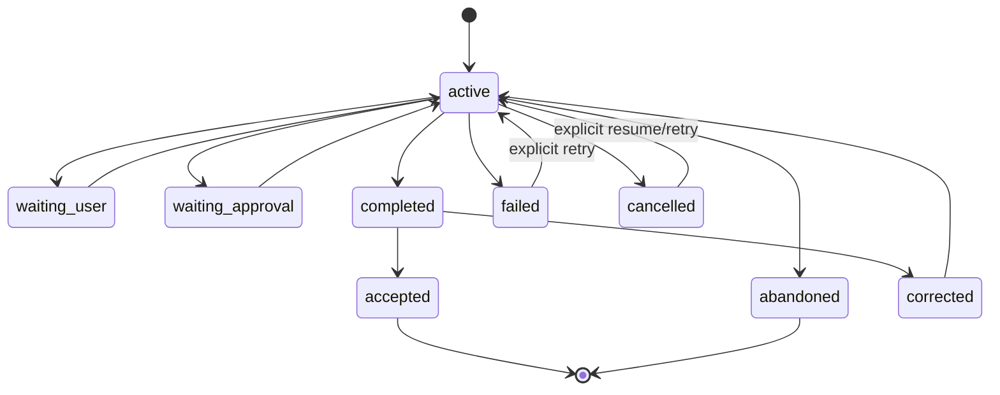

# Stage 4：Task、Session、Artifact 与持久化

> 状态：未开始
> 阶段结果：Morrow 的会话、任务、工具周期、权限授权和关键产物可在进程退出后恢复，并能对未完成副作用进行安全对账
> 上级文档：[开发路线总览](../ROADMAP.md)
> 上一阶段：[Stage 3：本地 Code Agent 与安全闭环](stage-3-local-tools-and-safety.md)
> 下一阶段：[Stage 5：可审查学习与长期记忆](stage-5-reviewable-learning-and-memory.md)

## 一、阶段目标

Stage 4 把 Morrow 从“进程内可用的 Code Agent”变成“具有可靠运行历史和恢复边界的长期工具”。

本阶段首先解决运行状态，不急于解决自动学习：

```text
用户进入工作空间
→ 创建或恢复 Session
→ 接受一个可能跨多轮的 TaskRun
→ 记录 Turn / AgentRun / ToolCycle / Approval / Artifact
→ 冻结本次 AgentRun 的权限范围、审批模式与授权来源
→ 在副作用前持久化执行意图
→ 完成、暂停、失败或等待用户
→ 进程退出或崩溃
→ 重启后恢复到可解释、可继续或可对账的状态
→ 生成结构化 TaskOutcome
```

阶段完成后，Morrow 应能准确回答：

- 当前在做什么任务？
- 已经执行了哪些工具和副作用？
- 哪些操作完成、失败、取消或结果未知？
- 下次启动应该继续、重试、对账还是重新询问用户？
- 长上下文中哪些内容被保留、压缩或转为 Artifact？
- 当时实际授予了什么权限、由谁授予、何时失效或撤销？

## 二、本阶段与 Stage 5 的边界

Stage 4 负责：

- 可靠保存运行历史。
- 恢复 Session 和 TaskRun。
- 长上下文压缩与任务摘要。
- 生成结构化 `TaskOutcome`。
- 保存来源明确的 Artifact 和执行证据。
- 持久化、冻结、查询和撤销显式 `CapabilityGrant`。
- 在可靠审计与恢复边界上先激活 Full Access Manual，再提供受控 Full Access Auto。

Stage 4 不负责：

- 从摘要中直接推断长期偏好。
- 自动把项目事实写入长期记忆。
- 自动创建 Skill。
- 根据历史选择 Multi-Agent Workflow。

换言之：

> **Stage 4 让系统记得“发生了什么”；Stage 5 才决定“什么值得长期学习”。**

## 三、进入条件

- Stage 3 已完成真实 Code Agent 闭环。
- 文件、Shell 和 Git 工具的结果模型、取消语义和副作用记录已稳定。
- `ConversationLog`、ToolCycle 和公开事件可以覆盖正常、拒绝、失败、超时和取消。
- 工作空间身份、Profile、Preferences、Provider 与凭据仍有明确权威来源。
- 已有真实任务数据表明哪些输出会造成上下文压力。

## 四、核心概念与所有权

### 4.1 Session

`Session` 是可恢复交互容器，绑定：

- `session_id`
- `workspace_id`
- 创建、最近活动和归档时间
- 当前模型/配置引用或快照
- 当前活跃 TaskRun
- 展示标题与用户标签
- 生命周期状态

建议状态：

```text
active
archived
deleted（逻辑删除或 tombstone，具体策略在阶段评审锁定）
```

一个 Session 可以顺序承载多个 TaskRun，但同一时刻默认只有一个前台活跃 TaskRun。

### 4.2 TaskRun

`TaskRun` 表示一个用户目标，而不是一次模型回合。它可以跨越：

- 多个用户补充 Turn。
- 多次工具调用。
- 多个 AgentRun（Stage 7 后）。
- 暂停、恢复和用户审批。
- 失败后的修正与重试。

建议状态机：



关键语义：

- `completed`：系统认为任务已给出结果，但尚未获得最终接受证据。
- `accepted`：用户明确接受，或确定性验收条件通过并满足配置策略。
- `corrected`：用户指出结果或协作方式需要修正。
- `abandoned`：用户放弃，不应作为正向学习证据。
- `failed`/`cancelled`：保留已发生副作用，不伪装回滚。

### 4.3 Turn

`Turn` 仍表示一次被接受的用户输入及其闭合结果。Stage 4 将现有进程内生命周期持久化，但不改变普通聊天必须经过 `AgentLoop.run_task()` 的原则。

### 4.4 AgentRun

Stage 4 先建立单 Agent 运行记录：

- 使用的 Provider/Model。
- 冻结的 RunPolicy、工具集和配置快照引用。
- 冻结的 AccessScope、ApprovalMode、ProcessIsolation 与 CapabilityGrant 引用。
- 开始、结束和状态。
- 输入/输出消息范围。
- Token、调用次数、停止原因和错误分类。

Stage 7 再把它扩展为由 `AgentDefinition` 和 Workflow Node 构造的通用执行单元。

### 4.5 CapabilityGrant

`CapabilityGrant` 是用户明确授予高权限能力的本地授权记录，不是 Preference、Memory、Skill 或模型输出。
第一版至少包含：

```text
grant_id
scope: full_access
approval_mode: manual | auto
subject_task_run_id
subject_agent_run_id
granted_by: user
created_at / expires_at
revoked_at
policy_version
reason_summary
```

确定规则：

- Stage 4 第一版只允许用户在当前前台任务中显式创建授权；模型、Tool、Skill、Memory、项目文件和
  Provider 响应都不能创建、延长或提升授权。
- Full Access 默认只对一个 AgentRun 有效，Run 结束即失效；不得保存为全局默认或从历史自动恢复。
- AgentRun 开始后冻结有效权限快照；配置变化不得让运行中的 Run 静默获得更高权限。
- 撤销会阻止新的副作用，并请求取消仍在执行的相关工具；已发生操作保留事实记录，不伪装回滚。
- `full_access + manual` 先开放；受控 `full_access + auto` 只能自动执行可结构化判定的操作，不透明
  Shell/脚本仍需审批。
- 真正“任意宿主命令永不询问”的 raw auto 不属于默认 Full Access，也不进入本阶段。

### 4.6 Artifact

Artifact 是不适合完整放进聊天历史、但需要保留和传递的任务产物。

首批类型：

- `command_output`
- `patch`
- `diff`
- `test_report`
- `task_summary`
- `diagnostic_report`
- `file_snapshot`（仅在必要时，避免复制整个项目）

Artifact 至少包含：

```text
artifact_id
kind
workspace_id
task_run_id
producer_run_id
content_location / inline_excerpt
content_hash
mime_type / encoding
size
created_at
sensitivity
retention_policy
metadata
```

聊天历史保存 Artifact 引用和有界摘要，而不是重复保存大内容。

### 4.7 TaskOutcome

任务结束时生成结构化结果：

```text
TaskOutcome
- task_run_id
- status
- user_goal
- result_summary
- changed_paths
- validation_performed
- validation_results
- unresolved_items
- side_effects
- artifacts
- evidence_refs
- completion_basis
- user_feedback
```

`TaskOutcome` 是 Stage 5 LearningReview 的唯一标准入口之一，但它本身不产生长期状态变更。

## 五、持久化顺序与副作用一致性

### 5.1 核心原则

> **先持久化执行意图，再执行有副作用的工具。**

推荐顺序：

```text
模型生成 Assistant tool call
→ AgentLoop 请求 ConversationLog 追加合法 AssistantMessage
→ ConversationLog 在同一逻辑追加边界校验并持久化 AssistantMessage、ToolCall 和 Run 状态
→ 提交成功
→ ToolExecutor 执行预检与审批
→ 持久化审批结果
→ 执行副作用
→ AgentLoop 请求 ConversationLog 持久化 ToolResult 与副作用摘要并闭合 ToolCycle
→ 继续模型循环
```

如果 ToolCall 无法可靠持久化，具有副作用的 handler 不得运行。这里的“ConversationLog 追加”包含
同步的持久化成功条件，不能先只改内存、再依赖异步事件最终落盘。

### 5.2 未完成工具调用

崩溃后可能出现：

1. ToolCall 已持久化，尚未开始执行。
2. 已获得审批，尚未执行。
3. 工具可能已执行，但 ToolResult 未持久化。
4. ToolResult 已生成但消息事务未完成。

恢复时不得盲目重放。每个工具需要声明恢复语义：

```text
never_started
safe_to_retry
requires_reconciliation
outcome_unknown
completed
```

- 纯读取通常可重试。
- 带幂等键的操作可按合同重试。
- 文件写入可通过内容 hash、目标 revision 或 Artifact 对账。
- Shell 命令若无法确定是否已产生副作用，必须标记 `outcome_unknown` 并提示用户。
- Stage 9 才为后台任务建立更完整的幂等与检查点框架。

### 5.3 ConversationLog 与数据库

保持一个逻辑权威：

- `ConversationLog` 仍拥有消息追加规则和 ToolCycle 合法性。
- 持久化 Store 通过 ConversationLog 的同步 durable adapter 或应用层事务边界接入，不重新实现第二套
  消息状态机；异步 event sink 只能生成投影，不能作为副作用前持久化门禁。
- 恢复时由持久化记录重建合法 Snapshot，并执行完整一致性校验。
- 不允许数据库中一套顺序、内存中另一套顺序。

## 六、存储架构方向

### 6.1 默认技术方向

本阶段默认采用 SQLite 作为运行状态权威存储，原因是它适合本地单用户、事务、索引、迁移和恢复场景。最终选择需在激活阶段通过 Spike 验证，但不得继续把 Session 数据无限追加到 `ProjectStateStore` YAML 门面。

### 6.2 职责分离

```text
现有 YAML / CredentialStore
- Global Preferences
- Workspace Preferences
- Profile
- Provider non-secret config
- credential refs / credentials

SQLite Operational Store
- Sessions
- TaskRuns
- Turns / Messages / ToolCalls / ToolResults
- AgentRuns
- Approvals
- Events
- Artifact metadata
- TaskOutcomes

Filesystem Artifact Store
- 大型命令输出
- Patch / Diff / TestReport
- 导出与备份包
```

### 6.3 数据库最低要求

- 显式 schema version。
- 事务与外键约束。
- 单调 sequence 或等价顺序权威。
- WAL/同步策略经过崩溃测试。
- 数据库迁移可预检、备份和回滚失败。
- 任何损坏或未来版本不被静默重建覆盖。
- 不把密钥、Provider reasoning 或未清洗 traceback 写入数据库。

### 6.4 数据保留

本阶段锁定机制，不急于锁定所有默认期限：

- Session 可归档。
- Artifact 可根据类型设置保留策略。
- 删除应区分隐藏、逻辑删除和物理清理。
- 导出与彻底删除的完整产品流在 Stage 10 完成。
- 任何自动清理不得删除仍被 TaskOutcome、Learning Evidence 或用户 Pin 引用的 Artifact。

## 七、上下文管理

### 7.1 PromptAssembler 的过渡

当前 `ContextBuilder` 在本阶段演进为更明确的分层组装器，但不必提前实现完整 Multi-Agent Prompt 系统。

建议输入层：

```text
fixed system boundary
+ resolved Preferences
+ Workspace Profile
+ active Task goal and state
+ recent complete ToolCycles / Turns
+ compacted context summaries
+ referenced Artifact excerpts
+ current user message
+ frozen tool definitions
```

### 7.2 完整 Cycle 边界

压缩和裁剪不能拆开：

- Assistant tool call 与对应 ToolResult。
- 当前用户消息与其最终闭合结果。
- 需要恢复的审批和错误上下文。

### 7.3 压缩策略

分级处理：

1. 移除可重新获取的重复工具输出，只保留 Artifact 引用。
2. 对旧命令输出、Diff 和搜索结果生成确定性摘要。
3. 对较旧完整 Turn 生成会话压缩摘要。
4. 必要时创建新的 context checkpoint。
5. 始终保留当前任务目标、关键约束、未完成项、最近失败和当前 Turn。

摘要必须带：

- 覆盖的消息范围。
- 生成方法/模型。
- 原始记录引用。
- 创建时间和版本。
- 是否可重新生成。

摘要不是新的项目事实源。

### 7.4 Fork

支持从历史 Turn 或 checkpoint 创建新 Session/Task 分支：

- 原记录不可变。
- 新分支保存 parent_session_id、parent_turn_id 或 checkpoint_id。
- 不复制大 Artifact 内容，只增加引用。
- Fork 后的修改、偏好和后续任务不反写父分支。

## 八、恢复语义

### 8.1 正常恢复

用户可以：

- 列出当前工作空间 Session。
- 查看最近任务、状态和摘要。
- 恢复一个 active/waiting/completed Session。
- 归档或删除不需要的 Session。
- 新建独立 Session。

### 8.2 崩溃恢复

启动时执行：

```text
打开 Operational Store
→ 校验 schema 与事务状态
→ 查找非终止 Run
→ 重建合法 ConversationLog Snapshot
→ 对未闭合 ToolCycle 分类
→ 生成 RecoveryReport
→ 自动继续安全部分或要求用户决策
```

默认不自动重做可能有副作用的未知操作。

### 8.3 Provider 流中断

- 已持久化用户消息保留。
- 可见但未完成的 Assistant 文本可作为诊断记录保存，但默认不进入后续权威聊天上下文。
- 工具参数只有在形成完整合法 ToolCall 后才可执行。
- 恢复后可以重新发起模型回合，但必须清楚标记前一回合未完成。

## 九、Command、Query 与 Event 接口

为未来 GUI 建立统一边界，但不在本阶段建设完整 GUI。

### 9.1 Command API

至少支持：

```text
session.create
session.resume
session.archive
session.delete
task.start
task.resume
task.cancel
task.accept
task.correct
approval.resolve
artifact.pin / artifact.release
```

### 9.2 Query API

至少支持：

```text
workspace.current
session.list / session.get
task.list / task.get
run.get
artifact.list / artifact.get
event.list
recovery.get
```

### 9.3 Event Stream

以下是 Stage 4 的候选扩展，不是当前公开事件已经变化的声明；激活本阶段时必须在明确计划中评审并
获得授权，现有 `turn.started` / `tool.status` / `turn.completed` 等生命周期在此之前保持不变。

建议扩展为：

```text
session.created / resumed / archived
task.started / status_changed / completed
agent.started / completed
tool.status
approval.requested / resolved
artifact.created
context.compacted
recovery.required / resolved
error
```

公开事件仍然有序、版本化、可忽略未知字段，并保持脱敏。

### 9.4 只读观察器 Spike

在 Query/Event 合同稳定后，可以实现一个开发者只读观察器验证：

- TaskRun 状态。
- 当前 Turn/Tool。
- Artifact。
- RecoveryReport。

该 Spike 不直接访问数据库，也不成为 Stage 8 GUI 的第二套业务实现。

## 十、CLI 产品面

精确命令在实施阶段确认，最低能力包括：

```text
morrow session list
morrow session resume <session-id>
morrow session archive <session-id>
morrow session delete <session-id>
morrow task list
morrow task show <task-id>
morrow task accept <task-id>
morrow task cancel <task-id>
morrow artifact list --task <task-id>
morrow recovery show
```

REPL 至少支持：

```text
/new
/sessions
/tasks
/resume
/status
/accept
/cancel
```

命令名称不如语义重要：任何入口都必须调用同一个 Application Service。

## 十一、实施切片

### 4A：Operational Store 与领域模型

交付：

- Session、TaskRun、Turn、AgentRun、Artifact、TaskOutcome 模型。
- SQLite Port/Adapter Spike 与迁移框架。
- 事务、sequence、损坏和未来版本测试。
- 现有 ConversationLog 的 durable 边界设计。

门禁：可以持久保存并无损恢复一个无工具的多轮 Session。

### 4B：持久化 ToolCycle 与副作用前记录

交付：

- Assistant ToolCall 持久化顺序。
- Approval 与 ToolResult 记录。
- 未闭合 ToolCycle 分类。
- 文件写入、命令执行的恢复对账示例。

门禁：在注入的崩溃点重启后，不会盲目重复执行有副作用工具。

### 4C：TaskRun 生命周期与 TaskOutcome

交付：

- Task start/complete/accept/correct/abandon 状态机。
- 多 Turn 任务归属。
- 结构化 TaskOutcome。
- CLI 查询和操作。

门禁：一个需要用户补充和二次修正的任务能保持单一 TaskRun 历史。

### 4D：上下文压缩、Artifact 与 Fork

交付：

- 大输出 Artifact 化。
- 完整 ToolCycle 感知的裁剪。
- Context summary/checkpoint。
- Session Fork。

门禁：长任务在上下文预算内继续，并可追溯到未压缩原记录。

### 4E：恢复、查询与事件合同

交付：

- Session list/resume/archive/delete。
- RecoveryReport 与用户决策流。
- Command/Query/Event API。
- 可选只读观察器 Spike。
- 备份、迁移与损坏恢复测试。

门禁：杀死进程后可以恢复真实 Stage 3 任务，并准确说明已发生和未知副作用。

### 4F：CapabilityGrant 与 Full Access 激活

交付：

- CapabilityGrant 领域模型、Store、Command/Query API 与审计投影。
- AgentRun 权限快照、有效期、撤销和 fail-closed 恢复。
- Full Access Manual 的显式逐次审批。
- 受控 Full Access Auto：结构化操作可自动，不透明 Shell/脚本继续审批。
- 权限提升来源、过期、撤销、崩溃点和跨工作空间隔离测试。

门禁：用户可以为一个前台 AgentRun 明确授予并撤销 Full Access；系统重启后不会自动恢复过期或未能
证明有效的授权，模型和长期状态不能提升权限，所有副作用都能追溯到当时冻结的授权与审批策略。

## 十二、测试与故障注入

至少覆盖：

- 每个消息写入点前后崩溃。
- ToolCall 提交前后崩溃。
- 审批接受后、handler 前崩溃。
- 文件已写但 ToolResult 未提交。
- Shell 已退出但结果未提交。
- SQLite 锁、磁盘满、只读目录和损坏页面。
- schema 升级失败。
- 长对话压缩中断。
- Artifact 文件丢失或 hash 不匹配。
- Fork 后父子隔离。
- Session 删除与仍被引用 Artifact 的保留。
- Provider 流中断和部分文本。
- CapabilityGrant 创建、冻结、过期、撤销和恢复。
- 模型、Skill、Memory、项目配置或历史记录尝试提升权限。
- Full Access 在工作空间、TaskRun 和 AgentRun 之间错误复用。
- Full Access Auto 对结构化操作与不透明 Shell 的策略分流。

测试不得依赖不稳定 wall-clock sleep；使用可控时钟、故障注入点和脚本化 Provider/Runner。

## 十三、阶段交付物

- Task/Session/Run/Artifact 领域模型。
- 运行状态 Operational Store 与迁移框架。
- Durable ConversationLog/ToolCycle 适配。
- 副作用前持久化与恢复对账机制。
- Session 管理、TaskRun 生命周期和 TaskOutcome。
- 上下文压缩、checkpoint 和 Fork。
- Command/Query/Event 接口。
- RecoveryReport、备份和故障注入测试。
- CapabilityGrant、AgentRun 权限快照与 Full Access Command/Query API。
- 更新后的 ARCHITECTURE、README 和数据边界说明。

## 十四、完成标准

1. 程序重启后可以列出并继续指定 Session。
2. 恢复后的消息顺序、ToolCycle、工作空间和配置快照一致。
3. 有副作用 ToolCall 在执行前已经可靠持久化。
4. 崩溃后不会自动重放结果未知的写入或命令。
5. 一个任务可以跨多轮、暂停、恢复、接受和纠正。
6. 长上下文达到预算时能压缩或 Artifact 化，而不是直接丢失关键状态。
7. 所有摘要和 Artifact 都可追溯到原始记录。
8. A 工作空间 Session 不会默认在 B 工作空间恢复或注入。
9. 存储损坏、迁移失败和 Artifact 缺失不会静默覆盖原数据。
10. CapabilityGrant 只能由用户显式创建，按 AgentRun 冻结和失效，且可查询、撤销、审计。
11. Full Access Manual 与受控 Full Access Auto 不会被模型、配置、Skill、Memory 或恢复流程静默开启。
12. Stage 3 的真实 Code Agent 任务可以在故障注入后恢复并继续。

## 十五、明确不包含

- 自动生成长期 Preference/Knowledge。
- 向量数据库和 Embedding 默认依赖。
- Skill 创建、安装与自动更新。
- Multi-Agent Workflow。
- 后台 Worker、定时任务和跨重启自动运行。
- 多设备同步和团队共享。
- 完整桌面 GUI。
- 可持久设为全局默认的 Full Access，以及任意宿主命令永不询问的 raw auto 专家模式。

## 十六、进入 Stage 5 前必须确认

- `TaskOutcome` 是否包含足够且不过度的学习证据。
- 用户接受、纠正和放弃的信号如何可靠记录。
- 哪些 Artifact 可被 LearningReview 读取，哪些因敏感性禁止。
- Profile、Preference、Project Knowledge 和 Episodic Summary 的事实边界。
- LearningReview 是否需要单独模型调用及其成本预算。
- 当前确定性检索是否足够，是否有任何真实证据需要语义检索。
